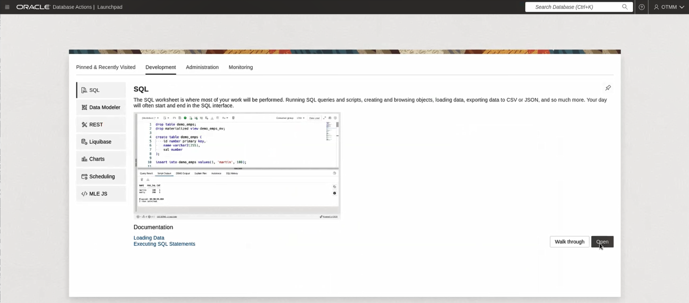

# Set Up the ORDS Instances

## Introduction

This lab walks you through the steps to set up two Oracle REST Data Services (ORDS) applications, Department 1 and Department 2. The Bank Transfer application is created in PL/SQL and deployed using ORDS in Oracle Database. It demonstrates how you can develop ORDS applications that participate in a distributed transaction while using MicroTx to coordinate the transaction. You can use the Bank Transfer application to withdraw or deposit an amount. Since financial applications that move funds require strong global consistency, the application uses the XA transaction protocol.

The following figure shows the various microservices in the Bank Transfer application.


* The MicroTx coordinator manages transactions amongst the participant services.

* Teller, a Java microservice, is called a transaction initiator service. A user interacts with this microservice to transfer money from Department One to Department Two. It exposes a REST API method to transfer funds. This method defines the transaction boundary and initiates the distributed transaction. When a new request is created, MicroTx starts an XA transaction at the Teller microservice. This microservice also contains the business logic to issue the XA commit and roll back calls.

* Department One and Department Two are ORDS applications. They participate in the transactions, so they are called participant services. The applications expose three REST APIs to withdraw or deposit money from a specified account and to get the account balance. They also use resources from resource managers. Resource managers manage stateful resources such as databases, queuing or messaging systems, and caches. Two PDBs (pluggable database) and a catalog database run in a standalone instance of Oracle Database 23ai Free to simulate the distributed transaction. A standalone ORDS APEX service instance, runs on port 8080, and it is configured with two database pools. Each database pool connects to a different PDB, FREEPDB1 and FREEPDB2. Here are the details about the PDBs:

* FREE: A catalog database that the `sysdba` user can access.
* FREEPDB1: A pluggable database that contains the OTMM schema. This connects to Department 1, an ORDS service.
* FREEPDB2 : A pluggable database that contains the OTMM schema. This connects to Department 2, an ORDS service.

The service must meet ACID requirements, so an XA transaction is initiated, and both withdraw and deposit are called in the context of this transaction.

When you run the Bank Transfer application, the Teller microservice calls the exposed `transfer` REST API call to initiate the transaction to withdraw an amount from Department 1, an ORDS service, which is connected to FREEPDB1. After the amount is successfully withdrawn, the Teller service receives HTTP 200. Then the Teller calls the `deposit` REST API from Department 2, an ORDS service, which is connected to FREEPDB2. After the amount is successfully deposited, the Teller service receives HTTP 200, and then the Teller commits the transaction. MicroTx coordinates this distributed transaction. Within the XA transaction, all actions such as withdraw and deposit either succeed, or they all are rolled back in case of a failure of any one or more actions.

During a transaction, the microservices also update the associated resource manager to track the change in the amount. When you run the Bank Transfer application, you will see how MicroTx ensures consistency of transactions across the distributed microservices and their resource managers.

Participant microservices use the MicroTx client libraries which registers callback and provides implementation of the callback for the resource manager. The MicroTx library also includes headers that enable the participant services to automatically enlist in the transaction. As shown in the image, MicroTx communicates with each resource manager to prepare, commit, or rollback the transaction. The participant service provides the credentials to the coordinator to access the resource manager.

Estimated Time: 15 minutes

### Objectives

In this lab, you will:

* Start the Database service and ORDS service instances
* Grant privileges to the database schema
* Set Up Department 1 and Department 2 applications
* Verify access to the applications

### Prerequisites

This lab assumes you have:

* An Oracle Cloud account.
* Successfully completed the previous labs:
    * Get Started
    * Lab 1: Prepare setup
    * Lab 2: Environment setup
* Logged in using remote desktop URL as an `oracle` user. If you have connected to your instance as an `opc` user through an SSH terminal using auto-generated SSH Keys, then you must switch to the `oracle` user before proceeding with the next step.

  ```text
  <copy>
  sudo su - oracle
  </copy>
  ```

## Task 1: Start the Database Service and ORDS Service Instances

1. Run the following command to verify that the Oracle Database 23ai Free service instance is running.

    ```text
    <copy>
    sudo /etc/init.d/oracle-free-23c status
    </copy>
    ```

   **Example output**

    ```text
    Status of the Oracle FREE 23ai service:
    LISTENER status: RUNNING
    FREE Database status: RUNNING
    ```

   If the Oracle Database 23ai Free service instance is not in the `RUNNING` state, then run the following command to restart the service.

    ```text
    <copy>
    sudo systemctl restart oracle-free-23c
    </copy>
    ```

2. Run the following commands in a new terminal to start the Oracle REST Data Services (ORDS) standalone service. Keep this terminal window open throughout the lab.

    ```text
    <copy>
    export _JAVA_OPTIONS="-Xms8192M -Xmx8192M"
    ords --config ${ORDS_CONFIG} serve
    </copy>
    ```

3. Run the following commands, in the specified order, to log into the catalog database with the default password, and then reset the password for the `SYS` user.

    ```SQL
    <copy>
    sys/Passw0rd@FREE as sysdba
    </copy>
    ```

    ```SQL
    <copy>
    ALTER USER SYS IDENTIFIED BY [new-user-password];
    </copy>
    ```

    Where, `[new-user-password]` is the new password that you specify for FREE, a catalog database.

    ```SQL
    <copy>
    ALTER USER SYSTEM IDENTIFIED BY [new-user-password];
    </copy>
    ```

    ```SQL
    <copy>
    commit;
    </copy>
    ```

    ```SQL
    <copy>
    exit;
    </copy>
    ```

## Task 2: Grant Privileges to the Schema in FREEPDB1

1. Login to FREEPDB1 as SYS user.

    ```SQL
    <copy>
    sys/[new-user-password]@FREEPDB1 as sysdba
    </copy>
    ```

    Where, `[new-user-password]` is the new password that you specify for the `SYS` user in a previous task.

2. Change the password for the OTMM user.

    ```SQL
    <copy>
    ALTER USER OTMM IDENTIFIED BY [new-freepdb1-password];
    </copy>
    ```

    Where, `[new-freepdb1-password]` is the new password that you want to set for the `OTMM` schema user.

    ```SQL
    <copy>
    commit;
    </copy>
    ```

3. Run the following commands to grant privileges to the schema.

    ```SQL
    <copy>
    DECLARE
        l_principal VARCHAR2(20) := 'OTMM';
    begin
        DBMS_NETWORK_ACL_ADMIN.append_host_ace (
            host => '*',
            lower_port => null,
            upper_port => null,
            ace => xs$ace_type(privilege_list => xs$name_list('http'),
            principal_name => l_principal,
            principal_type => xs_acl.ptype_db));
    end;
    /
 
    DECLARE
        l_principal VARCHAR2(20) := 'OTMM';
    begin
        DBMS_NETWORK_ACL_ADMIN.APPEND_HOST_ACE(
            host => '*',
            ace  =>  xs$ace_type(privilege_list => xs$name_list('connect', 'resolve'),
            principal_name => l_principal,
            principal_type => xs_acl.ptype_db));
    end;
    /
    </copy>
    ```

    Where, `OTMM` is the name of the user that can access the schema.

4. Commit the changes.

    ```SQL
    <copy>
    commit;
    </copy>
    ```

5. Exit SQL prompt.

    ```SQL
    <copy>
    exit;
    </copy>
    ```

## Task 3: Grant Privileges to the Schema in FREEPDB2

1. Login to FREEPDB1 as SYS user.

    ```SQL
    <copy>
    sys/[new-user-password]@FREEPDB1 as sysdba
    </copy>
    ```

    Where, `[new-user-password]` is the new password that you specify for the `SYS` user in a previous task.

2. Change the password for the OTMM user.

    ```SQL
    <copy>
    ALTER USER OTMM IDENTIFIED BY [new-freepdb2-password];
    </copy>
    ```

    Where, `[new-freepdb2-password]` is the new password that you want to set for the `OTMM` schema user.

    ```SQL
    <copy>
    commit;
    </copy>
    ```

3. Run the following commands to grant privileges to the schema.

    ```SQL
    <copy>
    DECLARE
        l_principal VARCHAR2(20) := 'OTMM';
    begin
        DBMS_NETWORK_ACL_ADMIN.append_host_ace (
            host => '*',
            lower_port => null,
            upper_port => null,
            ace => xs$ace_type(privilege_list => xs$name_list('http'),
            principal_name => l_principal,
            principal_type => xs_acl.ptype_db));
    end;
    /
 
    DECLARE
        l_principal VARCHAR2(20) := 'OTMM';
    begin
        DBMS_NETWORK_ACL_ADMIN.APPEND_HOST_ACE(
            host => '*',
            ace  =>  xs$ace_type(privilege_list => xs$name_list('connect', 'resolve'),
            principal_name => l_principal,
            principal_type => xs_acl.ptype_db));
    end;
    /
    </copy>
    ```

    Where, `OTMM` is the name of the user that can access the schema.

4. Commit the changes.

    ```SQL
    <copy>
    commit;
    </copy>
    ```

5. Exit SQL prompt.

    ```SQL
    <copy>
    exit;
    </copy>
    ```

## Task 4: Set Up Department 1

1. Enter the SQL Developer web URL to access Department 1 database.

    ```text
    <copy>
    http://localhost:8080/ords/sql-developer
    </copy>
    ```

    A sign-in page for Database Actions is displayed.

2. Enter the new password that you have specified earlier, `<new-freepdb1-password>`, to access the FREEPDB1 database as `OTMM` schema user.

    The Database Actions page is displayed.

3. In the **Development** tab, click **SQL**, and then click **Open**.

    

4. Open the `tmmxa.sql` SQL script file which is located in the following folder.

    ```text
    <copy>
    /home/oracle/OTMM/otmm-package/samples/xa/plsql/lib 
    </copy>
    ```

5. Click **Run as SQL script** to run the `tmmxa.sql` SQL script file.

    

6. Open the `ordsapp.sql` SQL script file which is located in the following folder.

    ```text
    <copy>
    /home/oracle/OTMM/otmm-package/samples/xa/plsql/databaseapp 
    </copy>
    ```

7. In the script, search for `resManagerId` and enter a unique resource manager ID to identify the database in both the `deposit` and `withdraw` handlers.

    **Example Code**

    ```text
    <copy>
    resManagerId VARCHAR2(256):= ''DEPT1-RM''; 
    </copy>
    ```

7. Click **Run as SQL script** to run the `ordsapp.sql` SQL script file.

    

8. Log out from SQL Developer.

## Task 5: Set Up Department 2

1. Enter the SQL Developer web URL to access Department 2 database.

    ```text
    <copy>
    http://localhost:8080/ords/pool2/sql-developer
    </copy>
    ```

    A sign-in page for Database Actions is displayed.

2. Enter the new password that you have specified earlier, `<new-freepdb2-password>`, to access the FREEPDB2 database as `OTMM` schema user.

    The Database Actions page is displayed.

3. In the **Development** tab, click **SQL**, and then click **Open**.

    

4. Open the `tmmxa.sql` SQL script file which is located in the following folder.

    ```text
    <copy>
    home/oracle/OTMM/otmm-package/samples/xa/plsql/lib
    </copy>
    ```

5. Click **Run as SQL script** to run the script file.

    

6. Open the `ordsapp.sql` SQL script file which is located in the following folder.

    ```text
    <copy>
    /home/oracle/OTMM/otmm-package/samples/xa/plsql/databaseapp
    </copy>
    ```

7. In the script, search for `resManagerId` and enter a unique resource manager ID to identify the database in both the `deposit` and `withdraw` handlers.

    **Example Code**

    ```text
    <copy>
    resManagerId VARCHAR2(256):= ''DEPT2-RM''; 
    </copy>
    ```

8. Click **Run as SQL script** to run the script file.

    

9. Log out from SQL Developer.

## Task 6: Verify Access to Department 1 and Department 2

Run the following commands to ensure that the REST API calls to Department 1 and Department 2 are executed successfully.

1. Run the following command to retrieve the balance in account 1 of Department 1.

    ```text
    <copy>
    curl --location --request GET 'http://localhost:8080/ords/otmm/accounts/account1'
    </copy>
    ```

2. Run the following command to retrieve the balance in account 2 of Department 2.

    ```text
    <copy>
    curl --location --request GET 'http://localhost:8080/ords/pool2/otmm/accounts/account2'
    </copy>
    ```

You may now **proceed to the next lab.**

## Learn More

* [REST Data Services Developer's Guide](https://docs.oracle.com/en/database/oracle/oracle-rest-data-services/)

## Acknowledgements

* **Author** - Sylaja Kannan
* **Contributors** - Brijesh Kumar Deo and Bharath MC
* **Last Updated By/Date** - Sylaja Kannan, September 2024
