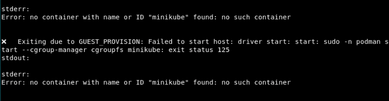

# Transfer Funds

## Introduction

Run the Bank Transfer application, which uses the XA transaction protocol, to transfer an amount from one department to another. Run this application to understand how you can use Transaction Manager for Microservices (MicroTx) to coordinate XA transactions across ORDS applications.

Estimated Lab Time: *15 minutes*

### Objectives

In this lab, you will:

* Start Minikube, and then start a Minikube tunnel.
* Deploy Kiali and Jaeger in your minikube cluster (optional)
* Run the Bank Transfer application to start an XA transaction to withdraw an amount from Department A and deposit it in Department B.
* View service graph of the mesh and distributed traces to track requests (optional)
* View source code of the Bank Transfer application (optional)

### Prerequisites

This lab assumes you have:

* An Oracle Cloud account.
* Successfully completed the previous labs:
    * Get Started
    * Lab 1: Prepare setup
    * Lab 2: Environment setup
    * Lab 3: Set up the ORDS instances
* Logged in using remote desktop URL as an `oracle` user. If you have connected to your instance as an `opc` user through an SSH terminal using auto-generated SSH Keys, then you must switch to the `oracle` user before proceeding with the next step.

 ```text
  <copy>
  sudo su - oracle
  </copy>
  ```

## Task 1: Start Minikube

Follow the instructions in this section to start Minikube, and then verify that all the resources are ready.

1. Click **Activities** in the remote desktop window to open a new terminal.

2. Run the following command to start Minikube.

    ```text
    <copy>
    minikube start
    </copy>
    ```

   In rare situations, you may the error message shown below. This message indicates that the stack resources have not been successfully provisioned. In such cases, complete **Lab 5: Environment Clean Up** to delete the stack and clean up the resources. Then perform the steps in Lab 2 to recreate the stack.

   

## Task 2: Deploy the Teller Application

Build and deploy the Teller application, which is the transaction initiator service.

1. Run the following commands to build the container image of the Teller application.

    ```text
    <copy>
    cd /home/oracle/OTMM/otmm-package/samples/xa/java/teller
    </copy>
    ```

    ```text
    <copy>
    minikube image build -t=xa-java-teller:1.0 .
    </copy>
    ```

2. Open the `/home/oracle/OTMM/otmm-package/samples/xa/java/helmcharts/ords-teller/values.yaml` file in any code editor. This is the manifest file, which contains the deployment configuration details of the Teller application.

    **Example command**
    ```text
    <copy>
    vim /home/oracle/OTMM/otmm-package/samples/xa/java/helmcharts/ords-teller/values.yaml
    </copy>
    ```

3. Enter the details, including the schema name, to access the Oracle REST Data Services (ORDS) endpoints. In the following sample code, the name of the schema is `otmm`.

    ```text
    <copy>
    departmentOneEndPoint: http://host.minikube.internal:8080/ords/otmm
    departmentTwoEndPoint: http://host.minikube.internal:8080/ords/pool2/otmm
    </copy>
    ```

4. Run the following commands to install the Teller application on Minikube.

    ```text
    <copy>
    cd /home/oracle/OTMM/otmm-package/samples/xa/java/helmcharts
    </copy>
    ```

    ```text
    <copy>
    helm install ords-teller --namespace otmm ords-teller/ --values ords-teller/values.yaml
    </copy>
    ```

5. Verify that the application is in the `running` state. Run the following command to retrieve the list of resources in the namespace `otmm` and their status.

    ```text
    <copy>
    kubectl get pods -n otmm
    </copy>
    ```

   **Example output**

    ```text
    NAME                      READY   STATUS    RESTARTS   AGE
    otmm-tcs-0                1/1     Running   0          79m
    teller-6df47b5b46-zp2d9   1/1     Running   0          0h31m
    ```

## Task 3: Start a Minikube Tunnel

Before you start a transaction, you must start a Minikube tunnel.

1. Run the following command in a new terminal to start a tunnel. Keep this terminal window open.

    ```text
    <copy>
    minikube tunnel
    </copy>
    ```

2. Enter the password to access your local machine if you are asked to enter your password at the command prompt.

3. In a new terminal, run the following command to note down the external IP address of the Istio ingress gateway.

    ```text
    <copy>
    kubectl get svc istio-ingressgateway -n istio-system
    </copy>
    ```

    From the output note down the value of `EXTERNAL-IP`, which is the external IP address of the Istio ingress gateway. You will provide this value in the next step.

    **Example output**

    

    Let's consider that the external IP in the above example is 192.0.2.117.

4. Store the external IP address of the Istio ingress gateway in an environment variable named `CLUSTER_IPADDR` as shown in the following command.

    ```text
    <copy>
    export CLUSTER_IPADDR=192.0.2.117
    </copy>
    ```

    Note that, if you don't do this, then you must explicitly specify the IP address in the commands when required.

5. Run the `reconfigureCoordinator.sh` script to redeploy the MicroTx coordinator using the external IP address of the Istio ingress gateway that you have retrieved in the previous step.

    ```text
    <copy>
    cd $HOME
    </copy>
    ```

    ```text
    <copy>
    sh reconfigureCoordinator.sh
    </copy>
    ```

6. Verify that all resources, such as pods and services, are ready. Run the following command to retrieve the list of resources in the namespace `otmm` and their status.

    ```text
    <copy>
    kubectl get pods -n otmm
    </copy>
    ```

   **Example output**

    ```text
    NAME                      READY   STATUS    RESTARTS   AGE
    otmm-tcs-0                2/2     Running   0          89m
    teller-6df47b5b46-zp2d9   2/2     Running   0          0h51m
    ```

## Task 4: Deploy Kiali and Jaeger (Optional)

Use distributed tracing to understand how requests flow between MicroTx and the microservices. Use tools, such as Kiali and Jaeger, to track and trace distributed transactions in MicroTx. Kiali requires Prometheus, so deploy Prometheus and Kiali in the same Kubernetes cluster.

Run the following commands to deploy Kiali and Jaeger.

1. Deploy Kiali.

    ```text
    <copy>
    kubectl apply -f https://raw.githubusercontent.com/istio/istio/release-1.17/samples/addons/kiali.yaml
    </copy>
    ```

    If Kiali is not deployed, run the following commands to pull the Kiali image and deploy it.

    1. Retrieve the Kiali image.

        ```text
        <copy>
        wget https://raw.githubusercontent.com/istio/istio/release-1.17/samples/addons/kiali.yaml
        </copy>
        ```

    2. Specify the image pull policy.

        ```text
        <copy>
        sed -i 's/imagePullPolicy: Always/imagePullPolicy: IfNotPresent/g' kiali.yaml
        </copy>
        ```

    3. Deploy Kiali.
        ```text
        <copy>
        kubectl apply -f kiali.yaml
        </copy>
        ```

2. Deploy Prometheus.

    ```text
    <copy>
    kubectl apply -f https://raw.githubusercontent.com/istio/istio/release-1.17/samples/addons/prometheus.yaml
    </copy>
    ```

3. Deploy Jaeger.

    ```text
    <copy>
    kubectl apply -f https://raw.githubusercontent.com/istio/istio/release-1.17/samples/addons/jaeger.yaml
    </copy>
    ```

4. Start the Kiali dashboard. Open a new tab in the terminal window and then run the following command. Leave the terminal running. If a new browser window appears, close the browser window.

    ```text
    <copy>
    istioctl dashboard kiali
    </copy>
    ```

   A URL is displayed. Open the URL in a new tab in your browser to access the Kiali dashboard. For example, `http://localhost:20001/kiali`.

5. Start the Jaeger dashboard. Open a new tab in the terminal window and then run the following command. Leave the terminal running. If a new browser window appears, close the browser window.

    ```text
    <copy>
    istioctl dashboard jaeger
    </copy>
    ```

   A URL is displayed. Open the URL in a new tab in your browser to access the Jaeger dashboard. For example, `http://localhost:16686`.

## Task 5: Run the Transfer Application

When you run the Transfer application, it starts an XA transaction. The Teller application is the transaction initiator service, it initiates the transaction. When the Teller application runs, it withdraws money from Department A and deposits it to Department B by creating an XA transaction. Within the XA transaction, all actions such as withdraw and deposit either succeed, or they all are rolled back in case of a failure of any one or more actions.

1. Before you start the transaction, run the following commands to check the initial balance in account 1 of Department 1 and account 2 of Department 2. Note down the initial balance.

    **Command to check the initial balance in account 1 of Department 1**

    ```text
    <copy>
    curl --location \
    --request GET http://localhost:8080/ords/otmm/accounts/account1 | jq
    </copy>
    ```

   **Command to check the initial balance in account 2 of Department 2**

    ```text
    <copy>
    curl --location \
    --request GET http://localhost:8080/ords/pool2/otmm/accounts/account2 | jq
    </copy>
    ```

2. Transfer an amount of 50 from Department 1, account1 to Department 2, account2.

    **Command**

    ```text
    <copy>
    curl --location \
    --request POST http://$CLUSTER_IPADDR/transfers \
    --header 'Content-Type: application/json' \
    --data-raw '{"from" : "account1", "to" : "account2", "amount" : 50}'
     </copy>
    ```

    HTTP status 200 in the response indicates that the transfer was successfully completed.

3. Run the following commands to check the account balance of Department 1, account1 and Department 2, account2. Note down the account balance to verify that the amounts reflect correctly after the transfer.

    **Command to check balance in Department 1**

    ```text
    <copy>
    curl --location \
    --request GET http://localhost:8080/ords/otmm/accounts/account1 | jq
    </copy>
    ```

    **Command to check balance in Department 2**

    ```text
    <copy>
    curl --location \
    --request GET http://localhost:8080/ords/pool2/otmm/accounts/account2 | jq
    </copy>
    ```

4. Transfer an amount of 50 from Department 1, account1 to an account that does not exist in Department 2, such as account7. Since account7 does not exist, the deposit fails and MicroTx rolls back the withdraw action.

    **Command**

    ```text
    <copy>
    curl --location \
    --request POST http://$CLUSTER_IPADDR/transfers \
    --header 'Content-Type: application/json' \
    --data-raw '{"from" : "account1", "to" : "account7", "amount" : 50}'
    </copy>
    ```

5. Check the balance in Department 1, account 1 to verify that the account balance is correct, and no amount was withdrawn.

   **Command**

    ```text
    <copy>
    curl --location \
    --request GET http://localhost:8080/ords/otmm/accounts/account1 | jq
    </copy>
    ```

## Task 6: View the Service Mesh Graph and Distributed Traces (Optional)

You can perform this task only if you have performed Task 4 to deploy Kiali and Jaeger in your cluster.
To visualize what happens behind the scenes, how the amount transfer request is processed by the distributed services, and how MicroTx manages the transaction requests you can use the Kiali and Jaeger Dashboards that you had started in Task 4.

1. Open a new browser tab and navigate to the Kiali dashboard URL. For example, `http://localhost:20001/kiali`.
2. Select Graph for the `otmm` namespace.
3. Open a new browser tab and navigate to the Jaeger dashboard URL. For example, `http://localhost:16686`.
4. From the **Service** drop-down list, select **istio-ingressgateway.istio-system**.
5. Click **Find Traces**. You can see the list of traces with each trace representing a request.
6. Select one of the traces to view.

## Task 7: View Source Code of the Transfer Application (Optional)

You can use the VIM editor to view the source code files. You can also use the Text Editor application to view the source code files.
To bring up the Text Editor, click on Activities (top left) -> Show Applications -> Text Editor. Inside Text Editor, select Open a File and browse to the source code files in the folders shown above.

The application source code is present in following location.

* Teller application source code: `/home/oracle/OTMM/otmm-package/samples/xa/java/teller`.
* Department 1 and Department 2 application source code: `/home/oracle/OTMM/otmm-package/samples/xa/plsql/databaseapp/ordsapp.sql`.

You may now **proceed to the next lab.**

## Learn More

* [Develop Applications with XA](https://docs.oracle.com/pls/topic/lookup?ctx=microtx-latest&id=TMMDG-GUID-D9681E76-3F37-4AC0-8914-F27B030A93F5)

## Acknowledgements

* **Author** - Sylaja Kannan, Consulting User Assistance Developer
* **Contributors** - Brijesh Kumar Deo and Bharath MC
* **Last Updated By/Date** - Sylaja Kannan, September 2024
