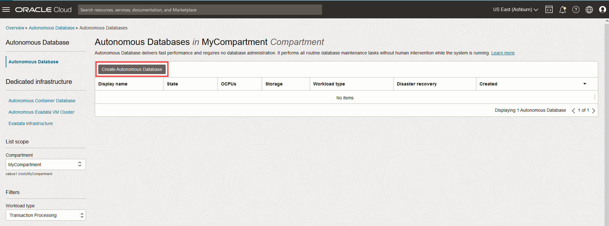
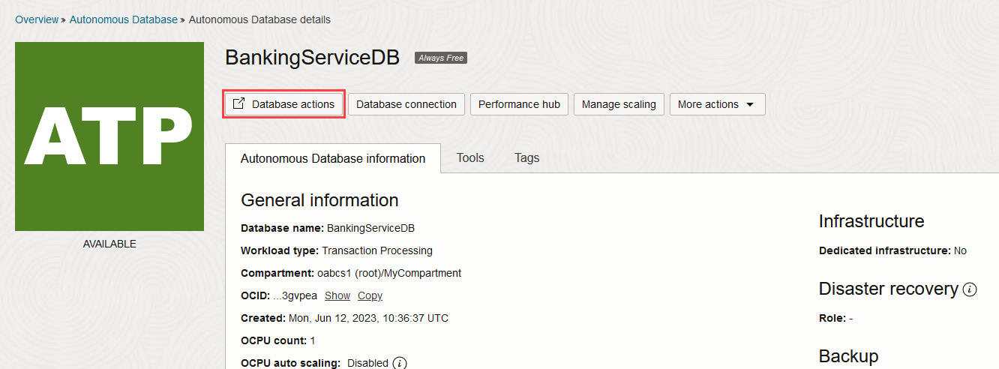
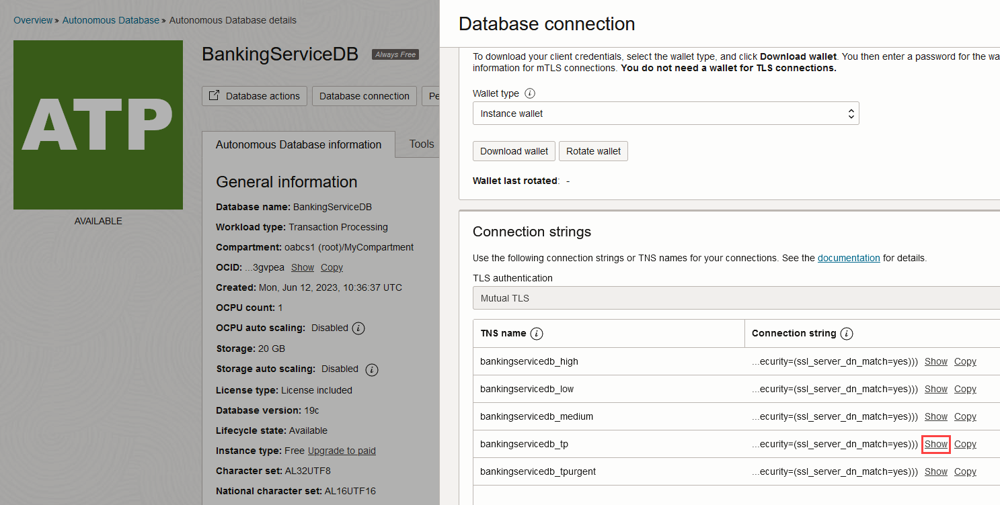

# Provision Autonomous Databases for Use as Resource Manager

## Introduction

This lab walks you through the steps to quickly provision Autonomous Transaction Processing Serverless (ATP-S) instances on Oracle Cloud. You will use this database in the subsequent labs of this workshop. For this lab, you must create two ATP-S instances. One ATP-S instance acts as a resource manager for the Core Banking service and Branch Banking Service. The other ATP-S instance acts as resource manager for the Stock Broker service. Run the tasks in this lab in the remote desktop to create the database instances and download the database wallets within the remote desktop. When you directly download the wallet files in the remote desktop environment, you do not need to copy the wallet files from outside the environment.

Estimated lab time: 20 minutes

### Objectives

In this lab, you will:

* Provision two new Autonomous Database Serverless instances.
* Download the wallet file for each ATP-S instance.
* Create tables with sample values for the Core Banking, Branch Banking, and Stock Broker services.

### Prerequisites

* This lab requires completion of the **Get Started** section in the Contents menu on the left.

## Task 1: Choose ATP-S from the Services Menu

1. Log in to the Oracle Cloud.
2. Once you log in, the cloud services dashboard shows all the services available to you. Click the navigation menu in the upper left to show top level navigation choices.

    > **Note:** You can also directly access your Autonomous Data Warehouse or Autonomous Transaction Processing service in the __Quick Actions__ section of the dashboard.

    

3. Click **Oracle Database** -> **Autonomous Transaction Processing**.

    

4. On the left side, make sure your **Workload Type** is **Transaction Processing** or **All** to see your ATP-S instances. Use the **Compartment** drop-down menu to select a compartment.

 **Note** - Avoid the use of the ManagedCompartmentforPaaS compartment as this is an Oracle default used for Oracle Platform Services.

   

5. This console shows that no databases exist as yet. If there were a long list of databases, you could filter the list by the state of the databases (Available, Stopped, Terminated).

## Task 2: Create an Autonomous Database Instance for the Core Banking and Branch Banking Services

1. Click **Create Autonomous Database** to start the instance creation process.

    

2. This brings up the **Create Autonomous Database** screen where you will specify the configuration of the instance.
3. Provide basic information for the autonomous database:

    * **Compartment** - Select a compartment for the database from the drop-down list. In the example below, **MyCompartment** was created ahead of time and chosen.
    * **Display Name** - Enter a memorable name for the database for display purposes. For this lab, use **BankingServiceDB**.
    * **Database Name** - Use letters and numbers only, starting with a letter. Maximum length is 14 characters. (Underscores not initially supported.) For this lab, use **BankingServiceDB**.

    

4. Choose a workload type. For this lab, choose **Transaction Processing** as the workload type.

    

5. Choose a deployment type. For this lab, choose **Serverless** as the deployment type.

    

6. Configure the database:

    <if type="tenancy">
    * **Always Free** - If your cloud account offers it, select this option to create an always free autonomous database, which comes with 1 CPU and 20 GB of storage. If you don't have this option, select the details mentioned below to create an autonomous database.
    </if>
    * **Choose database version** - Select a database version from the available versions.
    * **OCPU count** - Number of CPUs for your service. For this lab, specify **1 CPU**.  An Always Free database comes with 1 CPU.
    * **Storage (TB)** - Select your storage capacity in terabytes. For this lab, specify **0.02 TB** of storage (20 GB). An Always Free database comes with 20 GB of storage.
    * **OCPU Auto Scaling** - For this lab, you can disable OCPU auto scaling. Auto scaling allows the system to automatically use up to three times more CPU and IO resources to meet workload demand. The Always Free database does not scale up/down.
    * **Storage Auto Scaling** - For this lab, you can disable storage auto scaling. The Always Free database does not scale up/down.
    * **New Database Preview** - If a checkbox is available to preview a new database version, do **not** select it.

    <if type="tenancy">
    
    </if>
    <if type="sandbox">
    
    </if>

7. Create administrator credentials:

    * **Password and Confirm Password** - Specify the password for ADMIN user of the service instance. The password must meet the following requirements:
    * The password must be between 12 and 30 characters long and must include at least one uppercase letter, one lowercase letter, and one numeric character.
    * The password cannot contain the username.
    * The password cannot contain the double quote (") character.
    * The password must be different from the last 4 passwords used.
    * The password must not be the same password that is set less than 24 hours ago.
    * Re-enter the password to confirm it. Make a note of this password.

    
8. Choose network access. For this lab, accept the default, **Secure access from everywhere**, and then select the **Require mutual TLS (mTLS) authentication** option.

   Skip and go to the next step if the **Require mutual TLS (mTLS) authentication** option is unavailable or disabled. mTLS will be required to authenticate connections to your Autonomous Database.

   TLS connections allow Oracle Data Provider for .NET to connect to your Autonomous Database without a wallet. See the [documentation for network options](https://docs.oracle.com/en/cloud/paas/autonomous-database/adbsa/support-tls-mtls-authentication.html#GUID-3F3F1FA4-DD7D-4211-A1D3-A74ED35C0AF5) for options to allow TLS, or to require only mutual TLS (mTLS) authentication.

    

9. Choose a license type. For this lab, choose **License Included**. Select this type when you want to subscribe to new database software licenses and the database cloud service.

    

10. Provide a contact email address. The **Contact Email** field allows you to list contacts to receive operational notices and announcements as well as unplanned maintenance notifications.

    

11. Click **Create Autonomous Database**.

    

12. Your instance will begin provisioning. In a few minutes the state will turn from Provisioning to Available. At this point, your Autonomous Transaction Processing database is ready to use! Have a look at your instance's details here including its name, database version, CPU count and storage size.


    Provisioning an ATP-S instance.

    
    ATP-S instance is successfully provisioned.

## Task 3: Download the Wallet Files

To download client credentials from the Oracle Cloud Infrastructure Console:

1. Navigate to the Autonomous Database details page.

2. Click **DB Connection**.

   

3. On the Database Connection page, under **Wallet type**, select **Instance Wallet**.

4. Click **Download Wallet**.
   

5. In the **Download Wallet** dialog, enter a wallet password in the **Password** field and confirm the password in the **Confirm Password** field.

6. Click **Download** to save the client security credentials zip file.

    

   By default, the filename is: `Wallet_`*databasename*`.zip`. For example, `Wallet_BankingServiceDB.zip`. You can save this file with any filename you want.

   You must protect this file to prevent unauthorized database access.

7. Unzip the wallet file into the `Database_Wallet` folder. Replace the ZIP file name in following example code based on your environment.

    ```
    <copy>
    unzip Wallet_BankingServiceDB.zip -d <path to the Database_Wallet folder>
    </copy>
    ```

8. Extract the wallet files to the `/home/oracle/microtx/otmm-22.3.2/samples/xa/java/bankapp/CoreBanking/Database_Wallet` and `/home/oracle/microtx/otmm-22.3.2/samples/xa/java/bankapp/BranchBanking/Database_Wallet` folders. This folder contains the source code for the Core Banking and Branch Banking services respectively.

## Task 4: Connect with SQL Worksheet

Although you can connect to your ATP-S instance from local desktop tools, such as Oracle SQL Developer, you can conveniently access the browser-based SQL Worksheet directly from your Autonomous Database console.

1. In your database's details page, click **Database Actions**.

    

    A sign-in page for Database Actions is displayed.

2. Enter your database instance's default administrator account and password. For this lab, enter **ADMIN** as the username and the password you had specified when creating the database. Click **Sign in**.

    

    The Database Actions page is displayed.

3. In the **Development** box, click **SQL**.

    

4. The first time you open SQL Worksheet, a series of pop-up informational boxes introduce you to the main features. Click **Next** to take a tour through the informational boxes.

    

    After touring through the informational boxes, keep this SQL Worksheet open and please **proceed to the next task.**

## Task 5: Create Tables in BankingServiceDB for the Core Banking Service

Create tables in the `BankingServiceDB` ATP-S instance and populate it with sample values for the Core Banking service.

1. Ensure that you are connected to SQL Worksheet as administrator.

2. Copy and paste the following code snippet to your SQL Worksheet and run the queries.

      **Syntax**

      ```SQL
      <copy>
      -- Tables to be created
      CREATE TABLE BRANCH
      (
        BRANCH_ID   NUMBER NOT NULL,
        BRANCH_NAME VARCHAR2(20),
        PHONE       VARCHAR2(14),
        ADDRESS     VARCHAR2(60),
        SERVICE_URL VARCHAR2(255),
        LAST_ACCT   INTEGER,
        PRIMARY KEY (BRANCH_ID)
      );

      CREATE TABLE ACCOUNT
      (
        ACCOUNT_ID NUMBER   NOT NULL,
        BRANCH_ID  NUMBER   NOT NULL,
        SSN        CHAR(12) NOT NULL,
        FIRST_NAME VARCHAR2(20),
        LAST_NAME  VARCHAR2(20),
        MID_NAME   VARCHAR2(10),
        PHONE      VARCHAR2(14),
        ADDRESS    VARCHAR2(60),
        PRIMARY KEY (ACCOUNT_ID)
      );

      CREATE TABLE HISTORY
      (
        TRANSACTION_CREATED TIMESTAMP DEFAULT CURRENT_TIMESTAMP,
        ACCOUNT_ID          NUMBER       NOT NULL,
        BRANCH_ID           NUMBER       NOT NULL,
        TRANSACTION_TYPE    VARCHAR2(15) NOT NULL,
        DESCRIPTION         VARCHAR2(1024),
        AMOUNT              DECIMAL(20, 2) NOT NULL,
        BALANCE             DECIMAL(20, 2) NOT NULL
      );
      </copy>
      ```

      

      Tables with the names `BRANCH`, `ACCOUNT`, and `HISTORY` are created.

3. Populate the tables with sample values.

      ```SQL
      <copy>
      -- BRANCH
      INSERT INTO BRANCH (BRANCH_ID, BRANCH_NAME, PHONE, ADDRESS, SERVICE_URL, LAST_ACCT)
      VALUES (1111, 'Arizona', '123-456-7891', '6001 N 24th St, Phoenix, Arizona 85016, United States', 'http://arizona-branch-bank:9095', 10002);

      -- ACCOUNTS
      INSERT INTO ACCOUNT (ACCOUNT_ID, BRANCH_ID, SSN, FIRST_NAME, LAST_NAME, MID_NAME, PHONE, ADDRESS)
      VALUES (10001, 1111, '873-61-1457', 'Adams', 'Lopez', 'D', '506-100-5886', '15311 Grove Ct. Arizona  95101');
      INSERT INTO ACCOUNT (ACCOUNT_ID, BRANCH_ID, SSN, FIRST_NAME, LAST_NAME, MID_NAME, PHONE, ADDRESS)
      VALUES (10002, 1111, '883-71-8538', 'Smith', 'Mason', 'N', '403-200-5890', '15322 Grove Ct. Arizona  95101');
      INSERT INTO ACCOUNT (ACCOUNT_ID, BRANCH_ID, SSN, FIRST_NAME, LAST_NAME, MID_NAME, PHONE, ADDRESS)
      VALUES (10003, 1111, '883-71-8538', 'Thomas', 'Dave', 'C', '603-700-5899', '15333 Grove Ct. Arizona  95101');
      </copy>
      ```

## Task 6: Create Tables in BankingServiceDB for the Branch Banking Service

Create tables in the `BankingServiceDB` ATP-S instance and populate it with sample values for the Branch Banking service.

1. Ensure that you are connected to SQL Worksheet as administrator.

2. Copy and paste the following code snippet to your SQL Worksheet and run the queries.

      ```SQL
      <copy>
      CREATE TABLE SAVINGS_ACCOUNT
      (
        ACCOUNT_ID NUMBER NOT NULL,
        BRANCH_ID  NUMBER NOT NULL,
        BALANCE    DECIMAL(20, 2) NOT NULL,
        PRIMARY KEY (ACCOUNT_ID)
      );
      </copy>
      ```

   

   Table with the name `SAVINGS_ACCOUNT` is created.

3. Populate the `SAVINGS_ACCOUNT` table with sample values.

      ```SQL
      <copy>
      -- Branch - Arizona
      INSERT INTO SAVINGS_ACCOUNT (ACCOUNT_ID, BRANCH_ID, BALANCE)
      VALUES (10001, 1111, 50000.0);
      INSERT INTO SAVINGS_ACCOUNT (ACCOUNT_ID, BRANCH_ID, BALANCE)
      VALUES (10002, 1111, 50000.0);
      INSERT INTO SAVINGS_ACCOUNT (ACCOUNT_ID, BRANCH_ID, BALANCE)
      VALUES (10003, 1111, 50000.0);
      </copy>
      ```

## Task 7: Create an ATP-S Instance for the Stock Broker Service

Repeat tasks 1, 2, 3, and 4 to create another ATP-S instance for the Stock Broker service and download the database wallet.

1. Repeat [Task 1](#Task1:ChooseATPSfromtheServicesMenu) and [Task 2](#Task2:CreateanAutonomousDatabaseInstancefortheCoreBankingandBranchBankingServices) to create an Autonomous Database instance, which you will use as a resource manager, for the Stock Broker service.

    

2. After creating the database, repeat [Task 3](#Task3:DownloadtheWalletFiles) to download the wallet file. Copy the contents of the unzipped wallet file to the `/home/oracle/microtx/otmm-22.3.2/samples/xa/java/bankapp/StockBroker/Database_Wallet` folder. This file contains the source code for the Stock Broker service.

3. Connect to the database using SQL Worksheet. Repeat [Task 4](#Task4:ConnectwithSQLWorksheet) to connect to the ATP database that you have created for the Stock Broker service using SQL Worksheet.

Proceed to the next task to create a table and populate it with sample values.

## Task 8: Create Tables for the Stock Broker Service

Create tables with sample values for the Stock Broker service.

1. Ensure that you are connected to SQL Worksheet as administrator.

2. Copy and paste the following code snippet to your SQL Worksheet, and then run the queries.

      ```SQL
      <copy>
      -- Tables to be created
      -- Display stock units
      CREATE TABLE CASH_ACCOUNT
      (
          ACCOUNT_ID   NUMBER       NOT NULL,
          BALANCE      DECIMAL,
          STOCK_BROKER VARCHAR2(20) NOT NULL,
          PRIMARY KEY (ACCOUNT_ID)
      );
      -- Common account for Stock Broker. This is inserted during the initialization of the application.
      CREATE TABLE STOCKS
      (
          STOCK_SYMBOL VARCHAR2(6)  NOT NULL,
          COMPANY_NAME VARCHAR2(35) NOT NULL,
          INDUSTRY     VARCHAR2(35) NOT NULL,
          STOCK_PRICE  DECIMAL      NOT NULL,
          PRIMARY KEY (STOCK_SYMBOL)
      );
      CREATE TABLE USER_ACCOUNT
      (
          ACCOUNT_ID NUMBER   NOT NULL,
          SSN        CHAR(12) NOT NULL,
          FIRST_NAME VARCHAR2(20),
          LAST_NAME  VARCHAR2(20),
          MID_NAME   VARCHAR2(10),
          PHONE      VARCHAR2(14),
          ADDRESS    VARCHAR2(60),
          PRIMARY KEY (ACCOUNT_ID)
      );
      CREATE TABLE STOCK_BROKER_STOCKS
      (
          ACCOUNT_ID   NUMBER NOT NULL,
          STOCK_SYMBOL VARCHAR2(6)  NOT NULL,
          STOCK_UNITS  NUMBER NOT NULL,
          PRIMARY KEY (ACCOUNT_ID, STOCK_SYMBOL),
          CONSTRAINT FK_StockBroker_CashAccount
              FOREIGN KEY (ACCOUNT_ID) REFERENCES CASH_ACCOUNT (ACCOUNT_ID) ON DELETE CASCADE,
          CONSTRAINT FK_StockBrokerStocks_Stocks
              FOREIGN KEY (STOCK_SYMBOL) REFERENCES STOCKS (STOCK_SYMBOL) ON DELETE CASCADE
      );
      CREATE TABLE USER_STOCKS
      (
          ACCOUNT_ID   NUMBER NOT NULL,
          STOCK_SYMBOL VARCHAR2(6)  NOT NULL,
          STOCK_UNITS  NUMBER NOT NULL,
          PRIMARY KEY (ACCOUNT_ID, STOCK_SYMBOL),
          CONSTRAINT FK_UserStocks_UserAccount
              FOREIGN KEY (ACCOUNT_ID) REFERENCES USER_ACCOUNT (ACCOUNT_ID) ON DELETE CASCADE,
          CONSTRAINT FK_UserStocks_Stocks
              FOREIGN KEY (STOCK_SYMBOL) REFERENCES STOCKS (STOCK_SYMBOL) ON DELETE CASCADE
      );
      CREATE TABLE HISTORY
      (
          TRANSACTION_TIME TIMESTAMP DEFAULT CURRENT_TIMESTAMP,
          ACCOUNT_ID       NUMBER       NOT NULL,
          STOCK_OPERATION  VARCHAR2(15) NOT NULL,
          STOCK_UNITS      NUMBER       NOT NULL,
          STOCK_SYMBOL     VARCHAR2(6)  NOT NULL,
          DESCRIPTION      VARCHAR2(1024)
      );
      </copy>
      ```

    Tables with the names `BRANCH`, `ACCOUNT`, and `HISTORY` are created.

   

3. Populate the tables with sample values.

      ```SQL
      <copy>
      -- Initialize Database

      INSERT INTO STOCKS(STOCK_SYMBOL, COMPANY_NAME, INDUSTRY, STOCK_PRICE)
      VALUES ('BLUSC', 'Blue Semiconductor', 'Semiconductor Industry', 87.28);
      INSERT INTO STOCKS(STOCK_SYMBOL, COMPANY_NAME, INDUSTRY, STOCK_PRICE)
      VALUES ('SPRFD', 'Spruce Street Foods', 'Food Products', 152.55);
      INSERT INTO STOCKS(STOCK_SYMBOL, COMPANY_NAME, INDUSTRY, STOCK_PRICE)
      VALUES ('SVNCRP', 'Seven Corporation', 'Software consultants', 97.20);
      INSERT INTO STOCKS(STOCK_SYMBOL, COMPANY_NAME, INDUSTRY, STOCK_PRICE)
      VALUES ('TALLMF', 'Tall Manufacturers', 'Tall Manufacturing', 142.24);
      INSERT INTO STOCKS(STOCK_SYMBOL, COMPANY_NAME, INDUSTRY, STOCK_PRICE)
      VALUES ('VSNSYS', 'Vision Systems', 'Medical Equipments', 94.35);

      INSERT INTO CASH_ACCOUNT(ACCOUNT_ID, BALANCE, STOCK_BROKER)
      VALUES (9999999, 10000000, 'PENNYPACK');

      -- Stockbroker stock account --
      INSERT INTO STOCK_BROKER_STOCKS (ACCOUNT_ID, STOCK_SYMBOL, STOCK_UNITS)
      VALUES (9999999, 'BLUSC', 100000);
      INSERT INTO STOCK_BROKER_STOCKS (ACCOUNT_ID, STOCK_SYMBOL, STOCK_UNITS)
      VALUES (9999999, 'SPRFD', 50000);
      INSERT INTO STOCK_BROKER_STOCKS (ACCOUNT_ID, STOCK_SYMBOL, STOCK_UNITS)
      VALUES (9999999, 'SVNCRP', 90000);
      INSERT INTO STOCK_BROKER_STOCKS (ACCOUNT_ID, STOCK_SYMBOL, STOCK_UNITS)
      VALUES (9999999, 'TALLMF', 80000);
      INSERT INTO STOCK_BROKER_STOCKS (ACCOUNT_ID, STOCK_SYMBOL, STOCK_UNITS)
      VALUES (9999999, 'VSNSYS', 100000);

      -- user accounts
      INSERT INTO USER_ACCOUNT (ACCOUNT_ID, SSN, FIRST_NAME, LAST_NAME, MID_NAME, PHONE, ADDRESS)
      VALUES (10001, '873-61-1457', 'Adams', 'Lopez', 'D', '506-100-5886', '15311 Grove Ct. New York  95101');
      INSERT INTO USER_ACCOUNT (ACCOUNT_ID, SSN, FIRST_NAME, LAST_NAME, MID_NAME, PHONE, ADDRESS)
      VALUES (10002, '883-71-8538', 'Smith', 'Mason', 'N', '403-200-5890', '15311 Grove Ct. New York  95101');
      INSERT INTO USER_ACCOUNT (ACCOUNT_ID, SSN, FIRST_NAME, LAST_NAME, MID_NAME, PHONE, ADDRESS)
      VALUES (10003, '993-71-8500', 'Thomas', 'Dave', 'C', '603-700-5899', '15333 Grove Ct. Arizona  95101');

      -- user stocks
      INSERT INTO USER_STOCKS(ACCOUNT_ID, STOCK_SYMBOL, STOCK_UNITS)
      VALUES (10001, 'BLUSC', 10);
      INSERT INTO USER_STOCKS(ACCOUNT_ID, STOCK_SYMBOL, STOCK_UNITS)
      VALUES (10001, 'SPRFD', 15);
      INSERT INTO USER_STOCKS(ACCOUNT_ID, STOCK_SYMBOL, STOCK_UNITS)
      VALUES (10001, 'SVNCRP', 20);
      INSERT INTO USER_STOCKS(ACCOUNT_ID, STOCK_SYMBOL, STOCK_UNITS)
      VALUES (10001, 'TALLMF', 30);
      INSERT INTO USER_STOCKS(ACCOUNT_ID, STOCK_SYMBOL, STOCK_UNITS)
      VALUES (10001, 'VSNSYS', 40);
      </copy>
      ```

## Task 9: Update the values.yaml File

The sample application files also contain the `values.yaml` file. This is the manifest file, which contains the deployment configuration details for the XA sample application. Provide details about the ATP database instances, that you have created, in the `values.yaml` file, so that the Core Banking, Branch Banking, and Stock Broker services can access their resource manager.

To provide the details of the ATP-S database instances in the `values.yaml` file:

1. Open the `values.yaml` file, which is in the `/home/oracle/microtx/otmm-22.3.2/samples/xa/java/bankapp/Helmcharts/bankapp` folder.

2. Provide values for the following fields under `CoreBanking` and `ArizonaBranchBank` in the `values.yaml` file. Since Core Banking and Branch Banking services use the same ATP-S database instance, enter the same values under `CoreBanking` and `ArizonaBranchBank`.

    * `databaseUrl`: Enter the connect string to access the database in the following format. The host, port and service_name for the connection string can be found on the **DB Connection Tab** under **Connection Strings** as shown in screenshot below.

      **Syntax**

        ```
        <copy>
        jdbc:oracle:thin:@tcps://<host>:<port>/<service_name>?retry_count=20&retry_delay=3&wallet_location=Database_Wallet
        </copy>
        ```

    * `databaseUser`: Enter the user name to access the database, such as ADMIN. Use ADMIN if as you will create tables and insert sample data.
    * `databasePassword`: Enter the password to access the database for the specific user. Use the ADMIN user password as you will create tables and insert sample data.

    

3. Similarly, under `StockBroker` enter values for the database connection string, user name, and password for the ATP-S instance that you have created for the Stock Broker service.

   The `values.yaml` file contains many properties. For readability, only the resource manager properties for which you must provide values are listed in the following sample code snippet.

    ```
    <copy>
    CoreBanking:
      ...
      databaseUrl: "jdbc:oracle:thin:@tcps://adb.us-ashburn-1.oraclecloud.com:1522/bbcldfxbtjvtddi_tmmwsdb3_tp.adb.oraclecloud.com?retry_count=20&retry_delay=3&wallet_location=Database_Wallet"
      databaseUser: db_user
      databasePassword: db_user_password
    StockBroker:
      ...
      databaseUrl: "jdbc:oracle:thin:@tcps://adb.us-ashburn-1.oraclecloud.com:1522/bdcldfxbtjvtddi_tmmwsdb56_tp.adb.oraclecloud.com?retry_count=20&retry_delay=3&wallet_location=Database_Wallet"
      databaseUser: db_user
      databasePassword: db_user_password
    ArizonaBranchBank:
      ...
      databaseUrl: "jdbc:oracle:thin:@tcps://adb.us-ashburn-1.oraclecloud.com:1522/bdcldfxbtjvtddi_tmmwsdb3_tp.adb.oraclecloud.com?retry_count=20&retry_delay=3&wallet_location=Database_Wallet"
      databaseUser: db_user
      databasePassword: db_user_password
    </copy>
    ```

3. Save your changes.

You may now **proceed to the next lab.**

## Learn More

* [Using Oracle Autonomous Database on Serverless Infrastructure](https://docs.oracle.com/en/cloud/paas/autonomous-data-warehouse-cloud/user/autonomous-workflow.html#GUID-5780368D-6D40-475C-8DEB-DBA14BA675C3)
* [Database Concepts](https://docs.oracle.com/en/database/oracle/oracle-database/19/cncpt/introduction-to-oracle-database.html#GUID-A42A6EF0-20F8-4F4B-AFF7-09C100AE581E)

## Acknowledgements

* **Author** - Sylaja Kannan
* **Contributors** - Brijesh Kumar Deo and Bharath MC
* **Last Updated By/Date** - Sylaja Kannan, June 2023
