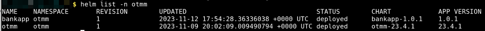
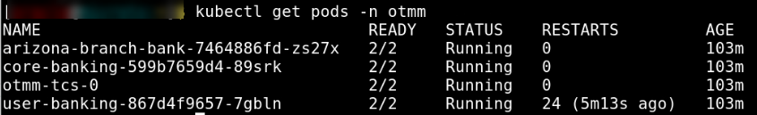
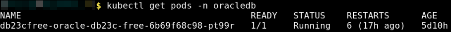
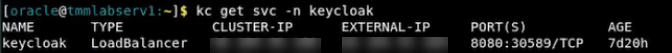
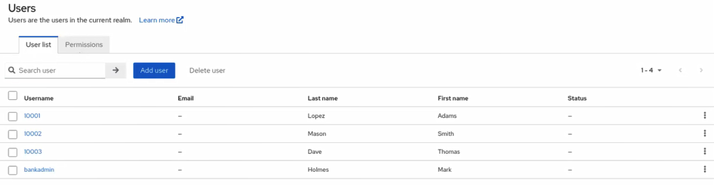
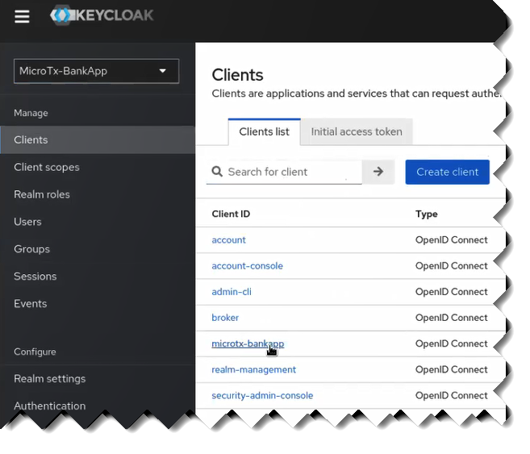
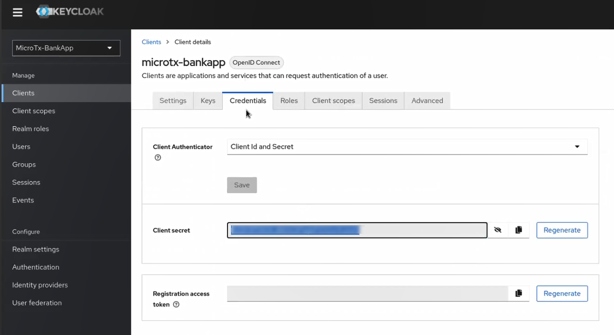
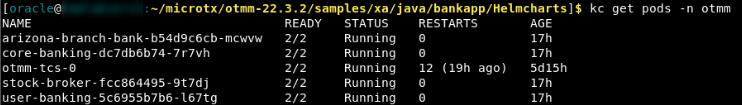

# Deploy the Bank and Stock-Trading Application

## Introduction

The Bank and Stock-Trading application contains several microservices that interact with each other to complete a transaction. The Stock Broker microservice initiates the transactions to purchase and sell shares, so it is called a transaction initiator service. The Core Banking, Branch Banking, and User Banking services participate in the transactions related to the trade in stocks, so they are called participant services.

Estimated Time: 12 minutes

### Objectives

In this lab, you will:

* Configure Minikube and start a Minikube tunnel
* Configure Keycloak
* Build container image for the Stock Broker microservice.
* Update the `values.yaml` file, which contains the deployment configuration details for the Bank and Stock-Trading application.
* Install the Bank and Stock-Trading application. While installing the application, Helm uses the configuration details you provide in the `values.yaml` file.
* (Optional) Deploy Kiali and Jaeger in your Minikube cluster

### Prerequisites

This lab assumes you have:

* An Oracle Cloud account.
* Successfully completed the previous labs:
    * Get Started
    * Lab 1: Prepare setup
    * Lab 2: Set Up the Environment
    * Lab 3: Integrate MicroTx Client Libraries with the Stock Broker Microservice
* Logged in using remote desktop URL as an `oracle` user. If you have connected to your instance as an `opc` user through an SSH terminal using auto-generated SSH Keys, then you must switch to the `oracle` user before proceeding with the next step.

  ```
  <copy>
  sudo su - oracle
  </copy>
  ```

## Task 1: Configure Minikube and Start a Tunnel

Before you start a transaction, you must start a Minikube tunnel.

1. Start Minikube.

    ```
    <copy>
    minikube start
    </copy>
    ```

2. Run the following command in a new terminal to start a tunnel. Keep this terminal window open.

    ```
    <copy>
    minikube tunnel
    </copy>
    ```

3. Enter the password to access your local machine if you are prompted to enter your password.

4. In a new terminal, run the following command to note down the external IP address of the Istio ingress gateway.

    ```
    <copy>
    kubectl get svc istio-ingressgateway -n istio-system
    </copy>
    ```

    From the output note down the value of `EXTERNAL-IP`, which is the external IP address of the Istio ingress gateway. You will provide this value in the next step. If the `EXTERNAL-IP` is in the `pending` state, ensure that the Minikube tunnel is running before proceeding with the next steps.

    **Example output**

    

    Let's consider that the external IP in the above example is 192.0.2.117.

5. Store the external IP address of the Istio ingress gateway in an environment variable named `CLUSTER_IPADDR` as shown in the following command.

    ```
    <copy>
    export CLUSTER_IPADDR=192.0.2.117
    </copy>
    ```

    Note that, if you don't do this, then you must explicitly specify the IP address in the commands when required.

## Task 2: Know Details About the Resource Managers

When you start Minikube, an instance of the Oracle Database 23ai Free Release is deployed on Minikube. See [Oracle Database Free](https://www.oracle.com/database/free/get-started). The following three PDBs are already available in the Database instance.

    * The Core Banking service uses `COREBNKPDB` as resource manager.
    * The Branch Banking service uses `AZBRPDB1` as resource manager.
    * The Stock Broker service uses `STOCKBROKERPDB` as resource manager.

The required tables are already created in each PDB and are populated with sample values. This section provides details about the sample data in each table.

### About the Resource Manager for the Core Banking Service

The Core Banking service uses `COREBNKPDB` as resource manager. This PDB contains three tables: Branch, Account, and History. The following code snippet provides details about the tables. The sample code is provided only for your reference. The tables are already available in the PDB and populated with sample values.

    ```SQL
    CREATE TABLE BRANCH
    (
      BRANCH_ID   NUMBER NOT NULL,
      BRANCH_NAME VARCHAR2(20),
      PHONE       VARCHAR2(14),
      ADDRESS     VARCHAR2(60),
      SERVICE_URL VARCHAR2(255),
      LAST_ACCT   INTEGER,
      PRIMARY KEY (BRANCH_ID)
    );

    CREATE TABLE ACCOUNT
    (
      ACCOUNT_ID NUMBER   NOT NULL,
      BRANCH_ID  NUMBER   NOT NULL,
      SSN        CHAR(12) NOT NULL,
      FIRST_NAME VARCHAR2(20),
      LAST_NAME  VARCHAR2(20),
      MID_NAME   VARCHAR2(10),
      PHONE      VARCHAR2(14),
      ADDRESS    VARCHAR2(60),
      PRIMARY KEY (ACCOUNT_ID)
    );

    CREATE TABLE HISTORY
    (
      TRANSACTION_CREATED TIMESTAMP DEFAULT CURRENT_TIMESTAMP,
      ACCOUNT_ID          NUMBER       NOT NULL,
      BRANCH_ID           NUMBER       NOT NULL,
      TRANSACTION_TYPE    VARCHAR2(15) NOT NULL,
      DESCRIPTION         VARCHAR2(1024),
      AMOUNT              DECIMAL(20, 2) NOT NULL,
      BALANCE             DECIMAL(20, 2) NOT NULL
    );
    ```
The following sample code provides details about the sample code that is available in the BRANCH and ACCOUNTS tables.

    ```SQL
    -- Sample values in the BRANCH table
    INSERT INTO BRANCH (BRANCH_ID, BRANCH_NAME, PHONE, ADDRESS, SERVICE_URL, LAST_ACCT)
    VALUES (1111, 'Arizona', '123-456-7891', '6001 N 24th St, Phoenix, Arizona 85016, United States', 'http://arizona-branch-bank:9095', 10002);

    -- Sample values in the ACCOUNTS table
    INSERT INTO ACCOUNT (ACCOUNT_ID, BRANCH_ID, SSN, FIRST_NAME, LAST_NAME, MID_NAME, PHONE, ADDRESS)
    VALUES (10001, 1111, '873-61-1457', 'Adams', 'Lopez', 'D', '506-100-5886', '15311 Grove Ct. Arizona  95101');
    INSERT INTO ACCOUNT (ACCOUNT_ID, BRANCH_ID, SSN, FIRST_NAME, LAST_NAME, MID_NAME, PHONE, ADDRESS)
    VALUES (10002, 1111, '883-71-8538', 'Smith', 'Mason', 'N', '403-200-5890', '15322 Grove Ct. Arizona  95101');
    INSERT INTO ACCOUNT (ACCOUNT_ID, BRANCH_ID, SSN, FIRST_NAME, LAST_NAME, MID_NAME, PHONE, ADDRESS)
    VALUES (10003, 1111, '883-71-8538', 'Thomas', 'Dave', 'C', '603-700-5899', '15333 Grove Ct. Arizona  95101');
    ```

### About the Resource Manager for the Branch Banking Service

The Branch Banking service uses `AZBRPDB1` as resource manager. This PDB contains the `SAVINGS_ACCOUNT` table. The following code snippet provides details about the `SAVINGS_ACCOUNT` table. The sample code is provided only for your reference. The tables are already available in the PDB and populated with sample values.

    ```SQL
    CREATE TABLE SAVINGS_ACCOUNT
    (
      ACCOUNT_ID NUMBER NOT NULL,
      BRANCH_ID  NUMBER NOT NULL,
      BALANCE    DECIMAL(20, 2) NOT NULL,
      PRIMARY KEY (ACCOUNT_ID)
    );
    ```

The following sample code provides details about the sample code that is available in the SAVINGS_ACCOUNT table.

    ```SQL
    -- Branch - Arizona
    INSERT INTO SAVINGS_ACCOUNT (ACCOUNT_ID, BRANCH_ID, BALANCE)
    VALUES (10001, 1111, 50000.0);
    INSERT INTO SAVINGS_ACCOUNT (ACCOUNT_ID, BRANCH_ID, BALANCE)
    VALUES (10002, 1111, 50000.0);
    INSERT INTO SAVINGS_ACCOUNT (ACCOUNT_ID, BRANCH_ID, BALANCE)
    VALUES (10003, 1111, 50000.0);
    ```

### About the Resource Manager for the Stock Broker Service

The Stock Broker service uses `STOCKBROKERPDB` as resource manager. This PDB contains six tables: `CASH_ACCOUNT`, `STOCKS`, `USER_ACCOUNT`, `STOCK_BROKER_STOCKS`, `USER_STOCKS`, and `HISTORY`. The following code snippet provides details about the tables. The sample code is provided only for your reference. The tables are already available in the PDB and populated with sample values.

    ```SQL
    -- Tables to be created
    -- Display stock units
    CREATE TABLE CASH_ACCOUNT
    (
        ACCOUNT_ID   NUMBER       NOT NULL,
        BALANCE      DECIMAL,
        STOCK_BROKER VARCHAR2(20) NOT NULL,
        PRIMARY KEY (ACCOUNT_ID)
    );
    -- Common account for Stock Broker. This is inserted during the initialization of the application.
    CREATE TABLE STOCKS
    (
        STOCK_SYMBOL VARCHAR2(6)  NOT NULL,
        COMPANY_NAME VARCHAR2(35) NOT NULL,
        INDUSTRY     VARCHAR2(35) NOT NULL,
        STOCK_PRICE  DECIMAL      NOT NULL,
        PRIMARY KEY (STOCK_SYMBOL)
    );
    CREATE TABLE USER_ACCOUNT
    (
        ACCOUNT_ID NUMBER   NOT NULL,
        SSN        CHAR(12) NOT NULL,
        FIRST_NAME VARCHAR2(20),
        LAST_NAME  VARCHAR2(20),
        MID_NAME   VARCHAR2(10),
        PHONE      VARCHAR2(14),
        ADDRESS    VARCHAR2(60),
        PRIMARY KEY (ACCOUNT_ID)
    );
    CREATE TABLE STOCK_BROKER_STOCKS
    (
        ACCOUNT_ID   NUMBER NOT NULL,
        STOCK_SYMBOL VARCHAR2(6)  NOT NULL,
        STOCK_UNITS  NUMBER NOT NULL,
        PRIMARY KEY (ACCOUNT_ID, STOCK_SYMBOL),
        CONSTRAINT FK_StockBroker_CashAccount
            FOREIGN KEY (ACCOUNT_ID) REFERENCES CASH_ACCOUNT (ACCOUNT_ID) ON DELETE CASCADE,
        CONSTRAINT FK_StockBrokerStocks_Stocks
            FOREIGN KEY (STOCK_SYMBOL) REFERENCES STOCKS (STOCK_SYMBOL) ON DELETE CASCADE
    );
    CREATE TABLE USER_STOCKS
    (
        ACCOUNT_ID   NUMBER NOT NULL,
        STOCK_SYMBOL VARCHAR2(6)  NOT NULL,
        STOCK_UNITS  NUMBER NOT NULL,
        PRIMARY KEY (ACCOUNT_ID, STOCK_SYMBOL),
        CONSTRAINT FK_UserStocks_UserAccount
            FOREIGN KEY (ACCOUNT_ID) REFERENCES USER_ACCOUNT (ACCOUNT_ID) ON DELETE CASCADE,
        CONSTRAINT FK_UserStocks_Stocks
            FOREIGN KEY (STOCK_SYMBOL) REFERENCES STOCKS (STOCK_SYMBOL) ON DELETE CASCADE
    );
    CREATE TABLE HISTORY
    (
        TRANSACTION_TIME TIMESTAMP DEFAULT CURRENT_TIMESTAMP,
        ACCOUNT_ID       NUMBER       NOT NULL,
        STOCK_OPERATION  VARCHAR2(15) NOT NULL,
        STOCK_UNITS      NUMBER       NOT NULL,
        STOCK_SYMBOL     VARCHAR2(6)  NOT NULL,
        DESCRIPTION      VARCHAR2(1024)
    );
    ```
The following sample code provides details about the sample code that is available in the `CASH_ACCOUNT`, `STOCKS`, `USER_ACCOUNT`, `STOCK_BROKER_STOCKS`, and `USER_STOCKS` tables.

    ```SQL
    -- Sample value in the STOCKS table
    INSERT INTO STOCKS(STOCK_SYMBOL, COMPANY_NAME, INDUSTRY, STOCK_PRICE)
    VALUES ('BLUSC', 'Blue Semiconductor', 'Semiconductor Industry', 87.28);
    INSERT INTO STOCKS(STOCK_SYMBOL, COMPANY_NAME, INDUSTRY, STOCK_PRICE)
    VALUES ('SPRFD', 'Spruce Street Foods', 'Food Products', 152.55);
    INSERT INTO STOCKS(STOCK_SYMBOL, COMPANY_NAME, INDUSTRY, STOCK_PRICE)
    VALUES ('SVNCRP', 'Seven Corporation', 'Software consultants', 97.20);
    INSERT INTO STOCKS(STOCK_SYMBOL, COMPANY_NAME, INDUSTRY, STOCK_PRICE)
    VALUES ('TALLMF', 'Tall Manufacturers', 'Tall Manufacturing', 142.24);
    INSERT INTO STOCKS(STOCK_SYMBOL, COMPANY_NAME, INDUSTRY, STOCK_PRICE)
    VALUES ('VSNSYS', 'Vision Systems', 'Medical Equipments', 94.35);

    -- Sample value in the CASH_ACCOUNT table
    INSERT INTO CASH_ACCOUNT(ACCOUNT_ID, BALANCE, STOCK_BROKER)
    VALUES (9999999, 10000000, 'PENNYPACK');

    -- Sample value in the STOCK_BROKER_STOCKS table
    INSERT INTO STOCK_BROKER_STOCKS (ACCOUNT_ID, STOCK_SYMBOL, STOCK_UNITS)
    VALUES (9999999, 'BLUSC', 100000);
    INSERT INTO STOCK_BROKER_STOCKS (ACCOUNT_ID, STOCK_SYMBOL, STOCK_UNITS)
    VALUES (9999999, 'SPRFD', 50000);
    INSERT INTO STOCK_BROKER_STOCKS (ACCOUNT_ID, STOCK_SYMBOL, STOCK_UNITS)
    VALUES (9999999, 'SVNCRP', 90000);
    INSERT INTO STOCK_BROKER_STOCKS (ACCOUNT_ID, STOCK_SYMBOL, STOCK_UNITS)
    VALUES (9999999, 'TALLMF', 80000);
    INSERT INTO STOCK_BROKER_STOCKS (ACCOUNT_ID, STOCK_SYMBOL, STOCK_UNITS)
    VALUES (9999999, 'VSNSYS', 100000);

    -- Sample value in the USER_ACCOUNT table
    INSERT INTO USER_ACCOUNT (ACCOUNT_ID, SSN, FIRST_NAME, LAST_NAME, MID_NAME, PHONE, ADDRESS)
    VALUES (10001, '873-61-1457', 'Adams', 'Lopez', 'D', '506-100-5886', '15311 Grove Ct. New York  95101');
    INSERT INTO USER_ACCOUNT (ACCOUNT_ID, SSN, FIRST_NAME, LAST_NAME, MID_NAME, PHONE, ADDRESS)
    VALUES (10002, '883-71-8538', 'Smith', 'Mason', 'N', '403-200-5890', '15311 Grove Ct. New York  95101');
    INSERT INTO USER_ACCOUNT (ACCOUNT_ID, SSN, FIRST_NAME, LAST_NAME, MID_NAME, PHONE, ADDRESS)
    VALUES (10003, '993-71-8500', 'Thomas', 'Dave', 'C', '603-700-5899', '15333 Grove Ct. Arizona  95101');

    -- Sample value in the USER_STOCKS table
    INSERT INTO USER_STOCKS(ACCOUNT_ID, STOCK_SYMBOL, STOCK_UNITS)
    VALUES (10001, 'BLUSC', 10);
    INSERT INTO USER_STOCKS(ACCOUNT_ID, STOCK_SYMBOL, STOCK_UNITS)
    VALUES (10001, 'SPRFD', 15);
    INSERT INTO USER_STOCKS(ACCOUNT_ID, STOCK_SYMBOL, STOCK_UNITS)
    VALUES (10001, 'SVNCRP', 20);
    INSERT INTO USER_STOCKS(ACCOUNT_ID, STOCK_SYMBOL, STOCK_UNITS)
    VALUES (10001, 'TALLMF', 30);
    INSERT INTO USER_STOCKS(ACCOUNT_ID, STOCK_SYMBOL, STOCK_UNITS)
    VALUES (10001, 'VSNSYS', 40);
    ```

When you start Minikube, the PDBs are created and populated with sample data.

## Task 3: Verify that All the Resources are Ready

1. Verify that the application has been deployed successfully.

    ```text
    <copy>
    helm list -n otmm
    </copy>
    ```

   In the output, verify that the `STATUS` of the `bankapp` is `deployed`.

   **Example output**

   

2. Verify that all resources, such as pods and services, are ready. Run the following command to retrieve the list of resources in the namespace `otmm` and their status.

    ```text
    <copy>
    kubectl get pods -n otmm
    </copy>
    ```

   **Example output**

   

3. Verify that the database instance is running. The database instance is available in the `oracledb` namespace.  Run the following command to retrieve the list of resources in the `oracledb` namespace and their status.

    ```text
    <copy>
    kubectl get pods -n oracledb
    </copy>
    ```

   **Example output**

   

It usually takes some time for the Database services to start running in the Minikube environment. Proceed with the remaining tasks only after ensuring that all the resources, including the database service, are ready and in the `RUNNING` status and the value of the **READY** field is `1/1`.

## Task 4: Configure Keycloak

The Bank and Stock-Trading Application console uses Keycloak to authenticate users.

1. Run the following command to note down the external IP address and port to access Keycloak.

    ```
    <copy>
    kubectl get svc -n keycloak
    </copy>
    ```

    From the output note down the value of `EXTERNAL-IP` and `PORT(S)`, which is the external IP address and port of Keycloak. You will provide this value later.

    **Example output**

    

    Let's consider that the external IP in the above example is 198.51.100.1 and the port is 8080.

2. Run the following command to run the `reconfigure-keycloak.sh` script from the `$HOME` directory. This command configures Keycloak and updates the settings to suit the requirements of the application.

    ```
    <copy>
    cd $HOME
    sh reconfigure-keycloak.sh
    </copy>
    ```

3. Sign in to Keycloak. In a browser, enter the IP address and port number that you have copied in the previous step. The following example provides sample values. Provide the values based on your environment.

    ```
    http://198.51.100.1:8080
    ```

4. Click **Administration Console**.

5. Sign in to Keycloak with the initial administrator username `admin` and password `admin`. After logging in, reset the password for the `admin` user. For information about resetting the password, see the Keycloak documentation.

6. Select the **MicroTx-BankApp** realm, and then click **Users** to view the list of users in the `MicroTx-BankApp` realm. The `MicroTx-BankApp` realm is preconfigured with these default user names.
   

7. Set the password for each user. For information about providing credentials for users, see the Keycloak documentation.

8. Click **Clients**, and then click **microtx-bankapp** in the **Clients list** tab.
    

    Details of the `microtx-bankapp` client are displayed.

9. In the **Settings** tab, under **Access settings**, verify that the external IP address of Istio ingress gateway is available in the **Root URL**, **Valid redirect URIs**, **Valid post logout redirect URIs**, and **Admin URL** fields.

10. Click the **Credentials** tab, and then note down the value of the **Client-secret**. You'll need to provide this value later.
    

11. Click **Realm settings**, and then in the **Frontend URL** field of the **General** tab, verify that the values provided match the external IP address and port of the Keycloak server which you have copied in a previous step. For example, `http://198.51.100.1:8080`.

12. In the **Endpoints** field, click the **OpenID Endpoint Configuration** link. Configuration details are displayed in a new tab.

13. Note down the value of the **issuer** URL. It is in the format, `http://<keycloak-ip-address>:<port>/realms/<name-of-realm-you-have-created>`. For example, `http://198.51.100.1:8080/realms/MicroTx-Bankapp`. You'll need to provide this value later.

14. Click **Save**.

## Task 5: Provide Access Details in the values.yaml File

The folder that contains the Bank and Stock-Trading application code also contains the `values.yaml` file. This is the manifest file, which contains the deployment configuration details for the Bank and Stock-Trading application. Edit the `values.yaml` file to provide the URL to access Keycloak and other access details.

To provide the configuration and environment details in the `values.yaml` file:

1. Open the `values.yaml` file, which is in the `/home/oracle/OTMM/otmm-package/samples/xa/java/bankapp/Helmcharts` folder.

2. Enter values that you have noted down for the following fields under `security` in `UserBanking`.

    * `clientSecret`: Enter the value of the client secret value that you had copied in step 10 of [Task 4](#Task4:ConfigureKeycloak).
    * `issuerURL`: Enter the URL that you had copied in step 13 of [Task 4](#Task4:ConfigureKeycloak).
    * `logoutRedirectURL`: Enter the URL in the format, `http://$CLUSTER_IPADDR/bankapp`. Where, `CLUSTER_IPADDR` is the external IP address of the Istio ingress gateway that you have noted down in [Task 1](#Task1:ConfigureMinikubeandStartaTunnel). For example, `http://192.0.2.117/bankapp`.

3. Under `StockBroker`, set `deploymentEnabled` to `true`. You must set this flag to true before deploying the Stock Broker service.

4. Save the changes you have made to the `values.yaml` file.

## Task 6: Build Container Image for the Stock Broker service

The code for the Bank and Stock-Trading application is available in the installation bundle in the `/home/oracle/OTMM/otmm-package/samples/xa/java/bankapp` folder. The container image for the User Banking, Branch Banking, Core Banking services are pre-built and available for your use. Build the container image only for the Stock Broker service.

To build container image for the Stock Broker service:

1. Run the following commands.

    ```
    <copy>
    cd /home/oracle/OTMM/otmm-package/samples/xa/java/bankapp/StockBroker
    </copy>
    ```

    ```
    <copy>
    minikube image build -t stockbroker:1.0 .
    </copy>
    ```

   When the image is successfully built, the following message is displayed.

   **Successfully tagged stockbroker:1.0**

The container image that you have built is available in your Minikube container registry.

## Task 7: Install the Bank and Stock-Trading application

Install the Bank and Stock-Trading application in the `otmm` namespace, where you have installed MicroTx. While installing the Bank and Stock-Trading application, Helm uses the configuration details you have provided in the `values.yaml` file.

1. Run the following commands to install the Bank and Stock-Trading application.

    ```
    <copy>
    cd /home/oracle/OTMM/otmm-package/samples/xa/java/bankapp/Helmcharts
    </copy>
    ```

    ```
    <copy>
    helm install bankapp --namespace otmm bankapp/ --values bankapp/values.yaml
    </copy>
    ```

   Where, `bankapp` is the name of the application that you want to install. You can provide another name to the installed application.

   In the output, verify that the `STATUS` of the `bankapp` is `deployed`.

   **Example output**

    ```
    NAME: bankapp
    LAST DEPLOYED: Tue May 23 10:52:14 2023
    NAMESPACE: otmm
    STATUS: deployed
    REVISION: 1
    TEST SUITE: None
    ```

2. If you don't need to make any changes to the `values.yaml` file, skip this step and go to the next step. If you need to modify the `values.yaml` file, then uninstall `bankapp`.

    ```
    <copy>
    helm uninstall bankapp --namespace otmm
    </copy>
    ```

    Update the `values.yaml` file, and then reinstall `bankapp`. Perform step 1 as described in this task again to reinstall `bankapp`.

3. Verify that all resources, such as pods and services, are ready. Proceed to the next step only when all resources are running. Run the following command to retrieve the list of resources in the namespace `otmm` and their status.

    ```
    <copy>
    kubectl get pods -n otmm
    </copy>
    ```

    The following image shows a sample output.
   

## Task 8: Deploy Kiali and Jaeger (Optional)

Optionally, you can use Kiali and Jaeger to track and trace distributed transactions in MicroTx through visualization. Use distributed tracing to track how requests flow between MicroTx and the microservices.

Run the following commands to deploy Kiali and Jaeger in a Minikube cluster.

1. Deploy Kiali.

    ```
    <copy>
    kubectl apply -f https://raw.githubusercontent.com/istio/istio/release-1.17/samples/addons/kiali.yaml
    </copy>
    ```

2. Deploy Prometheus. To use Kiali, you must deploy Prometheus and Kiali in the same cluster.

    ```
    <copy>
    kubectl apply -f https://raw.githubusercontent.com/istio/istio/release-1.17/samples/addons/prometheus.yaml
    </copy>
    ```

3. Deploy Jaeger.

    ```
    <copy>
    kubectl apply -f https://raw.githubusercontent.com/istio/istio/release-1.17/samples/addons/jaeger.yaml
    </copy>
    ```

4. Start the Kiali Dashboard. Run the following command in a new terminal. Ensure that you leave this terminal open. If a new browser opens, close the browser.

    ```
    <copy>
    istioctl dashboard kiali
    </copy>
    ```

   From the output, note down the URL. This is the URL on which you can access the Kiali dashboard in a browser. For example, `http://localhost:20001/kiali`.

5. Start the Jaeger Dashboard. Run the following command in a new terminal. Ensure that you leave this terminal open. If a new browser opens, close the browser.

    ```
    <copy>
    istioctl dashboard jaeger
    </copy>
    ```

   From the output, note down the URL. This is the URL on which you can access the Jaeger dashboard in a browser. For example, `http://localhost:16686`.

You may now **proceed to the next lab**.

## Learn More

* [Develop Applications with XA](https://docs.oracle.com/pls/topic/lookup?ctx=microtx-latest&id=TMMDG-GUID-D9681E76-3F37-4AC0-8914-F27B030A93F5)

## Acknowledgements

* **Author** - Sylaja Kannan
* **Contributors** - Brijesh Kumar Deo, Bharath MC, Atul Dhiman, and Anand Verma
* **Last Updated By/Date** - Sylaja, February 2025
