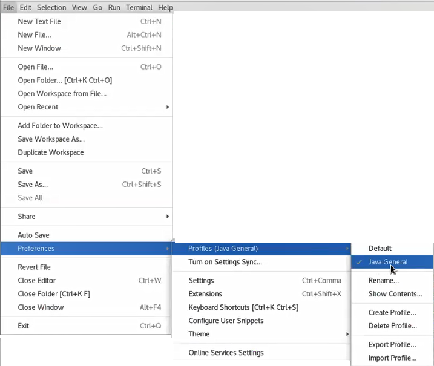

# Integrate MicroTx Client Libraries with the Stock Broker Microservice

## Introduction

This lab walks you through all the steps to integrate the functionality provided by the Oracle® Transaction Manager for Microservices (MicroTx) client libraries with an application. Use MicroTx client libraries to register the required interceptors and callbacks, to obtain a connection to the application's resource manager, and to delineate transaction boundaries which indicate that an XA transaction has started, and then to commit or roll back the transaction.

The Bank and Stock-Trading application contains the following microservices: Core Banking, Branch Banking, User Banking, and Stock Broker services. The MicroTx client library files are already integrated with the Core Banking, Branch Banking, and User Banking services. In this lab you will integrate the MicroTx client library files with the Stock Broker service.

Estimated Time: 5 minutes

### Objectives

In this lab, you will:

* Configure the Stock Broker service as a transaction initiator. A transaction initiator service starts and ends a transaction.
* Configure the Stock Broker service as a transaction participant. A transaction participant service joins the transaction. The Stock Broker service initiates the transaction, and then participates in it. After starting a transaction to buy or sell shares, the Stock Broker service also participates in the transaction to deposit or withdraw the shares from a user's account.

### Prerequisites

This lab assumes you have:

* An Oracle Cloud account.
* Successfully completed all previous labs:
    * Get Started
    * Lab 1: Prepare setup
    * Lab 2: Set Up the Environment
* Logged in using remote desktop URL as an `oracle` user. If you have connected to your instance as an `opc` user through an SSH terminal using auto-generated SSH Keys, then you must switch to the `oracle` user before proceeding with the next step.

      ```
      <copy>
      sudo su - oracle
      </copy>
      ```
* Configured Visual Studio Code to edit the code for Java applications. Click **File** > **Preferences** > **Profiles (Java General)** > **Java General** as shown in the following image.

    

## Task 1: Configure the Stock Broker App as a Transaction Initiator

Uncomment all the lines of code in the following files to integrate the functionality provided by the MicroTx client libraries with the Stock Broker application.

* `pom.xml` file located in the `/home/oracle/OTMM/otmm-package/samples/xa/java/bankapp/StockBroker/` folder
* `UserStockTransactionServiceImpl.java` file located in the `/com/oracle/tmm/stockbroker/service/impl/` package of the `StockBroker` application

The following section provides reference information about each line of code that you must uncomment and its purpose. You can skip this reading this section if you only want to quickly uncomment the code and run the application. You can return to this section later to understand the purpose of each line of code that you uncomment.

1. Include the MicroTx library as a maven dependency in the application's `pom.xml` file. Open the `pom.xml` file which is in the `/home/oracle/OTMM/otmm-package/samples/xa/java/bankapp/StockBroker/` folder in any code editor, such as Visual Studio Code, and then uncomment the following lines of code. The following sample code is for the 24.4.1 release. Provide the correct version, based on the release that you want to use.

    ```
    <copy>
    <dependency>
      <groupId>com.oracle.microtx</groupId>
      <artifactId>microtx-spring-boot-starter</artifactId>
      <version>24.4.1</version>
    </dependency>
    </copy>
    ```

2. Open the `UserStockTransactionServiceImpl.java` file in any code editor, such as Visual Studio Code. This file is in the `/com/oracle/tmm/stockbroker/service/impl/` package of the `StockBroker` application.

3. Uncomment the following lines of code to import the required packages.

    **Sample command**

    ```java
    <copy>
    import jakarta.transaction.*;
    import com.oracle.microtx.xa.rm.MicroTxUserTransactionService;
    </copy>
    ```

4. Uncomment the following lines of code to initialize an object of the `MicroTxUserTransactionService` class in the application code for every new transaction. This object demarcates the transaction boundaries, which are begin, commit, or roll back. Autowire the `MicroTxUserTransactionService` class before your application logic initiates or begins a transaction.

    **Sample command**

    ```java
    <copy>
    @Autowired
    MicroTxUserTransactionService microTxUserTransaction;
    </copy>
    ```

5. Uncomment the following line of code under `buy()` to begin an XA transaction to buy stocks.

    **Sample command**

    ```java
    <copy>
    microTxUserTransaction.begin(true);
    </copy>
    ```

6. Uncomment all the occurrences of the following lines of code to specify the transaction boundaries for rolling back or committing the transaction. Based on the application's business logic, commit or rollback the transaction.

    **Sample command**

    ```java
   <copy>
   microTxUserTransaction.rollback();
   microTxUserTransaction.commit();
   </copy>
    ```

7. Uncomment the following line of code under `sell()` to begin the XA transaction to sell stocks.

    **Sample command**

    ```java
    <copy>
    microTxUserTransaction.begin(true);
    </copy>
    ```

8. Uncomment all the occurrences of the following lines of code to specify the transaction boundaries for rolling back or committing the transaction. Based on your business logic, commit or rollback the transaction.

    **Sample command**

    ```java
   <copy>
   microTxUserTransaction.rollback();
   microTxUserTransaction.commit();
   </copy>
    ```

9. Uncomment the catch blocks in the `buy()` and `sell()` methods.

10. Uncomment the following lines of code in the `BankUtility.java` file, located in the `/com/oracle/tmm/stockbroker/utils/` package of the `StockBroker` application, to inject the Spring Boot REST template provided by MicroTx.

    **Sample command**

    ```java
    <copy>
    @Autowired
    @Qualifier("MicroTxXaRestTemplate")
    RestTemplate restTemplate;
    </copy>
    ```

## Task 2: Configure the Stock Broker Application as a Transaction Participant

Since the Stock broker application participates in the transaction in addition to initiating the transaction, you must make additional configurations for the application to participate in the transaction and communicate with its resource manager.

When you integrate the MicroTx client library for Java with the Stock broker application, the library performs the following functions:

* Enlists the participant service with the transaction coordinator.
* Injects an `XADataSource` object for the participant application code to use through dependency injection. The MicroTx libraries automatically inject the configured data source into the participant services, so you must autowire the connection object with `microTxSqlConnection` bean qualifier. The application code runs the DML using this connection.
* Calls the resource manager to perform operations.

Uncomment all the lines of code in the following files:

* `DatasourceConfigurations.java` file located in the `/com/oracle/tmm/stockbroker` package of the `StockBroker` application.
* `AccountServiceImpl.java` file located in the `/com/oracle/tmm/stockbroker/service/impl/` package of the `StockBroker` application.
* `StockBrokerTransactionServiceImpl.java` file located in the `/com/oracle/tmm/stockbroker/service/impl/` package of the `StockBroker` application.

The following section provides reference information about each line of code that you must uncomment and its purpose. You can skip this reading this section if you only want to quickly uncomment the code and run the application. You can return to this section later to understand the purpose of each line of code that you uncomment.

To configure the Stock Broker application as a transaction participant:

1. Open the `DatasourceConfigurations.java` file in any code editor, such as Visual Studio Code. This file is in the `/com/oracle/tmm/stockbroker` package of the `StockBroker` application.

2. Uncomment the following line of code to import the `com.oracle.microtx.common.MicroTxConfig` package.

    ```java
    <copy>
    import com.oracle.microtx.common.MicroTxConfig;
    </copy>
    ```

2. Uncomment the following lines of code in the transaction participant function or block to create a `PoolXADataSource` object and provide credentials and other details to connect to the resource manager. This object is used by the MicroTx client library.

    ```java
    <copy>
    @Bean(name = "SBPoolXADataSource")
    @Primary
    public PoolXADataSource getXAPoolDataSource() {
        PoolXADataSource xapds = null;
        try {
            xapds = PoolDataSourceFactory.getPoolXADataSource();
            xapds.setConnectionFactoryClassName(xaConnectionFactoryClassName);
            xapds.setURL(url);
            xapds.setUser(username);
            xapds.setPassword(password);
            xapds.setMinPoolSize(Integer.valueOf(minPoolSize));
            xapds.setInitialPoolSize(Integer.valueOf(initialPoolSize));
            xapds.setMaxPoolSize(Integer.valueOf(maxPoolSize));
            xapds.setValidateConnectionOnBorrow(true);
            xapds.setInactiveConnectionTimeout(60);
            xapds.setAbandonedConnectionTimeout(60);

            MicroTxConfig.initXaDataSource(xapds);
            } catch (SQLException ea) {
            log.error("Error connecting to the database: " + ea.getMessage());
        }
        log.info("PoolXADataSource initialized successfully.");
        return xapds;
    }
    </copy>
    ```

    It is your responsibility as an application developer to ensure that an XA-compliant JDBC driver and required parameters are set up while creating the `PoolXADataSource` object. The MicroTx client library uses the `XADatasource` object to create database connections.

10. Open the `AccountServiceImpl.java` file in any code editor, such as Visual Studio Code. This file is in the `/com/oracle/tmm/stockbroker/service/impl/` package of the `StockBroker` application.

12. Uncomment the following lines of code so that the application uses the connection passed by the MicroTx client library. The following code in the participant application autowires the connection object bean `microTxSqlConnection` that is managed by the MicroTx client library.

    ```java
    <copy>
    @Autowired
    @Qualifier("microTxSqlConnection")
    @Lazy
    private Connection connection;
    </copy>
    ```

14. Save the changes.

15. Open the `StockBrokerTransactionServiceImpl.java` file in any code edito, such as Visual Studio Code. This file is in the `/com/oracle/tmm/stockbroker/service/impl/` package of the `StockBroker` application.

17. Uncomment the following lines of code so that the application uses the connection passed by the MicroTx client library. The following code in the participant application autowires the connection object bean `microTxSqlConnection` that is managed by the MicroTx client library.

    ```java
    <copy>
    @Autowired
    @Qualifier("microTxSqlConnection")
    @Lazy
    private Connection connection;
    </copy>
    ```

19. Save the changes.

## Task 3: Enable Transaction History (Optional)

You can register your initiator and participant services to receive notifications when an event occurs. To achieve this you must perform the additional steps described in this task.

1. Uncomment the `TransactionEventsUtility.java` class, located in the `/com/oracle/tmm/stockbroker/utils/` package of the `StockBroker` application.
The `TransactionEventsUtility.java` class registers the events and you can use the `BuyStockEventListenerResource.java` and `SellStockEventListenerResource.java` classes to listen to the transaction events.

2. Update the `UserStockTransactionServiceImpl.java` class, located in the `/com/oracle/tmm/stockbroker/service/impl` package of the `StockBroker` application. Add the following lines of code to register the transaction events within the transaction boundary. Note that you must register the transaction event after the transaction begins.

    1. Add the following lines of code to import the required packages.

        ```java
        <copy>
        import com.oracle.tmm.stockbroker.utils.TransactionEventsUtility;
        </copy>
        ```

    2. Add the following line of code.

        ```java
        <copy>
        @Autowired
        TransactionEventsUtility transactionEventsUtility;
        </copy>
        ```

    3. Add a line of code, `transactionEventsUtility.registerStockTransactionEvents(buyStock)`, to register the purchase of stocks.

        ```java
        <copy>
        @Override
        public BuyResponse buy(BuyStock buyStock) {
        TrmUserTransaction transaction = new TrmUserTransaction();
        BuyResponse buyResponse = new BuyResponse();
        try {
           microTxUserTransaction.begin(true);
           // Add the following line of code after the transaction begins.
           transactionEventsUtility.registerStockTransactionEvents(buyStock);
           buyResponse.setTransactionId(microTxUserTransaction.getTransactionID());
           ...
        }
        </copy>
        ```

    4. Add a line of code, `transactionEventsUtility.registerStockTransactionEvents(sellStock)` to register the sale of stocks.

        ```java
        <copy>
        @Override
        public SellResponse sell(SellStock sellStock) {
        TrmUserTransaction transaction = new TrmUserTransaction();
        SellResponse sellResponse = new SellResponse();
        try {
            microTxUserTransaction.begin(true);
            // Add the following line of code after the transaction begins.
            transactionEventsUtility.registerStockTransactionEvents(sellStock);
            sellResponse.setTransactionId(microTxUserTransaction.getTransactionID());
            ...
        }
        </copy>
        ```

You may now **proceed to the next lab**.

## Learn More

* [Develop Applications with XA](https://docs.oracle.com/pls/topic/lookup?ctx=microtx-latest&id=TMMDG-GUID-D9681E76-3F37-4AC0-8914-F27B030A93F5)

## Acknowledgements

* **Author** - Sylaja Kannan
* **Contributors** - Brijesh Kumar Deo, Bharath MC, Atul Dhiman, and Anand Verma
* **Last Updated By/Date** - Sylaja, February 2025
