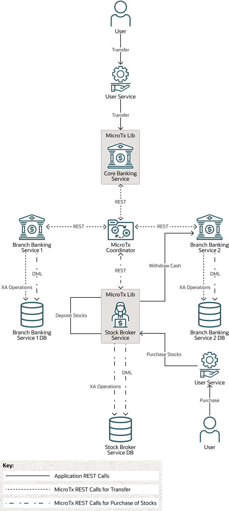

# Integrate MicroTx Client Libraries with XA Sample Application

## Introduction

Run a sample application that uses the XA transaction protocol to buy stocks and understand how you can use Transaction Manager for Microservices (MicroTx) to coordinate the transactions. Using samples is the fastest way for you to get familiar with MicroTx.
The sample application code is available in the MicroTx distribution.

Estimated Time: *10 minutes*

### About the XA Sample Application

The sample application demonstrates how you can develop microservices that participate in XA transactions while using MicroTx to coordinate the transactions.

The following figure shows a sample XA application, which contains several microservices, to demonstrate how you can develop microservices that participate in XA transactions.


### Objectives

In this lab, you will:

* Configure the Stock Broker App as a Transaction Initiator
* Configure the Stock Broker Application as a Transaction Participant

### Prerequisites

This lab assumes you have:

* An Oracle Cloud account.
* Successfully completed all previous labs:
  * Get Started
  * Lab 1: Prepare setup
  * Lab 2: Environment setup
* Logged in using remote desktop URL as an `oracle` user. If you have connected to your instance as an `opc` user through an SSH terminal using auto-generated SSH Keys, then you must switch to the `oracle` user before proceeding with the next step.

      ```text
      <copy>
      sudo su - oracle
      </copy>
      ```

## Task 1: Configure the Stock Broker App as a Transaction Initiator

Initialize an object of the `TrmUserTransaction` class in the application code for every new transaction. This object demarcates the transaction boundaries, which are begin, commit, or roll back. In your application code you must create this object before you begin a transaction.

1. Include the MicroTx library as a maven dependency in the application's `pom.xml` file. Open the `pom.xml` file which is located at `/home/oracle/OTMM/otmm-<*version*>/samples/xa/java/bankapp/StockBroker/` in any code editor, and then uncomment the following lines of code. The following sample code is for the 22.3.2 release. Provide the correct version, based on the release that you want to use.

    ```text
    <dependency>
      <groupId>com.oracle.tmm.jta</groupId>
      <artifactId>TmmLib</artifactId>
      <version>22.3.2</version>
    </dependency>
    ```

2. Open the `UserStockTransactionServiceImpl.java` file in any code editor. This file is located in the `/home/oracle/OTMM/otmm-<*version*>/samples/xa/java/bankapp/StockBroker/src/main/java/com/oracle/tmm/stockbroker/service/impl/` folder.

3. Import the `oracle.tmm.jta.TrmUserTransaction` package.

    **Sample command**

    ```text
    <copy>
    import oracle.tmm.jta.TrmUserTransaction;
    </copy>
    ```

4. The following code sample demonstrates how to create an instance of the `TrmUserTransaction` object to buy stocks. You only need to add the code in bold. The other lines of code are provided only to help you identify where to place the code.

    **Sample command**

    ```text
    <copy>
    ...
    @Override
    public BuyResponse buy(BuyStock buyStock) {
      **TrmUserTransaction transaction = new TrmUserTransaction();**
    ...
    </copy>
    ```

5. The following sample demonstrates the code to begin the XA transaction to buy stocks. You only need to add the code in bold. The other lines of code are provided only to help you identify where to place the code.

    **Sample command**

    ```text
    <copy>
    ...
    BuyResponse buyResponse = new BuyResponse();
        try {
            **transaction.begin(true);**
            ... // Implement the business logic to begin a transaction.
    </copy>
    ```

6. Specify the transaction boundaries for rolling back or committing the transaction. Based on your business logic, commit or rollback the transaction. You only need to add the code in bold. The other lines of code are provided only to help you identify where to place the code.

    **Sample command**

    ```text
   <copy>
   ...
    DebitResponse debitResponse = bankUtility.debit(coreBankEndpoint, buyStock.getUserAccountId(), totalStockPrice);
        if (debitResponse.getHttpStatusCode() != Response.Status.OK.getStatusCode()) {
            ...
            **transaction.rollback();**
            return buyResponse;
        }
        if (!stockBrokerTransactionService.creditMoneyToStockBroker(totalStockPrice)) {
            ...
            **transaction.rollback();**
            return buyResponse;
        }
        if (!stockBrokerTransactionService.debitStocksFromStockBroker(buyStock.getStockSymbol(), buyStock.getStockUnits())) {
            ...
            **transaction.rollback();**
            return buyResponse;
        }
        if (!stockBrokerTransactionService.creditStocksToUser(buyStock.getUserAccountId(), buyStock.getStockSymbol(), buyStock.getStockUnits())) {
            ...
            **transaction.rollback();**
            return buyResponse;
        }
        **transaction.commit();**
    ...
   </copy>
    ```

7. The following code sample demonstrates how to create an instance of the `TrmUserTransaction` object to sell stocks. You only need to add the code in bold. The other lines of code are provided only to help you identify where to place the code.

    **Sample command**

    ```text
    <copy>
    ...
    @Override
    public SellResponse sell(SellStock sellStock) {
      **TrmUserTransaction transaction = new TrmUserTransaction();**
    ...
    </copy>
    ```

8. The following sample demonstrates the code to begin the XA transaction to buy stocks. You only need to add the code in bold. The other lines of code are provided only to help you identify where to place the code.

    **Sample command**

    ```text
    <copy>
    ...
    SellResponse sellResponse = new SellResponse();
        try {
            **transaction.begin(true);**
            ... // Implement the business logic to begin a transaction.
    </copy>
    ```

9. Specify the transaction boundaries for rolling back or committing the transaction. Based on your business logic, commit or rollback the transaction. You only need to add the code in bold. The other lines of code are provided only to help you identify where to place the code.

    **Sample command**

    ```text
    <copy>
    ...
    CreditResponse creditResponse = bankUtility.credit(coreBankEndpoint, sellStock.getUserAccountId(), totalStockPrice);
            if (creditResponse.getHttpStatusCode() != Response.Status.OK.getStatusCode()) {
                ...
                **transaction.rollback();**
                return sellResponse;
            }
            if (!stockBrokerTransactionService.debitMoneyFromStockBroker(totalStockPrice)) {
                ...
                **transaction.rollback();**
                return sellResponse;
            }
            if (!stockBrokerTransactionService.creditStocksToStockBroker(sellStock.getStockSymbol(), sellStock.getStockUnits())) {
                ...
                **transaction.rollback();**
                return sellResponse;
            }
            if (!stockBrokerTransactionService.debitStocksFromUser(sellStock.getUserAccountId(), sellStock.getStockSymbol(), sellStock.getStockUnits())) {
                ...
                **transaction.rollback();**
                return sellResponse;
            }
            **transaction.commit();**
            ...
    </copy>
    ```

## Task 2: Configure the Stock Broker Application as a Transaction Participant

Since the Stock broker app participates in the transaction in addition to initiating the transaction, you must make additional configurations for the application to participate in the transaction and communicate with its resource manager.

When you integrate the MicroTx client library for Java with the Stock broker application, the library performs the following functions:

* Enlists the participant service with the transaction coordinator.
* Injects an `XADataSource` object for the participant application code to use through dependency injection. The MicroTx libraries automatically inject the configured data source into the participant services, so you must add the `@Inject` or `@Context` annotation to the application code. The application code runs the DML using this connection.
* Calls the resource manager to perform operations.

1. Open the `DatasourceConfigurations.java` file in any code editor. This file is located in the `/home/oracle/OTMM/otmm-<*version*>/samples/xa/java/bankapp/StockBroker/src/main/java/com/oracle/tmm/stockbroker` folder.

2. In the transaction participant function or block, create a `PoolXADataSource` object and provide credentials and other details to connect to the resource manager. This object is used by the MicroTx client library. Add the following lines of code at the end of the existing code in the `DatasourceConfigurations.java` file, and then save the changes.

    ```text
    <copy>
    @Bean(name = "SBPoolXADataSource")
    @Primary
    public PoolXADataSource getXAPoolDataSource() {
        PoolXADataSource xapds = null;
        try {
            xapds = PoolDataSourceFactory.getPoolXADataSource();
            xapds.setConnectionFactoryClassName("oracle.jdbc.xa.client.OracleXADataSource");
            xapds.setURL(url); //database connection string
            xapds.setUser(username); //username to access the resource manager
            xapds.setPassword(password); //password to access the resource manager
            xapds.setMinPoolSize(Integer.valueOf(minPoolSize));
            xapds.setInitialPoolSize(Integer.valueOf(initialPoolSize));
            xapds.setMaxPoolSize(Integer.valueOf(maxPoolSize));
        } catch (SQLException ea) {
            log.severe("Error connecting to the database: " + ea.getMessage());
        }
        log.info("PoolXADataSource initialized successfully.");
        return xapds;
    }
    </copy>
    ```
    It is your responsibility as an application developer to ensure that an XA-compliant JDBC driver and required parameters are set up while allocating PoolXADataSource.

3. Open the `TMMConfigurations.java` file in any code editor. This file is located in the `/home/oracle/OTMM/otmm-<*version*>/samples/xa/java/bankapp/StockBroker/src/main/java/com/oracle/tmm/stockbroker` folder.

4. Create a `PoolXADatasource` object. The following sample code describes how you can create the `PoolXADatasource` object at the beginning of the application code when you create a connection object. `PoolXADatasource` is an interface defined in JTA whose implementation is provided by the JDBC driver. The MicroTx client library uses this object to connect to database to start XA transactions and perform various operations such as prepare, commit, and rollback. The MicroTx library also provides a SQL connection object to the application code to execute DML using dependency injection.

    ```text
    <copy>
    @Configuration
    public class TMMConfigurations extends ResourceConfig {

        @Autowired
        private PoolXADataSource poolXADataSource;
    </copy>
    ```

5. Register the listeners, XA resource callback, filters for MicroTX libraries, and MicroTx XA connection bindings.

    ```text
    <copy>
        public TMMConfigurations() {
        //Jax-RS Resources
        ...
        **register(BuyStockEventListenerResource.class);**
        **register(SellStockEventListenerResource.class);**

        // OpenApi
        register(OpenApiResource.class);

        //Register the MicroTx XA Resource callback that coordinates with the transaction coordinator
        register(XAResourceCallbacks.class);

        // filters for the MicroTx libraries that intercept the JAX-RS calls and manages the XA Transactions
        register(TrmTransactionRequestFilter.class);
        register(TrmTransactionResponseFilter.class);

        // MicroTx XA connection Bindings
        register(new AbstractBinder() {
            @Override
            protected void configure() {
                bindFactory(TrmConnectionFactory.class).to(Connection.class);
                bindFactory(TrmXASQLStatementFactory.class).to(Statement.class);
            }
        });
    }

    // Register the MicroTx TrmSQLConnection object bean
    **@Bean**
    @TrmSQLConnection
    @Lazy
    @RequestScope
    public Connection tmmSqlConnectionBean(){
        return new TrmConnectionFactory().get();
    }

    // Register the MicroTx TrmXaConnection object bean
    @Bean
    @TrmXAConnection
    @Lazy
    @RequestScope
    **public XAConnection tmmSqlXaConnectionBean(){**
    **    return new TrmXAConnectionFactory().get();**
    }
    </copy>
    ```

6. In the transaction participant function or block, initialize the `poolXADataSource` object.

    ```text
    <copy>
    @EventListener(ApplicationReadyEvent.class)
    public void init() {
        **initializeOracleXADataSource();**
        initialiseLogger();
    **//Initialises the datasource to the Trm library that manages the lifecycle of the XA transaction**
    **private void initializeOracleXADataSource() {**
        **TrmConfig.initXaDataSource(this.poolXADataSource);**
    **}**
    </copy>
    ```

7. Save the changes.

8. Open the `AccountServiceImpl.java` file in any code editor. This file is located in the `/home/oracle/OTMM/otmm-<*version*>/samples/xa/java/bankapp/StockBroker/src/service/impl/` folder.

9. Insert the following lines of code so that the application uses the connection passed by the MicroTx client library. The following code in the participant application injects the `connection` object that is created by the MicroTx client library.

    ```text
    <copy>
    ...
    **import oracle.tmm.jta.common.TrmSQLConnection;**
    **import javax.inject.Inject;**
    @Component
    public class AccountServiceImpl implements AccountService {
        **@Inject**
        **@TrmSQLConnection**
        **private Connection connection;**
    ...
    </copy>
    ```

10. Delete all the occurrences of the following line of code as the connection is managed by the MicroTx client library.

    ```text
    <copy>
    Connection connection = poolDataSource.getConnection();
    </copy>
    ```

11. Save the changes.

12. Open the `StockBrokerTransactionServiceImpl.java` file in any code editor. This file is located in the `/home/oracle/OTMM/otmm-<*version*>/samples/xa/java/bankapp/StockBroker/src/service/impl/` folder.

13. Insert the following lines of code so that the application uses the connection passed by the MicroTx client library. The following code in the participant application injects the `connection` object that is created by the MicroTx client library.

    ```text
    <copy>
    import oracle.tmm.jta.common.TrmSQLConnection;
    @Component
    public class StockBrokerTransactionServiceImpl implements StockBrokerTransactionService {

    **@Inject**
    **@TrmSQLConnection**
    **private Connection connection;**
    </copy>
    ```

14. Delete all the occurrences of the following line of code as the connection is managed by the MicroTx client library.

    ```text
    <copy>
    Connection connection = poolDataSource.getConnection();
    </copy>
    ```

15. Save the changes.

You may now **proceed to the next lab** to run a sample XA application. If you do not want to proceed further and would like to finish the LiveLabs and clean up the resources, then complete **Lab 6: Environment Clean Up**.

## Learn More

* [Develop Applications with XA](https://docs.oracle.com/en/database/oracle/transaction-manager-for-microservices/22.3/tmmdg/develop-xa-applications.html#GUID-D9681E76-3F37-4AC0-8914-F27B030A93F5)

## Acknowledgements

* **Author** - Sylaja Kannan, Principal User Assistance Developer
* **Contributors** - Brijesh Kumar Deo and Bharath MC
* **Last Updated By/Date** - Sylaja, May 2023
