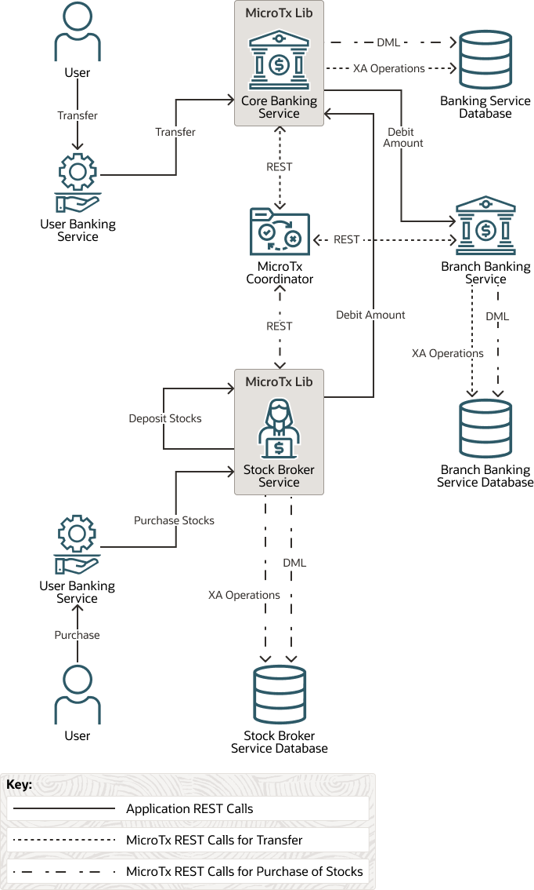

# Introduction

## About this Workshop

As organizations rush to adopt microservices architecture, they often run into problems associated with data consistency as each microservice typically has its own database. In monolithic applications, local transactions were enough as there were no other sources of data that needed to be consistent with the database. An application would start a local transaction, perform some updates, and then commit the local transaction to ensure the application moved from one consistent state to another. Once the application’s state is spread across multiple sources of data, some factors need to be considered. What happens if the updates succeed in one microservice, but fails in another microservice as part of the same request? One solution is to use a distributed transaction that spans across the sources of data used by the microservices involved in a request. To maintain consistency in the state of all microservices participating in a distributed transaction, Oracle Transaction Manager for Microservices (MicroTx) provides a transaction coordination microservice and client libraries.

In this workshop, you will learn how to use MicroTx to maintain data consistency across several microservices by deploying and running a Bank and Stock-Trading application. This application contains several microservices and it uses distributed, two-phase commit transaction (XA). It is very simple to use MicroTx. After installing MicroTx, you only need to integrate the MicroTx libraries with your application code to manage transactions. In this workshop, you will learn how you can integrate the MicroTx client libraries with the Bank and Stock-Trading application. During the transaction, each microservice also makes updates to a resource manager to track the change in the amount and stocks. When you run the Bank and Stock-Trading application, you will be able to see how MicroTx ensures consistency of transactions across the distributed microservices and their resource managers. You will also integrate MicroTx with the Kubernetes ecosystem by using tools, such as Kiali and Jaeger, to visualize the flow of requests between MicroTx and the microservices.

Estimated Workshop Time: *1 hours 30 minutes*

### Objectives

In this workshop, you will learn how to:

* Provision Oracle Autonomous Database instances and use them as resource managers for microservices.
* Configure the required properties so that MicroTx can connect to the resource manager and microservices.
* Include the MicroTx client libraries in your application to configure your Java application as a transaction initiator service. A transaction initiator service starts and ends a transaction.
* Include the MicroTx client libraries in your application to configure your Java application as a transaction participant. A transaction participant service only joins the transaction. They do not initiate a transaction.
* Run the Bank and Stock-Trading application to buy and sell stocks.
* Use tools, such as Kiali and Jaeger, to visualize the flow of requests between MicroTx and the microservices.

### Prerequisites

This lab assumes you have:
- An Oracle Cloud account

Let's begin! If you need to create an Oracle Cloud account, click **Get Started** in the **Contents** menu on the left. Otherwise, if you have an existing account, click **Lab 1**.

## About the Bank and Stock-Trading application

The Bank and Stock-Trading application demonstrates how you can develop microservices that participate in a distributed transaction while using MicroTx to coordinate the requests. You can use the application to withdraw or deposit an amount, as well as buy and sell stocks. Since financial applications that move funds require strong global consistency, the application uses XA transaction protocol.

When a user purchases stocks using the Stock Broker service, the application withdraws money from the Core Banking Service and deposits an equivalent number of stocks by creating an XA transaction. Within the XA transaction, all actions such as purchase, sale, withdraw, and deposit either succeed, or they all are rolled back in case of a failure of any one or more actions.

Participant microservices must use the MicroTx client libraries which registers callbacks and provides implementation of the callbacks for the resource manager. As shown in the following image, MicroTx communicates with the resource managers to commit or roll back the transaction. MicroTx connects with each resource manager involved in the transaction to prepare, commit, or rollback the transaction. The participant service provides the credentials to the coordinator to access the resource manager.

The following figure shows the various microservices in the Bank and Stock-Trading application.

* The MicroTx coordinator manages transactions amongst the participant services.

* The Stock Broker microservice initiates the transactions, so it is called a transaction initiator service. The user interacts with this microservice to buy and sell shares. When a new request is created, the helper method that is exposed in the MicroTx library runs the begin() method to start the transaction. This microservice also contains the business logic to issue the commit and roll back calls. After initiating the transaction, the Stock Broker service also participates in the transaction. So, you must configure the Stock Broker microservice as an initiator and as a participant service. It uses resources from the Stock Broker Service ATP instance.

* The Core Banking and Branch Banking services participate in the transactions related to the trade in stocks, so they are called participant services. They do not initiate the transaction to buy or sell stocks. The MicroTx library includes headers that enable the participant services to automatically enlist in the transaction. These microservices expose REST APIs to get the account balance and to withdraw or deposit money from a specified account. They also use resources from the Banking Service ATP instance.

* Resource managers manage stateful resources such as databases, queuing or messaging systems, and caches.

The service must meet ACID requirements, so withdraw amount, transfer amount, deposit stocks, sell stocks, debit amount, or credit amount are called in the context of the XA transaction.

## Task: Learn More

* [Oracle® Transaction Manager for Microservices Developer Guide](http://docs.oracle.com/en/database/oracle/transaction-manager-for-microservices/22.3/tmmdg/index.html)
* [Oracle® Transaction Manager for Microservices Quick Start Guide](http://docs.oracle.com/en/database/oracle/transaction-manager-for-microservices/22.3/tmmqs/index.html)

## Acknowledgements

* **Author** - Sylaja Kannan, Principal User Assistance Developer
* **Contributors** - Brijesh Kumar Deo
* **Last Updated By/Date** - Sylaja Kannan, June 2023
