# Run the Bank and Trading Application to Trade in Stocks

## Introduction

Run the Bank and Trading application to purchase or sell stocks and to understand how you can use Transaction Manager for Microservices (MicroTx) to coordinate XA transactions.

Estimated Lab Time: *30 minutes*

### About the Bank and Trading Application

The following figure shows the Bank and Trading application, which contains several microservices.


The Bank and Trading application demonstrates how you can develop microservices that participate in XA transactions while using MicroTx to coordinate the transactions. When a user purchases stocks using the Stock Broker service, it withdraws money from the Core Banking Service and deposits an equivalent amount of stocks by creating an XA transaction. Within the XA transaction, all actions such as purchase, sale, withdraw, and deposit either succeed, or they all are rolled back in case of a failure of any one or more actions.

### Objectives

In this lab, you will:

* Build container images for each microservice from the sample application code. After building the container images, the images are available in your Minikube container registry.
* Update the `values.yaml` file, which contains the deployment configuration details for the Bank and Trading application.
* Install the Bank and Trading application. While installing the application, Helm uses the configuration details you provide in the `values.yaml` file.
* (Optional) Deploy Kiali and Jaeger in your minikube cluster
* Purchase stocks using the Bank and Trading application.
* Sell stocks using the Bank and Trading application.
* (Optional) View service graph of the mesh and distributed traces to track requests
* (Optional) View source code of the sample application

### Prerequisites

This lab assumes you have:

* An Oracle Cloud account.
* Successfully completed the previous labs:
  * Get Started
  * Lab 1: Prepare setup
  * Lab 2: Environment setup
  * Lab 4: Provision an Oracle Autonomous Database for use as resource manager
* Logged in using remote desktop URL as an `oracle` user. If you have connected to your instance as an `opc` user through an SSH terminal using auto-generated SSH Keys, then you must switch to the `oracle` user before proceeding with the next step.

  ```text
  <copy>
  sudo su - oracle
  </copy>
  ```

## Task 1: Configure Minikube and Start a Tunnel

Before you start a transaction, you must start a Minikube tunnel.

1. Ensure that the minimum required memory and CPUs are available for Minikube.
    ```text
    <copy>
    minikube config set memory 32768
    </copy>
    ```

2. Start Minikube.
    ```text
    <copy>
    minikube start
    </copy>
    ```

3. Run the following command in a new terminal to start a tunnel. Keep this terminal window open.

    ```text
    <copy>
    minikube tunnel
    </copy>
    ```

4. Enter the password to access your local machine if you are prompted to enter your password.

5. In a new terminal, run the following command to note down the external IP address of the Istio ingress gateway.

    ```text
    <copy>
    kubectl get svc istio-ingressgateway -n istio-system
    </copy>
    ```

    From the output note down the value of `EXTERNAL-IP`, which is the external IP address of the Istio ingress gateway. You will provide this value in the next step.

    **Example output**

    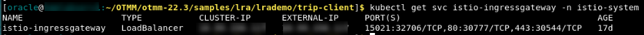

    Let's consider that the external IP in the above example is 192.0.2.117.

6. Store the external IP address of the Istio ingress gateway in an environment variable named `CLUSTER_IPADDR` as shown in the following command.

    ```text
    <copy>
    export CLUSTER_IPADDR=192.0.2.117
    </copy>
    ```

    Note that, if you don't do this, then you must explicitly specify the IP address in the commands when required.


## Task 2: Configure Keycloak

1. Run the following command to note down the external IP address and port to access Keycloak.

    ```text
    <copy>
    kubectl get svc -n keycloak
    </copy>
    ```

    From the output note down the value of `EXTERNAL-IP` and `PORT(S)`, which is the external IP address and port of Keycloak. You will provide this value in the next step.

    **Example output**

    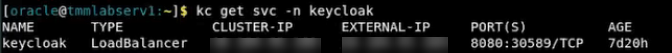

    Let's consider that the external IP in the above example is 198.51.100.1 and the IP address is 8080.

2. Sign in to Keycloak. In a browser, enter the IP address and port number that you have copied in the previous step. The following example provides sample values. Provide the values based on your environment.

    ```text
    http://198.51.100.1:8080
    ```

3. Click **Administration Console**.

4. Sign in to Keycloak with the initial administrator username `admin` and password `admin`. After logging in, reset the password for the `admin` user. For information about resetting the password, see the Keycloak documentation.

6. Select the **MicroTx-BankApp** realm, and then click **Users** to view the list of users in the `MicroTx-BankApp` realm. The `MicroTx-BankApp` realm is preconfigured with these default user names.
   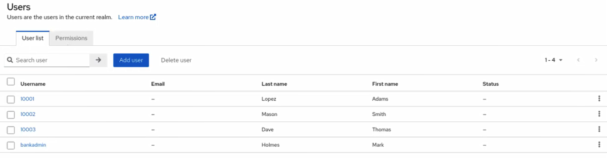

7. Set the password for each user. For information about providing credentials for users, see the Keycloak documentation.

8. Click **Clients**, and then click **microtx-bankapp** in the **Clients list** tab.
    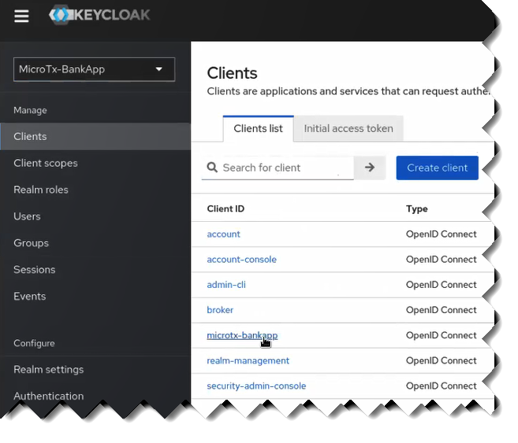

    Details of the `microtx-bankapp` client are displayed.

9. In the **Settings** tab, under **Access settings**, enter the external IP address of Istio ingress gateway for the **Root URL**, **Valid redirect URIs**, **Valid post logout redirect URIs**, and **Admin URL** fields. Provide the IP address of Istio ingress gateway that you have copied earlier.
    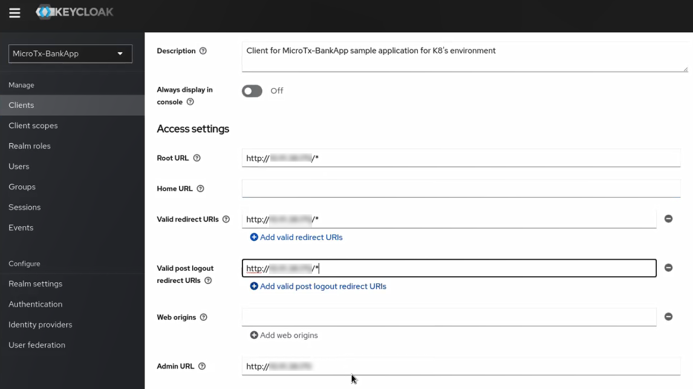

10. Click **Save**.

11. Click the **Credentials** tab, and then note down the value of the **Client-secret**. You'll need to provide this value later.
    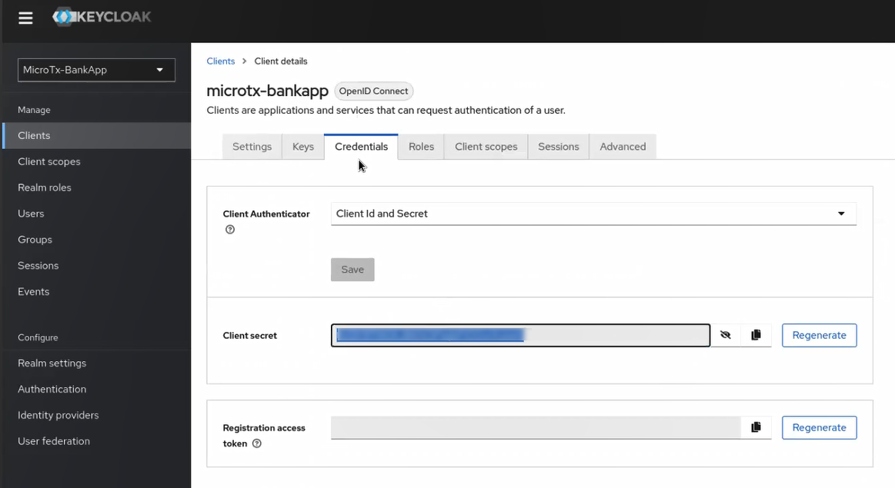

12. Click **Realm settings**, and then in the **Frontend URL** field of the **General** tab, enter the external IP address and port of the Keycloak server which you have copied in a previous step. For example, `http://198.51.100.1:8080`.
    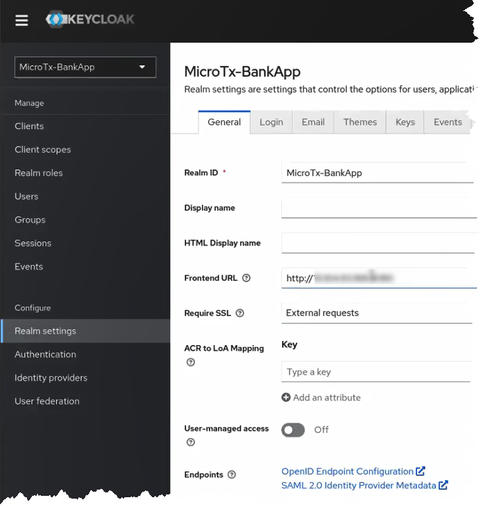

13. In the **Endpoints** field, click the **OpenID Endpoint Configuration** link. Configuration details are displayed in a new tab.

14. Note down the value of the **issuer** URL. It is in the format, `http://<keycloak-ip-address>:<port>/realms/<name-of-realm-you-have-created>`. For example, `http://198.51.100.1:8080/realms/MicroTx-Bankapp`. You'll need to provide this value later.

15. Click **Save**.

## Task 3: Provide Access Details in the values.yaml File

Edit the `values.yaml` file to provide the URL to access Keycloak and other access details.

1. Open the `values.yaml` file, which is located in the `/home/oracle/microtx/otmm-22.3.2/samples/xa/java/bankapp/Helmcharts` folder.  Enter the values that you have noted down for the following fields under `security` in `UserBanking`.

    * `clientSecret`: Enter the value of the client secret value that you had copied in step 11 of Task 2.
    * `issuerURL`: Enter the URL that you had copied in step 14 of Task 2.
    * `logoutRedirectURL`: Enter the URL in the format, `http://$CLUSTER_IPADDR/bankapp`. Where, `CLUSTER_IPADDR` is the external IP address of the Istio ingress gateway that you have noted down in Task 1. For example, `http://192.0.2.117/bankapp`.

2. Save the changes you have made to the `values.yaml` file.

## Task 4: Build the Container Images for the Microservices in the Bank and Trading Application

The code for the Bank and Trading application is available in the installation bundle in the `/home/oracle/microtx/otmm-22.3.2/samples/xa/java/bankapp` folder. Build container images for each microservice in the Bank and Trading application.

To build container images for each microservice in the sample:

1. Run the following commands to build the container image for the Branch Banking service.

    ```text
    <copy>
    cd /home/oracle/microtx/otmm-22.3.2/samples/xa/java/bankapp/BranchBanking
    </copy>
    ```

    ```text
    <copy>
    minikube image build -t branch-banking:1.0 .</copy>
    ```

   When the image is successfully built, the following message is displayed.

   **Successfully tagged branch-banking:1.0**

2. Run the following commands to build the container image for the Core Banking service.

    ```text
    <copy>
    cd /home/oracle/microtx/otmm-22.3.2/samples/xa/java/bankapp/CoreBanking
    </copy>
    ```

    ```text
    <copy>
    minikube image build -t core-banking:1.0 .
    </copy>
    ```

   When the image is successfully built, the following message is displayed.

   **Successfully tagged core-banking:1.0**

3. Run the following commands to build the Docker image for the Stock Broker service.

    ```text
    <copy>
    cd /home/oracle/microtx/otmm-22.3.2/samples/xa/java/bankapp/StockBroker
    </copy>
    ```

    ```text
    <copy>
    minikube image build -t stockbroker:1.0 .
    </copy>
    ```

   When the image is successfully built, the following message is displayed.

   **Successfully tagged stockbroker:1.0**

The container images that you have created are available in your Minikube container registry.

## Task 4: Update the values.yaml File

The sample application files also contain the `values.yaml` file. This is the manifest file, which contains the deployment configuration details for the Bank and Trading application.

The `values.yaml` file provides details about the Docker images of each microservice, the credentials to use when pulling the Docker images, and details to access the resource managers. While installing the sample application, Helm uses the values you provide to pull the sample application images from the Minikube container registry.

To provide the configuration and environment details in the `values.yaml` file:

1. Open the `values.yaml` file, which is located in the `/home/oracle/microtx/otmm-22.3.2/samples/xa/java/bankapp/Helmcharts` folder, in any code editor. This file contains sample values. Replace these sample values with values that are specific to your environment.

2. Under `StockBroker`, set `deploymentEnabled` to `true`. You must set this flag to true before deploying the Stock Broker service.

3. Save your changes.

## Task 5: Install the Bank and Trading Application

Install the Bank and Trading application in the `otmm` namespace, where you have installed MicroTx. While installing the sample application, Helm uses the configuration details you provide in the values.yaml file.

1. Run the following commands to install the Bank and Trading application.

    ```text
    <copy>
    cd /home/oracle/microtx/otmm-22.3.2/samples/xa/java/bankapp/Helmcharts
    </copy>
    ```

    ```text
    <copy>
    helm install bankapp --namespace otmm bankapp/ --values bankapp/values.yaml
    </copy>
    ```

   Where, `bankapp` is the name of the application that you want to install. You can provide another name to the installed application.

   In the output, verify that the `STATUS` of the `bankapp` is `deployed`.

   **Example output**

    ```text
    NAME: bankapp
    LAST DEPLOYED: TUe May 23 10:52:14 2023
    NAMESPACE: otmm
    STATUS: deployed
    REVISION: 1
    TEST SUITE: None
    ```

2. If you don't need to make any changes to the `values.yaml` file, skip this step and go to the next step. If you need to modify the `values.yaml` file, then uninstall `bankapp`. Update the `values.yaml` file, and then reinstall `bankapp`. Perform step 1 as described in this task again to reinstall `bankapp`.

    ```text
    <copy>
    helm uninstall sample-xa-app --namespace otmm
    </copy>
    ```

3. Verify that all resources, such as pods and services, are ready. Proceed to the next step only when all resources are running. Run the following command to retrieve the list of resources in the namespace `otmm` and their status.

    ```text
    <copy>
    kubectl get pods -n otmm
    </copy>
    ```
    The following image shows a sample output.
   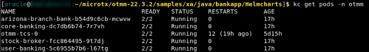

## Task 6: Deploy Kiali and Jaeger (Optional)

Optionally, you can use Kiali and Jaeger to track and trace distributed transactions in MicroTx through visualization. Use distributed tracing to track how requests flow between MicroTx and the microservices.

Run the following commands to deploy Kiali and Jaeger in a Minikube cluster.

1. Deploy Kiali.

    ```text
    <copy>
    kubectl apply -f https://raw.githubusercontent.com/istio/istio/release-1.17/samples/addons/kiali.yaml
    </copy>
    ```

2. Deploy Prometheus. To use Kiali, you must deploy Prometheus and Kiali in the same cluster.

    ```text
    <copy>
    kubectl apply -f https://raw.githubusercontent.com/istio/istio/release-1.17/samples/addons/prometheus.yaml
    </copy>
    ```

3. Deploy Jaeger.

    ```text
    <copy>
    kubectl apply -f https://raw.githubusercontent.com/istio/istio/release-1.17/samples/addons/jaeger.yaml
    </copy>
    ```

4. Start the Kiali Dashboard. Run the following command in a new terminal. Ensure that you leave this terminal open. If a new browser opens, close the browser.

    ```text
    <copy>
    istioctl dashboard kiali
    </copy>
    ```

   From the output, note down the URL. This is the URL on which you can access the Kiali dashboard in a browser. For example, `http://localhost:20001/kiali`.

5. Start the Jaeger Dashboard. Run the following command in a new terminal. Ensure that you leave this terminal open. If a new browser opens, close the browser.

    ```text
    <copy>
    istioctl dashboard jaeger
    </copy>
    ```

   From the output, note down the URL. This is the URL on which you can access the Jaeger dashboard in a browser. For example, `http://localhost:16686`.

## Task 7: Purchase Stocks

When you send a request to purchase stocks, the Stock Broker service debits the required amount from the Core Banking service. The Core Banking service in turns sends the debit amount request to the Branch Banking service. Once the amount is successfully debited from the your bank account, the Stock Broker service purchases the stocks and deposits the purchased stocks into your account. The microservices use the XA protocol and MicroTx to manage the transactions. Within an XA transaction, all actions such as debit amount and deposit stocks either succeed, or all actions are rolled back in case of a failure of any one or more actions.

1. Access the bank application. In a browser, type `192.0.2.117/bankapp`, where `192.0.2.117` is the external IP address of the Istio ingress gateway which you have noted down in Task 1.
    The Keycloak login page is displayed.

2. Enter the username and password to access the Keycloak instance. Enter the password that you had provided in Task 2 for the preconfigured users.
    The Bank and Trading application's console is displayed as shown in the following figure.
    

3. Click **Trading**.
    The Stock Trading page is displayed as shown in the following image.
    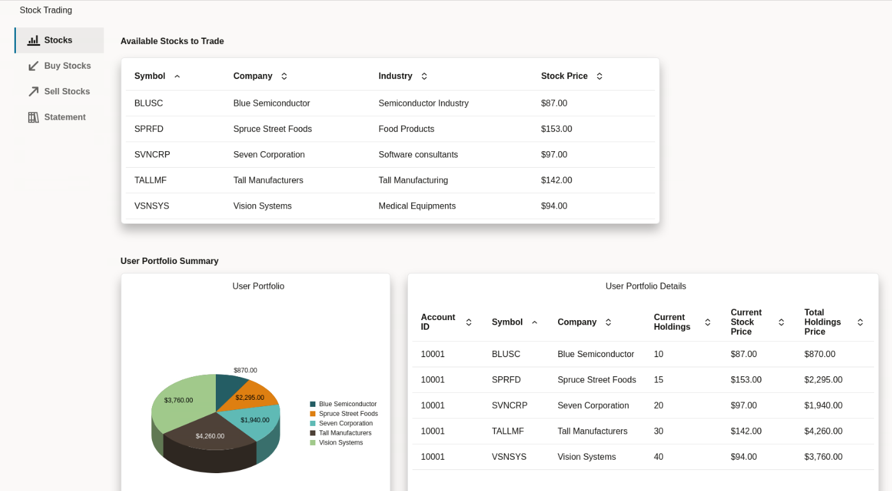

4. Click **Buy Stocks**, and then click **Buy Stocks**.

5. In the **Purchase Stocks** dialog box, enter the following details.
    1. Select the stock that you want to purchase.
    2. Enter the number of units of the stock that you want to purchase.
    3. (Optional.) Enter remarks, if any, regarding your purchase.
       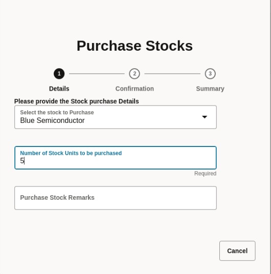
    4. Click **Confirmation**, and then review the details of the purchase.
    5. Click **Confirm** to purchase the stocks.
       After the Stock Broker service purchases the stocks and deposits it in your account, the **Transaction ID** and **Result** are displayed on the screen.
       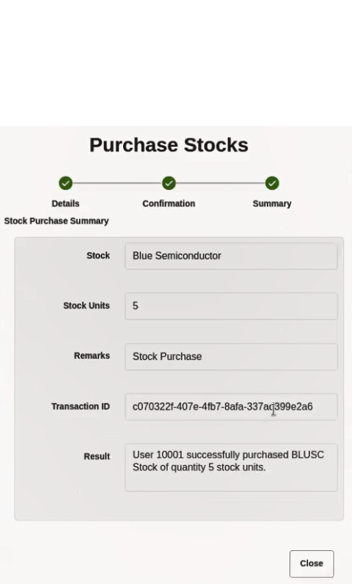
    6. Click **Close** to close the **Purchase Stocks** dialog box.

6. Click **Stocks** to view the updated list of stocks.
    

## Task 8: Sell Stocks

When you send a request to sell stocks, the Stock Broker service sells the stocks if the stocks are available in your portfolio. Next, the Stock Broker service credits the amount received to the Core Banking service. The Core Banking service in turns sends the credit amount request to the Branch Banking service to credit the amount to your account. The microservices use the XA protocol and MicroTx to manage the transactions. Within an XA transaction, all actions such as credit amount and sell stocks either succeed, or all actions are rolled back in case of a failure of any one or more actions.

1. Access the bank application. In a browser, type `192.0.2.117/bankapp`, where `192.0.2.117` is the external IP address of the Istio ingress gateway which you have noted down in Task 1.
    The Keycloak login page is displayed.

2. Enter the username and password to access the Keycloak instance. Enter the password that you had provided in Task 2 for the preconfigured users.
    The Bank and Trading application's console is displayed as shown in the following figure.
    

3. Click **Trading**.
    The Stock Trading page is displayed as shown in the following image.
    

4. Click **Sell Stocks**, and then click **Sell Stocks**.

5. In the **Sell Stocks** dialog box, enter the following details.
    1. Select the stock that you want to sell.
    2. Enter the number of units of the stock that you want to sell.
    3. (Optional.) Enter remarks, if any, regarding your sale.
    4. Click **Confirmation**, and then review the details of the sale.
    5. Click **Confirm** to sell the stocks.
       After the Stock Broker service sells the stocks and deposits the money in your account, the **Transaction ID** and **Result** are displayed on the screen.
    6. Click **Close** to close the **Sell Stocks** dialog box.

6. Click **Stocks** to view the updated list of stocks.
     

## Task 9: View Service Mesh graph and Distributed Traces (Optional)

You can perform this task only if you have deployed Kiali and Jaeger in your cluster.
To visualize what happens behind the scenes and how a trip booking request is processed by the distributed services, you can use the Kiali and Jaeger Dashboards that you started in Task 3.

1. Open a new browser tab and navigate to the Kiali dashboard URL - http://localhost:20001/kiali
2. Select Graph for the otmm namespace.
3. Open a new browser tab and navigate to the Jaeger dashboard URL - http://localhost:16686
4. In the **Service** drop-down list, select **istio-ingressgateway**. A list of traces is displayed where each trace represents a request.
5. Select a trace to view it.

## Task 10: View Source Code of the Sample Application (Optional)
The source code for the following sample applications is present in the `/home/oracle/OTMM/otmm-22.3.2/samples/xa/java/bankapp` folder.
- Stock Broker Service source code: /home/oracle/microtx/otmm-22.3.2/samples/xa/java/bankapp/StockBroker
- Branch Banking Service source code: /home/oracle/microtx/otmm-22.3.2/samples/xa/java/bankapp/BranchBanking
- Core Banking Service source code: /home/oracle/microtx/otmm-22.3.2/samples/xa/java/bankapp/CoreBanking
- User Banking Service source code: /home/oracle/microtx/otmm-22.3.2/samples/xa/java/bankapp/UserBanking

You can use the VIM editor to view the source code files. You can also use the Text Editor application to view the source code files.
To bring up the Text Editor, click on Activities (top left) -> Show Applications -> Text Editor. Inside Text Editor, select Open a File and browse to the source code files in the folders shown above.


## Learn More

* [Develop Applications with XA](http://docs.oracle.com/en/database/oracle/transaction-manager-for-microservices/22.3/tmmdg/develop-xa-applications.html#GUID-D9681E76-3F37-4AC0-8914-F27B030A93F5)

## Acknowledgements

* **Author** - Sylaja Kannan, Principal User Assistance Developer
* **Contributors** - Brijesh Kumar Deo, Bharath MC
* **Last Updated By/Date** - Sylaja, June 2023
