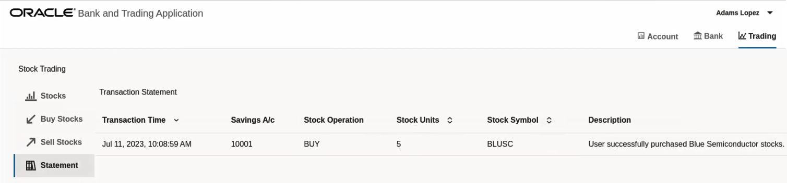
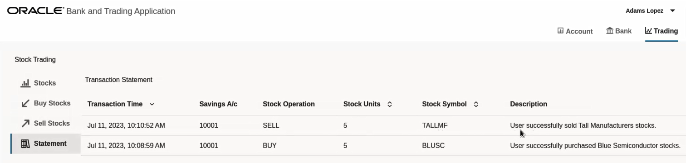
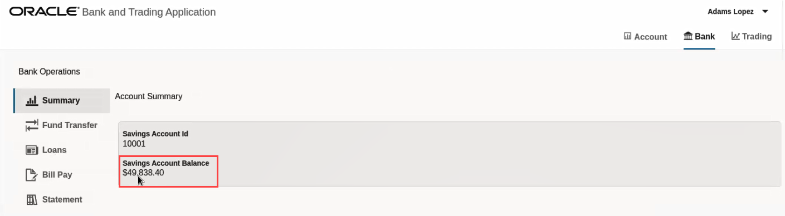

# Trade Stocks with the Bank and Stock-Trading Application

## Introduction

Run the Bank and Stock-Trading application to purchase and sell stocks and to understand how you can use Transaction Manager for Microservices (MicroTx) to coordinate XA transactions. After running the application, use distributed tracing to understand how the requests flow between MicroTx and the microservices. Running sample applications is the fastest way for you to get familiar with MicroTx.

Estimated Time: 5 minutes

### Objectives

In this lab, you will:

* Purchase stocks using the Bank and Stock-Trading application.
* Sell stocks using the Bank and Stock-Trading application.
* (Optional) View service graph of the mesh and distributed traces to track requests
* (Optional) View source code of the Bank and Stock-Trading application

### Prerequisites

This lab assumes you have:

* An Oracle Cloud account.
* Successfully completed the previous labs:
    * Get Started
    * Lab 1: Prepare setup
    * Lab 2: Set Up the Environment
    * Lab 3: Integrate MicroTx Client Libraries with the Stock Broker Microservice
    * Lab 4: Deploy the Bank and Stock-Trading Application
* Logged in using remote desktop URL as an `oracle` user. If you have connected to your instance as an `opc` user through an SSH terminal using auto-generated SSH Keys, then you must switch to the `oracle` user before proceeding with the next step.

    ```
    <copy>
    sudo su - oracle
    </copy>
    ```

## Task 1: Log in to the Bank and Stock-Trading Application

1. Access the bank application. In a browser, type `192.0.2.117/bankapp`, where `192.0.2.117` is the external IP address of the Istio ingress gateway which you have noted down in Lab 5 after starting a Minikube tunnel.
    The Keycloak login page is displayed.

2. Enter the username and password to access the Keycloak instance. Enter the password that you had provided in Lab 5 for the preconfigured Keycloak users.
    The Bank and Stock-Trading application's console is displayed as shown in the following figure.
    

## Task 2: Purchase Stocks

When you send a request to purchase stocks, the Stock Broker service debits the required amount from the Core Banking service. The Core Banking service in turns sends the debit amount request to the Branch Banking service. Once the amount is successfully debited from your bank account, the Stock Broker service purchases the stocks and deposits the purchased stocks into your account. The microservices use the XA protocol and MicroTx to manage the transactions. Within an XA transaction, all actions such as debit amount and deposit stocks either succeed, or all actions are rolled back in case of a failure of any one or more actions.

1. Log in to the Bank and Stock-Trading Application.

2. Click the **Bank** tab, and then click **Summary**.
    The account summary is displayed as shown in the following image. Note down the account balance.
    

3. Click the **Trading** tab.
    The Stock Trading page is displayed. Identify the stock that you want to purchase and the number of units of the stock that are currently available in your account. For example, let's consider that you want to purchase shares of the Blue Semiconductor. The following image shows that you have 10 shares of Blue Semiconductor.
    

4. Click **Buy Stocks**, and then click **Buy Stocks**.

5. In the **Purchase Stocks** dialog box, enter the following details.
    1. Select the stock that you want to purchase.
    2. Enter the number of units of the stock that you want to purchase.
    3. (Optional.) Enter remarks, if any, regarding your purchase.
       
    4. Click **Confirmation**, and then review the details of the purchase.
    5. Click **Confirm** to purchase the stocks.
       After the Stock Broker service purchases the stocks and deposits it in your account, the **Transaction ID** and **Result** are displayed on the screen.
       
    6. Click **Close** to close the **Purchase Stocks** dialog box.

6. Click **Stocks** to view the updated list of stocks.
   The following image shows the number of shares of Blue Semiconductor has increased by 5, the purchased amount, in your account.
    

7. Click **Statement** to view the transaction statement as shown in the image below.
    

8. Click the **Bank** tab, and then click **Summary**.
    The account summary is displayed as shown in the following image. Note that the account balance has reduced as the Stock Broker service debits the amount required to purchase the shares from your account.
    

## Task 3: Sell Stocks

When you send a request to sell stocks, the Stock Broker service sells the stocks if the stocks are available in your portfolio. Next, the Stock Broker service credits the amount received to the Core Banking service. The Core Banking service in turns sends the credit amount request to the Branch Banking service to credit the amount to your account. The microservices use the XA protocol and MicroTx to manage the transactions. Within an XA transaction, all actions such as credit amount and sell stocks either succeed, or all actions are rolled back in case of a failure of any one or more actions.

1. Log in to the Bank and Stock-Trading Application.

2. Click the **Bank** tab, and then click **Summary**.
    The account summary is displayed as shown in the following image. Note down the account balance.
    

3. Click **Trading**.
    The Stock Trading page is displayed. Identify the stock that you want to sell and the number of units of the stock that are currently available in your account. For example, let's consider that you want to sell 5 shares of the Tall Manufacturers. The following image shows that you currently have 30 shares of Tall Manufacturers.
    

4. Click **Sell Stocks**, and then click **Sell Stocks**.

5. In the **Sell Stocks** dialog box, enter the following details.
    1. Select the stock that you want to sell.
    2. Enter the number of units of the stock that you want to sell.
    3. (Optional.) Enter remarks, if any, regarding your sale.
       
    4. Click **Confirmation**, and then review the details of the sale.
    5. Click **Confirm** to sell the stocks.
       After the Stock Broker service sells the stocks and deposits the money in your bank account, the **Transaction ID** and **Result** are displayed on the screen as shown in the following image.
       
    6. Click **Close** to close the **Sell Stocks** dialog box.

6. Click **Statement** to view the transaction statement as shown in the image below.
    

7. Click the **Bank** tab, and then click **Summary**.
    The account summary is displayed as shown in the following image. Note that the account balance has increased as the Stock Broker service credits the amount to the account after selling the shares.
    

8. Click **Statement** to view the bank account statement. The following image shows the amount that was credited to the account after the shares were sold.
    

## Task 4: View Service Mesh graph and Distributed Traces (Optional)

Perform this task only if you have deployed Kiali and Jaeger in your cluster.
To visualize what happens behind the scenes and how a request to purchase or sell stocks is processed by the distributed services, you can use the Kiali and Jaeger Dashboards that you started in the previous lab.

1. Open a new browser tab and navigate to the Kiali dashboard URL. For example, `http://localhost:20001/kiali`.
2. Select Graph for the otmm namespace.
3. Open a new browser tab and navigate to the Jaeger dashboard URL. For example, `http://localhost:16686`.
4. In the **Service** drop-down list, select **istio-ingressgateway**. A list of traces is displayed where each trace represents a request.
5. Select a trace to view it.

## Task 5: View Source Code of the Bank and Stock-Trading application (Optional)

Source code for the following microservices is present in the `/home/oracle/microtx/otmm-package/samples/xa/java/bankapp` folder.

* Source code for the Stock Broker Service is available at `/home/oracle/microtx/otmm-package/samples/xa/java/bankapp/StockBroker`.
* Source code for the Branch Banking Service is available at `/home/oracle/microtx/otmm-package/samples/xa/java/bankapp/BranchBanking`.
* Source code for the Core Banking Service is available at`/home/oracle/microtx/otmm-package/samples/xa/java/bankapp/CoreBanking`.
* Source code for the User Banking Service is available at `/home/oracle/microtx/otmm-package/samples/xa/java/bankapp/UserBanking`.

You can use the VIM editor to view the source code files. You can also use the Text Editor application to view the source code files.
To bring up the Text Editor, click on Activities (top left) -> Show Applications -> Text Editor. Inside Text Editor, select Open a File and browse to the source code files in the folders shown above.

You may now **proceed to the next lab**.

## Learn More

* [Develop Applications with XA](https://docs.oracle.com/pls/topic/lookup?ctx=microtx-latest&id=TMMDG-GUID-D9681E76-3F37-4AC0-8914-F27B030A93F5)

## Acknowledgements

* **Author** - Sylaja Kannan
* **Contributors** - Brijesh Kumar Deo and Bharath MC
* **Last Updated By/Date** - Sylaja, June 2023
