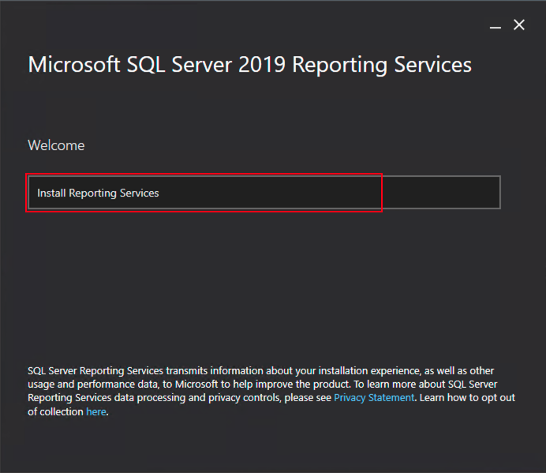
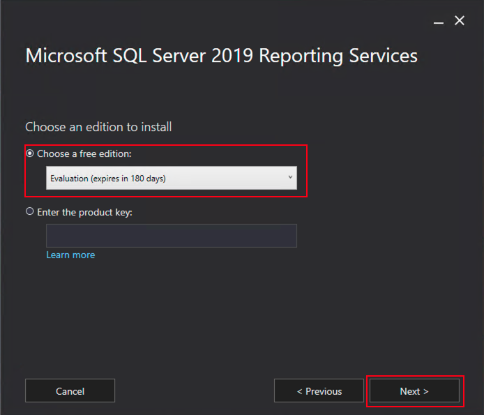
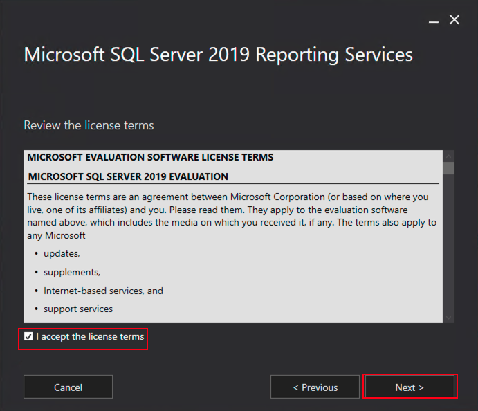
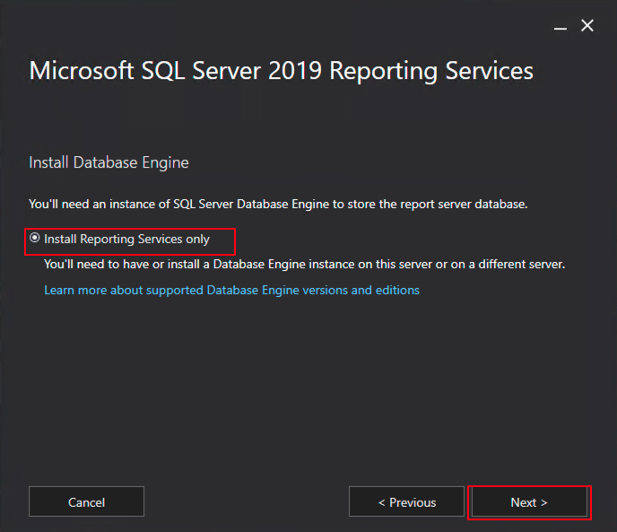
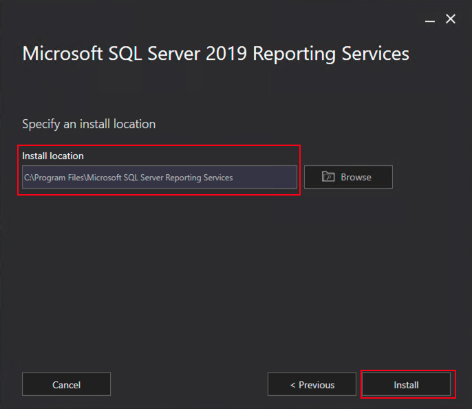
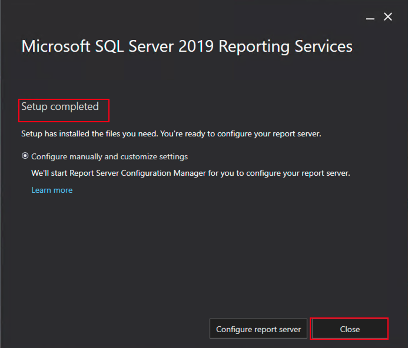

# Install Microsoft SQL Server Reporting Services (SSRS)

## Introduction

This lab walks you through how to install Microsoft SQL Server Reporting Services (SSRS) in Compute Instance.

Estimated Time:  30 min

### Objectives
In this lab, you will learn to :
* Download and Install the Microsoft SQL Server Reporting Services (SSRS)

### Prerequisites  

This lab assumes you have:
- A Free or LiveLabs Oracle Cloud account
- IAM policies to create resources in the compartment

##  Task 1: Download the Microsoft SQL Server Reporting Services (SSRS) 

1. RDP to the Bastion host server using the username .\opc and password. From the Bastion host, opens the Remote Desktop and connect to the Microsoft SSRS server using the private IP Address.

2. Download the Microsoft SQL Server Reporting Services (SSRS) binaries from the [link](https://www.microsoft.com/en-us/download/details.aspx?id=100122) from the browser. 

##  Task 2: Install Microsoft SQL Server Reporting Services (SSRS)

1. Double click on the downloaded **SQLServerReportingServices.exe**, and then click on **Install Reporting Services**. 

  
2. Choose the required edition, and then click on **Next**.

  
  
3. Accept the license terms and then click on **Next**.

  

4. Click on **Next**

  
  
5. Choose the install location, and then click on **Install**.

  

6. On Successful setup completion, we will see the successful message as shown in the following image. Click on **Close** to close the setup. 

  

  You may now **proceed to the next lab**.
  
## Acknowledgements
* **Author** - Ramesh Babu Donti, Principal Cloud Architect, NA Cloud Engineering
* **Contributors** -  Devinder Pal Singh, Senior Cloud Engineer, NA Cloud Engineering
* **Last Updated By/Date** - Ramesh Babu Donti, Principal Cloud Architect, NA Cloud Engineering, June 2022