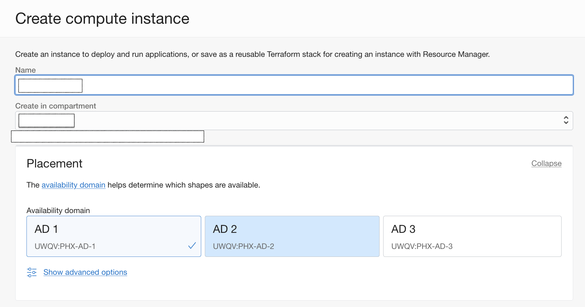

# Provision of the Compute Instance from Market Place Image for SQL Server 2019

## Introduction

This lab demonstrates how to provision Microsoft SQL Server 2019 from the Market Place Image in a Compute Instance.

Estimated Time:  1 hour

### Objectives
In this lab, you will learn to:
* Deploy Microsoft SQL Server 2019 from the marketplace image
* Register the Computer Instances to Active Directory Domain Controller

### Prerequisites

This lab assumes you have:
- A Free or LiveLabs Oracle Cloud account
- IAM policies to create resources in the compartment
- Required Subnets are available in VCN

##  Task 1: Provision the SQL Server 2019 from Market Place

1. Open the navigation menu, click **Marketplace**, and then click **All Applications**.

  

2. Marketplace **All Applications** will be shown below. Search for **SQL Server 2019** image and select the desired edition for SQL Server. The marketplace image is available in Enterprise and Standard Edition. Always On Basic Availability Groups provide a high availability solution for SQL Server from version 2016 and above on Standard Edition. An Availability Group supports a failover environment for a single database in Standard Edition.

  

3. Choose the compartment and click on **Launch Instance**. It Will take the screen to the launch Compute Instance.

  

> **Note: You will be charged a minimum of 744 hours for the MS SQL Server Marketplace image.

4. Choose the Instance name and compartment, and select the desired Availability Domain.

  

5. Click on **Change Shape** to select the shape of the Instance.

  

6. Choose the compartment where the Compute Instance should reside, and then choose the private subnet as shown below the image.

  

7. Choose the default values and click on the **Create** Instance.

  

8. Once the Compute Instance provisioning is completed, you will be able to see the Instance state is running.

  

##  Task 2: Download and install SQL Server Management Studio

1. Download and install SQL Server Management Studio [link](https://go.microsoft.com/fwlink/?linkid=2195969&clcid=0x409) from the browser.

  

2. Click on **SSMS-Setup-ENU.exe** to install the SQL Server Management Studio. The installation process is shown in the following image. 

  

3. The successful installation process is shown in the following image. 

  

## Learn More
- You can find more information about Launching a Windows Instance [here](https://docs.oracle.com/en-us/iaas/Content/GSG/Tasks/launchinginstanceWindows.htm)

  You may now **proceed to the next lab**.

## Acknowledgements
* **Author** - Ramesh Babu Donti, Principal Cloud Architect, NA Cloud Engineering
* **Contributors** -  Devinder Pal Singh, Senior Cloud Engineer, NA Cloud Engineering
* **Last Updated By/Date** - Ramesh Babu Donti, Principal Cloud Architect, NA Cloud Engineering, April 2022