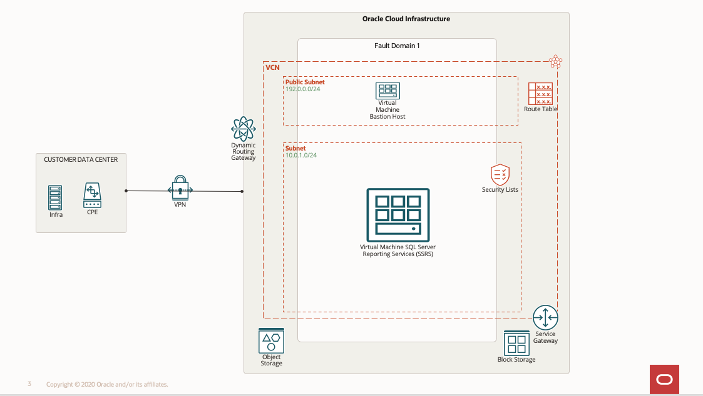

# Introduction

## About this Workshop

This hands-on workshop provides users with step-by-step instructions on migrating Microsoft SSRS Services from On-Premise to OCI (Compute Instance) and configuring the Microsoft SSRS Reporting services.

**Architecture:**
This reference architecture includes a Compute Instance and Object Storage on Oracle Cloud Infrastructure.

The Oracle Cloud Infrastructure region provides object storage (for backup) that includes a single availability domain with one fault domain. It also consists of a virtual cloud network (VCN) with one regional subnet and a service gateway. The VCN provides routing tables for the subnet, and the subnet provides its security list access. The compute instance has SQL Server Reporting Services in the fault domain.

  

Estimated Time: 3 Hours

**Workshop Objectives**
In this workshop, you will learn how to:
* Provision of the Compute Instance from Market Place Image for SQL Server 2019
* Install the SQL Server Reporting Services
* Restore the Reporting Databases from backups and configure the SQL Server Reporting Services to use the existing databases

**Prerequisites**
* An Oracle Free Tier, Always Free, Paid, or LiveLabs Cloud Account
* Some understanding of cloud and security terms is helpful
* Familiarity with Oracle Cloud Infrastructure (OCI) is helpful
* Required Subnets: One Public subnet to host the Bastion host and One Private subnet for hosting Compute Instance

## Acknowledgements
* **Author** - Ramesh Babu Donti, Principal Cloud Architect, NA Cloud Engineering
* **Contributors** - Devinder Pal Singh, Senior Cloud Engineer, NA Cloud Engineering
* **Last Updated By/Date** - Ramesh Babu Donti, Principal Cloud Architect, NA Cloud Engineering, June 2022