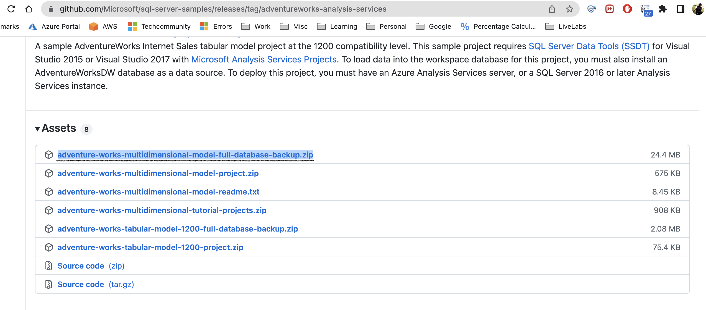

# Configure the SQL Server Analysis Service (SSAS)

## Introduction

This lab walks you through configuring the SQL Server Analysis Service (SSAS). Microsoft SQL Server Analysis Services (SSAS) are online analytical processing (OLAP) and data mining tool on Microsoft SQL Server. SSAS is used as a tool by organizations to analyze and make sense of information possibly spread out across multiple databases.

Estimated Time:  15 Minutes

### Objectives
In this lab, you will learn to :
* How to configure SQL Server Analysis Services with Tabular Format.

### Prerequisites  

This lab assumes you have:
- A Free or LiveLabs Oracle Cloud account
- IAM policies to create resources in the compartment

##  Task 1: Download the sample database backup for Analysis Service.

1. Log in to the compute instance and download the **SSAS Sample DB Backup** using [link.](https://github.com/microsoft/sql-server-samples/releases/download/adventureworks-analysis-services/adventure-works-multidimensional-model-full-database-backup.zip)

    **File Name: adventure-works-multidimensional-model-full-database-backup.zip**

  

You may now **proceed to the next lab**.

## Acknowledgements
* **Author** - Devinder Pal Singh, Senior Cloud Engineer, NA Cloud Engineering
* **Contributors** -  Ramesh Babu Donti, Principal Cloud Architect, NA Cloud Engineering
* **Last Updated By/Date** - Devinder Pal Singh, Senior Cloud Engineer, NA Cloud Engineering, June 2022
