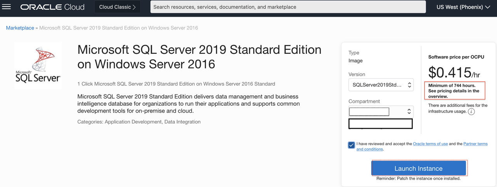
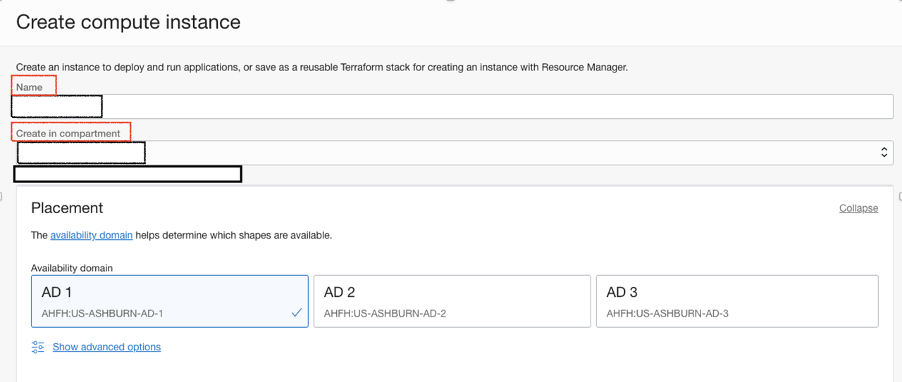
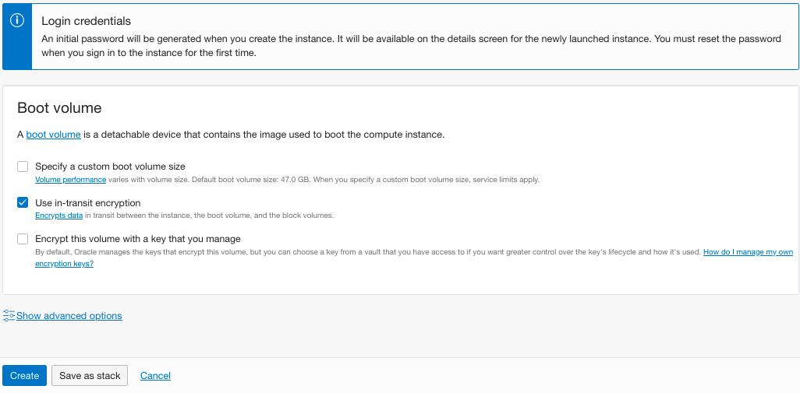
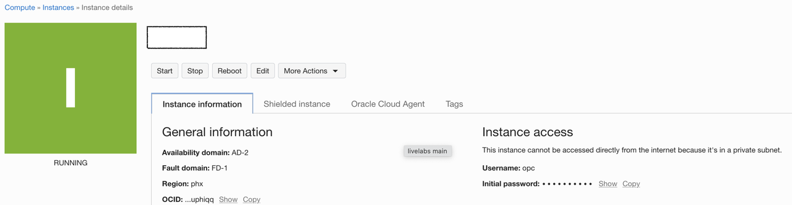

# Provision the Compute Instance from Market Place Image for SQL Server 2019

## Introduction

This lab walks you through how to provision the Microsoft SQL Server 2019 from the Market Place Image in compute instance.

Estimated Time:  15 Minutes

### Objectives
In this lab, you will learn to :
* Deploy the Microsoft SQL Server 2019 from the marketplace image
* Add the Computer Instances to Active Directory Domain Controller

### Prerequisites  

This lab assumes you have:
- A Free or LiveLabs Oracle Cloud account
- IAM policies to create resources in the compartment
- Required Subnets are available in VCN

##  Task 1: Provision the SQL Server 2019 from Market Place for Node1

1. Open the navigation menu, click **Marketplace**, and then click **All Applications**.

  

2. Marketplace will show all applications. Search for **SQL Server 2019** image and select the desired edition of SQL Server. We have Enterprise and Standard Edition available.  

  

3. Choose the compartment and click on **Launch Instance**. The screen will be taken to the launch compute instance.

  

> **Note:** A minimum of 744 hours will be charged for the SQL Server Marketplace image.

4. Choose the Instance name and compartment where the compute instance needs to create and select the desired Availability Domain.

  

5. Click on **Change Shape** to select the shape of the instance.

  

6. Choose the compartment where the compute instance should reside, and then choose the private subnet as shown below the image.

  

7. Choose the default values and click on **Create** instance.
  

8. Once the compute instance provisioning is completed, we could able to see the instance state is running.

    

  You may now **proceed to the next lab.**
## Learn More
- You can find more information about Launching a Windows Instance [here](https://docs.oracle.com/en-us/iaas/Content/GSG/Tasks/launchinginstanceWindows.htm)

## Acknowledgements
* **Author** - Devinder Pal Singh, Senior Cloud Engineer, NA Cloud Engineering
* **Contributors** -  Ramesh Babu Donti, Principal Cloud Architect, NA Cloud Engineering
* **Last Updated By/Date** - Devinder Pal Singh, Senior Cloud Engineer, NA Cloud Engineering, June 2022
