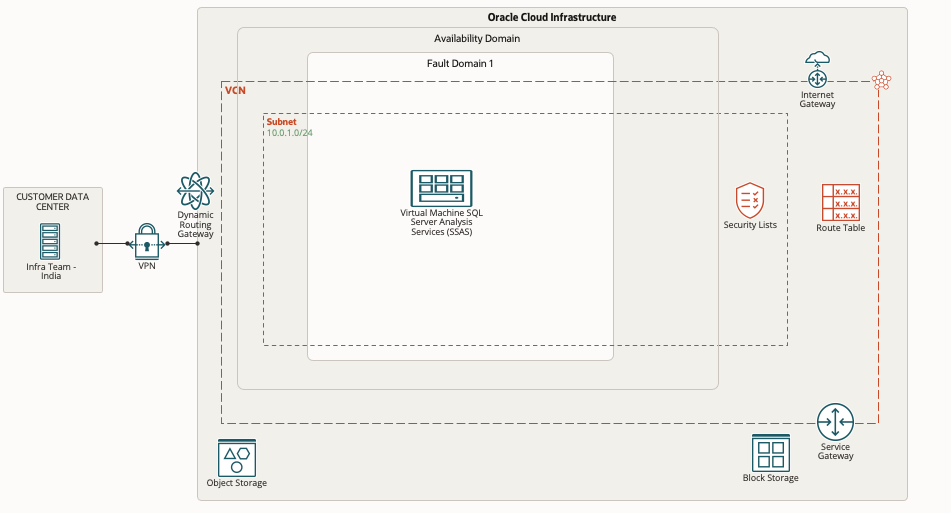

# Introduction

## About this Workshop

This hands-on workshop provides users with step-by-step instructions on migrating SSAS DBs from On-Premise to OCI (Compute Instance).

**Architecture:**
This reference architecture includes a compute instance and Object Storage on Oracle Cloud Infrastructure.

  

The Oracle Cloud Infrastructure region provides object storage (for backup) that includes a single availability domain with one fault domain. It also consists of a virtual cloud network (VCN) with one regional subnet and a service gateway. The VCN provides routing tables for the subnet, and the subnet provides its security list access. The compute instance has SQL Server Analysis Services in the fault domain.

Estimated Time: 1 Hour 30 Mins

### Workshop Objectives
In this workshop, you will learn how to:
* Provisioning the Compute Instance from Market Place Image for SQL Server 2019
* Configure the SQL Server Analysis Services
* Restore the analysis Databases from backups (Cubes, Dimensions, etc.)

### Prerequisites
* An Oracle Free Tier, Always Free, Paid, or LiveLabs Cloud Account
* Some understanding of cloud and security terms is helpful
* Familiarity with Oracle Cloud Infrastructure (OCI) is helpful
* Required Subnets: One Private subnet for hosting compute instance

## Learn More
- You can find more information about Launching a Windows Instance [here](https://docs.oracle.com/en-us/iaas/Content/GSG/Tasks/launchinginstanceWindows.htm)

## Acknowledgements
* **Author** - Devinder Pal Singh, Senior Cloud Engineer, NA Cloud Engineering
* **Contributors** -  Ramesh Babu Donti, Principal Cloud Architect, NA Cloud Engineering
* **Last Updated By/Date** - Devinder Pal Singh, Senior Cloud Engineer, NA Cloud Engineering, June 2022
