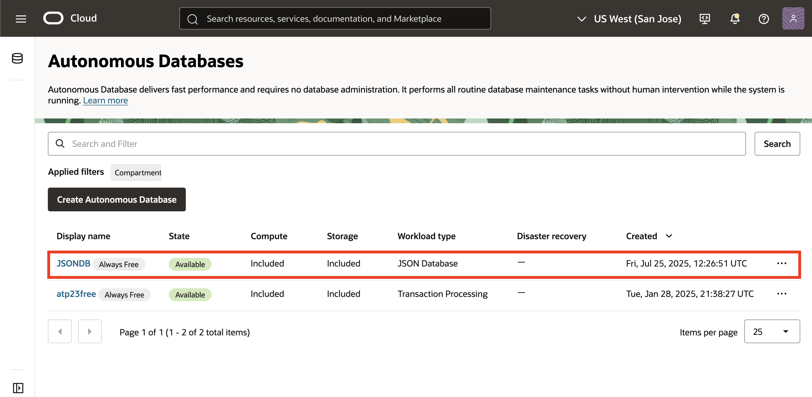
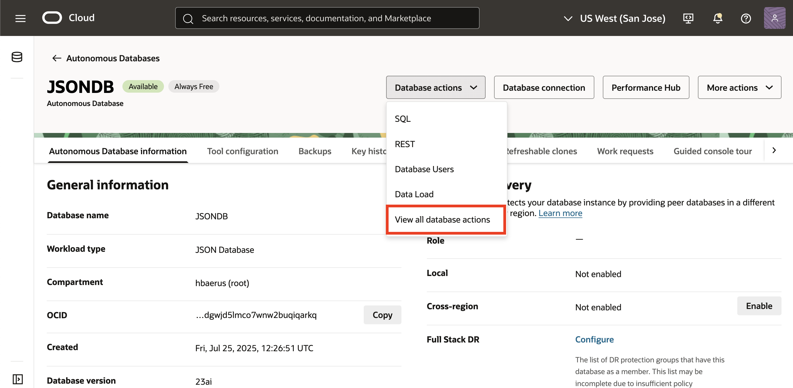
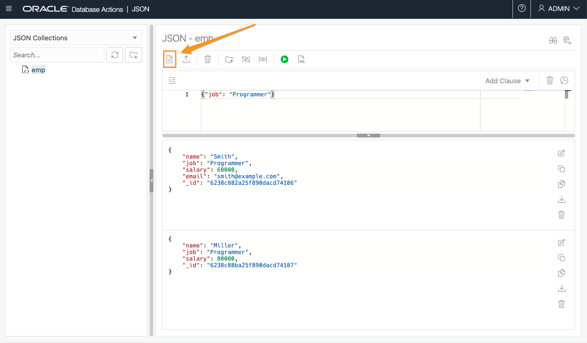
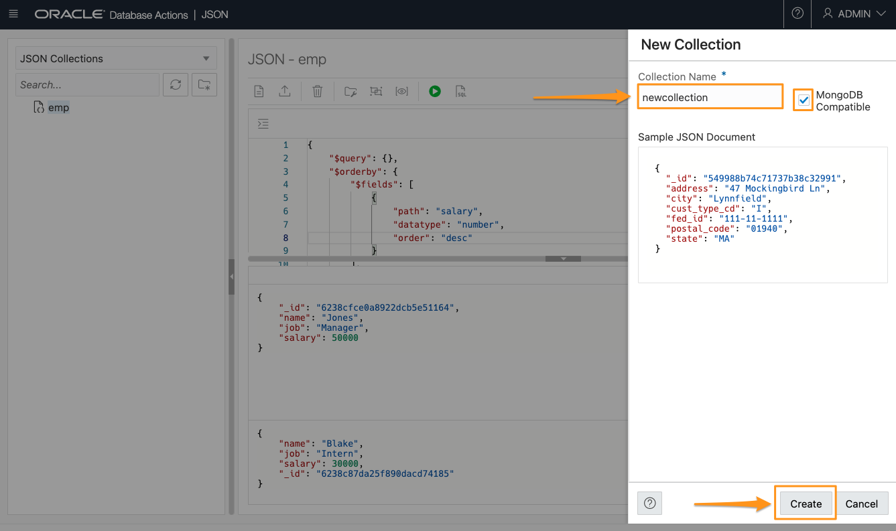
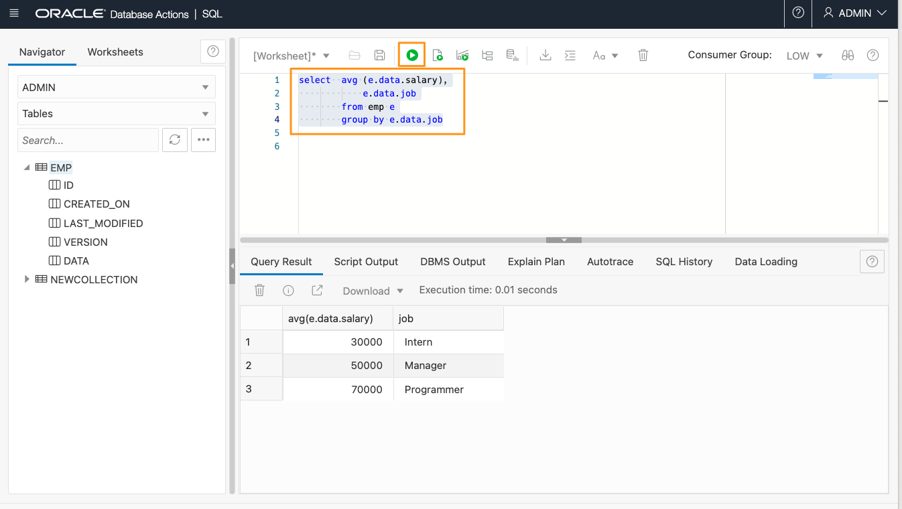

# Interacting with JSON Documents through Database Actions

## Introduction

This lab will use JSON and SQL in Database Actions from the Autonomous JSON Database page. It shows how we can swap between a document-centric model (MongoDB and Oracle's JSON tool in Database Actions), and a relational model using Oracle's SQL tool in Database Actions.

Watch this video for an overview of how to interact with JSON Documents through database actions.

[This video shows an overview of the steps in this lab.](youtube:pk7YAD-OZBQ)

Estimated Time: 20 minutes

### Objectives

In this lab, you will:

* Open Database Actions from the Autonomous JSON Database Menu
* Use the JSON and SQL tools in Database Actions to view the data you created from Mongo Shell

### Prerequisites

* Be logged into your Oracle Cloud Account

## Task 1: Open Database Actions

1. Login to the Oracle Cloud.

<if type="freetier">

2. If you are using a Free Trial or Always Free account, and you want to use Always Free Resources, you need to be in a region where Always Free Resources are available. You can see your current default **Region** in the top, right-hand corner of the page.

    

</if>
<if type="livelabs">

2. If you are using a LiveLabs account, you need to be in the region your account was provisioned in. You can see your current default **Region** in the top, right-hand corner of the page. Make sure that it matches the region on the LiveLabs Launch page.

    

</if>

3. Click the navigation menu in the upper left to show top-level navigation choices.

4. Click on **Oracle Database** and choose **Autonomous JSON Database**.

    

5. Use the __List Scope__ drop-down menu on the left to select the same compartment where you created your Autonomous JSON Database in Lab 2. Make sure your workload type is __JSON Database__. <if type="livelabs">Enter the first part of your user name, for example `LL185` in the Search Compartments field to quickly locate your compartment.

    

</if>
<if type="freetier">
    
</if>
    

<if type="freetier">
   > **Note:** Avoid the use of the ManagedCompartmentforPaaS compartment as this is an Oracle default used for Oracle Platform Services.
</if>

6. You should see your database **JSONDB** listed in the center. Click on the database name "JSONDB".

    


7.  On the database page, choose __Database Actions__.

    

8.  You are now in Database Actions.

    Database Actions allows you to connect to your Autonomous Database through various browser-based tools. We will be using three of those tools:
    
    * JSON - allows you to work with a **document database** view of your data
    * SQL - allows you to work with a relational, **SQL-based** view of your data
    * Charts - generate charts over data in Autonomous Database

    


## Task 2: JSON in Database Actions

1. You should be in the Database Actions panel. Click on the **JSON** card

    

    When you first enter JSON, you will get a tour of the features. We recommend you step through it, but you can skip the tour by clicking on the "X". The tour is available at any time by clicking the tour button.

    

    After the tour, you should see the 'emp' collection you created in Mongo Shell on the left. If it's not shown, click the refresh circle.

    The left-hand side shows collections. The upper right allows us to run queries, and the lower right shows the documents found by that query. An empty search - {} - will show all documents, which is what you should be looking at now. You can confirm using the scroll bar that there are three documents for Blake (Intern), Smith and Miller (Programmers).

2. Let's go ahead and do a search. Enter {"job": "Programmer"} in the search box and press the Run Query button. Case **is** significant, so be careful, or copy the query below:

    ```
    <copy>
    {"job": "Programmer"}
    </copy>
    ```

    

    We can see only two records are fetched as a result of that search. Let's give Miller a pay rise. Click on the "Edit" button to the right of the Miller document:

    

    That drops us into a JSON editor. In the JSON Document Content, change Miller's salary to 80000 and click the "Save" button. If you make an error which would produce invalid JSON, the editor will not let you save the content.

    

    We can now see that Miller's salary is 80000. Let's add another document to the collection. Click on the "New JSON Document" button immediately below the collection name on the top panel.

    


    That will bring up the JSON editor again, this time with an empty document. Copy the following document in:

    ```
    <copy>
    {
        "name": "Jones",
        "job": "Manager",
        "salary": 50000
    }
    </copy>
    ```

    Since there's already an empty document in there, make sure you don't end up with two sets of braces (curly brackets) around the JSON. Click "Create" when done.

    

    Click the "Clear" button for the existing search, then run another empty search to see all documents.

    **Caution:** the same "trashcan" icon is used in two places in the JSON workshop. To the right of "add clause" it means "Clear the current search". On the top row, it means "Delete all documents found by the current query". Don't delete your documents by accident!

    Finally, let's sort the results of our query, in descending order of salary (so highest first).

    On the right, click "Add Clause" and choose "$orderby". This will guide us through adding an order-by clause to our (currently empty) query.

    

    That will change our query to have two parts - a $query part and a $orderby part. The $query part is the default if neither is specified.

    $query still contains our empty search - {}.

    We need to complete some details for the $orderby. We want to sort by salary, so change the path to "salary". It's a number, so change datatype from "varchar2" to "number". And finally, change the order from "asc" (ascending) to "desc" (descending), so we get largest first. 

    

    Use the scrollbar to confirm that we have fetched back the records in descending order of salary.

    Before we leave JSON, let's just create a new collection. On the left side, click the "New Collection" button. 

    

    On the right, give our collection the name "newcollection" and check the "MongoDB Compatible" box. 
    
    If you're interested, the main effect of the MongoDB compatibility is to include the allocated ID field within the document itself, as a field called "_id". This is a requirement for MongoDB utilities, but if you are only going to use Oracle SODA (Simple Oracle Document Access) then the ID field can be external to the document. You can see the difference in the sample JSON document if you check and uncheck the box.

    When done, click "Create".  We won't do anything else with this collection, but it illustrates a point in the next section.

    

    You can refresh the collection list on the left-hand side to check the new collection is there.

    After that, we're ready to move on to the next task.

## Task 3: SQL in Database Actions

So far we've looked at a document-centric view of our data, from Mongo Shell and from Oracle's JSON workshop.

Now we're going to look at a SQL view of the same data, showing how you can swap between document and SQL views.

1.  Get to the Database Actions menu

    If you've just finished the previous task, click on 'Database Actions' in the top bar. If you've closed that window, then follow the instructions for Task 3 to get to the Database Actions menu.

    

    Now we want to open SQL. Click on the SQL panel in Database Actions

    

2.  Examine the EMP table

    On the left-hand panel, we will see all the tables in our database. Notice that there are two tables, EMP and NEWCOLLECTION.
    These correspond with the two collections we created - "emp" from Mongo Shell and "newcollection" from JSON.

    Open the EMP collection by clicking on the triangle next to it, to list the columns in the table.

    

    You can see that there are various "housekeeping" columns in the table, and a mysterious one called "DATA". We'll learn more about that later.
    In the top right "Worksheet" pane, enter the following query and click the "Run Statement" button:

    ```
    <copy>
    select * from emp
    </copy>
    ```
    

    In the output, you can see four rows. And we know that our "emp" collection has four documents in it, so we can deduce that:

    * Collections are represented by tables
    * Documents are represented by rows in a table

    The "DATA" column of the table contains the actual JSON of the documents, but since it's in a binary format, SQL can't show it. We can use a function JSON_SERIALIZE to get it into readable format.

    Enter the following query and click "Run Statement"

    ```
    <copy>
    select json_serialize(data) from emp
    </copy>
    ```

    You may need to adjust the column size to read the output better, but when you do you will see the JSON text displayed.

    This is great, we're accessing the JSON from a relational table. But it would be better if we could get at individual elements of the JSON, right?

3.  Simple dot notation

    We can do that using something called "simple dot notation". To use that, we **must** give our table an alias, then we can refer to an element in the JSON as "alias.column.elementname". Run the following:

    ```
    <copy>
    select e.data.name,
           e.data.job,
           e.data.salary
        from emp e
    </copy>
    ```

    [](./images/dot-notation.png " ")

    Fantastic! We've accessed individual elements of the JSON and returned them as though they were relational columns. In fact, anywhere we can use a relational column in a query we can use this simple dot notation. For example, we can use a simple aggregation query to find the average salary by job:

    ```
    <copy>
    select  avg (e.data.salary),
            e.data.job
        from emp e
        group by e.data.job
    </copy>
    ```

    

    Simple dot notation is great for straightforward "flat" JSON. There are many other JSON functions available to access data within JSON, such as JSON\_VALUE, JSON\_OBJECT and JSON\_TABLE, but we won't go into those here.

4.  JSON Dataguide

    JSON Dataguide examines the JSON stored in a collection and shows us the schema of that JSON - what elements are available, and their size and data types. Let's run it on our EMP table to see what the collection looks like:

    ```
    <copy>
    select json_dataguide(data, dbms_json.FORMAT_HIERARCHICAL, dbms_json.pretty) from emp;
    </copy>
    ```

    Since this is producing some quite long output, it's best if we use the "Run Script" button rather than "Run Statement". Scroll through the output to see the elements discovered in the JSON.

    


5.  Generate a view from Dataguide

    JSON Dataguide is useful for examing the layout of our JSON. But we can also use it to automatically create a relational view over the JSON data.

    To do that, we first run JSON\_DATAGUIDE, and then feed the output from that into DBMS\_JSON.CREATE\_VIEW.

    Note: the dbms_json.pretty used in the previous example is only to format the output nicely. DBMS\_JSON.CREATE\_VIEW doesn't care about formatting so we can leave that out here. Copy the following and click "Run Statement".

    ```
    <copy>
    declare
        dg clob;
    begin
        select json_dataguide(data, dbms_json.FORMAT_HIERARCHICAL, dbms_json.pretty) into dg
        from emp;
    
        dbms_json.create_view(
            viewname  => 'EMP_VIEW', 
            tablename => 'EMP', 
            jcolname  => 'DATA', 
            dataguide => dg
        );
    end;
    </copy>
    ```

    

    That created a view based on the elements within our JSON. On the left hand side, choose "Views" rather than "Tables" and open the "EMP_VIEW" view.

    You can see that our view contains the "housekeeping" data from our EMP table, plus the various elements from the JSON. Note that columns such as "job", "name" etc are in lower-case - case is significant for JSON, and "NAME" would be a different element to "name", so the case is maintained in the view. That means to refer to any of these columns, we must put them in double quotes, otherwise SQL will upper-case them.

    So let's run a query against the view. We no longer need to use the dot notation, but as noted above we do need to quote the column names. We're going to figure out how much of our company's salary bill is spent on each job. We'll do that with an aggregation query:

    ```
    <copy>
    select  sum("salary"),
            "job"
        from emp_view
        group by "job"
    </copy>
    ``` 

    Looking good! We've now automatically created a view over our collection, and can run SQL queries over it without even knowing that it's based on a JSON datasource.

6.  Create a Pie Chart of salaries

    Let's see if we can get that last query output in a more pleasing visual pattern. Click on "Database Actions" at the top of the page, and then choose Charts from the Database Actions menu.

    

    

    As usual, the first time you enter Charts you will see a tutorial. You can step through it or skip it for now.

    Click on "+ Create" in the top right, and then "New Chart"

    

    Give your chart a name "Salary Breakdown" and a description of "Total Salaries by job". Set the "Protected by Privilege" drop-down to "Not protected". When done, click "Next".

    

    In the next panel, enter the SQL aggregation query we used earlier in the "Enter a valid SQL query" box.

    ```
    <copy>
    select  sum("salary"),
            "job"
        from emp_view
        group by "job"
    </copy>
    ``` 
    On the right Choose "Pie Chart" in the "Chart type" drop-down. Click "Create" when done.

    

    On the next page, click the "three dots" menu to the right of our Salary Breakdown panel, and choose "View Chart".

    

    And now we should see a nice pie chart of our salary costs - we can see that Programmers are by far our largest cost at 63.6% of the total salary bill.

    


## Acknowledgements

- **Author** - Roger Ford, Principal Product Manager
- **Contributors** - Kamryn Vinson, Andres Quintana
- **Last Updated By/Date** - Roger Ford, March 2022
