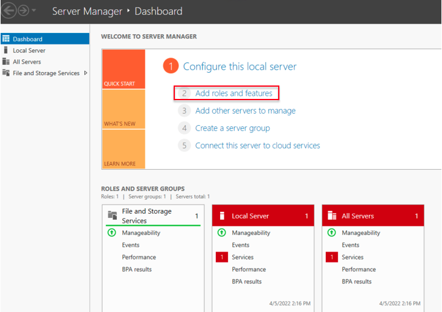
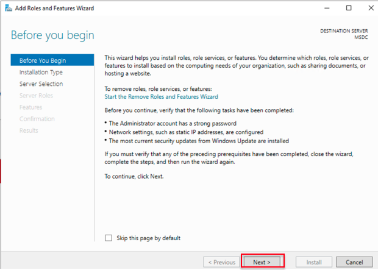
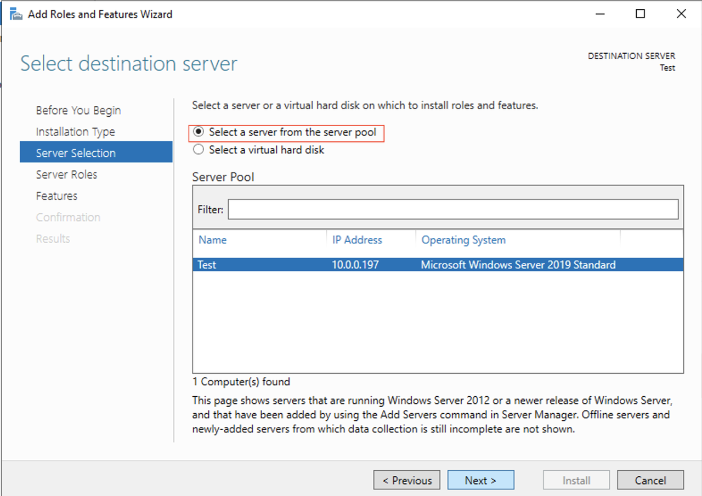
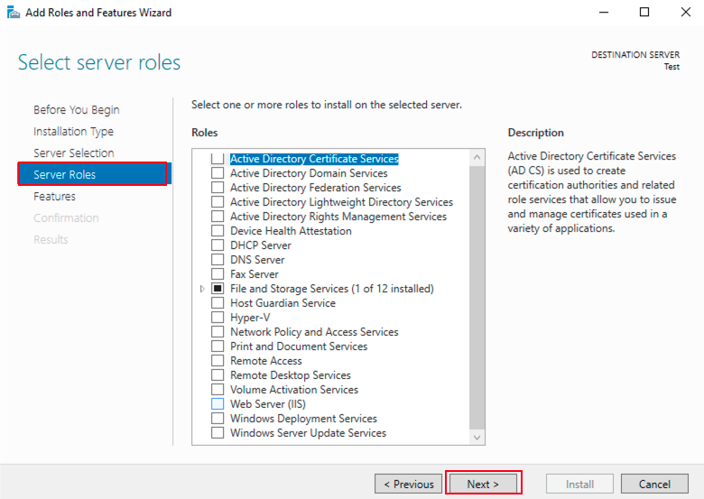
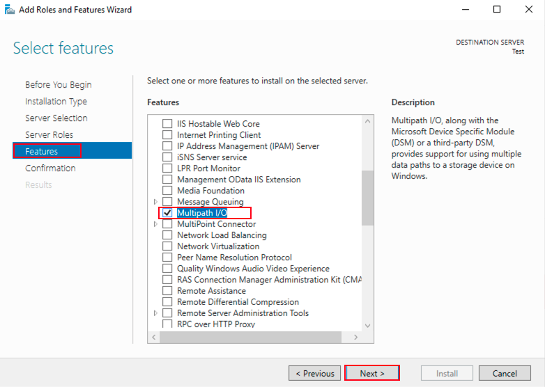
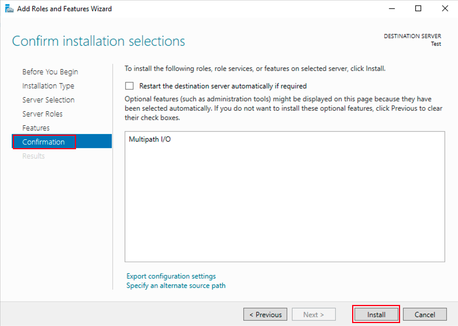
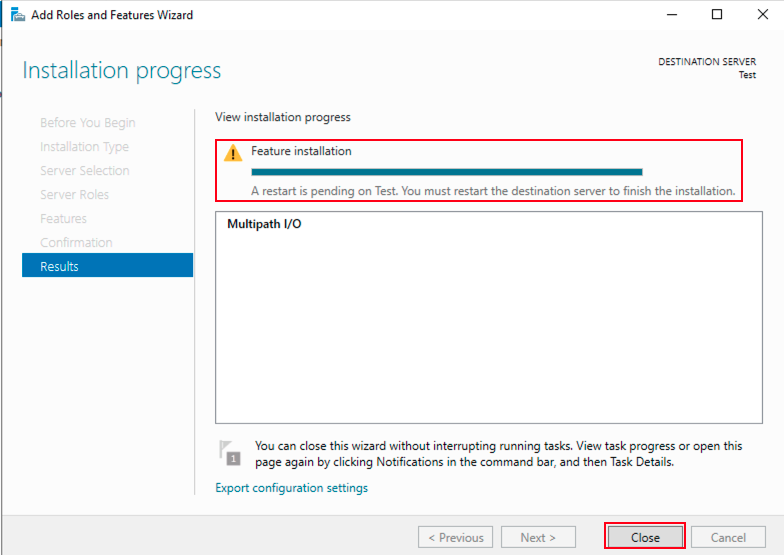
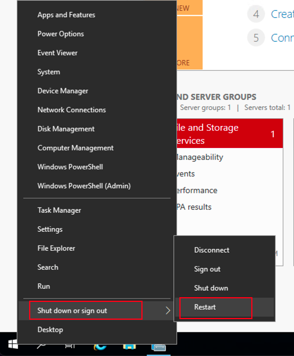

# Configure Multipath-IO (MPIO) on Windows Server 2019

## Introduction

This lab demonstrates how to Configure Multipath-IO (MPIO) on Windows Server 2019.

Estimated Time:  30 min

### Objectives
In this lab, you will learn to:
* Configure Multipath-IO (MPIO) on Windows Server 2019

### Prerequisites

This lab assumes you have:
- A Free or LiveLabs Oracle Cloud account
- IAM policies to create resources in the compartment
- Required Subnets are available in VCN

##  Task 1: Configure Multipath-IO (MPIO) on Windows Server 2019

1. RDP to the Windows host using the OPC user credentials.

2. From the taskbar, click **search button** and search for Server Manager and click on Server Manager.

  

3. once open the Server Manager, click on **Add roles and features**

  

4. The Add Roles and Features Wizard look like the following image. Click on **next**

  

5. Choose the Installation Type **Role-based or feature-based Installation**, click on **next**

  

6. Choose the Server Selection Type **Select a server from the server pool**, click on **next**

  

7. In **Server Role**, we need not select any role. Click on **Next**.

  

8. In **Features** section, select **Multipath I/O**, and click on **Next**.

  

9. In **Confirmation**, click on **Install**.

  

10. The results will show as shown in the following image, and the installation required a restart to finish the installation. Click on **close**. 

  

11. Restart the Windows server from start menu. 

  

12. After successful restart, login to the server, and you can see **Multipath I/O** installed successfully.

  

  You may now **Proceed to the next lab.**

## Learn More
- You can find more information about Launching a Windows Instance [here](https://docs.oracle.com/en-us/iaas/Content/GSG/Tasks/launchinginstanceWindows.htm)

## Acknowledgements
* **Author** - Ramesh Babu Donti, Principal Cloud Architect, NA Cloud Engineering
* **Contributors** -  Jitender Singh, Senior Cloud Engineer, NA Cloud Engineering
* **Last Updated By/Date** - Ramesh Babu Donti, Principal Cloud Architect, NA Cloud Engineering, July 2022