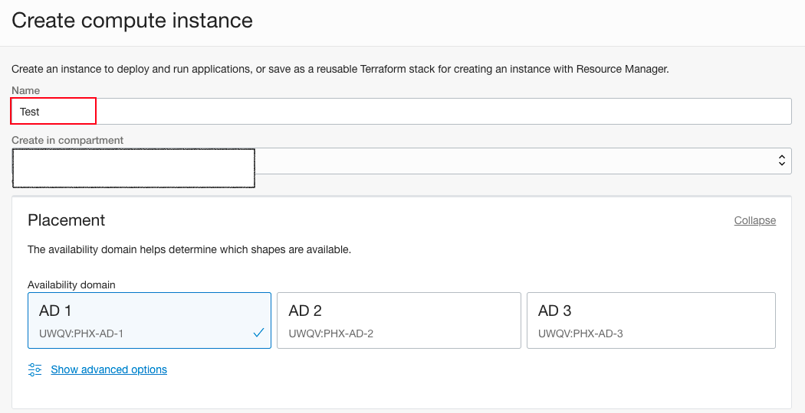
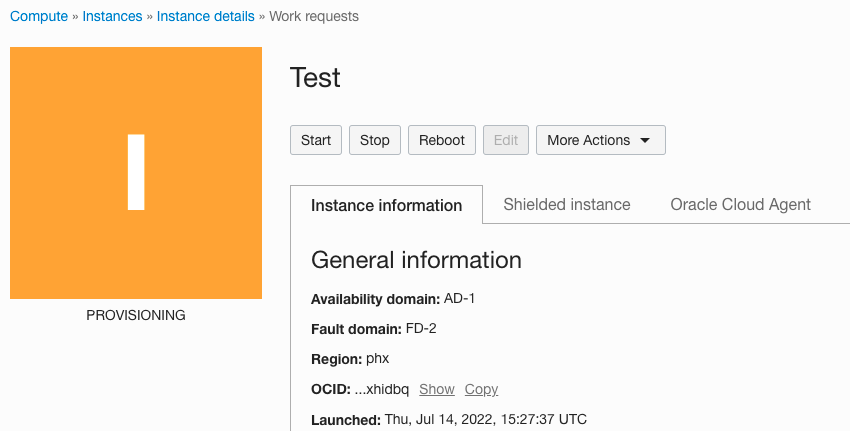

# Provision the Windows Compute Instance

## Introduction

This lab walks you through creating a Windows Compute Instance.

Estimated Time: 15 min

### Objectives
In this lab, you will learn to :
* Setup the Windows Compute Instance

### Prerequisites  

This lab assumes you have:
- A Free or LiveLabs Oracle Cloud account
- IAM policies to create resources in the compartment
- Required Subnets are available in VCN

##  Task 1: Provision the Windows Compute Instance

1. Open the navigation menu, click **Compute**, and then click **Instances**.

  

2. Compute will show the page below. The Compute service helps you provision VMs and bare metal Instances to meet your compute and application requirements. Navigate to **Instances**, and then click on **Create Instance**.

  

3. Choose the Instance name and compartment where the Compute Instance needs to create and select the desired Availability Domain.

  

4. Click on **Change image** to select the edition of Windows image build and Click on **Change Shape** to choose the Shape of the Instance.
  > Note: To achieve ultra-high performance minimum of 16 OCPU is required. 

  

5. Choose the compartment where the Compute Instance should reside and then choose the public subnet as shown below. Click on assign a public IPv4 address to connect from the public internet.

  

6. Choose the default values and click on the **Create** Instance.

  

7. The Compute Instance will be in a provisioning state, as shown in the below image.

  

8. Once the Compute Instance is provisioned successfully, the Instance state will be running state.

  

9. You can connect to the newly created Instance via Remote Desktop using the **opc** username and the initial password shown in the console; the user must change the password at the next logon. The Compute Instance must allow RDP TCP port **3389** in the security list.

  

  You may now **Proceed to the next lab.**
  
## Learn More
- You can find more information about Launching a Windows Instance [here](https://docs.oracle.com/en-us/iaas/Content/GSG/Tasks/launchinginstanceWindows.htm)

## Acknowledgements
* **Author** - Ramesh Babu Donti, Principal Cloud Architect, NA Cloud Engineering
* **Contributors** -  Jitender Singh, Senior Cloud Engineer, NA Cloud Engineering
* **Last Updated By/Date** - Ramesh Babu Donti, Principal Cloud Architect, NA Cloud Engineering, July 2022
