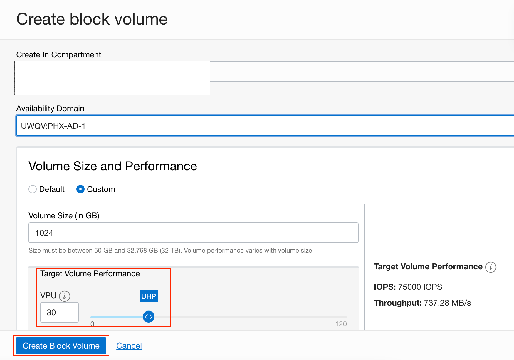
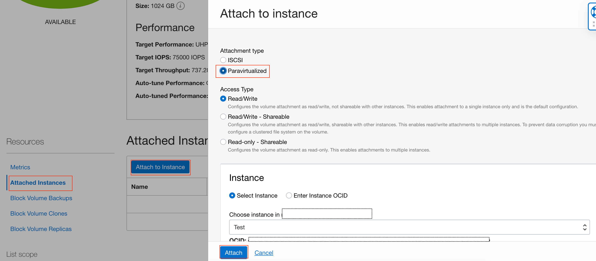

# Provision the Block Storage

## Introduction

This lab walks you through how to provision the Block Storage.

Estimated Time:  15 min

### Objectives
In this lab, you will learn to :
* How to provision the Block Storage

### Prerequisites  

This lab assumes you have:
- A Free or LiveLabs Oracle Cloud account
- IAM policies to create resources in the compartment

##  Task 1: Provision the Block Storage

1. From the OCI services menu, Click **Block Volumes** under **Block Storage**, then Click **Create Block Volume**.

2. Fill out the dialog box:
    * **Name:** Enter a name for the block volume. (e.g. sql_data)
    * **Create in Compartment:** Select the same compartment as your VCN and Instance.
    * **Availability Domain:** Select the first available domain (must be the same as Compute).
    * **Volume and Size Performance:** click on custom and choose 1024 GB size, and **Target Volume Performance** is **30 VPU**
      > Note: When attaching a volume with vpu>=30, the attachment will be configured as a multipath-enabled/UHP attachment automatically

    * **Compartment for Backup Policy:** Leave as default setting.
    * **Backup Policy:** Leave empty.
    * **Encryption:** Select "Encrypt Using Oracle-Managed Keys"

  

3. Wait for the Block Volume state to change from 'Provisioning' to 'Available'.

4. In **Resources** Select the **Attached Instances**, 
    * Choose the **Attachement Type** as **Paravirtualized**
    * Access Type **Read/Write**
    * Choose the instance you created in **Lab1**

    Click on **Attach**
  
    

  You may now **Proceed to the next lab.**

## Acknowledgements
* **Author** - Ramesh Babu Donti, Principal Cloud Architect, NA Cloud Engineering
* **Contributors** -  Jitender Singh, Senior Cloud Engineer, NA Cloud Engineering
* **Last Updated By/Date** - Ramesh Babu Donti, Principal Cloud Architect, NA Cloud Engineering, July 2022