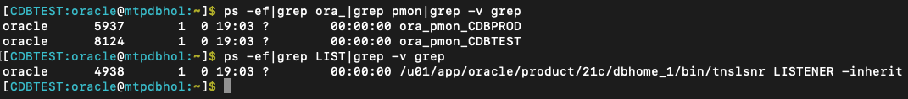

# Managing the Workshop Database Processes

## Introduction

In this lab we will review and startup all components required to successfully run this workshop.

*Estimated Time:* 10 Minutes.

### Objectives
- Validate that the workshop environment is up and running.

### Prerequisites
This lab assumes you have:
- A Free Tier, Paid or LiveLabs Oracle Cloud account
- You have completed:
    - Lab: Prepare Setup (*Free-tier* and *Paid Tenants* only)
    
**NOTE:** *When doing Copy/Paste using the convenient* **Copy** *function used throughout the guide, you must hit the* **ENTER** *key after pasting. Otherwise the last line will remain in the buffer until you hit* **ENTER!**

## Task 1: Lab Environment - Oracle Database Details 

The Oracle Database environment for this workshop should start up completely upon the provisioning of the workshop environment.  If you are having difficulty connecting to the databases using the lab commands, please verify that the lab database environment is completely up.  The following Processes should be running:

   - Database Listeners
       - LISTENER (1521)
   - Database Server Instances
       - CDBPROD
       - CDBTEST

You should be able to validate the running processes by entering the following commands in the desktop terminal window:

   ```
   <copy>
   ps -ef|grep ora_|grep pmon|grep -v grep
   ps -ef|grep LIST|grep -v grep
   </copy>
   ```

   

If all expected processes are shown in your output as seen above, then your environment is ready for running the workshop tasks. If any of the processes are not running, then please refer to the instructions in the next task.

## Task 2: Managing Startup Services

1. Database service (All databases and Standard Listener).

    - Start

    ```
    <copy>
    sudo systemctl start oracle-database
    </copy>
    ```
    - Stop

    ```
    <copy>
    sudo systemctl stop oracle-database
    </copy>
    ```

    - Status

    ```
    <copy>
    sudo systemctl status oracle-database
    </copy>
    ```

    - Restart

    ```
    <copy>
    sudo systemctl restart oracle-database
    </copy>
    ```

2. Database service (Non-Standard Listeners).

    - Start

    ```
    <copy>
    sudo systemctl start oracle-db-listener
    </copy>
    ```
    - Stop

    ```
    <copy>
    sudo systemctl stop oracle-db-listener
    </copy>
    ```

    - Status

    ```
    <copy>
    sudo systemctl status oracle-db-listener
    </copy>
    ```

    - Restart

    ```
    <copy>
    sudo systemctl restart oracle-db-listener
    </copy>
    ```

## Acknowledgements
* **Author** - Rene Fontcha, LiveLabs Platform Lead, NA Technology
- **Contributors** - Sean Provost, Mike Sweeney, Bryan Grenn, Bill Pritchett, Joseph Bernens
- **Last Updated By/Date** - Joseph Bernens, Principal Solution Engineer, Oracle NACI Engineering, July 2024
