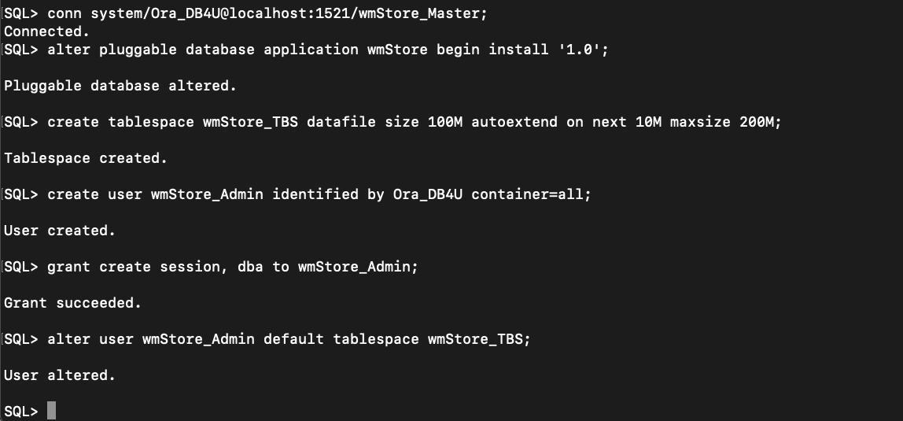
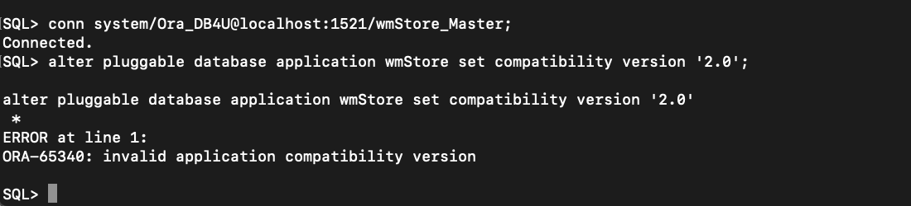

# Application containers

## Introduction
This is a series of 12 hands-on labs designed to familiarize you with the Application Container functionality of Oracle Multitenant. In these labs, we follow the journey of a notional company, Walt’s Malts, as their business expands from a single store to a global powerhouse, “from startup to starship”.

Estimated Time: 1 hour

[](youtube:ZPOjjF3kCvo)

Watch the video below for a quick walk-through of the lab.
[Application containers](videohub:1_h092h1u8)

### Prerequisites
This lab assumes you have:
- A Free Tier, Paid or LiveLabs Oracle Cloud account
- You have completed:
    - Lab: Prepare Setup (*Free-tier* and *Paid Tenants* only)
    - Lab: Environment Setup
    - Lab: Clone, Plug and Drop

**NOTE:** *When doing Copy/Paste using the convenient* **Copy** *function used throughout the guide, you must hit the* **ENTER** *key after pasting. Otherwise the last line will remain in the buffer until you hit* **ENTER!**

## Task 1: Instant SaaS
This section shows how Multitenant with Application Containers provides an instant SaaS architecture for an application formerly architected for standalone deployment.

The tasks you will do in this step are:
- Setup Application Root - `wmStore_Master`
- Install v1 of Application wmStore in Application Root
- Create and sync Application Seed and provision Application PDBs for four franchises: Tulsa, California, Tahoe, NYC
- Populate Application Tenant PDBs with demo data.

In the following labs, instead of SQL\*Plus you will use Oracle SQL Developer Command Line (SQLcl).  Oracle **SQLcl** is the modern, command line interface to the database. **SQLcl** has many key features that add to the value of the utility, including command history, in-line editing, auto complete using the TAB key and more. You can learn more about **SQLcl** [at the Oracle SQLcl website](https://www.oracle.com/database/technologies/appdev/sqlcl.html).


1. Start SQLcl, set the sqlformat for easier on-screen viewing, and connect to **CDB1**.

    ```
    <copy>
    sql /nolog
    </copy>
    ```

    ```
    <copy>
    set sqlformat ANSICONSOLE
    </copy>
    ```

    ```
    <copy>
    connect sys/Ora_DB4U@localhost:1521/cdb1 as sysdba
    </copy>
    ```

    

2. Create and open the master application root.

    ```
    <copy>create pluggable database wmStore_Master as application container
    admin user wm_admin identified by Ora_DB4U;</copy>
    ```

    ```
    <copy>alter pluggable database wmStore_Master open;</copy>
    ```

    

3. Define the application "wmStore" master.

    ```
    <copy>conn system/Ora_DB4U@localhost:1521/wmStore_Master;</copy>
    ```

    ```
    <copy>alter pluggable database application wmStore begin install '1.0';</copy>
    ```

    ```
    <copy>create tablespace wmStore_TBS datafile size 100M autoextend on next 10M maxsize 200M;</copy>
    ```

    ```
    <copy>create user wmStore_Admin identified by Ora_DB4U container=all;</copy>
    ```

    ```
    <copy>grant create session, dba to wmStore_Admin;</copy>
    ```

    ```
    <copy>alter user wmStore_Admin default tablespace wmStore_TBS;</copy>
    ```

    

    ```
    <copy>connect wmStore_Admin/Ora_DB4U@localhost:1521/wmStore_Master</copy>
    ```

    ```
    <copy>
    create table wm_Campaigns
    -- sharing = data
    (Row_GUID         raw(16)           default Sys_GUID()                      primary key
    ,Name             varchar2(30)                                    not null  unique
    )
    /
    </copy>
    ```

    ```
    <copy>
    create table wm_Products
    -- sharing = extended data
    (Row_GUID         raw(16)           default Sys_GUID()                      primary key
    ,Name             varchar2(30)                                    not null  unique
    )
    /
    </copy>
    ```

    ```
    <copy>
    create table wm_Orders
    -- sharing = metadata
    (Row_GUID         raw(16)           default Sys_GUID()                      primary key
    ,Order_Number     number(16,0)      generated always as identity  not null  unique
    ,Order_Date       date              default   current_date        not null
    ,Campaign_ID      raw(16)           
    )
    /
    </copy>
    ```

    ```
    <copy>
    alter table wm_Orders add constraint wm_Orders_F1
    foreign key (Campaign_ID)
    references wm_Campaigns(Row_GUID)
    disable
    /
    </copy>
    ```

    

    ```
    <copy>
    create table wm_Order_Items
    -- sharing = metadata
    (Row_GUID         raw(16)                    default Sys_GUID()           primary key
    ,Order_ID         raw(16)           not null
    ,Item_Num         number(16,0)      not null
    ,Product_ID       raw(16)           not null
    ,Order_Qty        number(16,0)      not null
    )
    /
    </copy>
    ```

    ```
    <copy>
    alter table wm_Order_Items add constraint wm_Order_Items_F1
    foreign key (Order_ID)
    references wm_Orders(Row_GUID)
    disable
    /
    </copy>
    ```

    ```
    <copy>
    alter table wm_Order_Items add constraint wm_Order_Items_F2
    foreign key (Product_ID)
    references wm_Products(Row_GUID)
    disable
    /
    </copy>
    ```

    ```
    <copy>
    create or replace view wm_Order_Details
    -- sharing = metadata
    (Order_Number
    ,Campaign_Name
    ,Item_Num
    ,Product_Name
    ,Order_Qty
    ) as
    select o.Order_Number
    ,      c.Name
    ,      i.Item_Num
    ,      p.Name
    ,      i.Order_Qty
    from wm_Orders o
    join wm_Order_Items i
    on  i.Order_ID = o.Row_GUID
    join wm_Products p
    on   i.Product_ID = p.Row_GUID
    left outer join wm_Campaigns c
    on  o.Campaign_ID = c.Row_GUID
    /
    </copy>
    ```

    

    ```
    <copy>
    insert into wm_Campaigns (Row_GUID, Name) values ('01', 'Locals vs Yokels');

    insert into wm_Campaigns (Row_GUID, Name) values ('02', 'Black Friday 2016');

    insert into wm_Campaigns (Row_GUID, Name) values ('03', 'Christmas 2016');

    insert into wm_Products (Row_GUID, Name) values ('01', 'Tornado Twisted');

    insert into wm_Products (Row_GUID, Name) values ('02', 'Muskogee Magic');

    insert into wm_Products (Row_GUID, Name) values ('03', 'Root 66 Beer Float');

    insert into wm_Products (Row_GUID, Name) values ('04', 'Yokie Dokie Okie Eggnog');
    </copy>
    ```

    ```
    <copy>commit;</copy>
    ```

    ```
    <copy>alter pluggable database application wmStore end install '1.0';</copy>
    ```

    

4. Create the application seed PDB, which will be used to create additional application PDBs. Open the application seed PDB after it is created.

    ```
    <copy>conn system/Ora_DB4U@localhost:1521/wmStore_Master</copy>
    ```

    ```
    <copy>create pluggable database as seed
    admin user wm_admin identified by Ora_DB4U;

    alter pluggable database wmStore_Master$Seed open;
    </copy>
    ```

    

5. Sync the seed with the application wmStore.

    ```
    <copy>conn system/Ora_DB4U@localhost:1521/wmStore_Master$Seed;</copy>
    ```

    ```
    <copy>alter pluggable database application wmStore sync;</copy>
    ```

    

6.  Provision separate application databases for each of the 4 stores.

    ```
    <copy>conn system/Ora_DB4U@localhost:1521/wmStore_Master</copy>
    ```

    ```
    <copy>create pluggable database Tulsa
    admin user wm_admin identified by Ora_DB4U;</copy>
    ```

    ```
    <copy>create pluggable database California
    admin user wm_admin identified by Ora_DB4U;</copy>
    ```

    ```
    <copy>create pluggable database Tahoe
    admin user wm_admin identified by Ora_DB4U;</copy>
    ```

    ```
    <copy>create pluggable database NYC
    admin user wm_admin identified by Ora_DB4U;</copy>
    ```

    ```
    <copy>alter pluggable database all open;</copy>
    ```

    

7. Create franchise-specific data by running the supplied script. In SQLcl we'll use the "cd" command to execute scripts from the correct directory.

    ```
    <copy>conn system/Ora_DB4U@localhost:1521/wmStore_Master</copy>
    ```

    ```
    <copy>cd /home/oracle/labs/multitenant</copy>
    ```

    ```
    <copy>@Franchise_Data_Lab1</copy>
    ```

    

## Task 2: PDB exploration
In this section you will take a brief tour of the newly created SaaS estate.

The tasks you will do in this step are:
- Look at the PDBs that have been created so far
- Experiment with different classes of User
- Perform queries against different franchises

1. Connect to **CDB1**.

    ```
    <copy>connect system/Ora_DB4U@localhost:1521/cdb1</copy>
    ```

2. Show PDBs created so far in container database **CDB1**.

    ```
    <copy>
    select P.Con_ID                 
    ,      P.Name                   "PDB Name"
    ,      P.CON_UID                "Con UID"
    ,      P.Restricted             "Restricted?"
    ,      P.Open_Mode              "Open Mode?"
    ,      P.Application_Root       "Root?"
    ,      P.Application_PDB        "App PDB?"
    ,      P.Application_Seed       "App Seed?"
    ,      P.Application_Root_Clone "Root Clone?"
    ,      P.Proxy_PDB              "Proxy?"
    ,      AC.Name                  "App Container Name"
    from v$PDBs P
    left outer join v$PDBs AC
    on AC.Con_ID = P.Application_Root_Con_ID
    order by P.Con_ID, P.Name
    ,        nvl(AC.Name,P.Name)
    ,        P.Application_Root desc
    ,        P.Application_Seed desc
    ,        P.Name
    ;
    </copy>
    ```

    

3. You should be able to set your container to Tulsa because `wmStore_Admin` is an Application Common user but it should fail if you try to set it to CDB$Root since that container is outside of the application container.

    ```
    <copy>connect wmStore_Admin/Ora_DB4U@localhost:1521/wmStore_Master</copy>
    ```

    ```
    <copy>alter session set container = Tulsa;</copy>
    ```

    ```
    <copy>alter session set container = CDB$Root;</copy>
    ```

    

4. You can connect directly to application PDBs as the various local users. Keep in mind these are local users, it just happens to be that they have the same password. Notice that the local user for California cannot use the Tulsa container because it is local to the California container.

    ```
    <copy>connect wm_admin/Ora_DB4U@localhost:1521/Tulsa</copy>
    ```

    ```
    <copy>alter session set container = Tulsa;</copy>
    ```

    ```
    <copy>connect wm_admin/Ora_DB4U@localhost:1521/California;</copy>
    ```

    ```
    <copy>alter session set container = Tulsa;</copy>
    ```

    

5. Now you'll explore the data inside the application PDBs using some sample queries. Note that each store has its own products, sales campaigns, and order quantities. You'll create and save a script to make it easy query each franchise's sales by product by campaign

    ```
    <copy>
    select     p.Name         Product
    ,      sum( i.Order_Qty)   Qty
    from wm_Orders o
    left outer join wm_Campaigns c
    on  o.Campaign_ID = c.Row_GUID
    left outer join wm_Order_Items i
    on  i.Order_ID = o.Row_GUID
    join wm_Products p
    on   i.Product_ID = p.Row_GUID
    Group by p.Name
    order by 1
    .

    save orders_by_product.sql
    </copy>
    ```

    

    

    ```
    <copy>connect wmStore_Admin/Ora_DB4U@localhost:1521/Tulsa
    @orders_by_product.sql
    </copy>
    ```

    ```
    <copy>connect wmStore_Admin/Ora_DB4U@localhost:1521/California
    @orders_by_product.sql
    </copy>
    ```

    ```
    <copy>connect wmStore_Admin/Ora_DB4U@localhost:1521/Tahoe
    @orders_by_product.sql
    </copy>
    ```

    

In this section you have observed how each application PDB has its own data through queries directly against each application PDB.  In an upcoming lab, you will learn how to run queries from the Application Root across multiple Application Tenant PDBs.

## Task 3: Upgrade from v1 to v2
In this section we'll upgrade Application wmStore from v1 to v2. Despite each franchise having a separate tenant PDB, there is only one master application definition to be upgraded, in the Application Root. We run the upgrade script only once, against the Application Root. It is then simply a matter of synchronizing the tenant PDBs for each franchise for them to be upgraded to the new version. Note that this model allows for granular (per tenant/franchise) upgrade schedules.

The tasks you will do in this step are:
- Upgrade application wmStore to v2
- Synchronize three of four Application Tenant PDBs

1. Create the upgrade of the pluggable databases.

    ```
    <copy>conn system/Ora_DB4U@localhost:1521/wmStore_Master</copy>
    ```

    ```
    <copy>alter pluggable database application wmStore begin upgrade '1.0' to '2.0';</copy>
    ```

    ```
    <copy>connect wmStore_Admin/Ora_DB4U@localhost:1521/wmStore_Master</copy>
    ```

    ```
    <copy>
    alter table wm_Products add
    (Local_Product_YN char(1)           default 'Y'                   not null
    )
    ;
    </copy>
    ```

    ```
    <copy>
    alter table wm_Products add constraint Local_Product_Bool
    check (Local_Product_YN in ('Y','N'))
    ;
    </copy>
    ```

    ```
    <copy>
    create or replace view wm_Order_Details
    -- sharing = metadata
    (Order_Number
    ,Campaign_Name
    ,Item_Num
    ,Product_Name
    ,Local_Product_YN
    ,Order_Qty
    ) as
    select o.Order_Number
    ,      c.Name
    ,      i.Item_Num
    ,      p.Name
    ,      p.Local_Product_YN
    ,      i.Order_Qty
    from wm_Orders o
    join wm_Order_Items i
    on  i.Order_ID = o.Row_GUID
    join wm_Products p
    on   i.Product_ID = p.Row_GUID
    left outer join wm_Campaigns c
    on  o.Campaign_ID = c.Row_GUID
    /
    </copy>
    ```

    

    ```
    <copy>
    update wm_Products
    set Local_Product_YN = 'N'
    where Name in
    ('Tornado Twisted'
    ,'Muskogee Magic'
    ,'Root 66 Beer Float'
    ,'Yokie Dokie Okie Eggnog'
    )
    ;
    </copy>
    ```

    ```
    <copy>commit;</copy>
    ```

    ```
    <copy>alter pluggable database application wmStore end upgrade;</copy>
    ```

    

2. Apply the upgrade to Tulsa.

    ```
    <copy>connect system/Ora_DB4U@localhost:1521/Tulsa</copy>
    ```

    ```
    <copy>alter pluggable database application wmStore sync;</copy>
    ```

    

3. Apply the upgrade to California and Tahoe.

    ```
    <copy>connect system/Ora_DB4U@localhost:1521/California</copy>
    ```

    ```
    <copy>alter pluggable database application wmStore sync;</copy>
    ```

    ```
    <copy>connect system/Ora_DB4U@localhost:1521/Tahoe</copy>
    ```

    ```
    <copy>alter pluggable database application wmStore sync;</copy>
    ```

    

4. Take a look at a pluggable database where the upgrade was applied.


    ```
    <copy>connect wmStore_Admin/Ora_DB4U@localhost:1521/Tulsa</copy>
    ```

    ```
    <copy>desc wm_Products</copy>
    ```

    ```
    <copy>
    select * from wm_Products;
    </copy>
    ```

    

5. Look at the application PDB **NYC** where the upgrade was not applied, comparing the table definitions and data to the application PDB that was upgraded.


    ```
    <copy>connect wmStore_Admin/Ora_DB4U@localhost:1521/NYC</copy>
    ```

    ```
    <copy>desc wm_Products</copy>
    ```

    ```
    <copy>
    select * from wm_Products;
    </copy>
    ```

    

## Task 4: Containers queries
In this section we introduce a very powerful cross-container aggregation capability: **containers()** queries. Containers() queries enable an application administrator to connect to the Application Root and aggregate data with a single query across some or all Application Tenants (Franchises). This is another example of how Multitenant, with Application Containers, enables you to manage many Application Tenants as one, when needed. Notice values in the column Franchise come from `Con$Name`. Remember that containers() queries are executed in Root and all containers plugged into it.

The task you will do in this step is:
- Run Queries across containers

1. Connect to the Application Master PDB as the application administrator.

    ```
    <copy>connect wmStore_Admin/Ora_DB4U@localhost:1521/wmStore_Master</copy>
    ```

2. Query the products in Tulsa and NYC.

    ```
    <copy>
    set pagesize 50
    select con$name "Franchise",
           Name     "Product Name"
    from containers(wm_Products)
    where con$name in ('TULSA','NYC')
    order by 1,2;
    </copy>
    ```

    

3. Query order quantities per campaign across all franchises.


    ```
    <copy>
    select con$name      "Franchise"
    ,      Campaign_Name "Campaign Name"
    ,      count(*)      "Total Orders"
    from containers(wm_Order_Details)
    group by con$name, Campaign_Name
    order by 1, 3 desc, 2;
    </copy>
    ```

    

4. Query order volume by product across all franchises.

    ```
    <copy>
    select con$name      "Franchise"
    ,      Product_Name  "Product Name"
    ,      count(*)      "Total Orders"
    from containers(wm_Order_Details)
    group by con$name, Product_Name
    order by 1, 3 desc, 2;
    </copy>
    ```

    

## Task 5: Application compatibility
In this section you will explore the PDBs and learn how to set compatibility at the Application Master.

1. Connect to `CDB1`.

    ```
    <copy>connect system/Ora_DB4U@localhost:1521/cdb1</copy>
    ```

2. Review the pluggable databases in the container database.

    ```
    <copy>
    select P.Name                   "PDB Name"
    ,      P.CON_UID                "Con UID"
    ,      P.Restricted             "Restricted?"
    ,      P.Open_Mode              "Open Mode"
    ,      P.Application_Root       "App Root?"
    ,      P.Application_PDB        "App PDB?"
    ,      P.Application_Seed       "App Seed?"
    ,      P.Application_Root_Clone "Root Clone?"
    ,      P.Proxy_PDB              "Proxy?"
    ,      AC.Name                  "App Container Name"
    from v$PDBs P
    left outer join v$PDBs AC
    on AC.Con_ID = P.Application_Root_Con_ID
    order by AC.Name, P.Name
    ,        nvl(AC.Name,P.Name)
    ,        P.Application_Root desc
    ,        P.Application_Seed desc
    ,        P.Name
    ;
    </copy>
    ```

    

3. Connect to the master database and set the application compatibility to 2.0. Notice you will get an error because one of the databases is not currently at that version.

    ```
    <copy>conn system/Ora_DB4U@localhost:1521/wmStore_Master;</copy>
    ```

    ```
    <copy>alter pluggable database application wmStore set compatibility version '2.0';</copy>
    ```

    

4. Run the query below and notice that there are applications that are not at the current version. If you look at the output from the first query you can see that the NYC and `wmStore_Master$Seed` are still at 1.0.

    ```
    <copy>select * from DBA_App_PDB_Status;</copy>
    ```

    

5. Connect to NYC and bring that up to the current version.

    ```
    <copy>conn system/Ora_DB4U@localhost:1521/NYC</copy>
    ```

    ```
    <copy>alter pluggable database application wmStore sync;</copy>
    ```

    


6. Connect to `wmStore_Master$Seed` and bring that up to the current version.

    ```
    <copy>conn system/Ora_DB4U@localhost:1521/wmStore_Master$Seed</copy>
    ```

    ```
    <copy>alter pluggable database application wmStore sync;</copy>
    ```

    

7. Connect back to `wmStore_Master` and set the compatibility to 2.0. This time it should work.

    ```
    <copy>conn system/Ora_DB4U@localhost:1521/wmStore_Master</copy>
    ```

    ```
    <copy>alter pluggable database application wmStore set compatibility version '2.0';</copy>
    ```

    

    ```
    <copy>select * from DBA_App_PDB_Status;</copy>
    ```

    


## Task 6: Expansion beyond single CDB and application root replicas
In this section we follow the global expansion of Walt's Malts. To comply with requirements of data sovereignty and latency, Walt's Malts has had to expand into a second CDB, CDB2. (In reality this would be in a separate server.) It is very important to note that we still only have a single master application definition, despite the application now being deployed across multiple CDBs.

The tasks you will do in this step are:
- Create and Open Application Root Replicas (ARRs): `wmStore_International`, `wmStore_West`
- Create Proxy PDBs for the ARRs
- Synchronize the ARRs by using their proxies
- Create App Seeds for the ARRs
- Provision the App PDBs for five new franchises
- Add franchise-specific products for new franchises

1. Connect to **CDB2**.

    ```
    <copy>connect system/Ora_DB4U@localhost:1522/cdb2</copy>
    ```

2. Create a database link to CDB1 to pull the data across.

    ```
    <copy>
    create public database link CDB1_DBLink
    connect to system identified by Ora_DB4U
    using 'localhost:1521/cdb1';
    </copy>
    ```

    

3. Create and open the Application Root Replicas (ARRs).

    ```
    <copy>
    create pluggable database wmStore_International as application container
    from wmStore_Master@CDB1_DBLink;
    </copy>
    ```

    ```
    <copy>
    create pluggable database wmStore_West as application container
    from wmStore_Master@CDB1_DBLink;
    </copy>
    ```

    ```
    <copy>
    alter pluggable database all open;
    show pdbs
    </copy>
    ```

    

4. Since the databases in CDB2 register with a listener with a non-default port (in this case, port 1522) you will need to update the ARRs with that port information. This is critical, since the proxy PDBs you will create require this configuration in order to communicate with their target PDBs.

    ```
    <copy>connect system/Ora_DB4U@localhost:1522/wmStore_International</copy>
    ```

    ```
    <copy>
    alter pluggable database CONTAINERS port=1522;
    alter pluggable database CONTAINERS host='localhost';
    </copy>
    ```

    ```
    <copy>connect system/Ora_DB4U@localhost:1522/wmStore_West</copy>
    ```

    ```
    <copy>
    alter pluggable database CONTAINERS port=1522;
    alter pluggable database CONTAINERS host='localhost';
    </copy>
    ```

    

5. Create the `CDB$Root-level` DB Link to CDB2.

    ```
    <copy>connect system/Ora_DB4U@localhost:1521/cdb1</copy>
    ```

    ```
    <copy>
    create public database link CDB2_DBLink
    connect to system identified by Ora_DB4U
    using 'localhost:1522/cdb2';
    </copy>
    ```

    

6. Create the Application-Root-level DB Links to CDB2.

    ```
    <copy>conn system/Ora_DB4U@localhost:1521/wmStore_Master</copy>
    ```

    ```
    <copy>
    create public database link CDB2_DBLink
    connect to system identified by Ora_DB4U
    using 'localhost:1522/cdb2';
    </copy>
    ```

    

7. Create and open Proxy PDBs for the Application Root Replicas.

    ```
    <copy>create pluggable database wmStore_International_Proxy
    as proxy from wmStore_International@CDB2_DBLink;</copy>
    ```

    ```
    <copy>create pluggable database wmStore_West_Proxy
    as proxy from wmStore_West@CDB2_DBLink;</copy>
    ```

    ```
    <copy>alter pluggable database all open;</copy>
    ```

    

8. Synchronize the Application Root Replicas (ARRs) by using their proxies.

    ```
    <copy>conn system/Ora_DB4U@localhost:1521/wmStore_International_Proxy</copy>
    ```

    ```
    <copy>alter pluggable database application wmStore sync;</copy>
    ```

    ```
    <copy>conn system/Ora_DB4U@localhost:1521/wmStore_West_Proxy</copy>
    ```

    ```
    <copy>alter pluggable database application wmStore sync;</copy>
    ```

    

9. Create and open the Application Seed PDBs for `wmStore_International` and sync it with Application wmStore.

    ```
    <copy>conn system/Ora_DB4U@localhost:1522/wmStore_International</copy>
    ```

    ```
    <copy>create pluggable database as seed
    admin user wm_admin identified by Ora_DB4U;</copy>
    ```

    ```
    <copy>alter pluggable database wmStore_International$Seed open;</copy>
    ```

    ```
    <copy>connect system/Ora_DB4U@localhost:1522/wmStore_International$Seed</copy>
    ```

    ```
    <copy>alter pluggable database application wmStore sync;</copy>
    ```

    

10. Create and open the Application Seed PDBs for `wmStore_West` and sync it with Application wmStore.

    ```
    <copy>conn system/Ora_DB4U@localhost:1522/wmStore_West</copy>
    ```

    ```
    <copy>create pluggable database as seed
    admin user wm_admin identified by Ora_DB4U;</copy>
    ```

    ```
    <copy>alter pluggable database wmStore_West$Seed open;</copy>
    ```

    ```
    <copy>connect system/Ora_DB4U@localhost:1522/wmStore_West$Seed</copy>
    ```

    ```
    <copy>alter pluggable database application wmStore sync;</copy>
    ```

    

11. Connect to the `wmStore_International` Application Root Replica (ARR) and create a database link from that ARR to the CDB of the Master Root.

    ```
    <copy>connect system/Ora_DB4U@localhost:1522/wmStore_International</copy>
    ```

    ```
    <copy>
    create public database link CDB1_DBLink
    connect to system identified by Ora_DB4U
    using 'localhost:1521/cdb1';
    </copy>
    ```

    

12. Provision Application PDBs for the UK, Denmark and France franchises.

    ```
    <copy>create pluggable database UK
    admin user wm_admin identified by Ora_DB4U;</copy>
    ```

    ```
    <copy>create pluggable database Denmark
    admin user wm_admin identified by Ora_DB4U;</copy>
    ```

    ```
    <copy>create pluggable database France
    admin user wm_admin identified by Ora_DB4U;</copy>
    ```

    

13. Connect to the `wmStore_West` Application Root Replica (ARR) and create a database link from that ARR to the CDB of the Master Root.

    ```
    <copy>connect system/Ora_DB4U@localhost:1522/wmStore_West</copy>
    ```

    ```
    <copy>
    create public database link CDB1_DBLink
    connect to system identified by Ora_DB4U
    using 'localhost:1521/cdb1';
    </copy>
    ```

    

14. Provision Application PDBs for the Santa Monica and Japan franchises.

    ```
    <copy>create pluggable database Santa_Monica
    admin user wm_admin identified by Ora_DB4U;</copy>
    ```

    ```
    <copy>create pluggable database Japan
    admin user wm_admin identified by Ora_DB4U;</copy>
    ```

    

15. Switch to the container root and open all pluggable databases.

    ```
    <copy>alter session set container=CDB$Root;</copy>
    ```

    ```
    <copy>alter pluggable database all open;</copy>
    ```

    

16. Create franchise-specific data by running a pre-supplied script.

    ```
    <copy>@Franchise_Data_Lab6</copy>
    ```

    

17. Connect to `wmStore_Master` and run a report of orders by franchise. Note the results include the stores who's application PDBs reside in **CDB2**; these are accessed through the Proxy PDBs that were created in **CDB1**.

    ```
    <copy>connect wmStore_Admin/Ora_DB4U@localhost:1521/wmStore_Master</copy>
    ```

    ```
    <copy>
    select con$name "Franchise"
    ,      cdb$name "CDB"
    ,      count(*) "Num Orders"
    from containers(wm_Orders) o
    ,    wm_Campaigns c
    where o.Campaign_id = c.row_guid
    and   c.Name = 'Locals vs Yokels'
    group by con$name
    ,        cdb$name
    order by 3 desc
    ,        1
    ;
    </copy>
    ```

    


## Task 7: Durable location transparency
This lab task demonstrates "durable location transparency." In the previous section we saw how Proxy PDBs can provide location transparency, allowing us to access remote application PDBs from the local Application Root. The Proxy PDBs for the Application Root Replicas (ARRs) provided local context (in the master Application Root) for the ARRs, which are physically located in a different CDB. This is a good example of location transparency. In this section, we see how these ARR Proxies can provide "durable location transparency." That is, location transparency that survives the physical reconfiguration of the Application Estate – specifically by relocating an Application PDB for a particular franchise from one CDB to another.

The tasks you will do in this step are:
- Run a report against `wmStore_Master`
- Relocate Tahoe to `wmStore_West`
- Run the report again

1. Review the report output from the previous task.

    

2. Now, relocate the application PDB **Tahoe** to `wmStore_West`.

    ```
    <copy>connect system/Ora_DB4U@localhost:1522/wmStore_West</copy>
    ```

    ```
    <copy>
    create pluggable database Tahoe from Tahoe@CDB1_DBLink relocate;
    </copy>
    ```

    ```
    <copy>connect sys/Ora_DB4U@localhost:1522/cdb2 as sysdba</copy>
    ```

    ```
    <copy>
    alter pluggable database Tahoe open;
    show pdbs
    </copy>
    ```

    

3. Rerun the report and take note of the change: the report results are basically the same, but now you can see that TAHOE is located in CDB2.

    ```
    <copy>connect wmStore_Admin/Ora_DB4U@localhost:1521/wmStore_Master</copy>
    ```

    ```
    <copy>
    select con$name "Franchise"
    ,      cdb$name "CDB"
    ,      count(*) "Num Orders"
    from containers(wm_Orders) o
    ,    wm_Campaigns c
    where o.Campaign_id = c.row_guid
    and   c.Name = 'Locals vs Yokels'
    group by con$name
    ,        cdb$name
    order by 3 desc
    ,        1
    ;
    </copy>
    ```

    

Although we physically relocated an application PDB from one CDB to another, that move was transparent to our reporting application.

## Task 8: Data sharing
In this section we introduce the advanced concept of data sharing. We have already seen how Multitenant, with Application Containers, can provide an instant SaaS architecture for an application previously architected for standalone deployment. Technically this is done by installing a master application definition in an Application Root. Application PDBs for each tenant / franchise are plugged into this Application Root and the metadata for the database components of the Application definition is served from the Application root. Up to this point, all data - including data which may be considered part of the application definition "seed data" - has been local. In other words, there's a replica of this seed data in every Application PDB.

In this lab we'll see how, in addition to metadata, common data may also be shared from Application Root. To do this we'll upgrade application wmStore to v3.0 and introduce various powerful data sharing capabilities.

The tasks you will do in this step are:
- Upgrade Application wmStore to v3.0
- Propagate the Upgrade to all franchises
- Query the `wm_Products` table in a franchise PDB to see the sources of data

1. Create the v3.0 upgrade in `wmStore_Master`.

    ```
    <copy>connect system/Ora_DB4U@localhost:1521/wmStore_Master</copy>
    ```

    ```
    <copy>alter pluggable database application wmStore begin upgrade '2.0' to '3.0';</copy>
    ```

    ```
    <copy>connect wmStore_Admin/Ora_DB4U@localhost:1521/wmStore_Master</copy>
    ```

    ```
    <copy>
    create table wm_List_Of_Values
    -- sharing = metadata
    -- the default sharing = data
    -- sharing = extended data
    (Row_GUID    raw(16)        default Sys_GUID() primary key
    ,Type_Code   varchar2(30)   not null
    ,Value_Code  varchar2(30)   not null
    )
    /
    </copy>
    ```

    ```
    <copy>
    alter table wm_List_Of_Values  add constraint wm_List_Of_Values_U1
    unique (Type_Code, Value_Code)
    /
    </copy>
    ```

    

    ```
    <copy>
    insert into wm_List_Of_Values (Type_Code, Value_Code) values ('Type', 'Currency');

    insert into wm_List_Of_Values (Type_Code, Value_Code) values ('Currency', 'USD');

    insert into wm_List_Of_Values (Type_Code, Value_Code) values ('Currency', 'GBP');

    insert into wm_List_Of_Values (Type_Code, Value_Code) values ('Currency', 'DKK');

    insert into wm_List_Of_Values (Type_Code, Value_Code) values ('Currency', 'EUR');

    insert into wm_List_Of_Values (Type_Code, Value_Code) values ('Currency', 'JPY');

    insert into wm_List_Of_Values (Type_Code, Value_Code) values ('Type', 'Country');

    insert into wm_List_Of_Values (Type_Code, Value_Code) values ('Country', 'USA');

    insert into wm_List_Of_Values (Type_Code, Value_Code) values ('Country', 'UK');

    insert into wm_List_Of_Values (Type_Code, Value_Code) values ('Country', 'Denmark');

    insert into wm_List_Of_Values (Type_Code, Value_Code) values ('Country', 'France');

    insert into wm_List_Of_Values (Type_Code, Value_Code) values ('Country', 'Japan');

    commit;
    </copy>
    ```

    

    ```
    <copy>alter table wm_Orders disable constraint wm_Orders_F1;</copy>
    ```

    ```
    <copy>alter table wm_Order_Items disable constraint wm_Order_Items_F2;</copy>
    ```

    ```
    <copy>delete from wm_Campaigns where Row_GUID in ('01','02','03');</copy>
    ```

    ```
    <copy>delete from wm_Products  where Row_GUID in ('01','02','03','04');</copy>
    ```

    ```
    <copy>
    insert into wm_Campaigns (Row_GUID, Name) values ('01', 'Locals vs Yokels');

    insert into wm_Campaigns (Row_GUID, Name) values ('02', 'Black Friday 2016');

    insert into wm_Campaigns (Row_GUID, Name) values ('03', 'Christmas 2016');

    insert into wm_Products (Row_GUID, Name) values ('01', 'Tornado Twisted');

    insert into wm_Products (Row_GUID, Name) values ('02', 'Muskogee Magic');

    insert into wm_Products (Row_GUID, Name) values ('03', 'Root 66 Beer Float');

    insert into wm_Products (Row_GUID, Name) values ('04', 'Yokie Dokie Okie Eggnog');

    commit;
    </copy>
    ```

    


    ```
    <copy>alter pluggable database application wmStore end upgrade;</copy>
    ```

    

2. Sync some pluggable databases.

    ```
    <copy>
    connect system/Ora_DB4U@localhost:1521/WMSTORE_MASTER$SEED

    alter pluggable database application wmStore sync;

    connect system/Ora_DB4U@localhost:1521/CALIFORNIA

    alter pluggable database application wmStore sync;

    connect system/Ora_DB4U@localhost:1521/NYC

    alter pluggable database application wmStore sync;

    connect system/Ora_DB4U@localhost:1521/TULSA

    alter pluggable database application wmStore sync;

    connect system/Ora_DB4U@localhost:1522/WMSTORE_INTERNATIONAL$SEED

    alter pluggable database application wmStore sync;

    connect system/Ora_DB4U@localhost:1522/DENMARK

    alter pluggable database application wmStore sync;
    </copy>
    ```

    

    ```
    <copy>connect system/Ora_DB4U@localhost:1522/FRANCE

    alter pluggable database application wmStore sync;

    connect system/Ora_DB4U@localhost:1522/UK

    alter pluggable database application wmStore sync;

    connect system/Ora_DB4U@localhost:1522/WMSTORE_WEST$SEED

    alter pluggable database application wmStore sync;

    connect system/Ora_DB4U@localhost:1522/JAPAN

    alter pluggable database application wmStore sync;

    connect system/Ora_DB4U@localhost:1522/SANTA_MONICA

    alter pluggable database application wmStore sync;

    connect system/Ora_DB4U@localhost:1522/TAHOE

    alter pluggable database application wmStore sync;
    </copy>
    ```

    

3. Now, run a query to list all the PDBs in CDB1.

    ```
    <copy>connect system/Ora_DB4U@localhost:1521/cdb1</copy>
    ```

    ```
    <copy>
    select Con_ID
    ,      Name   "Container"
    from v$containers
    order by 1;
    </copy>
    ```

    

4. This query shows the types of data sharing present in the wmStore application.

    ```
    <copy>connect wmStore_Admin/Ora_DB4U@localhost:1521/wmStore_Master</copy>
    ```


    ```
    <copy>
    select Object_Name "Table Name"
    ,      Sharing     "Sharing Type"
    from DBA_Objects
    where Owner = User
    and   Object_Name in ('WM_CAMPAIGNS','WM_PRODUCTS','WM_ORDERS')
    order by Object_Name
    ;
    </copy>
    ```

    

5. Query against the container Tulsa. Note all the data is visible but some data is being shared from the application master.

    ```
    <copy>connect wmStore_Admin/Ora_DB4U@localhost:1521/Tulsa</copy>
    ```


    ```
    <copy>
    select Row_GUID "Origin Con_ID"
    ,      Name     "Product"
    from wm_Products
    order by 1
    ;
    </copy>
    ```

    

## Task 9: Application patches
In this task we define an application patch. Patches are comparable to the application upgrades that we've seen in previous labs, but there are three important differences.
- The types of operations that are allowed in a patch are more limited. Operations which are destructive are not allowed within a patch, including:
    - Drop a table, column, index, trigger, and others.
    - Create or replace view, package, procedure, and others.
- Patches do not involve creation of Application Root Clones.
- Patches are not version-specific. This means that a single patch may be applied to multiple application versions.

The tasks you will do in this step are:
- Define patch 301 for application wmStore
- Propagate the patch to the Application Root Replicas. Then apply it to three franchises (but not to all)

1. Create patch 301.

    ```
    <copy>connect wmStore_Admin/Ora_DB4U@localhost:1521/wmStore_Master</copy>
    ```

    ```
    <copy>alter pluggable database application wmStore begin patch 301;</copy>
    ```

    ```
    <copy>
    alter table wm_Orders add
    (Financial_Quarter_Code varchar2(30) default 'Q4,FY2017' not null
    )
    ;
    </copy>
    ```

    ```
    <copy>create index wm_Orders_M1 on wm_Orders(Order_Date);</copy>
    ```

    ```
    <copy>
    insert into wm_List_Of_Values (Type_Code, Value_Code) values ('Type', 'Financial Quarter');

    insert into wm_List_Of_Values (Type_Code, Value_Code) values ('Financial Quarter', 'Q1,FY2016');

    insert into wm_List_Of_Values (Type_Code, Value_Code) values ('Financial Quarter', 'Q2,FY2016');

    insert into wm_List_Of_Values (Type_Code, Value_Code) values ('Financial Quarter', 'Q3,FY2016');

    insert into wm_List_Of_Values (Type_Code, Value_Code) values ('Financial Quarter', 'Q4,FY2016');

    insert into wm_List_Of_Values (Type_Code, Value_Code) values ('Financial Quarter', 'Q1,FY2017');

    insert into wm_List_Of_Values (Type_Code, Value_Code) values ('Financial Quarter', 'Q2,FY2017');

    insert into wm_List_Of_Values (Type_Code, Value_Code) values ('Financial Quarter', 'Q3,FY2017');

    insert into wm_List_Of_Values (Type_Code, Value_Code) values ('Financial Quarter', 'Q4,FY2017');

    commit;
    </copy>
    ```


    ```
    <copy>
    update wm_Orders
    set Financial_Quarter_Code = 'Q1,FY2016'
    where Order_Date >= '01-JAN-16'
    and   Order_Date <  '01-APR-16'
    ;

    update wm_Orders
    set Financial_Quarter_Code = 'Q2,FY2016'
    where Order_Date >= '01-APR-16'
    and   Order_Date <  '01-JUL-16'
    ;

    update wm_Orders
    set Financial_Quarter_Code = 'Q3,FY2016'
    where Order_Date >= '01-JUL-16'
    and   Order_Date <  '01-OCT-16'
    ;

    update wm_Orders
    set Financial_Quarter_Code = 'Q4,FY2016'
    where Order_Date >= '01-OCT-16'
    and   Order_Date <  '01-JAN-17'
    ;

    update wm_Orders
    set Financial_Quarter_Code = 'Q1,FY2017'
    where Order_Date >= '01-JAN-17'
    and   Order_Date <  '01-APR-17'
    ;

    update wm_Orders
    set Financial_Quarter_Code = 'Q2,FY2017'
    where Order_Date >= '01-APR-17'
    and   Order_Date <  '01-JUL-17'
    ;

    update wm_Orders
    set Financial_Quarter_Code = 'Q3,FY2017'
    where Order_Date >= '01-JUL-17'
    and   Order_Date <  '01-OCT-17'
    ;

    update wm_Orders
    set Financial_Quarter_Code = 'Q4,FY2017'
    where Order_Date >= '01-OCT-17'
    and   Order_Date <  '01-JAN-18'
    ;

    commit;
    </copy>
    ```


    ```
    <copy>alter pluggable database application wmStore end patch;</copy>
    ```

    

2. Apply the patch to some but not all databases.

    ```
    <copy>
    connect system/Ora_DB4U@localhost:1521/Tulsa

    alter pluggable database application wmStore sync to patch 301;

    connect system/Ora_DB4U@localhost:1521/California

    alter pluggable database application wmStore sync to patch 301;

    </copy>
    ```
    

## Task 10: DBA views
This section we introduce some DBA Views which are relevant to Application Containers.

The task you will do in this step is:
- Explore various DBA Views as they relate to Application Containers

1. DBA_PDBs

    ```
    <copy>connect system/Ora_DB4U@localhost:1521/cdb1</copy>
    ```

    ```
    <copy>
    set pagesize 100
    desc DBA_PDBs
    </copy>
    ```

   

    ```
    <copy>
    select P.Con_ID             "Con ID"
    ,      P.PDB_Name           "PDB Name"
    ,      P.CON_UID            "Con UID"
    ,      P.Status             "Status"
    ,      P.Application_Root   "App Root?"
    ,      P.Application_PDB    "App PDB?"
    ,      P.Application_Seed   "App Seed?"
    ,      P.Application_Clone  "Root Clone?"
    ,      P.Is_Proxy_PDB       "Proxy?"
    ,      AC.PDB_Name          "App Container Name"
    from DBA_PDBs P
    left outer join DBA_PDBs AC
    on AC.Con_ID = P.Application_Root_Con_ID
    order by 6 desc
    ,        9
    ,        8 desc
    ,        10 desc
    ,        7 desc
    ,        2
    ,        8
    ;
    </copy>
    ```

 

    


2. DBA\_APPLICATIONS

    ```
    <copy>connect system/Ora_DB4U@localhost:1521/wmStore_Master</copy>
    ```

    ```
    <copy>desc DBA_Applications</copy>
    ```

    ```
    <copy>select * from DBA_Applications;</copy>
    ```

    ```
    <copy>set echo off</copy>
    ```

    


3. DBA\_APP\_VERSIONS

    ```
    <copy>desc DBA_App_Versions</copy>
    ```

    ```
    <copy>select * from DBA_App_Versions;</copy>
    ```

    

4. DBA\_APP\_PATCHES

    ```
    <copy>desc DBA_App_Patches</copy>
    ```

    ```
    <copy>select * from DBA_App_Patches;</copy>
    ```

    

5. DBA\_APP\_PDB\_STATUS

    ```
    <copy>desc DBA_App_PDB_Status</copy>
    ```

    ```
    <copy>select * from DBA_App_PDB_Status;</copy>
    ```

    

6. DBA\_APP\_STATEMENTS

    ```
    <copy>desc DBA_App_Statements</copy>
    ```

    ```
    <copy>select * from DBA_App_Statements;</copy>
    ```

    

7. DBA\_APP\_ERRORS

    ```
    <copy>connect system/Ora_DB4U@localhost:1521/NYC</copy>
    ```

    ```
    <copy>desc DBA_App_Errors</copy>
    ```

    ```
    <copy>select * from DBA_App_Errors;</copy>
    ```

    ```
    <copy>set echo off</copy>
    ```

    

## Task 11: Diagnosing and correcting problems, restarting sync
This section will explore the ability to restart the patching process after diagnosing errors.

The tasks you will do in this step are:
- Make a manual change to NYC that will intentionally conflict with applying patch 301
- Attempt to sync NYC to apply the patch - anticipating failure
- Query relevant DBA views to identify the problem
- Resolve the problem and restart the sync, which should now succeed.

1. Create an index that will break the ability to sync the application

    ```
    <copy>
    connect wmStore_Admin/Ora_DB4U@localhost:1521/NYC
    create index wm_Orders_M1 on wm_Orders(Order_Date);
    </copy>
    ```

    


2. Attempt the sync and observe that it fails.

    ```
    <copy>
    connect system/Ora_DB4U@localhost:1521/NYC
    alter pluggable database application wmStore sync to patch 301;
    </copy>
    ```

    

3. Check for dba\_app\_errors.

    ```
    <copy>
    select * from DBA_App_Errors;
    </copy>
    ```

    

4. Correct the issue and try the sync again.

    ```
    <copy>
    connect wmStore_Admin/Ora_DB4U@localhost:1521/NYC

    drop index wm_Orders_M1;

    connect system/Ora_DB4U@localhost:1521/NYC

    alter pluggable database application wmStore sync to patch 301;
    </copy>
    ```

    

## Task 12: Container map
This section we explore another location transparency technology: Container Map. Here we follow the expansion of Walt's Malts through the acquisition of a formerly independent distributor of Walt's Malts products. This company is named Terminally Chill, and their niche was selling Walt's Malts products through a number of small kiosks in various airports globally. The Terminally Chill application has a different design from the original wmStore application. Whereas wmStore was originally designed for standalone deployment, Terminally Chill used a single database to manage data for all kiosks in all airports. The application server tiers are designed to connect directly to a single database, with query predicates to retrieve data for the right airport and kiosk. In this lab, we'll see how Container Map can help accommodate applications of this design.

The tasks you will do in this step are:
- Setup Application PDBs for new Airport franchises
- Install v1 of Application "Terminal"
- Sync Application PDBs
- Create franchise-specific demonstration data
- Perform various queries to see how Container Map can deliver location transparency

1. Create the application root.

    ```
    <copy>
    connect system/Ora_DB4U@localhost:1521/cdb1

    create pluggable database Terminal_Master as application container
    admin user tc_admin identified by Ora_DB4U;

    alter pluggable database Terminal_Master open;
    </copy>
    ```

    

2. Create the Application PDBs.

    ```
    <copy>
    connect system/Ora_DB4U@localhost:1521/Terminal_Master

    create pluggable database LHR
    admin user tc_admin identified by Ora_DB4U;

    create pluggable database SFO
    admin user tc_admin identified by Ora_DB4U;

    create pluggable database JFK
    admin user tc_admin identified by Ora_DB4U;

    create pluggable database LAX
    admin user tc_admin identified by Ora_DB4U;

    alter session set container=CDB$Root;
    alter pluggable database all open;
    </copy>
    ```

    

3. Create the 1.0 Terminal Install.

    ```
    <copy>
    connect system/Ora_DB4U@localhost:1521/Terminal_Master

    alter pluggable database application Terminal begin install '1.0';

    create table tc_Kiosk_Map
    (Kiosk varchar2(30) not null
    )
    partition by list (Kiosk)
    (partition LHR values ('LHR T1','LHR T4','LHR T5')
    ,partition SFO values ('SFO INTL','SFO T2')
    ,partition JFK values ('JFK T1','JFK T2','JFK T3')
    ,partition LAX values ('LAX INTL','LAX 7/8')
    )
    ;

    alter database set Container_Map = 'SYSTEM.tc_Kiosk_Map';

    create tablespace Terminal_TBS datafile size 100M autoextend on next 10M maxsize 200M;
    create user Terminal_Admin identified by Ora_DB4U container=all;
    grant create session, dba to Terminal_Admin;
    alter user Terminal_Admin default tablespace Terminal_TBS;

    connect Terminal_Admin/Ora_DB4U@localhost:1521/Terminal_Master

    create table tc_Products
    sharing = extended data
    (Row_GUID         raw(16)           default Sys_GUID()                      primary key
    ,Name             varchar2(30)                                    not null  unique
    ,Local_Product_YN char(1)           default 'Y'                   not null
    )
    ;

    alter table tc_Products add constraint Local_Product_Bool
    check (Local_Product_YN in ('Y','N'))
    ;

    create table tc_Coupons
    sharing = data
    (Row_GUID         raw(16)           default Sys_GUID()                      primary key
    ,Coupon_Number    number(16,0)      generated always as identity  not null  unique
    ,Campaign_Code    varchar2(30)
    ,Expiration_Date  date              default current_date+14
    )
    ;
    </copy>
    ```

    ```
    <copy>
    create table tc_Orders
    sharing = metadata
    (Row_GUID         raw(16)           default Sys_GUID()                      primary key
    ,Order_Number     number(16,0)      generated always as identity  not null  unique
    ,Order_Date       date              default   current_date        not null
    ,Kiosk_Code       varchar2(30)      not null
    ,Coupon_ID        raw(16)
    ,Campaign_Code    varchar2(30)      null
    )
    ;

    alter table tc_Orders add constraint tc_Orders_F1
    foreign key (Coupon_ID)
    references tc_Coupons(Row_GUID)
    disable
    ;

    create table tc_Order_Items
    sharing = metadata
    (Row_GUID         raw(16)                    default Sys_GUID()           primary key
    ,Order_ID         raw(16)           not null
    ,Item_Num         number(16,0)      not null
    ,Product_ID       raw(16)           not null
    ,Order_Qty        number(16,0)      not null
    )
    ;

    alter table tc_Order_Items add constraint tc_Order_Items_F1
    foreign key (Order_ID)
    references tc_Orders(Row_GUID)
    disable
    ;
    alter table tc_Order_Items add constraint tc_Order_Items_F2
    foreign key (Product_ID)
    references tc_Products(Row_GUID)
    disable
    ;

    create table tc_List_Of_Values
    sharing = data
    (Row_GUID    raw(16)        default Sys_GUID() primary key
    ,Type_Code   varchar2(30)   not null
    ,Value_Code  varchar2(30)   not null
    )
    ;
    </copy>
    ```

    ```
    <copy>
    alter table tc_List_Of_Values  add constraint tc_List_Of_Values_U1
    unique (Type_Code, Value_Code)
    ;

    insert into tc_List_Of_Values (Type_Code, Value_Code) values ('Type', 'Airport');
    insert into tc_List_Of_Values (Type_Code, Value_Code) values ('Airport','LHR');
    insert into tc_List_Of_Values (Type_Code, Value_Code) values ('Airport','SFO');
    insert into tc_List_Of_Values (Type_Code, Value_Code) values ('Airport','JFK');
    insert into tc_List_Of_Values (Type_Code, Value_Code) values ('Airport','LAX');

    insert into tc_List_Of_Values (Type_Code, Value_Code) values ('Type', 'Kiosk');
    insert into tc_List_Of_Values (Type_Code, Value_Code) values ('Kiosk','LHR T1');
    insert into tc_List_Of_Values (Type_Code, Value_Code) values ('Kiosk','LHR T4');
    insert into tc_List_Of_Values (Type_Code, Value_Code) values ('Kiosk','LHR T5');
    insert into tc_List_Of_Values (Type_Code, Value_Code) values ('Kiosk','SFO INTL');
    insert into tc_List_Of_Values (Type_Code, Value_Code) values ('Kiosk','SFO T2');
    insert into tc_List_Of_Values (Type_Code, Value_Code) values ('Kiosk','JFK T1');
    insert into tc_List_Of_Values (Type_Code, Value_Code) values ('Kiosk','JFK T2');
    insert into tc_List_Of_Values (Type_Code, Value_Code) values ('Kiosk','JFK T3');
    insert into tc_List_Of_Values (Type_Code, Value_Code) values ('Kiosk','LAX INTL');
    insert into tc_List_Of_Values (Type_Code, Value_Code) values ('Kiosk','LAX 7/8');

    insert into tc_List_Of_Values (Type_Code, Value_Code) values ('Type', 'Campaign');
    insert into tc_List_Of_Values (Type_Code, Value_Code) values ('Campaign','Foreign Getaway');
    insert into tc_List_Of_Values (Type_Code, Value_Code) values ('Campaign','Lost Weekend');
    insert into tc_List_Of_Values (Type_Code, Value_Code) values ('Campaign','Road Warrior');
    insert into tc_List_Of_Values (Type_Code, Value_Code) values ('Campaign','World Citizen');
    </copy>
    ```

    ```
    <copy>
    insert into tc_List_Of_Values (Type_Code, Value_Code) values ('Type', 'Financial Quarter');
    insert into tc_List_Of_Values (Type_Code, Value_Code) values ('Financial Quarter', 'Q1,FY2016');
    insert into tc_List_Of_Values (Type_Code, Value_Code) values ('Financial Quarter', 'Q2,FY2016');
    insert into tc_List_Of_Values (Type_Code, Value_Code) values ('Financial Quarter', 'Q3,FY2016');
    insert into tc_List_Of_Values (Type_Code, Value_Code) values ('Financial Quarter', 'Q4,FY2016');
    insert into tc_List_Of_Values (Type_Code, Value_Code) values ('Financial Quarter', 'Q1,FY2017');
    insert into tc_List_Of_Values (Type_Code, Value_Code) values ('Financial Quarter', 'Q2,FY2017');
    insert into tc_List_Of_Values (Type_Code, Value_Code) values ('Financial Quarter', 'Q3,FY2017');
    insert into tc_List_Of_Values (Type_Code, Value_Code) values ('Financial Quarter', 'Q4,FY2017');

    commit;

    insert into tc_Products (Row_GUID, Name, Local_Product_YN) values ('01', 'Tornado Twisted', 'N');
    insert into tc_Products (Row_GUID, Name, Local_Product_YN) values ('02', 'Muskogee Magic', 'N');
    insert into tc_Products (Row_GUID, Name, Local_Product_YN) values ('03', 'Root 66 Beer Float', 'N');
    insert into tc_Products (Row_GUID, Name, Local_Product_YN) values ('04', 'Yokie Dokie Okie Eggnog', 'N');

    commit;
    </copy>
    ```

    ```
    <copy>
    alter table tc_Orders enable containers_default;

    alter table tc_Orders enable container_map;

    alter pluggable database application Terminal end install '1.0';
    </copy>
    ```

    

4. Sync the Application databases to install 1.0.

    ```
    <copy>
    connect system/Ora_DB4U@localhost:1521/LHR

    alter pluggable database application Terminal sync to '1.0';

    connect system/Ora_DB4U@localhost:1521/SFO

    alter pluggable database application Terminal sync to '1.0';

    connect system/Ora_DB4U@localhost:1521/JFK

    alter pluggable database application Terminal sync to '1.0';

    connect system/Ora_DB4U@localhost:1521/LAX

    alter pluggable database application Terminal sync to '1.0';
    </copy>
    ```

    

5. Load the Terminal Data.

    ```
    <copy>@Terminal_Data_Lab12</copy>
    ```

    

6. Review the query results utilizing the Container Map: a "CONTAINERS" clause is not needed in the query, although it still fetches results from each Application PDB.

    ```
    <copy>
    connect Terminal_Admin/Ora_DB4U@localhost:1521/Terminal_Master
    set pagesize 100

    select count(*) "Num Orders"
    ,      Kiosk_Code "Kiosk"
    ,      Campaign_Code "Compaign"
    from tc_Orders
    group by Kiosk_Code, Campaign_Code
    order by 2,3
    ;

    </copy>
    ```

    

**Congratulations! You have completed this workshop!**

## Acknowledgements

- **Author** - Patrick Wheeler, VP, Multitenant Product Management
- **Adapted to Cloud by** -  David Start, OSPA
- **Contributors** -  David Start, Anoosha Pilli, Rene Fontcha, Joseph Bernens
- **Last Updated By/Date** - Joseph Bernens, Principal Solution Engineer, NACT Solution Engineering / February 2023
