# Clone, plug and drop

## Introduction
In this lab you will perform many multitenant basic tasks. You will create a pluggable database (PDB), make a copy of this pluggable database, or clone it, explore the concepts of "plugging" and "unplugging" a PDB and finally drop it. You will then explore the concepts of cloning unplugged databases and databases that are hot or active.

Estimated Time: 1 hour

[](youtube:kzTQGs75IjA)

Watch the video below for a quick walk-through of the lab.
[Clone, plug and drop](videohub:1_19adr34a)

### Prerequisites

This lab assumes you have:
- A Free Tier, Paid or LiveLabs Oracle Cloud account
- You have completed:
    - Lab: Prepare Setup (*Free Tier* and *Paid Tenancies* only)
    - Lab: Environment Setup

**NOTE:** *When doing Copy/Paste using the convenient* **Copy** *function used throughout the guide, you must hit the* **ENTER** *key after pasting. Otherwise the last line will remain in the buffer until you hit* **ENTER!**

## Task 1: Log in and create PDB
In the following labs, instead of SQL\*Plus you will use Oracle SQL Developer Command Line (SQLcl).  Oracle **SQLcl** is the modern, command line interface to the database. **SQLcl** has many key features that add to the value of the utility, including command history, in-line editing, auto-complete using the TAB key and more. You can learn more about **SQLcl** [at the Oracle SQLcl website](https://www.oracle.com/database/technologies/appdev/sqlcl.html).

In this first task, you will create and explore a new pluggable database **PDB2** in the container database **CDB1**

1. All scripts for this lab are stored in the `labs/multitenant` folder and are run as the oracle user. Let's navigate to the path now.

    ```
    <copy>
    cd /home/oracle/labs/multitenant
    </copy>
    ```

2.  Set your oracle environment and connect to **CDB1** using SQLcl.

    ```
    <copy>. ~/.set-env-db.sh CDB1</copy>
    ```

    ```
    <copy>
    sql sys/Ora_DB4U@localhost:1521/cdb1 as sysdba
    </copy>
    ```

    To make the SQLcl output easier to read on the screen, set the sql format.

    ```
    <copy>
    set sqlformat ANSICONSOLE   
    </copy>
    ```

    

3. Create a script to check to see who you are connected as. At any point in the lab you can run this script to see who or where you are connected. We'll save this script for future use and call it "whoami.sql".

    ```
    <copy>
    select
      'DB Name: '  ||Sys_Context('Userenv', 'DB_Name')||
      ' / CDB?: '     ||case
        when Sys_Context('Userenv', 'CDB_Name') is not null then 'YES'
          else  'NO'
          end||
      ' / Auth-ID: '   ||Sys_Context('Userenv', 'Authenticated_Identity')||
      ' / Sessn-User: '||Sys_Context('Userenv', 'Session_User')||
      ' / Container: ' ||Nvl(Sys_Context('Userenv', 'Con_Name'), 'n/a')
      "Who am I?"
      from Dual
      .

      save whoami.sql
      

    </copy>
    ```

    Now, let's run the script.

    ```
    <copy>
     @whoami.sql
    </copy>
    ```

   


4. Create a pluggable database **PDB2**.

    ```
    <copy>show pdbs
    </copy>
    ```

    ```
    <copy>
    create pluggable database PDB2 admin user PDB_Admin identified by Ora_DB4U;

    alter pluggable database PDB2 open;

    show pdbs
    </copy>
    ```

    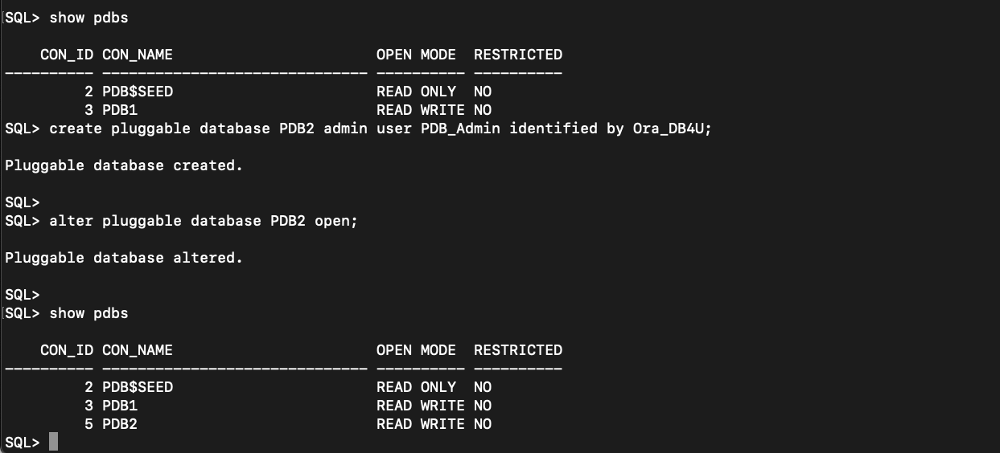


5. Change the session to point to **PDB2**.

    ```
    <copy>alter session set container = PDB2;</copy>
    ```

    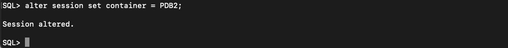

6. Grant **PDB_ADMIN** the necessary privileges and create the **USERS** tablespace for **PDB2**.

    ```
    <copy>
    grant sysdba to pdb_admin;
    create tablespace users datafile size 20M autoextend on next 1M maxsize unlimited segment space management auto;
    alter database default tablespace Users;
    grant create table, unlimited tablespace to pdb_admin;

    </copy>
    ````

   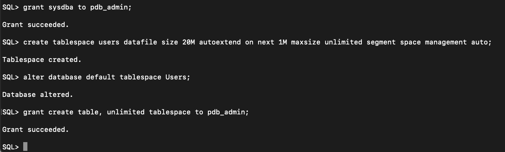

7. Connect as **PDB_ADMIN** to **PDB2**.

    ```
    <copy>connect pdb_admin/Ora_DB4U@localhost:1521/pdb2</copy>
    ```

8. Create a table **MY_TAB** in **PDB2**.

    ```
    <copy>
    create table my_tab(my_col number);
    insert into my_tab values (1);
    commit;
    </copy>
    ```

   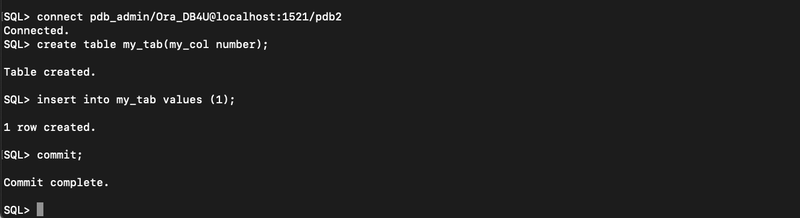

9. Change back to **SYS** in the container database **CDB1** and show the tablespaces and datafiles created.

    ```
    <copy>
    connect sys/Ora_DB4U@localhost:1521/cdb1 as sysdba

    with Containers as (
      select PDB_ID Con_ID, PDB_Name Con_Name from DBA_PDBs
      union
      select 1 Con_ID, 'CDB$ROOT' Con_Name from Dual)
    select
      Con_ID,
      Con_Name "Con_Name",
      Tablespace_Name "T'space_Name",
      File_Name "File_Name"
    from CDB_Data_Files inner join Containers using (Con_ID)
    union
    select
      Con_ID,
      Con_Name "Con_Name",
      Tablespace_Name "T'space_Name",
      File_Name "File_Name"
    from CDB_Temp_Files inner join Containers using (Con_ID)
    order by 1, 3
    /
    </copy>
    ```

    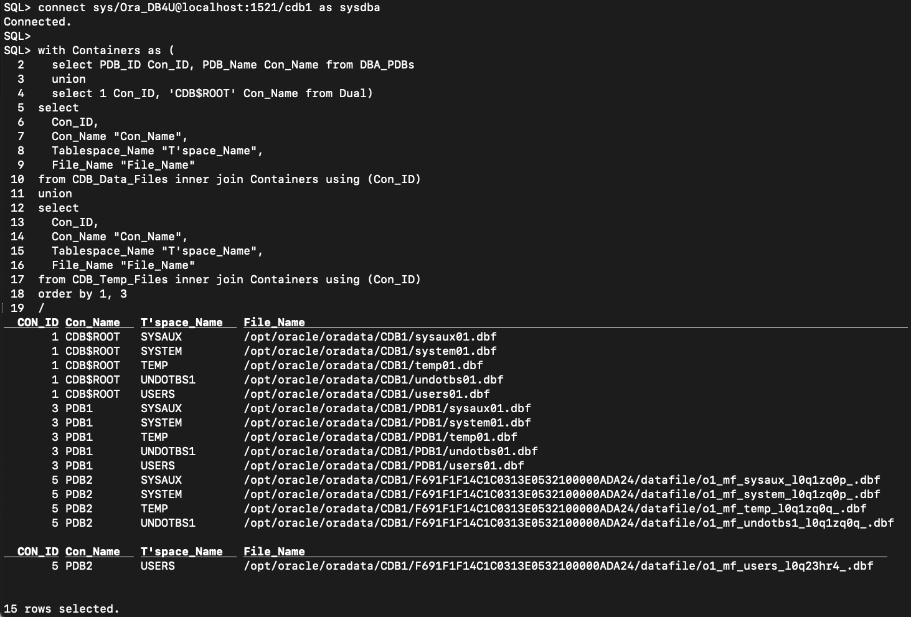

## Task 2: Clone a PDB
This lab covers the basics of how to clone a Pluggable Database (PDB).

The task you will do in this step is:
- Clone a pluggable database **PDB2** into **PDB3**

    If you're not already running SQLcl, then launch SQLcl and set the formatting to make the on-screen output easier to read.

    ```
    <copy>sql /nolog
    set sqlformat ANSICONSOLE
    </copy>
    ```

1. Connect to the container **CDB1**.

    ```
    <copy>connect sys/Ora_DB4U@localhost:1521/cdb1 as sysdba</copy>
    ```

2. Change the pluggable database **PDB2** to read only.

    ```
    <copy>alter pluggable database PDB2 open read only force;
    show pdbs</copy>
    ```

   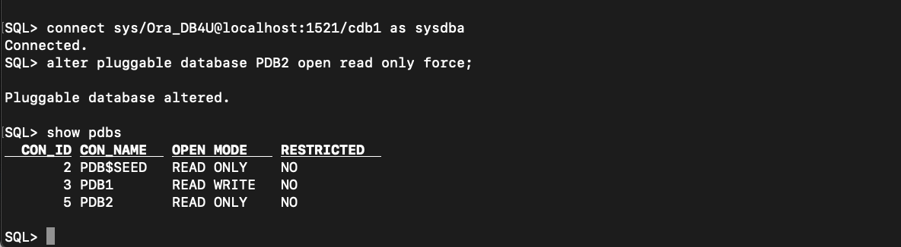


3. Create a pluggable database **PDB3** from the read only database **PDB2**.

    ```
    <copy>create pluggable database PDB3 from PDB2;
    alter pluggable database PDB3 open force;

    show pdbs
    </copy>
    ```

   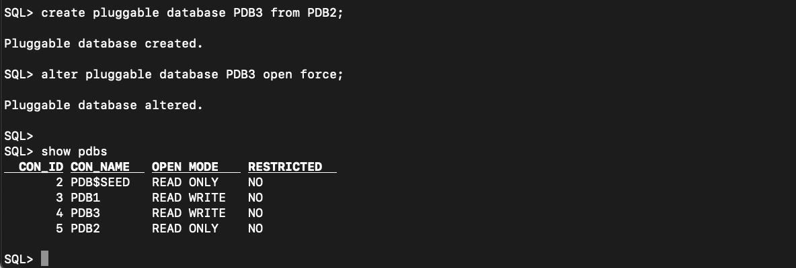

4. Change **PDB2** back to read write.

    ```
    <copy>alter pluggable database PDB2 open read write force;
    show pdbs</copy>
    ```


   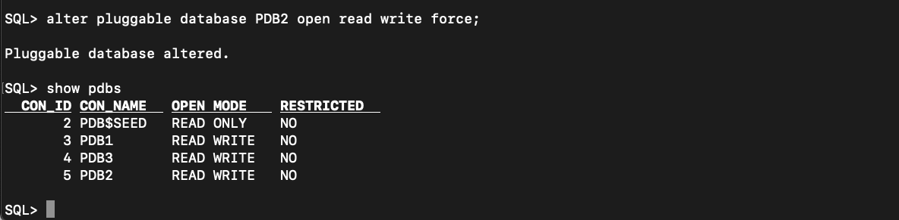

5. Connect to **PDB2** and show the table **MY_TAB**, then run the same SQL against **PDB3** to demonstrate that this is an exact copy of the source PDB.

    ```
    <copy>connect pdb_admin/Ora_DB4U@localhost:1521/pdb2</copy>
    ```

    ```
    <copy>select * from my_tab;</copy>
    ```

    ```
    <copy>connect pdb_admin/Ora_DB4U@localhost:1521/pdb3</copy>
    ```

    ```
    <copy>select * from my_tab;</copy>
    ```

   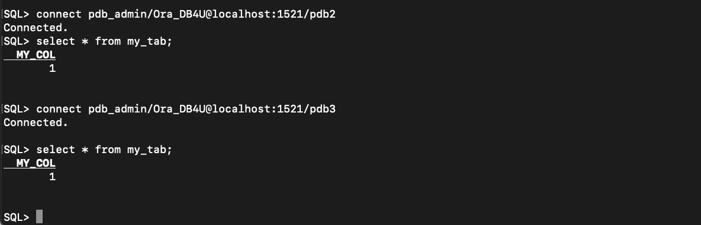

## Task 3: Unplug a PDB
This section reviews how to unplug a PDB from its container database (CDB) and save the PDB metadata into an XML manifest file.

The task you will do in this step is:
- Unplug **PDB3** from **CDB1**

    If you are not already running SQLcl, then launch SQLcl and set the formatting to make the on-screen output easier to read.

    ```
    <copy>sql /nolog
    set sqlformat ANSICONSOLE
    </copy>
    ```

1. Connect to the container **CDB1**.

    ```
    <copy>connect sys/Ora_DB4U@localhost:1521/cdb1 as sysdba</copy>
    ```

2. Unplug **PDB3** from **CDB1**.

    ```
    <copy>show pdbs</copy>
    ```

    ```
    <copy>alter pluggable database PDB3 close immediate;</copy>
    ```

    ```
    <copy>
    alter pluggable database PDB3
    unplug into
    '/opt/oracle/oradata/CDB1/pdb3.xml';
    show pdbs
    </copy>
    ```


   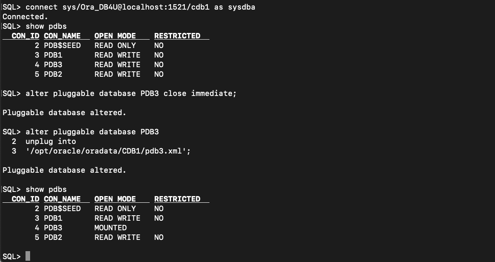

3. Remove **PDB3** from **CDB1** but keep the PDB datafiles for future use.

    ```
    <copy>drop pluggable database PDB3 keep datafiles;
    show pdbs
    </copy>
    ```

   

4. Show the datafiles in **CDB1** and note that files for PDB3 are no longer part of the container.
    ```
    <copy>
    with Containers as (
      select PDB_ID Con_ID, PDB_Name Con_Name from DBA_PDBs
      union
      select 1 Con_ID, 'CDB$ROOT' Con_Name from Dual)
    select
      Con_ID,
      Con_Name "Con_Name",
      Tablespace_Name "T'space_Name",
      File_Name "File_Name"
    from CDB_Data_Files inner join Containers using (Con_ID)
    union
    select
      Con_ID,
      Con_Name "Con_Name",
      Tablespace_Name "T'space_Name",
      File_Name "File_Name"
    from CDB_Temp_Files inner join Containers using (Con_ID)
    order by 1, 3
    /
    </copy>
    ```

    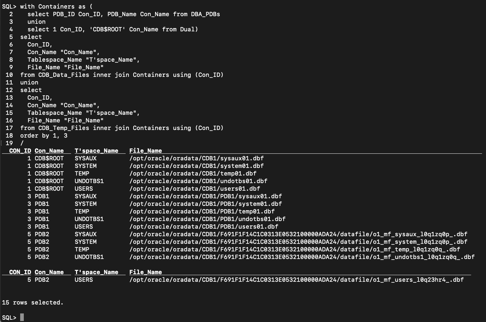

5. Look at the XML file for the pluggable database **PDB3**.  Take some time to review the information that is contained in a PDB manifest.

    ```
    <copy>host cat /opt/oracle/oradata/CDB1/pdb3.xml</copy>
    ```

    

## Task 4: Plug in a PDB
This section looks at how to plug in a PDB.

The task you will do in this step is:
- Plug the previously unplugged **PDB3** into **CDB2**

    If you are not already running SQLcl, then launch SQLcl and set the formatting to make the on-screen output easier to read.

    ```
    <copy>sql /nolog
    set sqlformat ANSICONSOLE
    </copy>
    ```

1. Connect to the container **CDB2** and run the "whoami.sql" script that was saved during Task 1.
    ```
    <copy>connect sys/Ora_DB4U@localhost:1522/cdb2 as sysdba</copy>
    ```

    ```
    <copy>@whoami.sql  </copy>
    ```

    ```
    <copy>show pdbs</copy>
    ```

    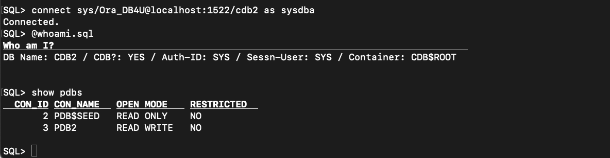

2. Check the compatibility of **PDB3** with **CDB2**.  If there are no errors then the PDB is compatible with the CDB.

    ```
    <copy>
    begin
      if not
        Sys.DBMS_PDB.Check_Plug_Compatibility
        ('/opt/oracle/oradata/CDB1/pdb3.xml')
      then
        Raise_Application_Error(-20000, 'Incompatible');
      end if;
    end;
    /
    </copy>
    ```

    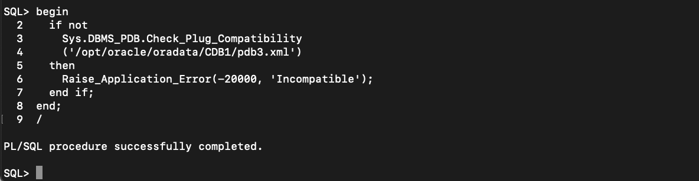

3. Plug **PDB3** into **CDB2**, moving the PDB's datafiles under the CDB2 storage location.

    ```
    <copy>
    create pluggable database PDB3
    using '/opt/oracle/oradata/CDB1/pdb3.xml'
    move;

    show pdbs
    </copy>
    ```

    ```
    <copy>alter pluggable database PDB3 open;
    show pdbs
    </copy>
    ```

    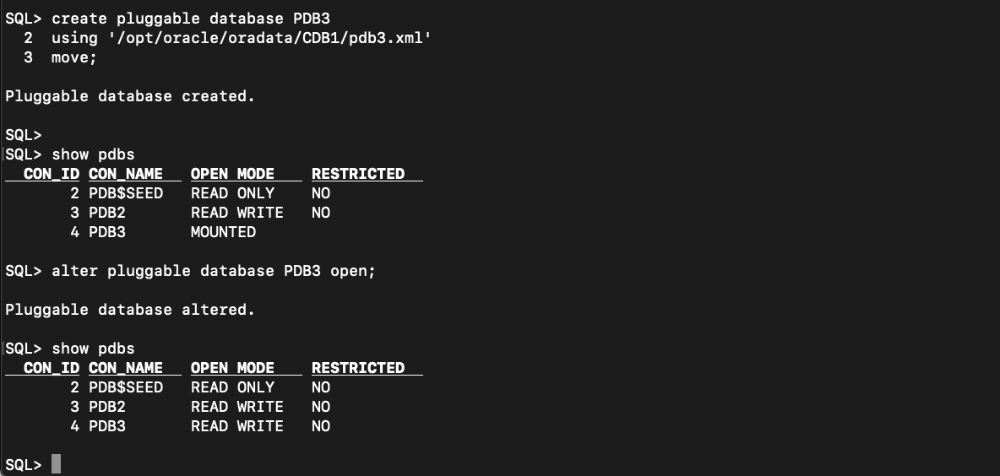

4. Review the datafiles in **CDB2**.

    ```
    <copy>


    with Containers as (
      select PDB_ID Con_ID, PDB_Name Con_Name from DBA_PDBs
      union
      select 1 Con_ID, 'CDB$ROOT' Con_Name from Dual)
    select
      Con_ID,
      Con_Name "Con_Name",
      Tablespace_Name "T'space_Name",
      File_Name "File_Name"
    from CDB_Data_Files inner join Containers using (Con_ID)
    union
    select
      Con_ID,
      Con_Name "Con_Name",
      Tablespace_Name "T'space_Name",
      File_Name "File_Name"
    from CDB_Temp_Files inner join Containers using (Con_ID)
    order by 1, 3
    /
    </copy>
    ```

    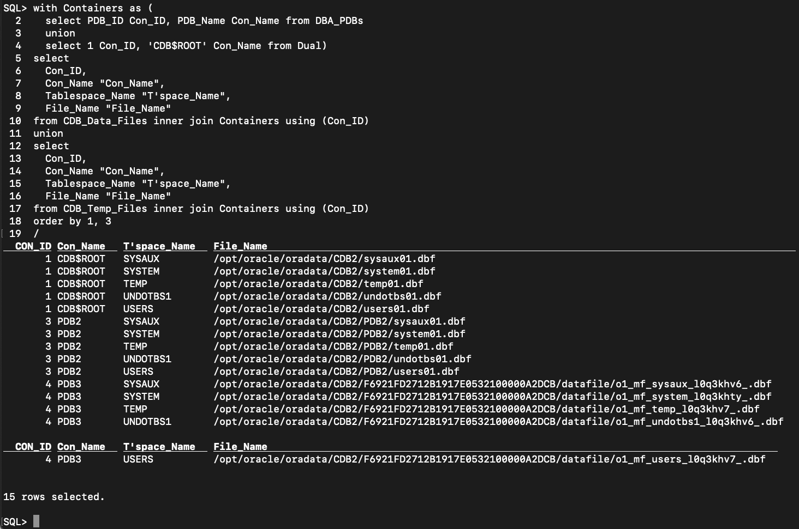

5. Connect as **PDB\_ADMIN** to **PDB3** and look at **MY\_TAB**.

    ```
    <copy>connect pdb_admin/Ora_DB4U@localhost:1522/pdb3</copy>
    ```

    ```
    <copy>select * from my_tab;</copy>
    ```

    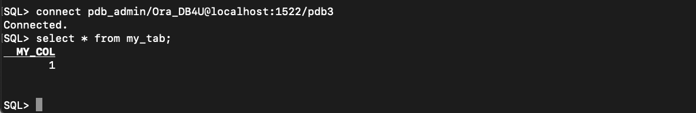

## Task 5: Drop a PDB
This section looks at how to drop a pluggable database.

The task you will do in this step is:
- Drop **PDB3** from **CDB2**

    If you are not already running SQLcl, then launch SQLcl and set the formatting to make the on-screen output easier to read.

    ```
    <copy>sql /nolog
    set sqlformat ANSICONSOLE
    </copy>
    ```

1. Connect to the container **CDB2**.

    ```
    <copy>connect sys/Ora_DB4U@localhost:1522/cdb2 as sysdba</copy>
    ```

2. Drop **PDB3** from **CDB2**.

    ```
    <copy>show pdbs</copy>
    ```

    ```
    <copy>alter pluggable database PDB3 close immediate;</copy>
    ```

    ```
    <copy>drop pluggable database PDB3 including datafiles;</copy>
    ```

    ```
    <copy>show pdbs</copy>
    ```

    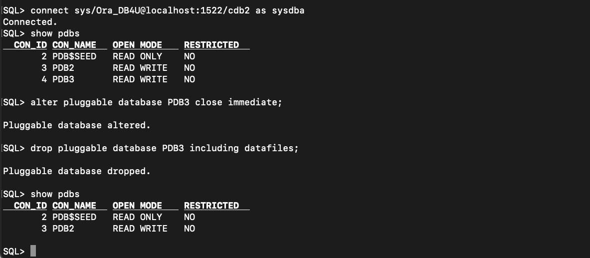


## Task 6: Clone an unplugged PDB
This section looks at how to create a gold copy of a PDB and clone it into another container.

The tasks you will do in this step are:
- Create a gold copy of **PDB2** in **CDB1** as **GOLDPDB**
- Clone **GOLDPDB** into **COPYPDB1** and **COPYPDB2** in **CDB2**

    If you are not already running SQLcl, then launch SQLcl and set the formatting to make the on-screen output easier to read.

    ```
    <copy>sql /nolog
    set sqlformat ANSICONSOLE
    </copy>
    ```

1. Connect to the container **CDB1**.
    ```
    <copy>connect sys/Ora_DB4U@localhost:1521/cdb1 as sysdba</copy>
    ```

2. Open database **PDB2** to read only.

    ```
    <copy>alter pluggable database PDB2 open read only force;</copy>
    ```

    ```
    <copy>show pdbs</copy>
    ```

    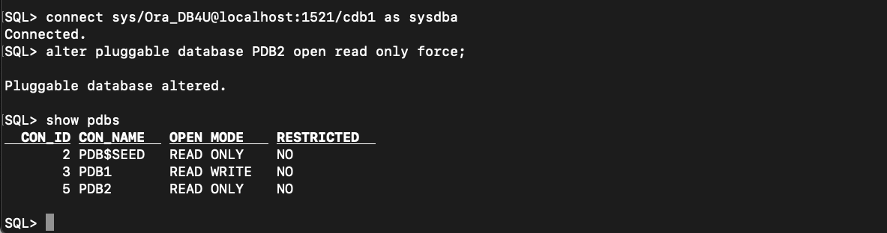

3. Create a pluggable database **GOLDPDB** from the read only database **PDB2** and then open it.

    ```
    <copy>create pluggable database GOLDPDB from PDB2;</copy>
    ```

    ```
    <copy>alter pluggable database GOLDPDB open force;</copy>
    ```

    ```
    <copy>show pdbs</copy>
    ```

    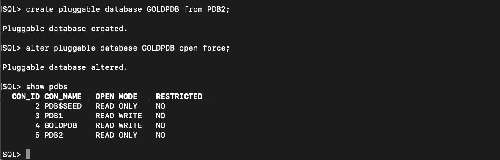

4. Change **PDB2** back to read write.

    ```
    <copy>alter pluggable database PDB2 open read write force;</copy>
    ```

    ```
    <copy>show pdbs</copy>
    ```

    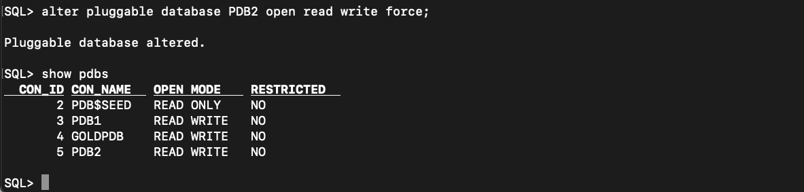

5. Unplug your gold copy PDB **GOLDPDB** from **CDB1**.


    ```
    <copy>alter pluggable database GOLDPDB close immediate;</copy>
    ```

    ```
    <copy>alter pluggable database GOLDPDB
    unplug into '/opt/oracle/oradata/CDB1/goldpdb.xml';</copy>
    ```

    ```
    <copy>show pdbs</copy>
    ```

    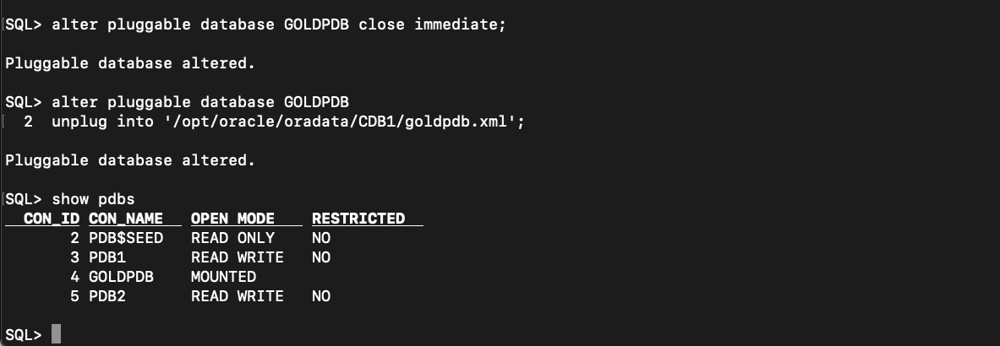

6. Remove **GOLDPDB** from **CDB1** and keep the datafiles for future use.

    ```
    <copy>drop pluggable database GOLDPDB keep datafiles;</copy>
    ```

    ```
    <copy>show pdbs</copy>
    ```

    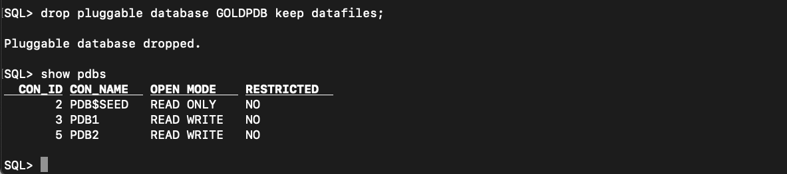

7. We want to clone our gold image PDB into another container database. Connect to **CDB2** and validate **GOLDPDB** is compatible with **CDB2**.

    ```
    <copy>connect sys/Ora_DB4U@localhost:1522/cdb2 as sysdba</copy>
    ```

    ```
    <copy>
    begin
      if not
        Sys.DBMS_PDB.Check_Plug_Compatibility
    ('/opt/oracle/oradata/CDB1/goldpdb.xml')
      then
        Raise_Application_Error(-20000, 'Incompatible');
      end if;
    end;
    /
    </copy>
    ```

    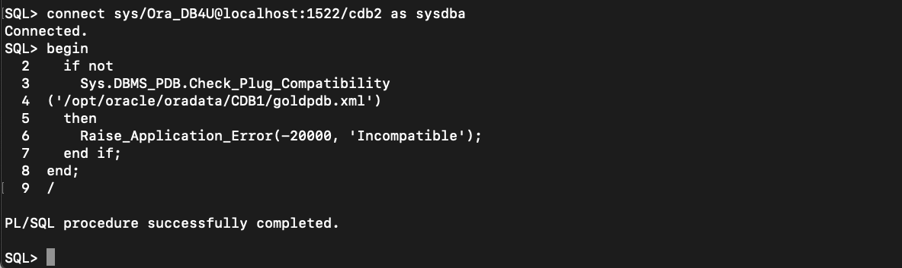

8. Create a clone of our unplugged **GOLDPDB** as **COPYPDB1**.

    ```
    <copy>
    create pluggable database COPYPDB1 as clone
    using '/opt/oracle/oradata/CDB1/goldpdb.xml'
    storage (maxsize unlimited max_shared_temp_size unlimited)
    copy;
    </copy>
    ```

    ```
    <copy>show pdbs</copy>
    ```

    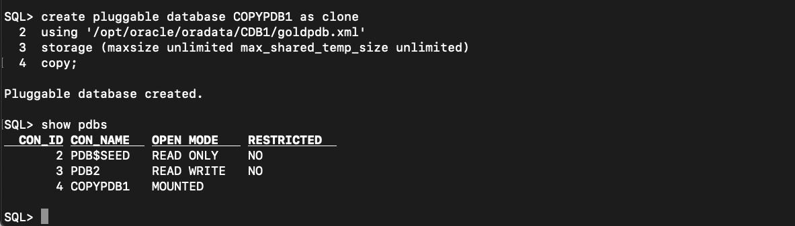

9. Create another clone of **GOLDPDB** as **COPYPDB2**.

    ```
    <copy>
    create pluggable database COPYPDB2 as clone
    using '/opt/oracle/oradata/CDB1/goldpdb.xml'
    storage (maxsize unlimited max_shared_temp_size unlimited)
    copy;
    </copy>
    ```

    ```
    <copy>show pdbs</copy>
    ```

    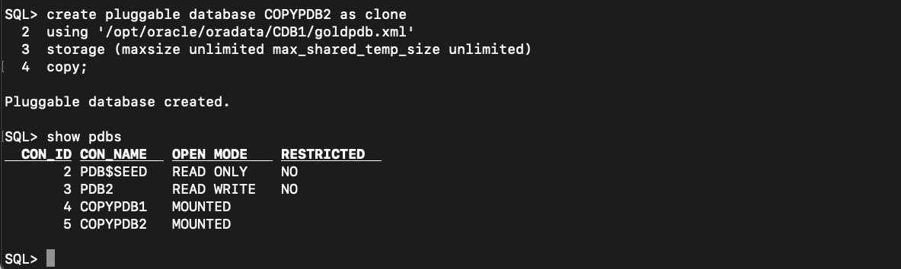

10. Open all pluggable databases in the container database **CDB2**.

    ```
    <copy>alter pluggable database all open;</copy>
    ```

    ```
    <copy>show pdbs</copy>
    ```

    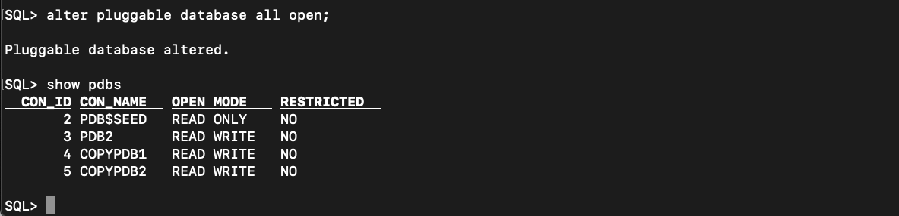

11. Look carefully at the GUID for the two cloned databases. Since they are cloned from the same unplugged PDB, they are very similar.

    ```
    <copy>
    select PDB_Name "PDB Name", GUID
    from DBA_PDBs
    order by Creation_Scn
    /
    </copy>
    ```

    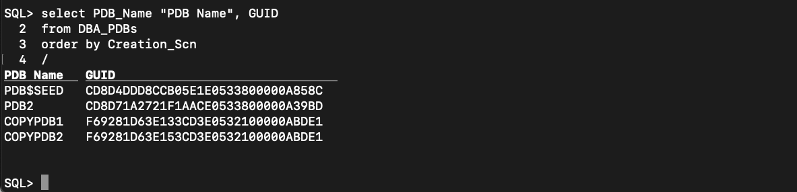

## Task 7: PDB hot clones
This section looks at how to "hot clone" a pluggable database. Since Database 12.2, the capability exists to clone a PDB while it is open read write.

  [](youtube:djp-ogM71oE)

What you will do in this task:
- Create a pluggable database **OE** in the container database **CDB1**
- Create a load against the pluggable database **OE**
- Create a hot clone **OE_DEV** in the container database **CDB2** from the pluggable database **OE**

    If you are not already running SQLcl, then launch SQLcl and set the formatting to make the on-screen output easier to read.

    ```
    <copy>sql /nolog
    set sqlformat ANSICONSOLE
    </copy>
    ```

1. Connect to the container **CDB1**.
    ```
    <copy>connect sys/Ora_DB4U@localhost:1521/cdb1 as sysdba</copy>
    ```

2. Create a pluggable database **OE** with an admin user of **SOE**.

    ```
    <copy>create pluggable database oe admin user soe identified by soe roles=(dba);</copy>
    ```

    ```
    <copy>alter pluggable database oe open;</copy>
    ```

    ```
    <copy>show pdbs</copy>
    ```

    ```
    <copy>alter session set container = oe;</copy>
    ```

    ```
    <copy>grant create session, create table to soe;</copy>
    ```

    ```
    <copy>
    create bigfile tablespace users;
    alter user soe quota unlimited on users;
    alter user soe default tablespace users;
    </copy>
    ```

    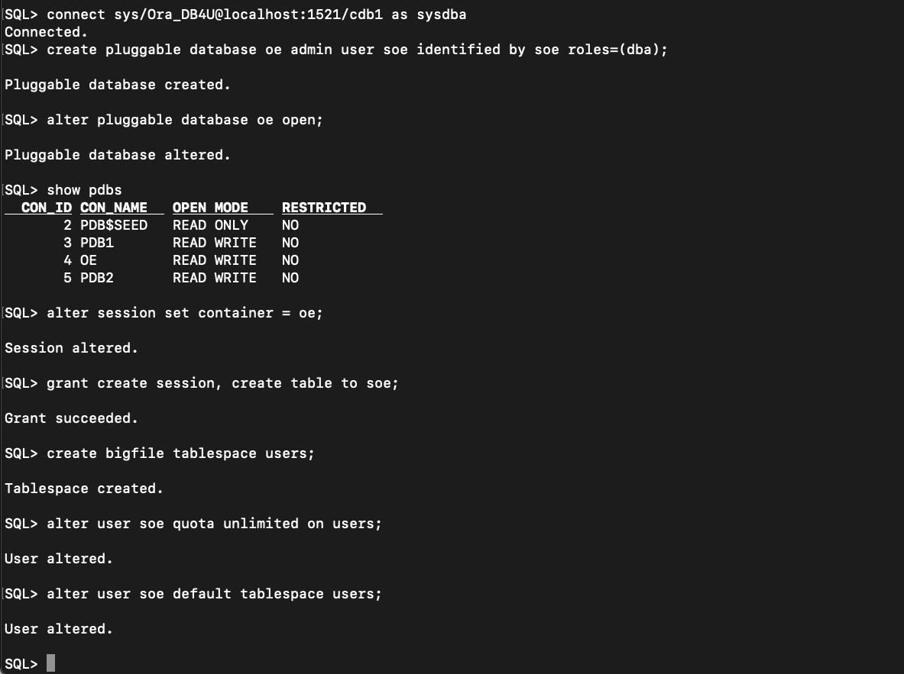

3. Connect as **SOE** and create the **sale_orders** table.

    ```
    <copy>connect soe/soe@localhost:1521/oe</copy>
    ```

    ```
    <copy>
    CREATE TABLE sale_orders
    (ORDER_ID      number,
    ORDER_DATE    date,
    CUSTOMER_ID   number);
    </copy>
    ```

    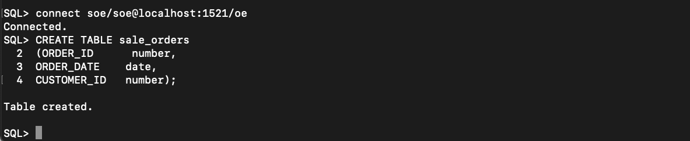

 4. Open a new terminal window or tab within your remote desktop session, then navigate to */home/oracle/labs/multitenant* and execute *write-load.sh*. Keep this window open and running throughout for the rest of this lab.

    ```
    <copy>cd /home/oracle/labs/multitenant</copy>
    ```

    ```
    <copy>./write-load.sh</copy>
    ```

    

    Leave this window open and running for the next few steps in this lab.

5. Go back to your original terminal window. Connect to **CDB2** and create the pluggable **OE\_DEV** from the database link **oe@cdb1\_link**.

    ```
    <copy>connect sys/Ora_DB4U@localhost:1522/cdb2 as sysdba</copy>
    ```

    ```
    <copy>create pluggable database oe_dev from oe@cdb1_link;</copy>
    ```

    ```
    <copy>alter pluggable database oe_dev open;</copy>
    ```

    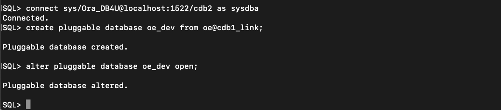

6. Connect as **SOE** to **OE\_DEV** and check the number of records in the **sale\_orders** table.

    ```
    <copy>connect soe/soe@localhost:1522/oe_dev</copy>
    ```

    ```
    <copy>select count(*) from sale_orders;</copy>
    ```

    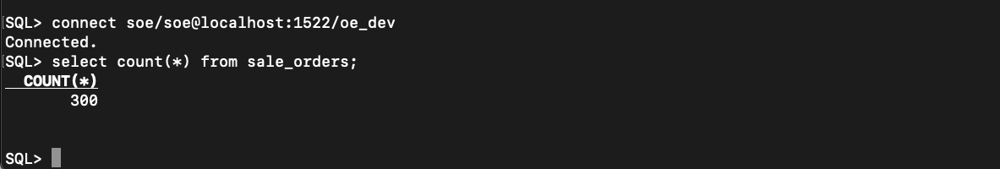

7. Connect as **SOE** to **OE** and check the number of records in the **sale_orders** table. Since the load script is running against this database, there should be more rows in the table than in the PDB you created as a hot clone of **OE**.

    ```
    <copy>connect soe/soe@localhost:1521/oe</copy>
    ```

    ```
    <copy>select count(*) from sale_orders;</copy>
    ```

    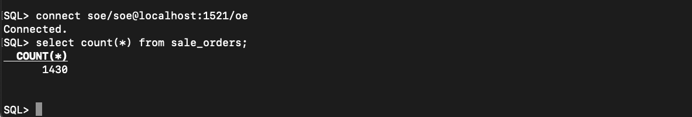

8. Close and remove the **OE_DEV** pluggable database.

    ```
    <copy>connect sys/Ora_DB4U@localhost:1522/cdb2 as sysdba</copy>
    ```

    ```
    <copy>alter pluggable database oe_dev close;</copy>
    ```

    ```
    <copy>drop pluggable database oe_dev including datafiles;</copy>
    ```

    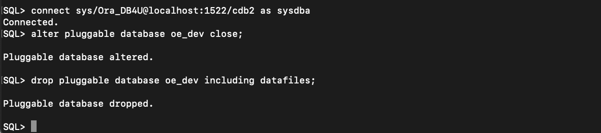

9. Leave the **OE** pluggable database open with the load running against it for the rest of the steps in this lab.

You can see that the clone of the pluggable database worked without having to stop the load on the source database. In the next step, you will look at how to refresh a clone.

## Task 8: PDB refresh
This section looks at how to hot clone a pluggable database, open it for read only and then refresh the database.

  [](youtube:L9l7v6dH-e8)

The tasks you will do in this step are:
- Leverage the **OE** pluggable database from the previous step with the load still running against it.
- Create a hot clone **OE_REFRESH** in the container database **CDB2** from the pluggable database **OE**
- Refresh the **OE_REFRESH** pluggable database.

    If you are not already running SQLcl, then launch SQLcl and set the formatting to make the on-screen output easier to read.

    ```
    <copy>sql /nolog
    set sqlformat ANSICONSOLE
    </copy>
    ```

1. Connect to the container **CDB2**.
    ```
    <copy>connect sys/Ora_DB4U@localhost:1522/cdb2 as sysdba</copy>
    ```

2. Create a pluggable database **OE\_REFRESH** with manual refresh mode from the database link **oe@cdb1\_link**.

    ```
    <copy>create pluggable database oe_refresh from oe@cdb1_link refresh mode manual;</copy>
    ```

    ```
    <copy>alter pluggable database oe_refresh open read only;</copy>
    ```

    ```
    <copy>show pdbs</copy>
    ```
    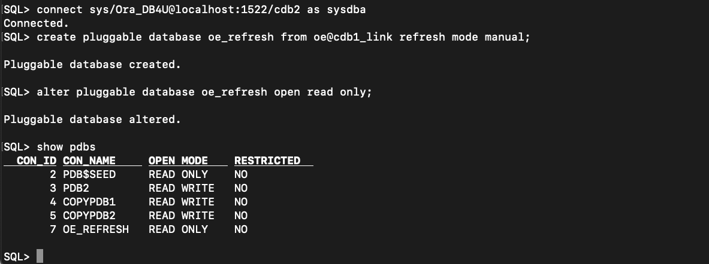

3. Connect as **SOE** to the pluggable database **OE\_REFRESH** and count the number of records in the **sale\_orders** table.

    ```
    <copy>conn soe/soe@localhost:1522/oe_refresh</copy>
    ```

    ```
    <copy>select count(*) from sale_orders;</copy>
    ```

    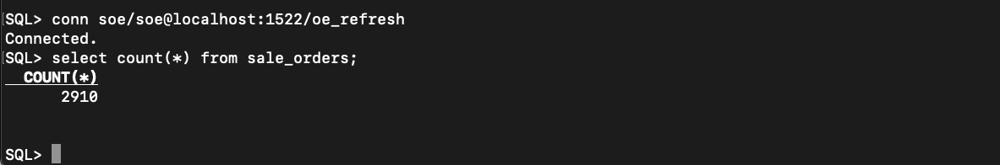

4. Close the pluggable database **OE_REFRESH** and refresh it from the **OE** pluggable database.

    ```
    <copy>conn sys/Ora_DB4U@localhost:1522/oe_refresh as sysdba</copy>
    ```

    ```
    <copy>alter pluggable database oe_refresh close;</copy>
    ```

    ```
    <copy>alter session set container=oe_refresh;</copy>
    ```

    ```
    <copy>alter pluggable database oe_refresh refresh;</copy>
    ```

    ```
    <copy>alter pluggable database oe_refresh open read only;</copy>
    ```

    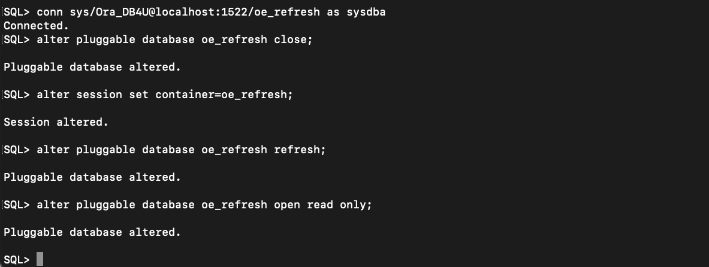

5. Connect as **SOE** to the pluggable database **OE\_REFRESH** and count the number of records in the **sale\_orders** table. You should see the number of records has changed following the refresh from the source PDB.

    ```
    <copy>conn soe/soe@localhost:1522/oe_refresh</copy>
    ```

    ```
    <copy>select count(*) from sale_orders;</copy>
    ```

    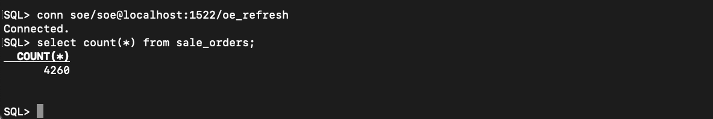

7. Leave the **OE** pluggable database open with the load running against it for the rest of this lab.

## Task 9: PDB snapshot COPY

You can create a snapshot copy PDB by executing a CREATE PLUGGABLE DATABASE … FROM … SNAPSHOT COPY statement. The source PDB is specified in the FROM clause.

A snapshot copy reduces the time required to create the clone because it does not include a complete copy of the source data files. Furthermore, the snapshot copy PDB occupies a fraction of the space of the source PDB. The snapshot copy can be created in any filesystem like ext3, ext4, ntfs for local disks. It also supports NFS, ZFS, ACFS, and ASM sparse disk groups on Oracle Exadata.

The two main requirements for snapshot copy to work on our Linux filesystem are:

- CLONEDB initialization parameter should be set to TRUE.
- The source PDB is in Read Only mode.

    Refreshable PDBs need to be in **read only** mode in order to refresh. You can quickly create a Snapshot Clone PDB from the refreshable PDB and use it in reporting, test and dev environments. In our exercise, we will create a **Snapshot Copy PDB** from the read only PDB **OE_REFRESH**.

1. If you're already running SQLcl, then **exit** from SQLcl and set the environment to CDB2.

    ```
    <copy>
    exit
    </copy>
    ```
    ```
    <copy>
    . ~/.set-env-db.sh CDB2
    </copy>
    ```

    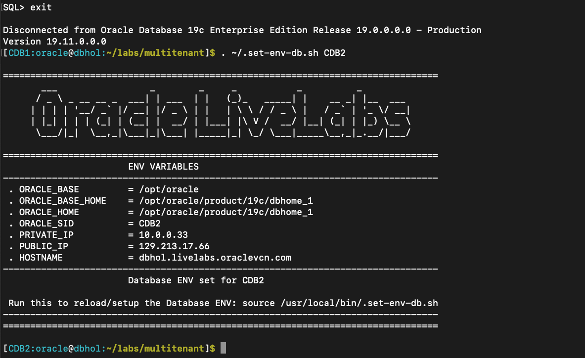

2. Launch SQLcl, connect to CDB2 as SYSDBA. Set the SQLcl formatting to make the on-screen output easier to read. Run the "whoami" script to verify the CDB connection.
    ```
    <copy>
    sql / as sysdba
    </copy>
    ```

    ```
    <copy>
    set sqlformat ANSICONSOLE
    @whoami
    </copy>
    ```

    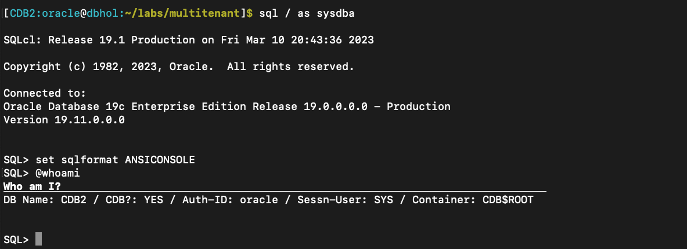

3. Show the status of the PDBs and also verify the setting of the CLONEDB initialization parameter.

    ```
    <copy>
    show pdbs
    show parameter CLONEDB
    </copy>
    ```

    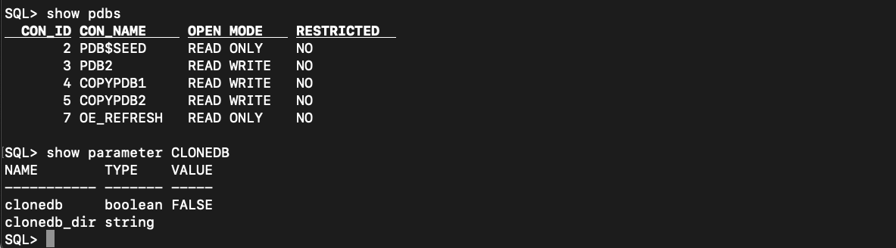


4. Set the static initialization parameter CLONEDB = TRUE and restart CDB2.

    ```
    <copy>
    alter system set CLONEDB = TRUE scope = spfile;
    shutdown immediate
    startup
    show parameter CLONEDB
    </copy>
    ```

    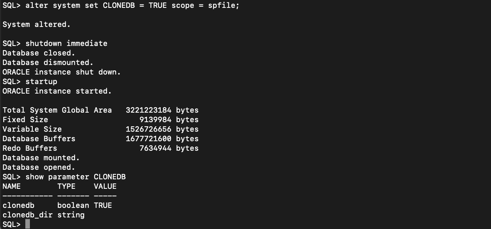

5. Snapshot Copy PDBs must be created from a read-only source, so open PDB **OE\_REFRESH** read only and create a Snapshot Copy PDB named **OE_SNAP**.  

    ```
    <copy>
    alter pluggable database OE_REFRESH open read only force;
    create pluggable database OE_SNAP from OE_REFRESH snapshot copy;
    show pdbs
    alter pluggable database OE_SNAP open;
    show pdbs
    </copy>
    ```

    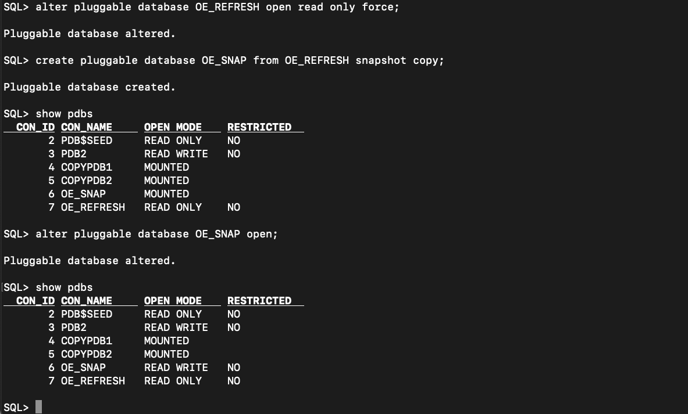

6. A PDB Snapshot Copy is a "thin" clone that reads from the source PDB but any DML changes will be persisted in the snapshot copy PDB. Insert a row into the **OE_SNAP** database.

    ```
    <copy>
    connect soe/soe@localhost:1522/oe_snap
    select count(*) from sale_orders;
    insert into sale_orders VALUES (1, SYSDATE, 30);
    commit;
    select count(*) from sale_orders;
    </copy>
    ```

    

7. Now generate a couple of OS commands to show that the **OE\_SNAP** PDB uses a fraction of the space compared to the source **OE_REFRESH** database.

    ```
    <copy>
    connect sys/Ora_DB4U@//localhost:1522/cdb2 as sysdba
    show pdbs
    select distinct 'host du -h '||SUBSTR(NAME,1,INSTR(NAME,'datafile')+8 ) du_output
     from v$datafile  
     where con_id in
     (select con_id from v$pdbs where name in ('OE_REFRESH','OE_SNAP'));
    </copy>
    ```

    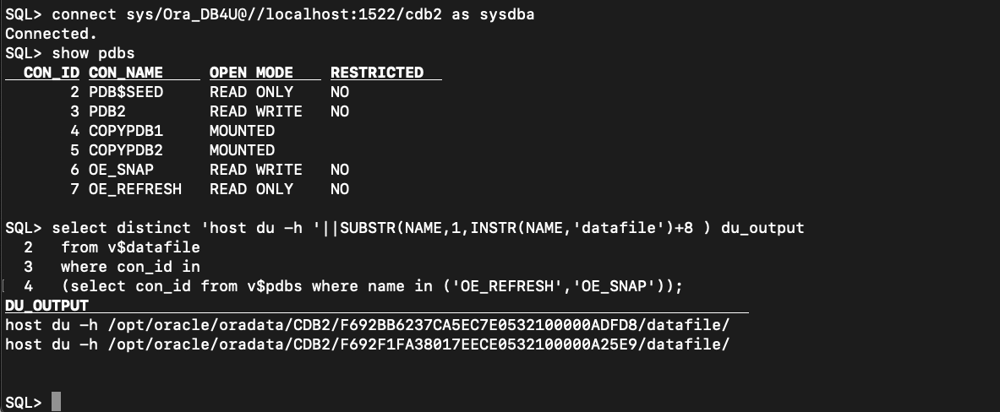

8. Copy and paste each of the query output lines separately, to see the difference in disk space consumed between the "thin" PDB Snapshot Copy and the source PDB.

    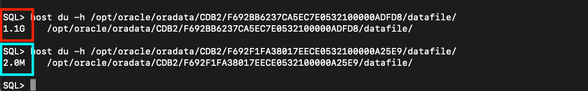

9. Close and remove the **OE\_REFRESH** and **OE_SNAP** pluggable databases.

    ```
    <copy>
    show pdbs
    alter pluggable database oe_snap close;
    drop pluggable database oe_snap including datafiles;
    alter pluggable database oe_refresh close;
    drop pluggable database oe_refresh including datafiles;
    show pdbs
    </copy>
    ```

    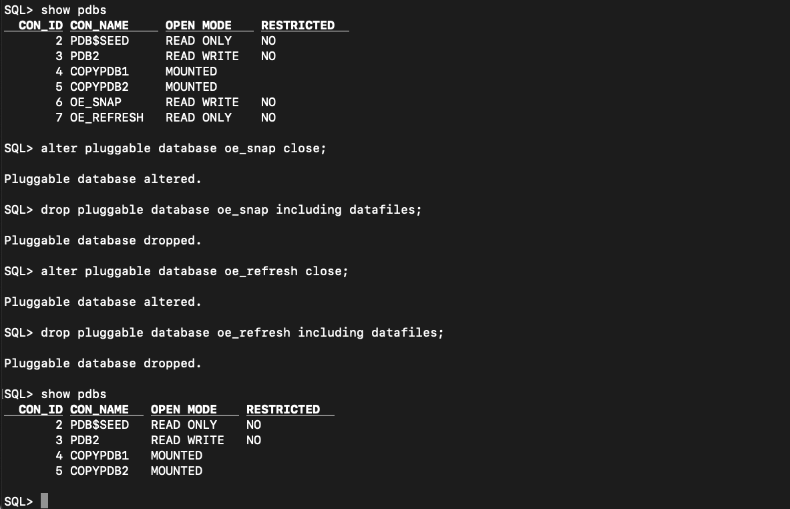


## Task 10: PDB relocation

This section looks at how to relocate a pluggable database from one container database to another. One important note: either both container databases need to be using the same listener in order for sessions to keep connecting, or local and remote listeners need to be set up correctly. For this lab we will change **CDB2** to use the same listener as **CDB1**.

The tasks you will do in this step are:
- Change **CDB2** to use the same listener as **CDB1**
- Relocate the pluggable database **OE** from **CDB1** to **CDB2** with the load still running
- Once **OE** is open the load should continue working

1. In the **other terminal window** that was opened in Lab Task 8, make sure the write-load script is still running. If not, you may need to restart the shell script.

    ```
    <copy>./write-load.sh </copy>
    ```

2. Connect to the container **CDB2** and update the LOCAL_LISTENER parameter to point to the listener used by **CDB1**.
    ```
    <copy>conn sys/Ora_DB4U@localhost:1522/cdb2 as sysdba</copy>
    ```

    ```
    <copy>alter system set local_listener='LISTENER_CDB1' scope=both;</copy>
    ```

    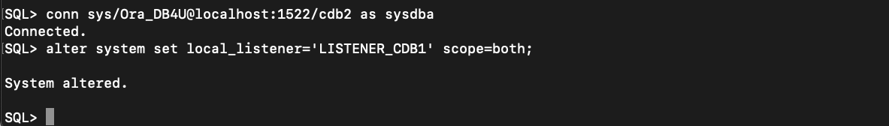

3. Connect to **CDB2** using the shared listener and relocate **OE** using the database link **oe@cdb1_link**.  

    ```
    <copy>conn sys/Ora_DB4U@localhost:1521/cdb2 as sysdba;</copy>
    ```

    ```
    <copy>create pluggable database oe from oe@cdb1_link relocate;
    alter pluggable database oe open;
    show pdbs</copy>
    ```

    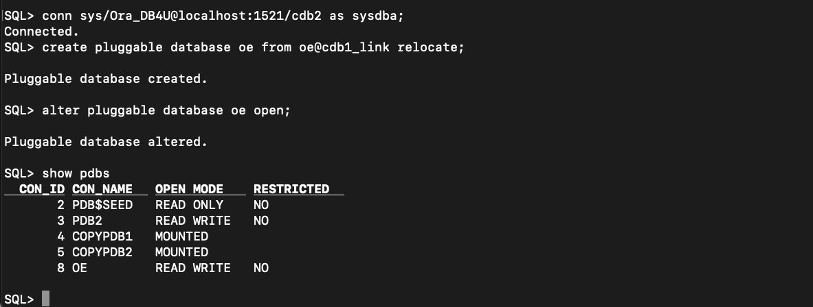

3. Connect to **CDB1** and see what pluggable databases exist there.

    ```
    <copy>conn sys/Ora_DB4U@localhost:1521/cdb1 as sysdba</copy>
    ```

    ```
    <copy>show pdbs</copy>
    ```

    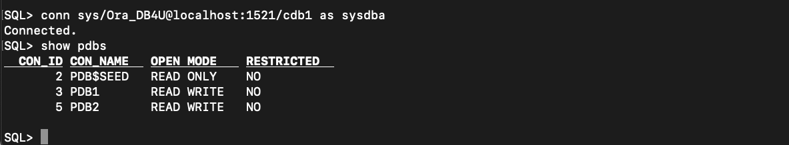

4.  Check the other terminal window where the load program is running. After a timeout, the load program will resume on its own. If you don't want to wait, enter CTRL-C to break out of the connection timeout and the load program should continue. Note that the output now shows it is connected to the database in container **CDB2**. In real-world scenarios, Oracle customers may be able to leverage **Application Continuity**. Oracle **Application Continuity** masks outages from end users and applications by recovering the in-flight work for impacted database sessions following outages. You can learn more about **Application Continuity** [at the Oracle Application Continuity web page](https://www.oracle.com/database/technologies/high-availability/app-continuity.html).  

    The load program isn't needed anymore, so CTRL-C out of that program and exit from the second terminal window.

5. If you are going to continue to use this environment then you will need to change **CDB2** back to use **LISTENER_CDB2**.

    ```
    <copy>conn sys/Ora_DB4U@localhost:1521/cdb2 as sysdba</copy>
    ```

    ```
    <copy>alter system set local_listener='LISTENER_CDB2' scope=both;</copy>
    ```

    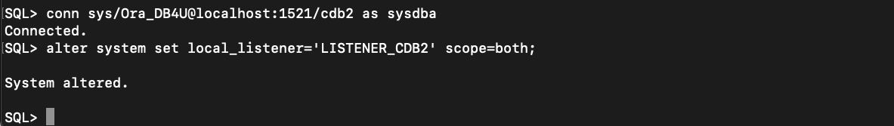

## Task 11: Lab cleanup

1. Exit from the SQL command prompt and reset the container databases back to their original ports. If any errors about dropping databases appear, you can ignore them.

    ```
    <copy>
    exit
    </copy>
    ```
    ```
    <copy>
    ./resetCDB.sh
    </copy>
    ```

    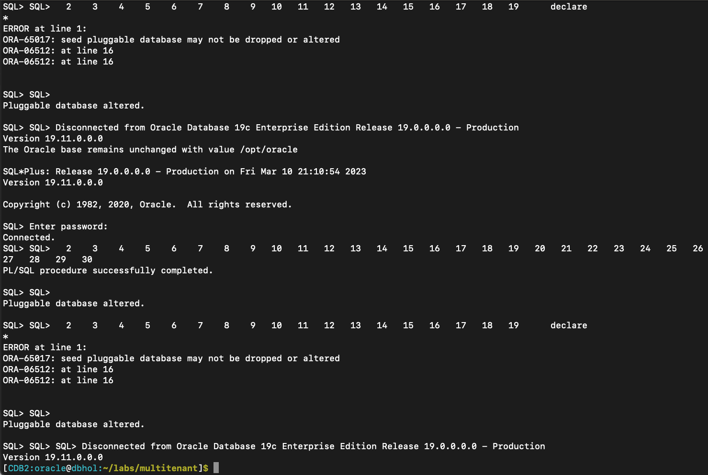

Now you've had a chance to try out the Multitenant option. You were able to create, clone, plug and unplug a pluggable database. You were then able to accomplish some advanced tasks, such as hot cloning and PDB relocation, that you could leverage to more easily maintain a large multitenant environment.

Please *proceed to the next lab*.

## Acknowledgements

- **Author** - Patrick Wheeler, VP, Multitenant Product Management
- **Contributors** -  Joseph Bernens, David Start, Anoosha Pilli, Brian McGraw, Quintin Hill, Rene Fontcha
- **Last Updated By/Date** - Joseph Bernens, Principal Solution Engineer, NACT Solution Engineering / February 2023
