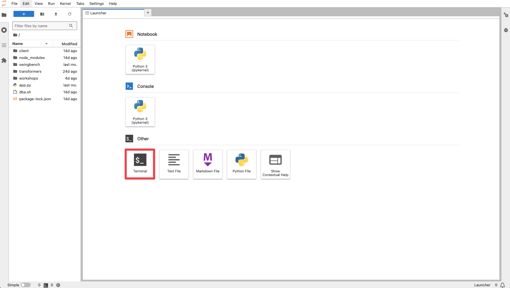

# Connect to the Oracle Database 23ai Server

## Introduction

In this lab we will review and startup all components required to successfully run this workshop.

*Estimated Lab Time:* 15 Minutes.


### Objectives
- Initialize the workshop environment.

### Prerequisites
This lab assumes you have completed:
- Lab: Get Started - Task 2: Access JupyterLab Environment 

**NOTE:** *When doing Copy/Paste using the convenient* **Copy** *function used throughout the guide, you must hit the* **ENTER** *key after pasting. Otherwise the last line will remain in the buffer until you hit* **ENTER!**


## Task 1: Log in to the Oracle Database 23ai server

After you log in to JupyterLabs, you are presented with different options to proceed.
In this workshop, we will only relay on the the terminal.

1. Open the Terminal in JupyterLabs

    

2. Run the dba.sh script to login to the database server

    ```
    <copy>
    ./dba.sh
    </copy>
    ```

3. We are using ssh to connect in between servers. When you connect for the first time, you will see a message that the authenticity of the host cannot be established. Please confirm by typing 'yes'.

    ```
    <copy>
    yes
    </copy>
    ```

4. You should see a bash prompt in the terminal which confirms that are successfully logged into the database server.

    


## Task 2: Validate That Required Processes are Up and Running.

1. Now with access to your remote desktop session, proceed as indicated below to validate your environment before you start executing the subsequent labs. The following Processes should be up and running:

    - Database Listeners
        - LISTENER (1521)
        - LISTENER_CDB2 (1522)
    - Database Server Instances
        - CDB1
        - CDB2


2. Click the *Terminal* icon on the desktop to launch a session, then run the following to validate that expected processes are up.

    ```bash
    <copy>
    ps -ef|grep LIST|grep -v grep
    ps -ef|grep ora_|grep pmon|grep -v grep
    </copy>
    ```

    

    If all expected processes are shown in your output as seen above, then your environment is ready for the next task.  

3. If you see questionable output(s), failure or down component(s), refer to the appendix section to restart the service accordingly

<!-- ## Task 3: Initialize Database for Multitenant Use Cases

1. Your workshop environment comes preloaded with scripts you may need in part of the workshop. The instructions will describe which scripts you need to execute. For now, please note that the scripts are preloaded on the database server and can be found in the following path: 

    ```bash
    /home/oracle/labs/workshops/multitenant
    ```

    You can easily change to the directory by typing:

    ```bash
    <copy>
    cd /home/oracle/labs/workshops/multitenant
    </copy>
    ``` -->


You may now proceed to the next lab.

## Acknowledgements
* **Author** - Kevin Lazarz, Senior Manager, Database Product Management
* **Last Updated By/Date** - Kevin Lazarz, August 2024
