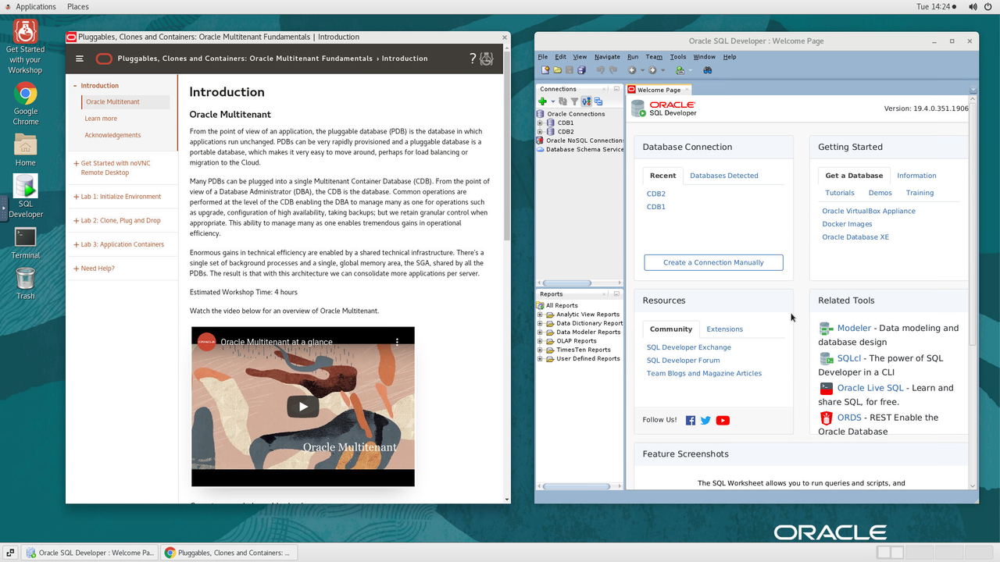
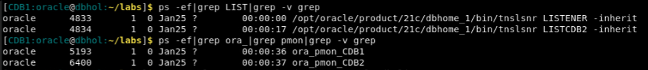
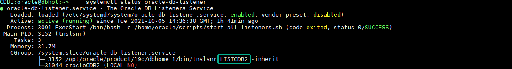
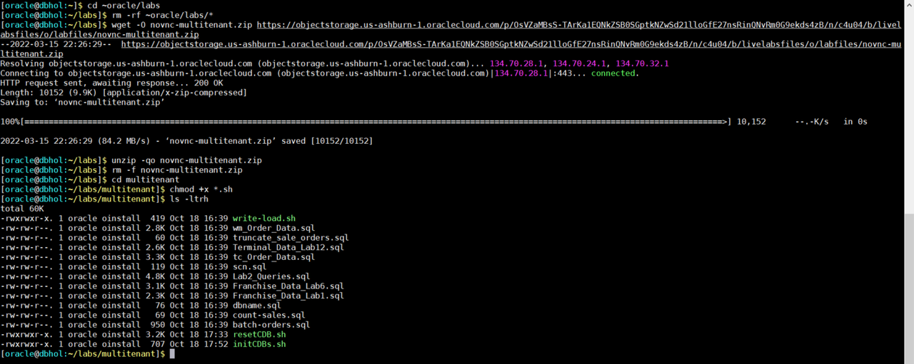

# Initialize Environment

## Introduction

In this lab we will review and startup all components required to successfully run this workshop.

*Estimated Lab Time:* 30 Minutes.

### Objectives
- Initialize the workshop environment.

### Prerequisites
This lab assumes you have:
- A Free Tier, Paid or LiveLabs Oracle Cloud account
- You have completed:
    - Lab: Prepare Setup (*Free-tier* and *Paid Tenants* only)
    - Lab: Environment Setup

**NOTE:** *When doing Copy/Paste using the convenient* **Copy** *function used throughout the guide, you must hit the* **ENTER** *key after pasting. Otherwise the last line will remain in the buffer until you hit* **ENTER!**

## Task 1: Validate That Required Processes are Up and Running.

1. Now with access to your remote desktop session, proceed as indicated below to validate your environment before you start executing the subsequent labs. The following Processes should be up and running:

    - Database Listeners
        - LISTENER (1521)
        - LISTCDB2 (1522)
    - Database Server Instances
        - CDB1
        - CDB2

    You may test database connectivity clicking on the *+* sign next to the Database(s) as shown below in the *SQL Developer Oracle Connections* panel.

    

2. Click the *Terminal* icon on the desktop to launch a session, then run the following to validate that expected processes are up.

    ```
    <copy>
    ps -ef|grep LIST|grep -v grep
    ps -ef|grep ora_|grep pmon|grep -v grep
    systemctl status oracle-database
    systemctl status oracle-db-listener
    </copy>
    ```

    
    
    

    If all expected processes are shown in your output as seen above, then your environment is ready for the next task.  

3. If you see questionable output(s), failure or down component(s), restart the service accordingly

    ```
    <copy>
    sudo systemctl restart oracle-database
    sudo systemctl restart oracle-db-listener
    </copy>
    ```

## Task 2: Initialize Database for Multitenant Use Cases

1. From your remote desktop session as user *oracle*, run the block below to refresh labs artifacts

    ```
    <copy>
    clear
    cd ~oracle/labs
    rm -rf ~oracle/labs/*
    wget -O novnc-multitenant.zip https://objectstorage.us-ashburn-1.oraclecloud.com/p/OsVZaMBsS-TArKa1EQNkZSB0SGptkNZwSd21lloGfE27nsRinQNvRm0G9ekds4zB/n/c4u04/b/livelabsfiles/o/labfiles/novnc-multitenant.zip
    unzip -qo novnc-multitenant.zip
    rm -f novnc-multitenant.zip
    cd multitenant
    chmod +x *.sh
    ls -ltrh
    </copy>
    ```

    

You may now [proceed to the next lab](#next).

## Appendix 1: Managing Startup Services

1. Database service (All databases and Standard Listener).

    - Start

    ```
    <copy>
    sudo systemctl start oracle-database
    </copy>
    ```
    - Stop

    ```
    <copy>
    sudo systemctl stop oracle-database
    </copy>
    ```

    - Status

    ```
    <copy>
    systemctl status oracle-database
    </copy>
    ```

    - Restart

    ```
    <copy>
    sudo systemctl restart oracle-database
    </copy>
    ```

2. Database service (Non-Standard Listeners).

    - Start

    ```
    <copy>
    sudo systemctl start oracle-db-listener
    </copy>
    ```
    - Stop

    ```
    <copy>
    sudo systemctl stop oracle-db-listener
    </copy>
    ```

    - Status

    ```
    <copy>
    systemctl status oracle-db-listener
    </copy>
    ```

    - Restart

    ```
    <copy>
    sudo systemctl restart oracle-db-listener
    </copy>
    ```

## Acknowledgements
* **Author** - Andy Rivenes, Sr. Principal Product Manager, Oracle Database In-Memory
* **Contributors** - Kay Malcolm, Didi Han, Rene Fontcha
* **Last Updated By/Date** - Rene Fontcha, LiveLabs Platform Lead, NA Technology, March 2022
