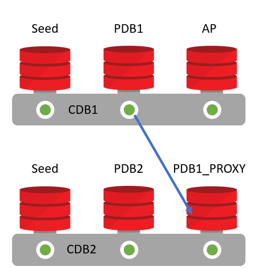

# Hands-on with Multitenant (Advanced)

## Lab Introduction

This is a series of 12 hands-on labs designed to familiarize you with the Application Container functionality of Oracle Multitenant. In these labs, We will dive into the concepts of Application container and Proxy PDBs.

### Setup

### Lab Assumptions

- Each participant has been provided a username and password to the tenancy c4u04.
- Each participant has completed the Environment Setup lab.
- Each participant has created an OCI compute instance using the database template.

There are two container databases running:

- CDB1 running on port 1523
- CDB2 running on port 1524

### Lab Setup

All the scripts for this lab are located in the /home/oracle/labs/multitenant/scripts folder.

1. To access the scripts, secure shell into the OCI compute instance.

2. Change to the ssh directory and ssh into your instance. The public IP address can be found by going to Compute -> Instance.

   ```
   cd /home/oracle/labs/multitenant
   ```

3. Reset the container databases back to their original ports if they were changed in a previous lab. If any errors about dropping databases appear they can be ignored.

   ```
   ./resetCDB.sh
   ```

   ## Creating an application root

   Creating an Application Root is similar to creating a normal PDB, just with an extra parameter. The source of the Application Root can be an existing database or the SEED database on CDB level.

   - Create a Application pluggable database **APP_ROOT** in the container database **CDB1**

   1. Connect to **CDB1**

      ```
      sudo su - oracle
      sqlplus /nolog
      connect sys/oracle@localhost:1523/cdb1 as sysdba
      ```

   2. #### Create application root container APP_ROOT

      ```
      show  pdbs;
      create pluggable database APP_ROOT as APPLICATION CONTAINER admin user admin identified by admin ;
      alter pluggable database APP_ROOT open;
      show pdbs;
      ```

      ****

      

   ## Manage Applications

   Applications are managed in the application root container using the `APPLICATION` clause of the `ALTER PLUGGABLE DATABASE` command, described below.

   ```
   ALTER PLUGGABLE DATABASE APPLICATION
   { { app_name
       { BEGIN INSTALL 'app_version' [ COMMENT 'comment' ]
       | END INSTALL [ 'app_version' ]
       | BEGIN PATCH number [ MINIMUM VERSION 'app_version' ] [ COMMENT 'comment' ]
       | END PATCH [ number ]
       | BEGIN UPGRADE 'start_app_version' TO 'end_app_version' [ COMMENT 'comment' ]
       | END UPGRADE [ TO 'end_app_version' ]
       | BEGIN UNINSTALL
       | END UNINSTALL
       | SET PATCH number
       | SET VERSION 'app_version'
       | SET COMPATIBILITY VERSION { 'app_version' | CURRENT }
       | SYNC  }
     |
     { ALL SYNC }
   }
   ```

   For more information see [documentation](http://docs.oracle.com/database/122/ADMIN/administering-application-containers-with-sql-plus.htm) .you will see there is a lot of detail about this functionality.

   ## Creating an application

   We can create one or more Applications within the Application Root container. When an Application is created, you need to give it a version number and a name. All statements that are executed after the initial 'BEGIN' clause of the application are captured and can be replayed in the target APP PDB.

   Connect to the application root and create a new Application called APP01 with version 1.0

   

   ```
   alter session set container=APP_ROOT;
   alter pluggable database application APP01 begin install '1.0';
   
   ```

   One of the things we can do now is create a new App user and create some objects for this user.

   **Create a new user called APP_TEST and create a new table in this schema.** 

    **Add a record and commit.**

   ```
   create user app_test identified by app_test;
   alter user APP_TEST quota unlimited on SYSTEM;
   create table app_test.mytable (id number);
   insert into app_test.mytable values (1);
   commit;
   ```

   Usually a lot more statements would follow, comparable to an application install script. But for now we simulate that one table and one user is all we need in our application. 

   **End** the installation of Application APP01

   ```
    alter pluggable database application APP01 end install;
   ```

   The actual statements that were recorded are visible in the view DBA_APP_STATEMENTS

   #####  Query the stored commands for application APP01

   ```
   select app_statement from dba_app_statements
   where app_name='APP01'
   order by statement_id;
   ```

    

   ```
   SQL> select app_statement from dba_app_statements
   where app_name='APP01'
   order by statement_id;  2    3
   
   APP_STATEMENT
   --------------------------------------------------------------------------------
   SYS
   BEGIN DBMS_APPLICATION_INFO.SET_MODULE('sqlplus@mtv16 (TNS V1-V3)', ''); END;
   alter pluggable database application APP01 begin install '1.0'
   create user app_test identified by values *
   alter user APP_TEST quota unlimited on SYSTEM
   create table app_test.mytable (id number)
   insert into app_test.mytable values (1)
   commit
    alter pluggable database application APP01 end install
   ```

    As you can see, each statement that we have executed will be recorded. Any statements that lead to an error (because of a typo or because of another error) are discarded. This way the APPLICATION is basically the install script you would normally run for a new installation at a new customer.

   The Application can be installed in an Application PDB.

   ## Creating an Application PDB

   An Application PDB is a child of APPS_ROOT PDB. The source could either be the regular CDB SEED, an existing application PDB or a special Application Seed PDB. For this example we will use the regular CDB SEED (PDB$SEED) pluggable database.

   The only difference between a regular PDB and an Application PDB Is the location where it is plugged in. Regular PDBs are plugged into the CDB$ROOT, Application PDBs are plugged into the Application Root Container. So, in order to create a new Application PDB, we need to connect to the Application Root Container and execute a normal Create Pluggable Database statement.

   #####  Connect to the Application Root PDB and create a new Application PDB. Finally, open the PDB.

   ```
   alter session set container=APP_ROOT;
   create pluggable database APP_PDB1 admin user admin identified by admin;
   alter pluggable database APP_PDB1 open;
   ```

    

   The Application Root works basically as a regular container database. This means that if we query the databases available in this container, it will only show us the Application PDBs and not the remaining PDBs in the regular CDB$ROOT.

   #####  Display the available PDBs in this container

   ```
   SQL> show pdbs
       CON_ID CON_NAME                       OPEN MODE  RESTRICTED
   ---------- ------------------------------ ---------- ----------
            4 APP_ROOT                       READ WRITE NO
            5 APP_PDB1                       READ WRITE NO
   ```

   

   ## Installing an application in an Application PDB

   Installing, upgrading or patching an application in an Application PDB is basically running the statements that have been captured during the initial INSTALL command in the Application Root. The running of the statements is called 'Syncing' to a particular version of the application. If no version has been specified during the **SYNC** process, the system will run all commands up to the latest version of the Application.

   Before we install the application we can see that no user APP_TEST exists in our new PDB.

    **Connect to the new APP_PDB1 and query for the user APP_TEST**

   ```
   alter session set container=APP_PDB1;
   select username from dba_users where username='APP_TEST';
   ```

    Note that no Application or users are installed in the Application PDB.  We need to **SYNC**  the Application PDB in order to install the application.

   ##### Install the application APP01 into the APP_PDB1

   ```
    alter pluggable database application APP01 SYNC;
   ```

   

   We can now check to see if the user has been created and whether or not our data has been inserted.

   #####  Query the table APP_TEST.MYTABLE to see if the installation was successful

   ```
   select * from APP_TEST.MYTABLE;
   select username from dba_users where username='APP_TEST';
   ```

    

   ```
   SQL> select * from APP_TEST.MYTABLE;
   
           ID
   ----------
            1
   
   SQL> select username from dba_users where username='APP_TEST';
   
   USERNAME
   -------------------------------------------
   APP_TEST
   ```

   Observe that the table and user created in APP_ROOT in now created in APP_PDB1 after SYNCing the App PDB.

   #### View the application and the versions from **DBA_APPLICATIONS.**

   ```
   col APP_NAME    format a10
   col APP_VERSION format a10
   alter session set container=APP_ROOT;
   select * from dba_applications ;
   ```

   

   ## Patching an Application and pushing the changes

   Patching means changing the application in a non-destructive way. Basically, do anything that would not result in data loss. For example, we can add a new table, procedures, functions  to the application, add a column to an existing table or add data into the existing tables. Dropping a table would not be allowed as this would mean data loss. Minor changes to an application constitute application patches. If you consider the changes to be major and will affect you application compatibility, then use upgrade instead of patching. Here is an example of Patching:

   ###  Start to create a patch for the application APP01 with version 1.1

   In this example we will  create a table and add a column to existing table and insert data. All within the application APP01 patch.

   ```
   alter session set container=APP_ROOT;
   alter pluggable database application APP01 begin patch 1.1;
   create table app_test.mytable2 (id number);
   alter table app_test.mytable add DESCRIPTION varchar2(100);
   insert into app_test.mytable values (2,'Two');
   commit;
   alter pluggable database application APP01 end patch;
   ```

   

   If we connect to the Application PDB, no changes are forwarded yet. We could automate this process but by default it is a manual action to sync the Application in the Application PDB with the one in the Application Root.

   ###  Connect to the Application PDB and check the current status

   ```
   alter session set container=APP_PDB1;
   desc app_test.mytable
   desc app_test.mytable2
   alter pluggable database application APP01 sync;
   desc app_test.mytable
   desc app_test.mytable2
   col DESCRIPTION format a20
   select * from app_test.mytable;
   ```

   

```
SQL> alter session set container=APP_PDB1;
Session altered.
SQL> desc app_test.mytable
 Name                                      Null?    Type
----------------------------------------- -------- ----------------------------
 ID                                                 NUMBER
SQL> desc app_test.mytable2
ERROR:
ORA-04043: object app_test.mytable2 does not exist

SQL> alter pluggable database application APP01 sync;
Pluggable database altered.

SQL> desc app_test.mytable
 Name                                      Null?    Type
----------------------------------------- -------- ----------------------------
 ID                                                 NUMBER
 DESCRIPTION                                        VARCHAR2(100)

SQL> desc app_test.mytable2
 Name                                      Null?    Type
----------------------------------------- -------- ----------------------------
 ID                                                 NUMBER


SQL> col DESCRIPTION format a20
SQL> /
        ID DESCRIPTION
---------- --------------------
         1
         2 Two
```


## Upgrade Applications

###  Upgrade APP01 in APP_ROOT  from 1.0 to 2.0

Major changes to an application constitute application upgrades. You can upgrade an application in an application container.

You can upgrade the application definition once in the application root so that other application PDBs can synchronize with the upgraded definition.

Application PDBs do not automatically inherit the upgraded application definition in the application root. Application PDBs synchronize with an application in the root when you manually run an `ALTER PLUGGABLE DATABASE` statement with the `SYNC` clause.

When you upgrade applications, any **intermediate patches applied will also be applied.**


#### Initiate upgrade for the application APP01

```
ALTER SESSION SET container=APP_ROOT;
ALTER PLUGGABLE DATABASE APPLICATION APP01 BEGIN UPGRADE '1.0' TO '2.0';
```

```
SQL> ALTER PLUGGABLE DATABASE APPLICATION APP01 BEGIN UPGRADE '1.0' TO '2.0';
Pluggable database altered.
```


#### Create Application Common Objects  as part of upgrade.

Objects created in an application are known as application common objects, which can take one of three forms.

- Metadata-Linked (`METADATA`): The application root holds the metadata information that all linked PDBs will reference using a metadata-link. This can be used to centralize the definition of application objects, but all data will be held locally, not centrally.
- Data-Linked (`DATA`): The application root holds both the metadata and data for the object. All linked PDBs will reference both the centralized metadata and data. The data-link is similar to a synonym, but between containers.
- Extended Data-Linked (`EXTENDED DATA`): The application root holds the metadata and data for the object. All linked PDBs will reference both the centralized metadata and data. In addition to the central shared data, the local application PDB can insert its own data, which the other PDBs can't see.

The `DEFAULT_SHARING` parameter, which has `METADATA` as a default value, determines the default type of sharing used.


***Create a new tablespace for the new common user*** 


```
create tablespace app01_data datafile size 100M;
create user app_common identified by app_common default tablespace app01_data container=all;
alter user app_common quota unlimited on app01_data;
grant connect, resource to app_common;
```


***Create 3 new tables, each with a different SHARING clause.***

```
create table app_common.T_DATA sharing=data (id number);
create table app_common.T_METADATA sharing=METADATA (id number);
create table app_common.T_EXTENDED sharing=EXTENDED DATA (id number);
```


```
SQL> create table app_common.T_DATA sharing=data (id number);
Table created.
SQL> create table app_common.T_METADATA sharing=METADATA (id number);
Table created.
SQL> create table app_common.T_EXTENDED sharing=EXTENDED DATA (id number);
Table created.
```


### ***END upgrade of APP01 from 1.0  to 2.0***

```
ALTER PLUGGABLE DATABASE APPLICATION APP01  END UPGRADE;
```

```
SQL>  ALTER PLUGGABLE DATABASE APPLICATION APP01  END UPGRADE;
Pluggable database altered.
```

***Insert  Data into the tables  with SHARING clause  in APP_ROOT.***

```
insert into app_common.T_DATA values (1);
insert into app_common.T_EXTENDED values (1);
insert into app_common.T_METADATA values (1);
commit;
```


```
SQL>  insert into app_common.T_DATA values (1);
1 row created.
SQL> insert into app_common.T_EXTENDED values (1);
1 row created.
SQL> insert into app_common.T_METADATA values (1);
1 row created.
SQL> commit;
Commit complete.
```


Observe that all Inserts into Tables with SHARING=DATA,METADATA and EXTENDED  options are successful in APP_ROOT.

***UPGRADE the application APP01 in APP_PDB1 from 1.0 to 2.0***

```
alter session set container=APP_PDB1;
alter pluggable database application APP01 sync;
```

```
SQL> alter session set container=APP_PDB1;

Session altered.

SQL> alter pluggable database application APP01 sync;

Pluggable database altered.
```


*** DML and Query on  Application Tables***

```
select * from app_common.T_DATA;
select * from app_common.T_EXTENDED;
select * from app_common.T_METADATA;
```


```
SQL> select * from app_common.T_DATA;
        ID
----------
         1
SQL> select * from app_common.T_EXTENDED;
        ID
----------
         1
SQL> select * from app_common.T_METADATA;
no rows selected
```

The table app_common.T_METADATA does not have any data as it shares only DDL .  However if SHARING is DATA or EXTENDED,  the data is shared from the App Root to App PDB.

***Insert a value in the created tables***

```
insert into app_common.T_DATA values (2);
insert into app_common.T_EXTENDED values (2);
insert into app_common.T_METADATA values (2);
commit;
```

```
SQL> insert into app_common.T_DATA values (2);
                       *
ERROR at line 1:
ORA-65097: DML into a data link table is outside an application action

SQL> insert into app_common.T_EXTENDED values (2);
1 row created.
SQL> insert into app_common.T_METADATA values (2);
1 row created.
SQL> commit;
Commit complete.
```

As the  following table shows, you cannot insert or delete data if the table has SHARING is DATA or EXTENDED. However, in EXTENDED table you can have Both Local data and APP_ROOT data, the insert was successful.

The following table shows the types of application common objects, and where the data and metadata is stored.

 ***Application Common Objects***

| Object Type          | SHARING Value   | Metadata Storage | Data Storage                         |
| :------------------- | :-------------- | :--------------- | :----------------------------------- |
| Data-Linked          | `DATA`          | Application root | Application root                     |
| Extended Data-Linked | `EXTENDED DATA` | Application root | Application root and application PDB |
| Metadata-Linked      | `METADATA`      | Application root | Application PDB                      |


***As a last step, try to delete the record with ID=1 . This data was inserted from APP_ROOT***

```
select * from app_common.T_DATA;
select * from app_common.T_EXTENDED;
select * from app_common.T_METADATA;
```


```
delete app_common.T_DATA where id=1;
delete app_common.T_METADATA where id=1;
delete app_common.T_EXTENDED where id=1;
```

```
SQL> delete app_common.T_DATA where id=1;
ERROR at line 1:
ORA-65097: DML into a data link table is outside an application action

SQL> delete app_common.T_METADATA where id=1;
0 rows deleted.

SQL> delete app_common.T_EXTENDED where id=1;
0 rows deleted.
```

Note that in table T_EXTENDED, we can select where Id=1, but cannot delete as the data was created in APP_ROOT.

In case of DATA, you can query data that was created in APP_ROOT, but errors out when we try to Delete.

In case of METADATA  query does not show the data inserted in APP_ROOT, as only DDL statements is replicated.

In some tables we inserted a record with ID 2. from within APP_PDB So let us see how much of this information is available in the APP_ROOT

***Connect to the Application Root and query the 3 tables***

```
alter session set container=APP_ROOT;
select * from app_common.T_DATA;
select * from app_common.T_EXTENDED;
select * from app_common.T_METADATA;
```

```
SQL> alter session set container=APP_ROOT;
Session altered.
SQL>  select * from app_common.T_DATA;

         ID
 ----------
          1

SQL> select * from app_common.T_EXTENDED;
         ID
 ----------
          1

SQL> select * from app_common.T_METADATA;
         ID
 ----------
          1
```

As you can see, From APP_ROOT, you cannot see data inserted in APP_PDB1. 


### SQL CONTAINERS CLAUSE

When a metadata-linked table is queried using the CONTAINERS clause in the application root, a UNION ALL of the table rows from the application root and all the opened application PDBs is returned. Thus, by leveraging the CONTAINERS clause, the user-created data can be aggregated across many application PDBs from one single place; i.e., the application root. If we need to retrieve data from a subset of the PDBs, we can include a filter on CON_ID or CON$NAME in the WHERE clause. These are pseudo columns that can be queried or used in where clause. This clause also helps us to do DML operations on all open App PDBs or specific  App PDBs.

```
col con$name format a20
Select  A.*  FROM app_common.T_METADATA A;
select  A.*  FROM  containers(app_common.T_METADATA) A ;
select  con$name, A.*  FROM  containers(app_common.T_METADATA) A ;
```

```
SQL> Select  A.*  FROM app_common.T_METADATA A;
        ID
----------
         1
SQL> select  A.*  FROM  containers(app_common.T_METADATA) A ;
        ID     CON_ID
---------- ----------
         2          4
         1          5
SQL> select  con$name, A.*  FROM  containers(app_common.T_METADATA) A ;
CON$NAME                     ID     CON_ID
-------------------- ---------- ----------
APP_PDB1                      2          4
APP_ROOT                      1          5
```


Note that CON_ID  is a virtual column when using the container clause while you have to explicitly  use con$name. When You want to aggregate data across all App PDBs , container clause is very useful. 

In some application in a Multitenant environment , It may **not be possible** to change the application to use the CONTAINERS clause . In such scenarios you can use CONTAINER MAPS.   More information about Container MAPS can be got from [Oracle Documentation.](https://docs.oracle.com/en/database/oracle/oracle-database/19/multi/administering-application-containers-with-sql-plus.html#GUID-E2668048-1657-49BC-9B6E-6837D5757463)


## Proxy PDBs




You can create a PDB as a proxy PDB by referencing it in a remote CDB.

 A Proxy PDB is physically an empty PDB that has the minimum tablespaces required (SYSTEM, SYSAUX, UNDO), created in one CDB that references a remote Pluggable Database in a different CDB. All the operations (DDLs & DMLs) that are executed within the Proxy PDB are sent to the referenced Pluggable Database and remotely executed in it, except for the operations ALTER PLUGGABLE DATABASE and ALTER DATABASE. This is why it is called “Proxy”.

The benefit of a Proxy PDB is that it’s exactly as if the referenced PDB was in the local CDB, but the data is stored remotely and the operations are executed remotely in the referenced Pluggable Database.

   Example, in the CONTAINERS clause, which allows retrieval of data from all the Pluggable Databases. The query will be executed within the proxy PDB ,but in turn run on the Remote PDB. 


Connect to PDB1 in CDB1 and create a test table. Since we are not using the default PORT, set the PORT to 1523 with PDB1.

```
conn sys/oracle@//localhost:1523/cdb1 as sysdba
show pdbs
conn sys/oracle@//localhost:1523/pdb1 as sysdba
ALTER PLUGGABLE DATABASE CONTAINERS PORT=1523;
create table proxy_test (id number , name varchar2(15));
insert into proxy_test values (1,'in PDB1');
commit;
select * from proxy_test ;
```

```
SQL>  conn sys/oracle@//localhost:1523/cdb1 as sysdba
Connected.
SQL> show pdbs
    CON_ID CON_NAME                       OPEN MODE  RESTRICTED
---------- ------------------------------ ---------- ----------
         2 PDB$SEED                       READ ONLY  NO
         3 PDB1                           READ WRITE NO
         4 APP_PDB1                       READ WRITE NO
         5 APP_ROOT                       READ WRITE NO
         7 F3345058508_3_1                READ WRITE NO

SQL> conn sys/oracle@//localhost:1523/pdb1 as sysdba
Connected.
SQL> ALTER PLUGGABLE DATABASE CONTAINERS PORT=1523;
Pluggable database altered.

SQL> create table proxy_test (id number , name varchar2(15));
Table created.

SQL> insert into proxy_test values (1,'in PDB1');
1 row created.
SQL> commit;
Commit complete.
SQL> select * from proxy_test ;
        ID NAME
---------- ---------------
         1 in PDB1
```

Connect to CDB2 and Create a PROXY PDB. using a DB_link to CDB1. To Create a proxy PDB, you use the clause "**AS PROXY from <RemotePDB>@<DB_LINK>**"

```
conn sys/oracle@//localhost:1524/cdb2 as sysdba
show pdbs
drop database link cdb1_link ;
 create database link cdb1_link connect to system identified by oracle using '//localhost:1523/cdb1';
CREATE PLUGGABLE DATABASE PDB1_PROXY AS PROXY FROM PDB1@CDB1_LINK;
ALTER PLUGGABLE DATABASE PDB1_PROXY OPEN;
show pdbs
conn sys/oracle@//localhost:1524/pdb1_proxy as sysdba
insert into proxy_test values (2,'IN PDB1_PROXY') ;
commit;
select * from proxy_test;
```

```
SQL> conn sys/oracle@//localhost:1524/cdb2 as sysdba
Connected.
SQL> show pdbs
    CON_ID CON_NAME                       OPEN MODE  RESTRICTED
---------- ------------------------------ ---------- ----------
          2 PDB$SEED                       READ ONLY  NO
          3 PDB2                           READ WRITE NO
SQL> drop database link cdb1_link ;
Database link dropped.
SQL>  create database link cdb1_link connect to system identified by oracle using '//localhost:1523/cdb1';
Database link created.
SQL> CREATE PLUGGABLE DATABASE PDB1_PROXY AS PROXY FROM PDB1@CDB1_LINK;
Pluggable database created.
SQL> ALTER PLUGGABLE DATABASE PDB1_PROXY OPEN;
Pluggable database altered.
SQL> show pdbs
     CON_ID CON_NAME                       OPEN MODE  RESTRICTED
---------- ------------------------------ ---------- ----------
          2 PDB$SEED                       READ ONLY  NO
          3 PDB2                           READ WRITE NO
          5 PDB1_PROXY                     READ WRITE NO

SQL> conn sys/oracle@//localhost:1524/pdb1_proxy as sysdba
Connected.
SQL> insert into proxy_test values (2,'IN PDB1_PROXY') ;
1 row created.
SQL> commit;
Commit complete.
SQL> select * from proxy_test;
        ID NAME
---------- ---------------
          1 in PDB1
          2 IN PDB1_PROXY
```


Verify in pdb1 that the data inserted into table from pdb1_proxy in CDB2 is inserted into PDB1.

```
conn sys/oracle@//localhost:1523/pdb1 as sysdba
select * from proxy_test;
```


## Synchronizing an Application Root Replica with a Proxy PDB

 With Application Containers, you can install applications in an Application Root and synchronize the application to Application PDBs. On the other hand, a Proxy PDB provides location transparency; this is useful when we want to access data or objects remotely from another Container Database (CDB). An advantage of a Proxy PDB is that we don’t have to copy all the data to the remote CDB in order to access the objects and its data, however this is also a disadvantage. If the network  fails or If something goes wrong with the Application Root in the Master Application Container, all the remote Proxy PDBs will  not work. To avoid this, we would probably want to have a physical replica of all the objects and data in another remote Container Database. Here is where a new feature called “Application Root Replica”

A good scenario is hosting a multi tenant Application environment where each tenant  uses a APP PDB. When the tenants are across say  US and Europe, we can replicate App root to each continent and all App PDB can be the child of that local App Root.  The App Roots are kept in SYNC . This way , you can have one master App Root and all other App Roots can subscribe to It and inturn have App PDBS associated with it.


 Connect to APP_ROOT and create Additional App_PDB2  and install the Application APP01

```
conn sys/oracle@//localhost:1523/cdb1 as sysdba
show pdbs
conn  sys/oracle@//localhost:1523/APP_ROOT as sysdba
show pdbs
create PLUGGABLE DATABASE APP_PDB2 ADMIN USER admin IDENTIFIED BY admin ;
alter pluggable database APP_PDB2 open;
show pdbs
conn sys/oracle@//localhost:1523/APP_PDB2 as sysdba
alter pluggable database application APP01 sync;
insert into app_common.T_METADATA values (2222);
commit;
```

```
SQL>  conn sys/oracle@//localhost:1523/cdb1 as sysdba
Connected.
SQL> show pdbs
    CON_ID CON_NAME                       OPEN MODE  RESTRICTED
---------- ------------------------------ ---------- ----------
         2 PDB$SEED                       READ ONLY  NO
         3 PDB1                           READ WRITE NO
         4 APP_PDB1                       READ WRITE NO
         5 APP_ROOT                       READ WRITE NO
         7 F3345058508_3_1                READ WRITE NO
SQL>  conn  sys/oracle@//localhost:1523/APP_ROOT as sysdba
Connected.
SQL> show pdbs
    CON_ID CON_NAME                       OPEN MODE  RESTRICTED
---------- ------------------------------ ---------- ----------

         4 APP_PDB1                       READ WRITE NO
         5 APP_ROOT                       READ WRITE NO
SQL> create PLUGGABLE DATABASE APP_PDB2 ADMIN USER admin IDENTIFIED BY admin ;
Pluggable database created.
SQL>  alter pluggable database APP_PDB2 open;
Pluggable database altered.
show pdbs
SQL>
    CON_ID CON_NAME                       OPEN MODE  RESTRICTED
---------- ------------------------------ ---------- ----------
         4 APP_PDB1                       READ WRITE NO
         5 APP_ROOT                       READ WRITE NO
         6 APP_PDB2                       READ WRITE NO
SQL> conn sys/oracle@//localhost:1523/APP_PDB2 as sysdba
Connected.

SQL> alter pluggable database application APP01 SYNC;
Pluggable database altered.
SQL> insert into app_common.T_METADATA values (2222);
1 row created.
SQL> commit;
Commit complete.
```

Now  APP01 Application in APP_ROOT has been SYNCed with APP_PDB1 and APP_PDB2 . You can now run the sql CONTAINER query to see the data  inserted after SYNCing.

```
conn  sys/oracle@//localhost:1523/APP_ROOT as sysdba
select  con$name, A.*  FROM  containers(app_common.T_METADATA) A ;
```


#### Clone APP_ROOT_REPLICA in CDB2 based on  APP_ROOT in CDB1.

##### Create a DB link in CDB2 pointing to CDB1 and Remote clone APP_ROOT. 

User the CLAUSE "**AS APPLICATION CONTAINER from <remote_APP_ROOT>@<DB_LINK>**"

```
conn sys/oracle@//localhost:1524/cdb2 as sysdba
Drop PUBLIC database link CDB1_Link;
create PUBLIC database link CDB1_Link 
connect to system identified by oracle
using 'localhost:1523/cdb1';

create PLUGGABLE DATABASE APP_ROOT_REPLICA /* ARR in CDB2 */
as APPLICATION CONTAINER 
from APP_ROOT@CDB1_LINK;
Alter PLUGGABLE database APP_ROOT_REPLICA open;
show pdbs
```


```
SQL> conn sys/oracle@//localhost:1524/cdb2 as sysdba
Connected.

SQL> Drop PUBLIC database link CDB1_Link;
Database link dropped.
SQL> create PUBLIC database link CDB1_Link
connect to system identified by oracle
using 'localhost:1523/cdb1';
Database link created.
SQL> show pdbs
    CON_ID CON_NAME                       OPEN MODE  RESTRICTED
---------- ------------------------------ ---------- ----------
         2 PDB$SEED                       READ ONLY  NO
         3 PDB2                           READ WRITE NO
         5 PDB1_PROXY                     READ WRITE NO
```

```
SQL> create PLUGGABLE DATABASE APP_ROOT_REPLICA /* ARR in CDB2 */
as APPLICATION CONTAINER from APP_ROOT@CDB1_LINK;  2
Pluggable database created.

SQL> alter pluggable database APP_ROOT_REPLICA open;
Pluggable database altered.

SQL> show pdbs
    CON_ID CON_NAME                       OPEN MODE  RESTRICTED
---------- ------------------------------ ---------- ----------
         2 PDB$SEED                       READ ONLY  NO
         3 PDB2                           READ WRITE NO
         4 APP_ROOT_REPLICA               READ WRITE NO
         5 PDB1_PROXY                     READ WRITE NO
```


#### Create App PDB APP_PDB3 under APP_ROOT_RELICA and install APP01 application.

Now, APP_ROOT_REPLICA is a ROOT CONTAINER in Container database CDB2.  This CDB could in real world would be in a different server. This APP_ROOT_REPLICA being Application ROOT can now have local App PDBs. 

**Connect to APP_ROOT_REPLICA and create App PDB APP_PDB3 and SYNC the Application APP01**

```

conn sys/oracle@//localhost:1524/APP_ROOT_REPLICA as sysdba
create pluggable database APP_PDB3  admin user admin identified by admin;
alter pluggable database APP_PDB3 open;
show pdbs
conn sys/oracle@//localhost:1524/APP_PDB3 as sysdba
alter pluggable database application APP01 SYNC;
insert into app_common.T_METADATA values (3333);
commit;
```

```

SQL> conn sys/oracle@//localhost:1524/APP_ROOT_REPLICA as sysdba
Connected.
SQL> create pluggable database APP_PDB3  admin user admin identified by admin;
Pluggable database created.

SQL> alter pluggable database APP_PDB3 open;
Pluggable database altered.
SQL> show pdbs
    CON_ID CON_NAME                       OPEN MODE  RESTRICTED
---------- ------------------------------ ---------- ----------
         4 APP_ROOT_REPLICA               READ WRITE NO
         6 APP_PDB3                       READ WRITE NO
SQL> conn sys/oracle@//localhost:1524/APP_PDB3 as sysdba
Connected.
 -- SYNC  the application APP01 which create the t_metadata table and app_common user.
SQL>  alter pluggable database application APP01 SYNC;
Pluggable database altered.

SQL>  insert into app_common.T_METADATA values (3333);
1 row created.
SQL> commit;
Commit complete.
```

#### Query the App data using the containers clause from APP_ROOT_REPLICA in CDB2.

```
conn sys/oracle@//localhost:1524/APP_ROOT_REPLICA as sysdba;
select  con$name, A.*  FROM  containers(app_common.T_METADATA) A ;
```


```
SQL> conn sys/oracle@//localhost:1524/APP_ROOT_REPLICA as sysdba;
Connected.
SQL> select  con$name, A.*  FROM  containers(app_common.T_METADATA) A ;
CON$NAME                                 ID     CON_ID
-------------------------------- ---------- ----------
APP_ROOT_REPLICA                          1          4
APP_PDB3                               3333          6
```

Here, APP_ROOT_REPLICA has has data (ID =1 ) as this  Application container was cloned from APP_ROOT where we had inserted earlier. Having the same application run on different Replicas of Application Containers  in different CDBs address data sovereignty and latency issues. 

Now, by creating a Proxy PDB for APP_ROOT_REPLICA (in CDB2) in  APP_ROOT ( in CDB1), we can query using the containers clause across all APPs. ( APP_PDB1, APP_PDB2 and APP_PDB3).  

 Application APP01 upgrades and patches  in APP_ROOT are pushed to the APP_ROOT_REPLICA through the proxy PDBs.

Before we create proxy PDBs, ensure that the Port property of all the PDBS in CDB2 is 1524. ( required for proxy PDB when its not the default port (1521))


```
conn  sys/oracle@//localhost:1524/CDB2 as sysdba
select * from  v$proxy_pdb_targets;
conn  sys/oracle@//localhost:1524/APP_ROOT_REPLICA as sysdba
alter pluggable database containers port=1524;
conn  sys/oracle@//localhost:1524/APP_PDB3 as sysdba
alter pluggable database containers port=1524;
conn  sys/oracle@//localhost:1524/CDB2 as sysdba
select * from  v$proxy_pdb_targets;
```


#### Create ProxyPDB ARR_PROXY in APP_ROOT(in CDB1) for APP_ROOT_REPLICA (in CDB2) 

 

```
conn sys/oracle@//localhost:1523/APP_ROOT as sysdba
show pdbs
Create database link cdb2_link connect to system identified by oracle using '//localhost:1524/cdb2'  ;

 create PLUGGABLE DATABASE ARR_PROXY
 as proxy
 from  APP_ROOT_REPLICA@CDB2_LINK;

alter pluggable database ARR_PROXY open;
show pdbs
col  con$name format a20
col  cdb$name format a10
select  cdb$name, con$name, A.*  FROM  containers(app_common.T_METADATA) A ;
```


```
SQL> select cdb$name,  con$name, A.*  FROM  containers(app_common.T_METADATA) A;
CDB$NAME   CON$NAME                     ID     CON_ID
---------- -------------------- ---------- ----------
CDB1       APP_ROOT                      1          5
CDB1       APP_PDB2                   2222          6
CDB1       APP_PDB1                      2          4
CDB2       APP_PDB3                   3333          6
CDB2       APP_ROOT_REPLICA              1          4
```

 

Observer that we added another hidden  column **CDB$NAME** to show the CDB source for the data in the CONTAINERS clause. 

We are able to run the  query across two CDBs and all the Application PDBs. You can use CDB$NAME, CON$NAME and CON_ID in the where condition and group by to  filter the data further. Eg

```
SQL>  select cdb$name,  con$name, A.*  FROM  containers(app_common.T_METADATA) A
  2   where con$name not in ('APP_ROOT','APP_ROOT_REPLICA');

CDB$NAME   CON$NAME                     ID     CON_ID
---------- -------------------- ---------- ----------
CDB1       APP_PDB1                      2          4
CDB1       APP_PDB2                   2222          6
CDB2       APP_PDB3                   3333          6
```


Now we can apply a patch or upgrade the Master APP_ROOT,  the data will be distributed to APP_ROOT_REPLICA when we sync the proxy PDB. Let us test this.

We will 

- **Upgrade APP01** from 2.0 to 20.0 In APP_ROOT

- **SYNC**  local App pdbs APP_PDB1 and APP_PDB2.

- #### Connect to ARR_PROXY &  SYNC and verify that the APP01 changes are push from APP_ROOT to APP_ROOT_REPLICA

 

```
conn sys/oracle@//localhost:1523/APP_ROOT as sysdba
ALTER PLUGGABLE DATABASE APPLICATION APP01 BEGIN UPGRADE '2.0' to '20.0';
create table app_common.T_METADATA2 ( name varchar2(20));
insert into  app_common.T_METADATA2 values ( 'in_cdb1-app_root');
ALTER PLUGGABLE DATABASE APPLICATION APP01  END UPGRADE;

--upgrage APP_PDB1
alter session set container=APP_PDB1;
alter  pluggable database application app01 sync ;

--upgrage APP_PDB2
alter session set container=APP_PDB2;
alter  pluggable database application app01 sync ;

-- TO connect to proxy PDBs, alter session is not supported. 
 conn sys/oracle@//localhost:1523/ARR_PROXY as sysdba
-- Executing SYNC in ARR_PROXY will upgrage APP_ROOT_RELICA in CDB2
 alter  pluggable database application app01 sync ;

--Verify that the upgrade is reflected.
conn sys/oracle@//localhost:1524/APP_ROOT_REPLICA as sysdba;
 select * from  app_common.T_METADATA2 ;
```


```
SQL>  conn sys/oracle@//localhost:1523/ARR_PROXY as sysdba
Connected.
SQL>  alter  pluggable database application app01 sync ;
Pluggable database altered.

SQL>  conn sys/oracle@//localhost:1524/APP_ROOT_REPLICA as sysdba;
Connected.
SQL> select * from  app_common.T_METADATA2 ;
NAME
--------------------
in_cdb1-app_root
```


Table created during the upgrade of APP01 from 2.0 to 20.0 in APP_ROOT has successfully replicated. This demonstrates that we can have **one Master Application root container and push changes to all the  Root replicas** and inturn help manage application PDBs. 

## Version Control and Compatibility.

In Order to upgrade the application PDBs, we need to login to the PDBS and SYNC to a version. If we do not SYNC, they will be on the previous version. This will give use better Version Control Ability. In Addition, you could have more than one Application Module in one App root. Each of the Application could be different modules of the same application like HR,ERP,Sales, reporting. It could be totally different applications as well. The advantage of having multiple applications with in the same App root is that there could be applications that will need to access tables or packages from another application.  This could be a use case for micro services where you could isolate each microservice to its own application. But at the same time applications can cross reference other application's data if required.

APP PDBs can run different versions of Application , Combining this with the ability to Clone at App PDB level,  You can control the Life cycle management of your application and give you great flexibility for Deve, test and production instances to run under one APP root container.


### Check the versions of APP01 in all the application PDBS.

```
conn sys/oracle@//localhost:1523/APP_ROOT as sysdba
select * from containers(dba_pplications) select  cdb$name,con$name, APP_NAME , APP_VERSIOn,CON_ID from containers(dba_applications);
```


```
SQL> select  cdb$name,  con$name, APP_NAME, max(to_number(app_version)) from containers(dba_app_versions) group by  cdb$name,  con$name, APP_NAME order by 4

CDB$NAME   CON$NAME             Application Name     APP_VERSION
---------- -------------------- -------------------- ---------------------------
CDB2       APP_ROOT_REPLICA     APP$A11520423FDE4299                           1
CDB1       APP_ROOT             APP$A09DFC8718454C97                           1
CDB2       APP_PDB3             APP01                                          2
CDB2       APP_ROOT_REPLICA     APP01                                         20
CDB1       APP_ROOT             APP01                                         20
CDB1       APP_PDB2             APP01                                         20
CDB1       APP_PDB1             APP01                                         20
```


You will observe that  APP_PDB3 has not been upgraded to  version 20.0  .... It is at level 2.0

### Implicit Patching

Another import feature to remember is that the PATCHES applied between upgrades will be  implicitly applied before the upgrade.  Earlier , we had applied PATCH 1.1  which added a column "description" to table app_test.mytable in APP01 1.0.

 Now connect to APP_PDB3 to see if the changes done in the patch 1.1 are in APP_PDB3 which is in version 2.0.

```
conn sys/oracle@//localhost:1524/app_pdb3 as sysdba
col DESCRIPTION format a20
select * from app_test.mytable;
```

   

```
SQL> conn sys/oracle@//localhost:1524/app_pdb3 as sysdba
Connected.
SQL> col DESCRIPTION format a20
select * from app_test.mytable;SQL>
        ID DESCRIPTION
---------- --------------------
         1
         2 Two
```


### Compatibility 

When we upgrade application , Oracle creates  a copy of the APP_ROOT container with Names like F3345058508_3_2 ..  This Helps in Creating a NEW App PDBs and SYNC to any version by USING the **SYNC to "version"** Clause.  instead of  just **SYNC**  which we did  in out lab to the latest version.

If we do not need to keep older versions of the APP_ROOT , then we could simply set compatibility to a higher version.  Any App PDBs created from App Root after setting the compatibility will inherit the data until the set version.  Application root clones that resulted from application upgrades corresponding to versions are implicitly dropped.


In CDB1, we have application  upgrade from 1.0 to 2.0 and from 2.0 to 20.0 ..

We can set Compability from 2.0 and see if we can get the App Root clone disappear.

```
conn sys/oracle@//localhost:1523/CDB1 as sysdba
show pdbs
alter session set container=APP_ROOT;
alter PLUGGABLE DATABASE APPLICATION APP01 SET COMPATIBILITY VERSION '2.0';
conn sys/oracle@//localhost:1523/CDB1 as sysdba
show pdbs
```

```
SQL> conn sys/oracle@//localhost:1523/CDB1 as sysdba
Connected.
SQL> show pdbs
    CON_ID CON_NAME                       OPEN MODE  RESTRICTED
---------- ------------------------------ ---------- ----------
         2 PDB$SEED                       READ ONLY  NO
         3 PDB1                           READ WRITE NO
         4 APP_PDB1                       READ WRITE NO
         5 APP_ROOT                       READ WRITE NO
         6 APP_PDB2                       READ WRITE NO
         7 F3345058508_3_1                READ WRITE NO
         9 ARR_PROXY                      READ WRITE NO
        10 F3345058508_3_2                READ WRITE NO

SQL> alter session set container=APP_ROOT;
Session altered.

SQL> alter PLUGGABLE DATABASE APPLICATION APP01 SET  COMPATIBILITY VERSION '2.0';
Pluggable database altered.

SQL> conn sys/oracle@//localhost:1523/CDB1 as sysdba
Connected.
SQL> show pdbs
    CON_ID CON_NAME                       OPEN MODE  RESTRICTED
---------- ------------------------------ ---------- ----------
         2 PDB$SEED                       READ ONLY  NO
         3 PDB1                           READ WRITE NO
         4 APP_PDB1                       READ WRITE NO
         5 APP_ROOT                       READ WRITE NO
         6 APP_PDB2                       READ WRITE NO
         9 ARR_PROXY                      READ WRITE NO
        10 F3345058508_3_2                READ WRITE NO
```


Note that one of the APP ROOT CLONE F3345058508_3_1 is deleted as we set the compatibility to 2.0. So, any App Pdbs created further will inherit all the changes from  1.0 version and 1.1 Patch and 2.0 changes when SYNCed. 


