## Task 1: Backup CDB1 and CDB2
This section starts you off with an unencrypted database & backing it up so you can re-run this lab multiple times if you want.

The tasks you will do in this step are
1. Log into the Oracle database and become oracle
    2. Backup Container Database 1 (CDB1)
    3. Backup CDB2
    4. Look for a CDB1 wallet
    5. Look for CDB2 wallet


Start with normal setup on CDB1
1. Run copy back on CDB1 to refresh the database prior to TDE being applied

    ```
    <copy>
    source /usr/local/bin/.set-env-db.sh
    </copy>
    ```
2. Choose 1 for CDB1

    ```
    <copy>
    Opt/oracle/oradata/backups/copyfiles_back_CDB1.sh
    </copy>
    ```

**Key Points** 
1. Once you create a key for the database you are at the point of no return
2. The database knows there is a wallet & master encryption key associated with it
3.   If you don’t have the database access the wallet you will get messages that it can’t access the key
4. Be sure of steps before you do this to a database that you use normally

## Task 2: Run copy back on CDB2 to refresh the database prior to TDE being applied

    ```
    <copy>
    Opt/oracle/oradata/backups/copyfiles_back_CDB2.sh
    </copy>
    ```

  **Key Points**   
1. Once you do encrypt the database you need to do a full backup, as a best practice
2. TDE encrypts the 
    a. Datafile
    b. Tablespace
    c. Data in the blocks

3. TDE does NOT encrypt
    a. Block Headers
        i. Means when you go to back it up nothing changed 
        ii. If you do an incremental it won’t look at the database and say the data in the data file or tablespace changed because it got encrypted 
        iii. All it knows is the header, which has the last update scn, didn’t change, so the block didn’t change 
        iv. But the data within the block did change because it was encrypted
    
4. If you only do an incremental merge then
    a. The data will stay unencrypted 
    b. You need to start over as it will take those incremental backups that are unencrypted, merge it into the full backup, which is unencrypted, and keep it unencrypted 
    c. It will stay unencrypted till you do another full backup 
    d. The exception is the ZDLRA/RA21

## Task 3: Look at the wallet for CDB1
    - Showing the default location 
    - Status 
    - Not even a wallet yet 
    - At this point CBD1 does not know about a wallet or encryption

    

## Task 4: Look at the wallet for CDB2

    ```
    <copy>
    /home/oracle/scripts/cloning/wallet_status.sh CDB2
    </copy>
    ```

    

## Task 5: At this point neither database knows about encryption and there is no wallet set so let's check the encryption status of CDB1

    ```
    <copy>
    /home/oracle/scripts/cloning/key_status.sh CDB1
    </copy>
    ```

Shows tablespaces associated with the database 
Whether they are encrypted or not 
If they are encrypted what is the master key 
Status is empty

    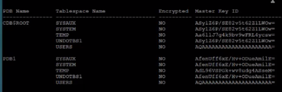

## Task 6: We can check the status of CDB2 and see the same thing
    
    ```
    <copy>
    /home/oracle/scripts/cloning/key_status.sh CDB2
    </copy>
    ```

## Task 7: Steps to Create A Wallet

    ```
    <copy>
    /home/oracle/scripts/cloning/create_wallet.sh CDB1
    </copy>
    ```

1. Goes out to CDB1, which has PDB1
    - Changes the wallet root parameter
        - Recommendation for 19 and above is to use the spfile parameter wallet root
    - Tells it that starting in this location that the wallet root is set at to look for the wallet associated with this database
        - In this instance it will look for a subdirectory called tde
    - You will see the message to Bounce the database
        - Changing the spfile parameter requires a database bounce
            - Can set the wallet root location when you have a maintenance window & set the key
                - This allows you to go down the encryption path later
                - They don’t have to be done together
                - Plan for a bounce before you start the encryption process

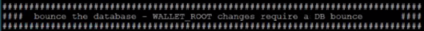
    
    - After the database comes back up from bounce
        - Set tde configuration parameter
            - In this case it is set to file
            - What we are telling the database is
                - In wallet root location, under the tde directory, I’m going to be using a wallet file
                - If using Oracle Key Vault the configuration will say OKV instead of file

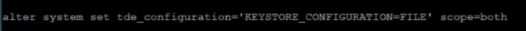

    - Create the keystore
    - Give it a wallet file
    - Give it a password
    - Open it
    - Changing to PDB1
    - Using a unified wallet
        - This means the wallet that is used for the CDB contains the keys for the CDB and the PDB
        - When you have Multi-Tenant the CDB and the PDB‘s all have independent keys
        - In this case the 
            - CDB has it’s own Master Encryption Key
            - The PDB has it’s own Master Encryption Key
            - If there were a second PDB it would also have it’s own unique Master Encryption Key
    - The script also creates a second wallet
        - No password needed to read
        - Database able to connect to it at startup
        - When restarted it will auto read the wallet and pull any keys that are set in that wallet to do the encryption
        - If you do not create an autologin wallet when you start the database you need to manually open up the wallet using the password in order to access the keys
            - Not as secure a method, but less effort when you bounce the database
            - Most customers use an auto login wallet
    - Note the 2 files in the directory
        - .p12 is the password file
            - Cannot access the file without the password
            - Need to back this up when you backup the database
            - It should not be with the database
            - Use to add keys and make changes to the wallet
        - .sso is the auto login wallet
            - You do not want to backup this file
            - Anybody who has this will be able open the database and read the keys
    - Even is somebody got the database on the wallet they can’t get the key that is protecting that database

    - Do the same for CDB2

    ```
    <copy>
    /home/oracle/scripts/cloning/create_wallet.sh CDB2
    </copy>
    ```

    - Create the keystore
    - Give it a wallet file
    - Give it a password 
    - Open it 
    - Changing to PDB2 
    - Use a unified wallet

**Key Points For RAC Environments**
    - In a RAC environment the key needs to be read by all the nodes in the RAC cluster
    - Wallet can be in a shared location 
        - Local copy 
            - Copy over to all nodes
        - ACFS mount that is seen by all of the nodes
        - NFS mount that is seen by all of the nodes
        - ASM
            - If you leverage ASM when you backup the file you need to pull it form ASM and then back it up
            - More complicated
    - Most common is a shared location: ex ACFS mount point
    - Cloud uses ACFS

## Task 8: Check the Wallet Status For CDB1

    ```
    <copy>
    /home/oracle/scripts/cloning/create_wallet.sh CDB1
    </copy>
    ```

    - Last time we ran this is said not available
    - You will see the status as OPEN_NO_MASTER_KEY
        - We have not set the key yet
    - CDB1 & PDB1 both have the wallet open but no master key

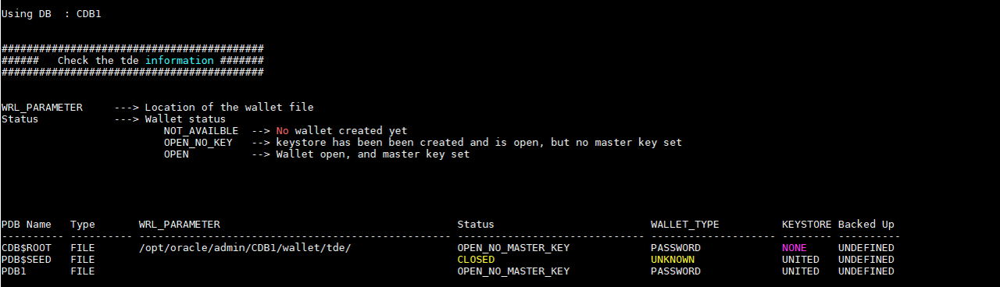

## Task 9: Check the Wallet Status For CDB2

    ```
    <copy>
    /home/oracle/scripts/cloning/create_wallet.sh CDB2
    </copy>
    ```

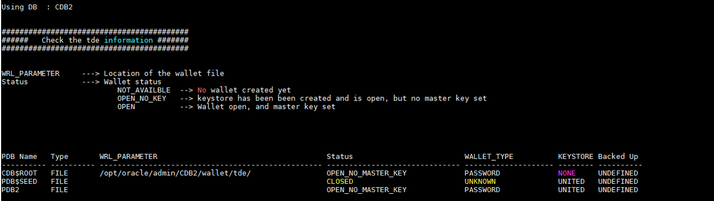

## Task 10: Set The master Key For CDB1 & PDB1

    ```
    <copy>
    /home/oracle/scripts/cloning/set_keys.sh CDB1
    </copy>
    ```

This script 
    - Sets the encryption key for the CDB & PDB
    - We are using a tag
        - Tags are important to identify which key it is, especially when using OKV
            - In OKV you have the visibility to all the databases that are set and all the keys that are managed
            - The tag uniquely identifies the encryption key
            - This makes it easier to manage the wallets and know exactly which key you are looking at
    - This is the point of no return
        - From this point forward the database expects the wallet and encryption key to be there when the database starts up
    - Each PDB also has its own unique key

Run this script to set the master encryption key for CDB2 and PDB2

    ```
    <copy>
    /home/oracle/scripts/cloning/set_keys.sh CDB1
    </copy>
    ```
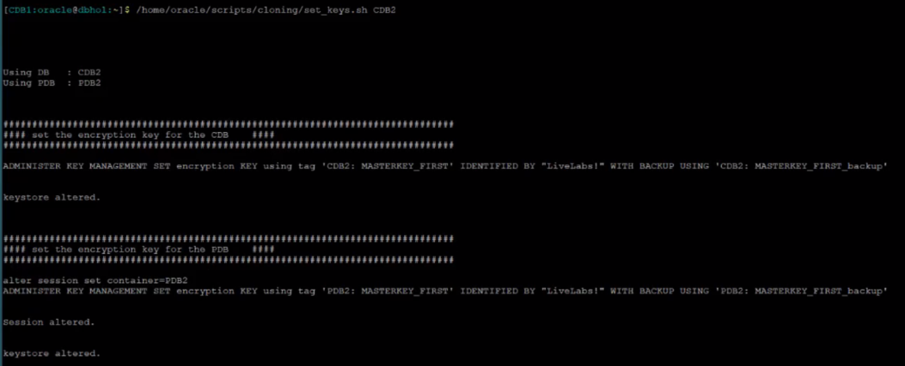

Check the wallet status now that the master encryptions keys were created
    - Status shows as OPEN
    - Wallet is known and open

CDB1

    ```
    <copy>
    /home/oracle/scripts/cloning/wallet_status.sh CDB1
    </copy>
    ```

CDB2

    ```
    <copy>
    /home/oracle/scripts/cloning/wallet_status.sh CDB1
    </copy>
    ```

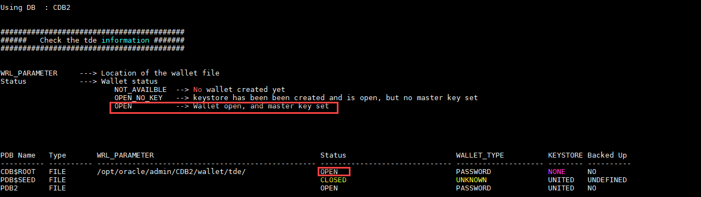

    - Check the key status for CDB1 again

    ```
    <copy>
    /home/oracle/scripts/cloning/key_status.sh CDB1
    </copy>
    ```

    - No tablespaces are encrypted for CDB1
    - It now shows 2 Master Keys
        - 1 for the CDB
        - 1 for the PDB

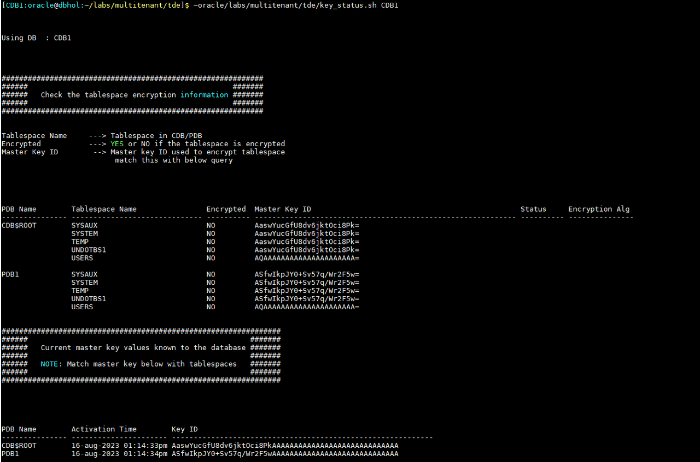
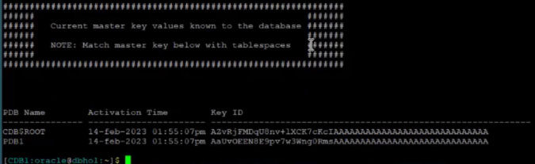

    - The Activation Time is listed
        - As you rotate through the keys it will show a new Activation Time
        - This will show the history of the keys and when activated

    - Check the key status for CDB2 again

    ```
    <copy>
    /home/oracle/scripts/cloning/key_status.sh CDB2
    </copy>
    ```

    - Nothing should be encrypted at this point
    - You should have 2 master Encryption Keys

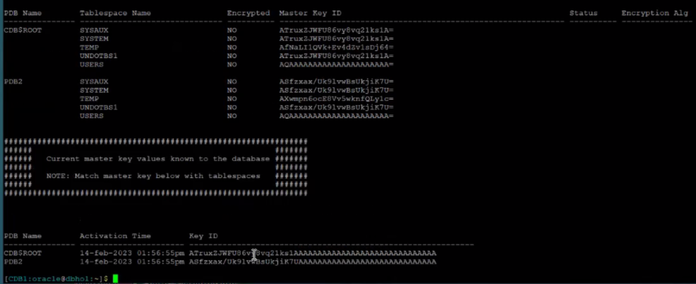

        - If you look at the keys for SYSAUX & SYSTEM they match the keys at the bottom
        - They are not encrypted at this point
            - If they were to be encrypted those are they keys that they would use

## Task 11: Set The Algorithm

    - Run the script for CDB1

    ```
    <copy>
    /home/oracle/scripts/cloning/set_algorythm.sh CDB1
    </copy>
    ```


        - By default it is set to AES128
            - Recommendation is to set to AES256
            - Gives a little more security
        - Second parameter set is encrypt_new_tablespaces = ALWAYS
        - By default any new tablespaces will be encrypted with AES256

    - Run the script for CDB2

    ```
    <copy>
    /home/oracle/scripts/cloning/set_algorythm.sh CDB2
    </copy>
    ```


    - We are now ready to encrypt

## Task 12: Encrypt The Tablespaces

    - Run for CDB1

    ```
    <copy>
    /home/oracle/scripts/cloning/encrypt_tablespaces.sh CDB1
    </copy>
    ```

    - This is an on-line encryption
        - Sequentially it is going through all the data files associated with the tablespace & creating a new copy of the data file that is encrypted.  
        - It keeps track of any changes of that data file in that tablespace while it is doing that copy that is encrypted
        - It applies those changes
        - Under the covers it replaces the current data file with the new data file while the database is up and running
        - When finished the space is reclaimed

**Key Points**
    - You need to have enough additional space for the largest data file that is going to be encrypted because a second file will be created
    - This can be done in parallel, but more data files are created in parallel so keep your free space in mind
    - This can be at a later point in time
    -   You don’t have to do all the tablespaces at once

    - Run the encryption for CDB2

     ```
    <copy>
    /home/oracle/scripts/cloning/encrypt_tablespaces.sh CDB2
    </copy>
    ```

**Key Points**
    - When you are finished you need to do a full backup as an incremental will not see the tablespace as encrypted
    - The backup should be done as-soon-as it is done encrypting
    - If you do a restore to the data file before doing the full backup and applied the archive logs to bring it forward the restore would be unencrypted

    - Look at the key status again and let's review what happened to the tablespaces and how this ties together

     ```
    <copy>
    /home/oracle/scripts/cloning/key_status.sh CDB1
    </copy>
    ```

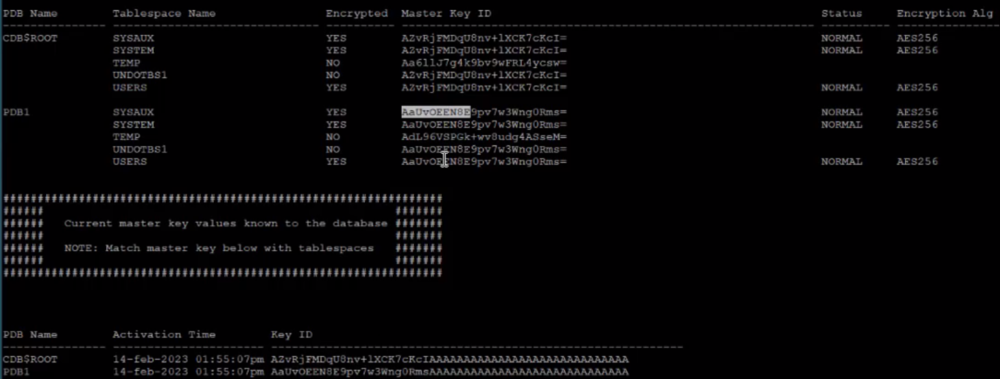


    - You can see the Master Encryption Key is set for SYSAUX & SYSTEM
    - It now shows as encrypted
    - It shows as encrypted with AES256
    - The keys starts with AZvR, which matches the key for the CDB
    - If you look at the PDB the Master Encryption Key begins with AaUv & it matches the Key Id at the bottom
        - NOTICE: TEMP & UNDO were not encrypted
        - Anytime you encrypt the tablespace that means that the data that originated in that tablespace stays encrypted anytime the database uses it for processing.
        - If you have a sort going on and that sort contains data that is in USERS, if it’s a join of multiple tables and only 1 of those tables resides in a tablespace that encrypted that whole join process becomes encrypted
        - Everything that starts with an encrypted tablespace inherits  encryption during sorts
        - If it spills over from memory into temp and temp is encrypted it will stay encrypted
        - No reason to encrypt temp again because anything that gets encrypted will stay encrypted
        - The same thing happens with UNDO as it would inherit the starting point of encrypted data, so there is no reason to encrypt this as well

    - Check the key status for CDB2

    ```
    <copy>
    /home/oracle/scripts/cloning/key_status.sh CDB1
    </copy>
    ```

        - You will see the same thing as CDB1
            NOTE:  The keys are different, so you have 4 Master Keys in 2 different wallets

## Task 13: Clone PDB1 in CDB1

    ```
    <copy>
    /home/oracle/scripts/cloning//clonepdb1.sh
    </copy>
    ```

    - This will create a pluggable database that is a clone of PDB1
        - Calling it pdbclone1
        - Doing the work in parallel
        - You notice that because you are cloning a pdb that is encrypted it needs access to the encryption key

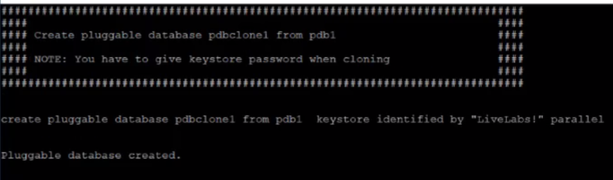

        - You have to give it the password for the keystore so it can take the datafiles associated with PDB1 and clone them into pdbclone1 and have access to that data
        - You can see below that the keystore is open

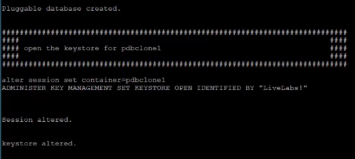

    - When finished you can see the status of the PDB’s
        - PDB1 – Open READ WRITE
        - PDBCLONE1 – OPEN READ WRITE

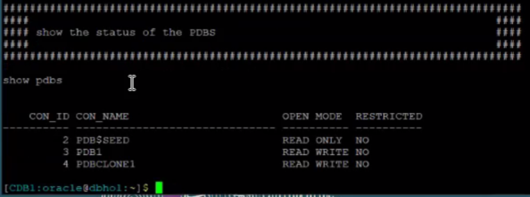


    - Look at the key status 

     ```
    <copy>
    /home/oracle/scripts/cloning/key_status.sh CDB1
    </copy>
    ```

        - Notice PDB1 and PDBCLONE1 have the same master encryption key
        - The wallet only contains 2 keys
            - Since you created a clone you do not want it to have the same Master Encryption Key

    - Re-key the pdb

     ```
    <copy>
    /home/oracle/scripts/cloning/key_pdbclone1.sh
    </copy>
    ```

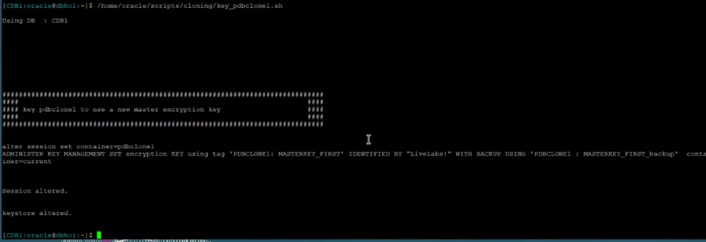

    - This set the key for PDBCLONE1 and use that key for PDBCLONE1
        - Now PDB1 and PDBCLONE1 have separate encryption keys

    - Check at the key status again

     ```
    <copy>
    /home/oracle/scripts/cloning/key_status.sh CDB1
    </copy>
    ```

        - Master Key ID for PDBCLONE1 is now different & it has it’s own unique key
        - If you look at the wallet there are now 3 keys
        - The re-key went quickly because when we do a re-key it doesn’t change the encrypted data.  
            - It changes the master encryption key which is used to encrypt the tablespace encryption key

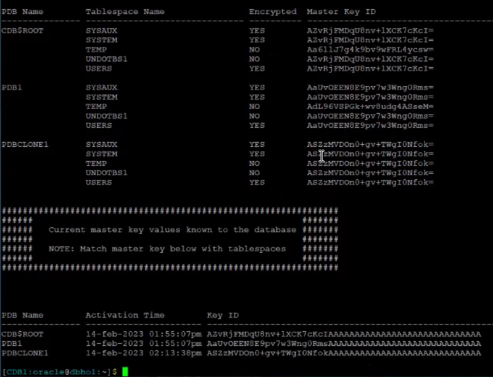 

## Task 14: Unplug PDBCLONE1 and plug into CDB2

    ```
    <copy>
    /home/oracle/scripts/cloning/key_pdbclone1.sh
    </copy>
    ```

        - This close’s pdbclone1
        - It needs to be closed in order to unplug it
            - Unplug’s into an xml file
            - Notice the ENCRYPT USING transport_secret

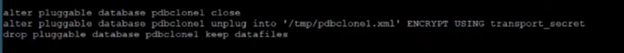

            - This takes a copy of the Master Encryption Key
            - Brings it over to CDB2
            - You want that key encrypted while it is being moved over
            - Password protecting the Master Encryption Key that it is transporting
        - Notice that pdbclone1 is not showing since it was unplugged

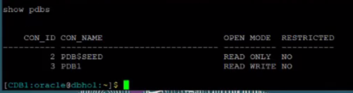

    - Run

     ```
    <copy>
    /home/oracle/scripts/cloning/key_status.sh CDB1
    </copy>
    ```

        - Takes pdbclone1 & plugs it in cdb2 
        - Using the xml file you created during the unplug 
        - Not copying over the temp file 
        - Moves the key along with the password to decrypt it 
        - Stores the key in the wallet for cdb2 
        - Once you create it you connect to it
        - You open the keystore for cdbclone1
        - The state is saved as open
    


        -  With show pdbs you can see pdbclone1 is open for read write

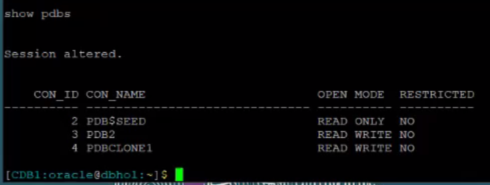

    - Lets look at the data files again


    ```
    <copy>
    /home/oracle/scripts/cloning/key_status.sh CDB1
    </copy>
    ```

        - All that is out there is the CDB and PDB1
        - The keys match for the cdb and pdb
        - The encryption key is still there for pdbclone1 even though it was unplugged
            - There is no pdb associated with it

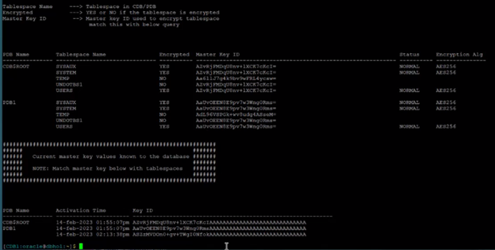

**Key Points**
    - If you were using OKV you could remove it from the wallet
    - You should leave the key in for now
    - If you want to restore to a point in time prior to unplugging, and you were backing it up all along, the database will need that key
    - If you do an archival backup and want to do a resote later you will need that key

## Task 15: Check cdb2 

```
    <copy>
    /home/oracle/scripts/cloning/key_status.sh CDB2
    </copy>
    ```

        - PDB2 is the same as before with its own encryption key
        - PDBCLONE1 was brought in
        - It has its own encryption key
            - If you scroll up you will see it is the same key that was left in the wallet for CDB1
        - The wallet shows 3 encryption keys


    
**Congratulations! You have completed this workshop!**

## Acknowledgements

- **Authors/Contributors** - Sean Provost, Mike Sweeney, Bryan Grenn, Bill Pritchett, Rene Fontcha
- **Last Updated By/Date** - Sean Provost, Enterprise Architect, May 2023
