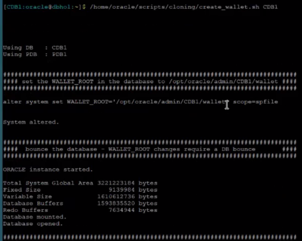
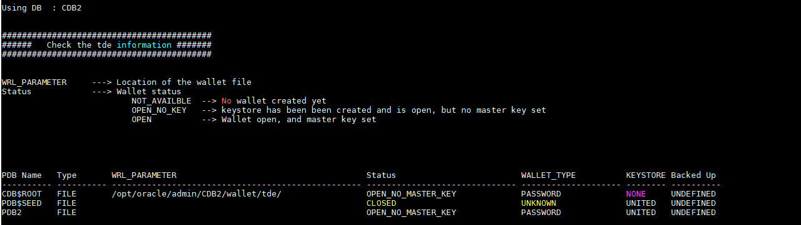
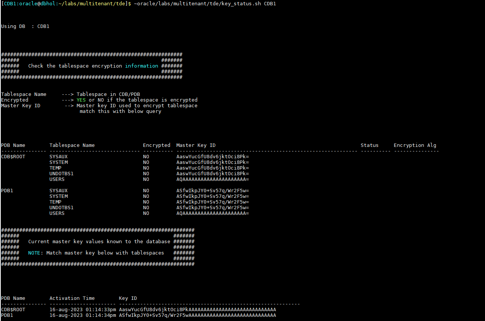
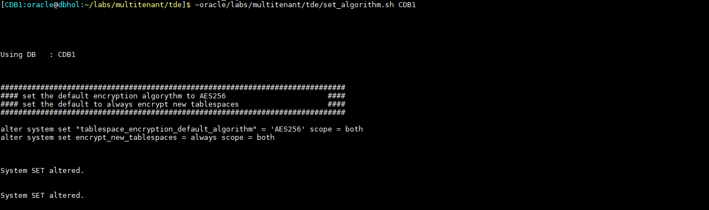
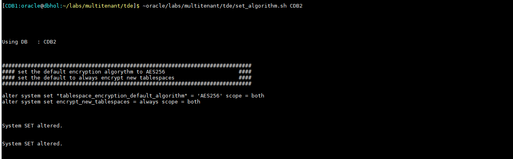
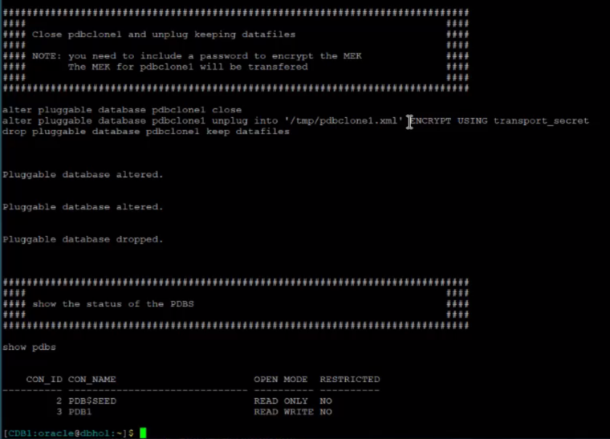
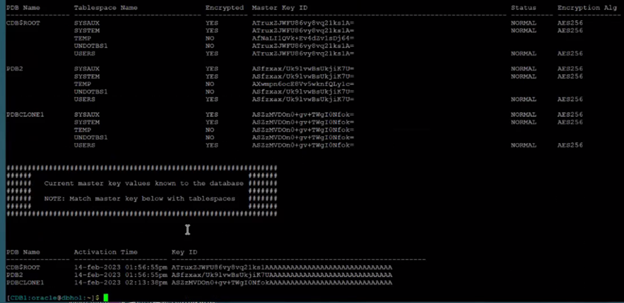

# Securely Clone, Unplug/Plug PDBs Using Transparent Database Encryption (TDE)

## Introduction

In this lab we will go through the steps to add a wallet and keys to CDB's and PDB's, unplug a PDB, plug it into a different CDB and then move the key.

*Estimated Time* :60 Minutes

### Objectives

1. Add TDE to a Pluggable Database (PDB) and Container
2. Move PDB to another container
3. Move key for that database to new container

### Prerequisites

his lab assumes you have:
- A Free Tier, Paid or LiveLabs Oracle Cloud account
- You have completed:
    - Lab: Prepare Setup (*Free Tier* and *Paid Tenancies* only)
    - Lab: Environment Setup
    - Lab: Initialize environment

## Task 1: Validate the non-encryption state
In the following labs, instead of SQL\*Plus you will use Oracle SQL Developer Command Line (SQLcl).  Oracle **SQLcl** is the modern, command line interface to the database. **SQLcl** has many key features that add to the value of the utility, including command history, in-line editing, auto-complete using the TAB key and more. You can learn more about **SQLcl** at the product homepage [ here](https://www.oracle.com/database/sqldeveloper/technologies/sqlcl/).

We start off with an unencrypted database and will be validating that state in this session

1. All scripts for this lab are stored in the `labs/multitenant/tde` folder and are run as the oracle user. Let's navigate to the path now.

    ```
    <copy>
    cd /home/oracle/labs/multitenant/tde
    </copy>
    ```

2.  Set your oracle environment and connect to **CDB1** using SQLcl.

    ```
    <copy>. ~/.set-env-db.sh CDB1</copy>
    ```

    ```
    <copy>
    sql / as sysdba
    </copy>
    ```

    To make the SQLcl output easier to read on the screen, set the sql format.

    ```
    <copy>
    set sqlformat ANSICONSOLE   
    </copy>
    ```

    

3. Create a script to check to see who you are connected as. At any point in the lab you can run this script to see who or where you are connected. We'll save this script for future use and call it *`whoami.sql`*.

    ```
    <copy>
    select
      'DB Name: '  ||Sys_Context('Userenv', 'DB_Name')||
      ' / CDB?: '     ||case
        when Sys_Context('Userenv', 'CDB_Name') is not null then 'YES'
          else  'NO'
          end||
      ' / Auth-ID: '   ||Sys_Context('Userenv', 'Authenticated_Identity')||
      ' / Sessn-User: '||Sys_Context('Userenv', 'Session_User')||
      ' / Container: ' ||Nvl(Sys_Context('Userenv', 'Con_Name'), 'n/a')
      "Who am I?"
      from Dual
      .

      save whoami.sql

    </copy>
    ```

    Now, let's run the script.

    ```
    <copy>
     @whoami.sql
    </copy>
    ```

   


5. Look at the wallet for CDB1

    ```
    <copy>
    ~oracle/labs/multitenant/tde/wallet_status.sh CDB1
    </copy>
    ```

    

>>**Notes:**
- You can see the default location of the wallet file.
- The wallet status will be given.
- You can see there is no wallet that has been created yet.

    At this point CBD1 does not know about a wallet or encryption


6. Look at the wallet for CDB2

    ```
    <copy>
    ~oracle/labs/multitenant/tde/wallet_status.sh CDB2
    </copy>
    ```

    

    At this point CBD2 does not know about a wallet or encryption

At this point neither database knows about encryption and there is no wallet set so let's check the encryption status of CDB1

7. Run this command

    ```
    <copy>
    ~oracle/labs/multitenant/tde/key_status.sh CDB1
    </copy>
    ```

    

>>**Notes:**
- Shows tablespaces associated with the database
- Whether they are encrypted or not
- If they are encrypted what is the master key
- Status is empty

8. We can check the status of CDB2 and see the same thing

    ```
    <copy>
    ~oracle/labs/multitenant/tde/key_status.sh CDB2
    </copy>
    ```

## Task 2: Backup **CDB1** and  **CDB2** (Optional)

**Warning**: *This backup operation takes about 30 minutes to complete, is optional, and may be skipped. The main reason for performing this task is simply so that you can re-run this lab multiple times if you so choose, or restart midway if you make a mistake*

1. Run the following command to perform a backup of the two container databases that will be used during this lab.

    ```
    <copy>
    ~oracle/labs/multitenant/tde/backup_all_db.sh  
    </copy>
    ```

>>**Notes:**
- Once you create a key for the database you are at the point of no return
- The database knows there is a wallet and master encryption key associated with it
- If you don’t have the database access the wallet you will get messages that it can’t access the key
- Be sure of the steps before you do this to a database that you use normally
- Once you do encrypt the database you need to do a full backup, as a best practice
- TDE encrypts the
    - Datafile
    - Tablespace
    - Data in the blocks
- TDE does NOT encrypt
    - Block Headers
    - Means when you go to back it up nothing changed
    - If you do an incremental it won’t look at the database and say the data in the data file or tablespace changed because it got encrypted
    - All it knows is the header, which has the last update scn, didn’t change, so the block didn’t change
    - But the data within the block did change because it was encrypted
- If you only do an incremental merge then
    - The data will stay unencrypted
    - You need to start over as it will take those incremental backups that are unencrypted, merge it into the full backup, which is unencrypted, and keep it unencrypted
    - It will stay unencrypted till you do another full backup
    - The exception is the ZDLRA/RA21

## Task 3: Create A Wallet

In this section we will create a wallet for each CDB. For ease of execution, all steps needed have been provided in the script below

1. Create the wallet and Keystore for CDB1, which has PDB1

    ```
    <copy>
    ~oracle/labs/multitenant/tde/create_wallet.sh CDB1
    </copy>
    ```

    This script will perform the following:

    - Changes the wallet root parameter. Recommendation for 19 and above is to use the spfile parameter wallet root
    - Tells it that starting in this location that the wallet root is set at to look for the wallet associated with this database
    - In this instance it will look for a subdirectory called *tde*
    - You will see the message to Bounce the database

    

    Keep the following in mind:

    - Changing the spfile parameter requires a database bounce
    - Can set the wallet root location when you have a maintenance window and set the key
    - This allows you to go down the encryption path later
    - They don’t have to be done together
    - Plan for a bounce before you start the encryption process

    After the database comes back up from the bounce the following tasks are performed by the script

    - Set tde configuration parameter. In this case it is set to file
    - What we are telling the database is
      - In wallet root location, under the tde directory
      - I’m going to be using a wallet file
      - If using Oracle Key Vault the configuration will say OKV instead of file

    

    For the keystore the following tasks are performed in this step:

    - Give it a wallet file
    - Give it a password
    - Open it
    - Changing to PDB1
    - Using a unified wallet
    - The script also creates a second wallet
    - Note the 2 files in the directory
        - *.p12* is the password file
            - Cannot access the file without the password
            - Need to back this up when you backup the database
            - It should not be with the database
            - Use to add keys and make changes to the wallet
        - *.sso* is the auto login wallet
            - You do not want to backup this file
            - Anybody who has this will be able open the database and read the keys
    - Even if somebody got the database on the wallet they can’t get the key that is protecting that database

>>**Notes:**
- Using a unified wallet
  - This means the wallet that is used for the CDB contains the keys for the CDB and the PDB
  - When you have Multi-Tenant the CDB and the PDB‘s all have independent keys
  - In this case the
    - CDB has it’s own Master Encryption Key
    - The PDB has it’s own Master Encryption Key
    - If there were a second PDB it would also have it’s own unique Master Encryption Key
- The script also creates a second wallet
  - No password needed to read
  - Database able to connect to it at startup
  - When restarted it will auto read the wallet and pull any keys that are set in that wallet to do the encryption
  - If you do not create an autologin wallet when you start the database you need to manually open up the wallet using the password in order to access the keys
    - Not as secure a method, but less effort when you bounce the database
    - Most customers use an auto login wallet

2. Repeat [1] for CDB2

    ```
    <copy>
    ~oracle/labs/multitenant/tde/create_wallet.sh CDB2
    </copy>
    ```

>>**Notes:**
Note For RAC Environments
1. In a RAC environment the key needs to be read by all the nodes in the RAC cluster
2. Wallet can be in a shared location
    - Local copy
        - Copy over to all nodes
    - ACFS mount that is seen by all of the nodes
    - NFS mount that is seen by all of the nodes
    - ASM
        - If you leverage ASM when you backup the file you need to pull it form ASM and then back it up
        - More complicated
    - Most common is a shared location: ex ACFS mount point
3. Cloud uses ACFS

3. Check the Wallet Status For CDB1

    ```
    <copy>
    ~oracle/labs/multitenant/tde/wallet_status.sh CDB1
    </copy>
    ```

    

The last time we ran this status check the value was **NOT AVAILABLE**. It has now evolved to **`OPEN_NO_MASTER_KEY`** since we are yet to set the key. As a result, while CDB1 and PDB1 both have the wallet open, there is no master key

4. Check the Wallet Status For CDB2

    ```
    <copy>
    ~oracle/labs/multitenant/tde/wallet_status.sh CDB2
    </copy>
    ```

    

Same as for CDB1 and PDB1, CDB2 and PDB2 both have the wallet open but no master key


## Task 4:  Set The master Key

The *`set_keys.sh`* script used in this section will set the encryption key for the CDB and PDB, and will rely on the tag feature.

Tags are important to identify keys, especially when using OKV where keys are stored in a centralized vault and managed for multiple databases. In such instances, the tag allows to uniquely identify the encryption key

>>**Notes:**
- This is the point of no return: Once you create a key for the database you are at the point of no return
- From this point forward the database expects the wallet and encryption key to be there when the database starts up
- The database knows there is a wallet and master encryption key associated with it
- If you don’t have the database access the wallet you will get messages that it can’t access the key
- Be sure of the steps before you do this to a database that you use normally
- Each PDB also has its own unique key


1. Set the master encryption key for CDB1 and PDB1

    ```
    <copy>
    ~oracle/labs/multitenant/tde/set_keys.sh CDB1
    </copy>
    ```

2. Set the master encryption key for CDB2 and PDB2

    ```
    <copy>
    ~oracle/labs/multitenant/tde/set_keys.sh CDB2
    </copy>
    ```

    

3. Check the wallet status now that the master encryptions keys have been set

    ```
    <copy>
    ~oracle/labs/multitenant/tde/wallet_status.sh CDB1
    </copy>
    ```

    - Status shows as OPEN
    - Wallet is known and open

4. Repeat to check the wallet status of CDB2

    ```
    <copy>
    ~oracle/labs/multitenant/tde/wallet_status.sh CDB2
    </copy>
    ```

    

5. Check the key status for CDB1 again

    ```
    <copy>
    ~oracle/labs/multitenant/tde/key_status.sh CDB1
    </copy>
    ```

    - No tablespaces are encrypted for CDB1
    - It now shows 2 Master Keys
        - 1 for the CDB
        - 1 for the PDB

    

    The Activation Time is listed

    - As you rotate through the keys it will show a new Activation Time
    - This will show the history of the keys and when activated

6. Check the key status for CDB2 again

    ```
    <copy>
    ~oracle/labs/multitenant/tde/key_status.sh CDB2
    </copy>
    ```

    - Nothing should be encrypted at this point
    - You should have 2 master Encryption Keys

    

    - If you look at the keys for SYSAUX and SYSTEM they match the keys at the bottom
    - They are not encrypted at this point
        - If they were to be encrypted those are they keys that they would use

## Task 5: Encrypt The Tablespaces

In this section we will encrypt tablespaces. However before proceeding we need to set an encryption algorithm on the two CDBs

1. Run the script for CDB1 to set the encryption algorithm

    ```
    <copy>
    ~oracle/labs/multitenant/tde/set_algorithm.sh CDB1
    </copy>
    ```

    

>>**Notes:**    
- By default it is set to AES128. However the recommendation is to set to AES256, which provides a little more security
- Second parameter set is `encrypt_new_tablespaces` = ALWAYS
- With this setup, any new tablespaces will be encrypted with AES256

2. Repeat for CDB2

    ```
    <copy>
    ~oracle/labs/multitenant/tde/set_algorithm.sh CDB2
    </copy>
    ```

    

We are now ready to encrypt

3. Encrypt the tablespaces in CDB1

    This is an on-line encryption and will perform the following:

    - Sequentially going through all the data files associated with the tablespace and creating a new encrypted copy.  
    - Keeping track of any changes to each data file during the process and applying them after the encryption is completed
    - Under the covers it replaces the current data file with the new data file while the database is up and running
    - When finished the space is reclaimed

    ```
    <copy>
    ~oracle/labs/multitenant/tde/encrypt_tablespaces.sh CDB1
    </copy>
    ```

    

>>**Note:**
- You need to have enough additional space for the largest data file that is going to be encrypted because a second file will be created
- This can be done in parallel, but more data files are created in parallel so keep your free space in mind
- This can be at a later point in time
- You don’t have to do all the tablespaces at once
- When you are finished you need to do a full backup as an incremental will not see the tablespace as encrypted
- The backup should be done as-soon-as it is done encrypting
- If you do a restore to the data file before doing the full backup and applied the archive logs to bring it forward the restore would be unencrypted

2. Run the encryption for CDB2

     ```
    <copy>
    ~oracle/labs/multitenant/tde/encrypt_tablespaces.sh CDB2
    </copy>
    ```

3. Look at the key status again and let's review what happened to the tablespaces and how this ties together

     ```
    <copy>
    ~oracle/labs/multitenant/tde/key_status.sh CDB1
    </copy>
    ```

    

>>**Note:**
- You can see the Master Encryption Key is set for SYSAUX and SYSTEM
- It now shows as encrypted
- It shows as encrypted with AES256
- The keys starts with AZvR, which matches the key for the CDB
- If you look at the PDB the Master Encryption Key begins with AaUv and it matches the Key Id at the bottom
- NOTICE: TEMP and UNDO were not encrypted
    - Anytime you encrypt the tablespace that means that the data that originated in that tablespace stays encrypted anytime the database uses it for processing.
    - If you have a sort going on and that sort contains data that is in USERS, if it’s a join of multiple tables and only 1 of those tables resides in a tablespace that encrypted that whole join process becomes encrypted
    - Everything that starts with an encrypted tablespace inherits  encryption during sorts
    - If it spills over from memory into temp and temp is encrypted it will stay encrypted
    - No reason to encrypt temp again because anything that gets encrypted will stay encrypted
    - The same thing happens with UNDO as it would inherit the starting point of encrypted data, so there is no reason to encrypt this as well

4. Check the key status for CDB2

    ```
    <copy>
    ~oracle/labs/multitenant/tde/key_status.sh CDB2
    </copy>
    ```

You will see the same thing as CDB1. The keys are different, so you have 4 Master Keys in 2 different wallets

## Task 6: Clone PDB1 in CDB1

1. Clone pdb1

    ```
    <copy>
    ~oracle/labs/multitenant/tde/clone_pdb1.sh
    </copy>
    ```

    This will create *pdbclone1*, a pluggable database by cloning PDB1
    - Doing the work in parallel
    - Since you are cloning a pdb that is encrypted it needs access to the encryption key

    

    You have to give it the password for the keystore so it can take the datafiles associated with PDB1 and clone them into pdbclone1 and have access to that data.
    - As you can see below, the keystore is open

    

    When finished you can see the status of the PDB’s
    - PDB1 – Open READ WRITE
    - PDBCLONE1 – OPEN READ WRITE

    

2. Look at the key status

     ```
    <copy>
    ~oracle/labs/multitenant/tde/key_status.sh CDB1
    </copy>
    ```

    Notice PDB1 and PDBCLONE1 have the same master encryption key
    - The wallet only contains 2 keys
    - Since you created a clone you do not want it to have the same Master Encryption Key

3. Re-key the pdb

     ```
    <copy>
    ~oracle/labs/multitenant/tde/key_pdbclone1.sh
    </copy>
    ```

    

    This set the key for PDBCLONE1 and use that key for PDBCLONE1
    - Now PDB1 and PDBCLONE1 have separate encryption keys

4. Check at the key status again

     ```
    <copy>
    ~oracle/labs/multitenant/tde/key_status.sh CDB1
    </copy>
    ```

    - Master Key ID for PDBCLONE1 is now different and it has it’s own unique key
    - If you look at the wallet there are now 3 keys
    - The re-key went quickly because when we do a re-key it doesn’t change the encrypted data
        - It changes the master encryption key which is used to encrypt the tablespace encryption key

    

## Task 7: Unplug PDBCLONE1 and plug into CDB2

1. Unplug pdbclone1

    ```
    <copy>
    ~oracle/labs/multitenant/tde/unplug_pdbclone1.sh
    </copy>
    ```

    - This closes pdbclone1
        - It needs to be closed in order to unplug it
        - Unplugs into an xml file
        - Notice the ENCRYPT USING *`transport_secret`*
    - This also takes a copy of the Master Encryption Key and brings it over to CDB2
        - You want that key encrypted while it is being moved over
        - Password protecting the Master Encryption Key that it is transporting
    - Notice that pdbclone1 is not showing since it was unplugged

    

2. Run to plug pdbclone1 into cdb2

     ```
    <copy>
    ~oracle/labs/multitenant/tde/plug_pdbclone1.sh
    </copy>
    ```

    - Takes pdbclone1 and plugs it in cdb2
    - Using the xml file you created during the unplug
    - Not copying over the temp file
    - Moves the key along with the password to decrypt it
    - Stores the key in the wallet for cdb2
    - Once you create it you connect to it
    - You open the keystore for cdbclone1
      - The state is saved as open
    - With show pdbs you can see pdbclone1 is open for read write

    

3. Lets look at the data files again

    ```
    <copy>
    ~oracle/labs/multitenant/tde/key_status.sh CDB1
    </copy>
    ```

    - All that is out there is the CDB and PDB1
    - The keys match for the cdb and pdb
    - The encryption key is still there for pdbclone1 even though it was unplugged
        - There is no pdb associated with it

    

>>**Note:**
- If you were using OKV you could remove it from the wallet
- You should leave the key in for now
- If you want to restore to a point in time prior to unplugging, and you were backing it up all along, the database will need that key
- If you do a backup and want to do a restore later you will need that key

4. Check CDB2

    ```
    <copy>
    ~oracle/labs/multitenant/tde/key_status.sh CDB2
    </copy>
    ```

    - PDB2 is the same as before with its own encryption key
    - PDBCLONE1 was brought in
    - It has its own encryption key
        - If you scroll up you will see it is the same key that was left in the wallet for CDB1
    - The wallet shows 3 encryption keys

    

>>**Notes:**
- Once you do encrypt the database you need to do a full backup, as a best practice
- TDE encrypts the
    - Datafile
    - Tablespace
    - Data in the blocks
- TDE does NOT encrypt
    - Block Headers
    - Means when you go to back it up nothing changed
    - If you do an incremental it won’t look at the database and say the data in the data file or tablespace changed because it got encrypted
    - All it knows is the header, which has the last update scn, didn’t change, so the block didn’t change
    - But the data within the block did change because it was encrypted
- If you only do an incremental merge then
    - The data will stay unencrypted
    - You need to start over as it will take those incremental backups that are unencrypted, merge it into the full backup, which is unencrypted, and keep it unencrypted
    - It will stay unencrypted till you do another full backup
    - The exception is the ZDLRA/RA21

## Task 8: Reset the Environment (Optional)
While executing this workshop should you need to get a fresh start midway through the execution or simply want to reset the database back to the initial unencrypted state, perform the following tasks.

1. Restore all databases (**CDB1** and **CDB2**)

    ```
    <copy>
    ~oracle/labs/multitenant/tde/restore_all_db.sh
    </copy>
    ```

2. Check the existence of a wallet for **CDB1**

    ```
    <copy>
    ~oracle/labs/multitenant/tde/wallet_status.sh CDB1
    </copy>
    ```

    

>>**Notes:**
- You can see the default location of the wallet file.
- The wallet status will be given.
- You can see there is no wallet that has been created yet.
- At this point CBD1 does not know about a wallet or encryption


3. Check the existence of a wallet for **CDB2**

    ```
    <copy>
    ~oracle/labs/multitenant/tde/wallet_status.sh CDB2
    </copy>
    ```

    

>>**Notes:**
- You can see the default location of the wallet file.
- The wallet status will be given.
- You can see there is no wallet that has been created yet.
- At this point CBD2 does not know about a wallet or encryption

At this point neither database knows about encryption and there is no wallet set so let's check the encryption status on the two CDBs

4. Check the encryption status of **CDB1**

    ```
    <copy>
    ~oracle/labs/multitenant/tde/key_status.sh CDB1
    </copy>
    ```

    

>>**Notes:**
- Shows tablespaces associated with the database
- Whether they are encrypted or not
- If they are encrypted what is the master key
- Status is empty

5. Check the encryption status of **CDB2**

    ```
    <copy>
    ~oracle/labs/multitenant/tde/key_status.sh CDB2
    </copy>
    ```

**Congratulations! You have completed this workshop!**

## Acknowledgements
- **Authors** - Sean Provost, Enterprise Architect
- **Contributors** - Mike Sweeney, Bryan Grenn, Bill Pritchett, Divit Gupta, Rene Fontcha
- **Last Updated By/Date** - Rene Fontcha, LiveLabs Platform Lead, NA Technology, August 2023
