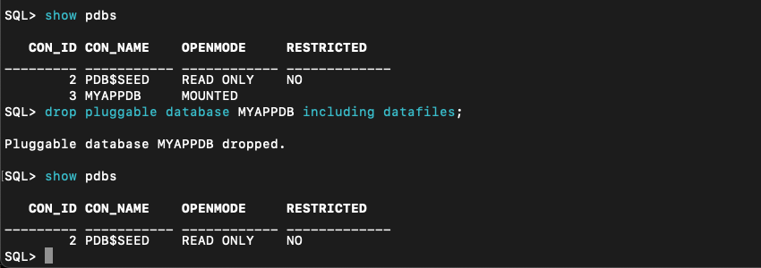
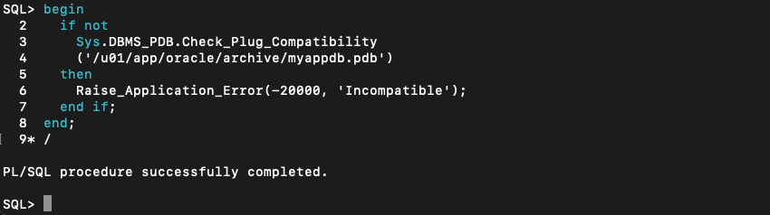
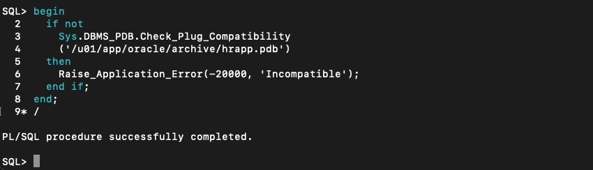
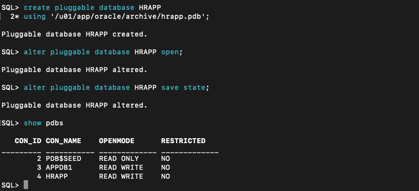
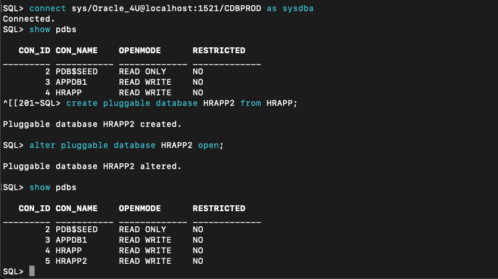
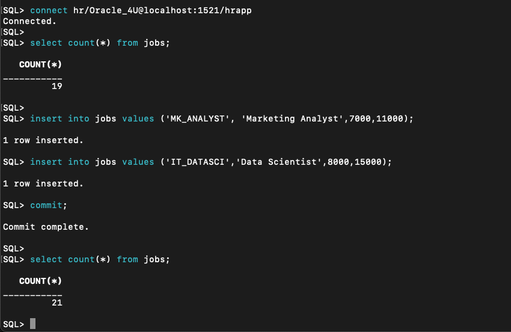
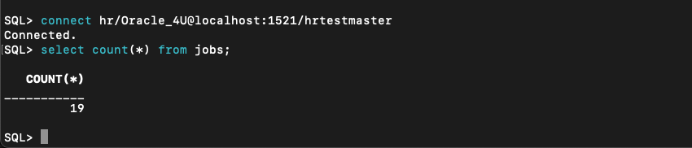
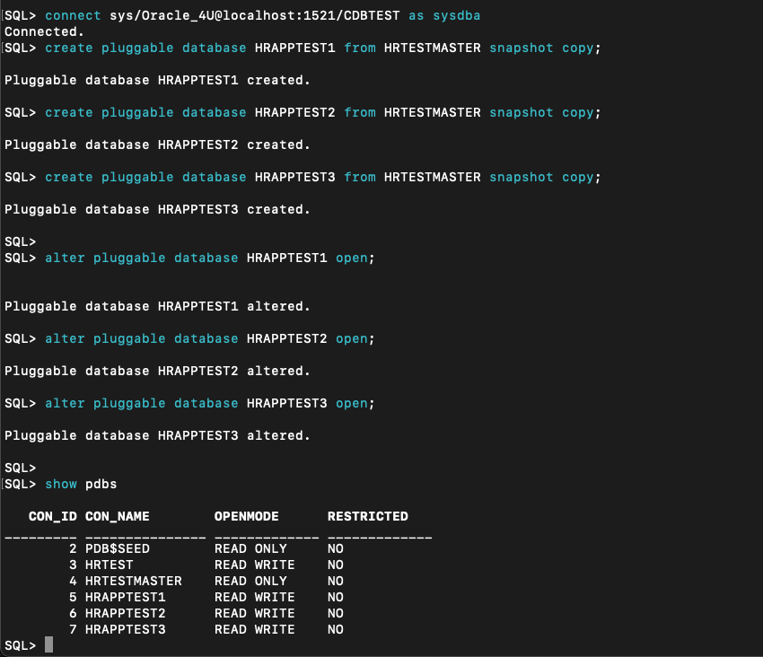
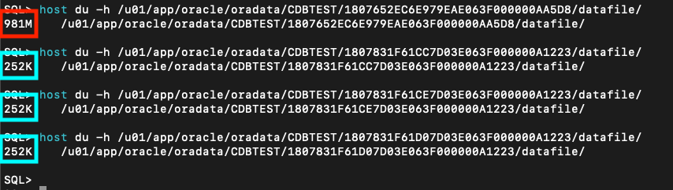

# Pluggable Database for Development Agility

## Introduction
In this lab you will assume the role of a development team member, and you will leverage Oracle Multitenant to perform tasks similar to what might be performed in a development and testing role.  The tasks in this lab include:

- Creating your pluggable database (PDB) in a matter of seconds.
- Unplugging your database into a portable archive that could later be plugged in the same CDB or another CDB.
- Plugging in a database from a shared PDB archive.
- Creating copies of your database using PDB cloning.
- Cloning your "production" PDB to a "test" PDB to use as a master copy for the test/development teams.
- Creating thin "snapshot" copies of the test master for use by the test/development teams.

Estimated Time to Complete This Workshop: 90 minutes


### Prerequisites

This lab assumes you have:
- A Free Tier or paid OCI account, or that you are running this lab in a LiveLabs OCI sandbox
- Completed the following labs:
    - Lab: Prepare Setup (*Free Tier* and *Paid Tenancies* only)
    - Lab: Environment Setup

In the following labs, instead of SQL\*Plus you will use **Oracle SQL Developer Command Line (SQLcl)**.  Oracle **SQLcl** is the modern, command line interface to the Database. **SQLcl** has many key features that add to the value of the utility, including command history, in-line editing, auto-complete using the TAB key and more. You can learn more about **SQLcl** [at the Oracle SQLcl website](https://www.oracle.com/database/technologies/appdev/sqlcl.html).

If you accidentally exit the SQLcl client during a lab exercise, the client can be launched using the command **sql /nolog** .

**NOTE:** *When doing Copy/Paste using the convenient* **Copy** *function used throughout the guide, you must hit the* **ENTER** *key after pasting. Otherwise the last line will remain in the buffer until you hit* **ENTER**!

**Please run all workshop tasks in the order in which they appear in this guide.**

## Task 1: Log in and create the application database

In this first task, you will create and explore a new pluggable database **MYAPPDB** in the container database **CDBTEST**.  Typically, the database administrators would provide the developers with the appropriate privileges to allow self-service database provisioning, cloning, de-provisioning and other tasks that DevOps requires.  For the sake of simplicity, you will use the database superuser privilege SYSDBA to perform many of these tasks throughout this workshop. 


1.  Connect to **CDBTEST** using SQLcl. The database **CDBTEST** is a container database, or CDB.  The CDB contains the root of the database, and is also associated with the database memory (SGA, PGA, etc.) and background processes on the system that are part of the Oracle Database instance.

    ```
    <copy>
    sql sys/Oracle_4U@localhost:1521/CDBTEST as sysdba
    </copy>
    ```

    
    

2. It is common for application development teams to have to wait for a new database when they need one.  The process might be to submit a formal request for a new database, wait for approval, and then wait some more while an environment and database are provisioned.  Depending on the organization and the available infrastructure, that's a process that could take hours, days, or maybe even longer!  However, in a modern, data-driven environment, developers need the ability to quickly create and manage data stores in order to keep pace with rapidly evolving business needs.  Oracle Multitenant makes it easy to enable a "self-service" database environment for the development team.  Not only is database creation self-service and easy, it is also incredibly fast to stand up a new Oracle Database. 

    In this task, you'll examine the container database **CDBTEST** by listing the pluggable databases already in the container; since this is a new CDB the only database plugged into it is the SEED database.  You will create the pluggable database **MYAPPDB**.  Note that the database is created and ready for use in a matter of seconds.

    ```
    <copy>
    show pdbs
    </copy>
    ```

    ```
    <copy>
    set timing on
    create pluggable database MYAPPDB admin user PDB_Admin identified by Oracle_4U;
    set timing off

    alter pluggable database MYAPPDB open;
    alter pluggable database MYAPPDB save state; /* The "save state" command will enable the PDB to open automatically with the CDB */
    show pdbs
    </copy>
    ```

    


3. Change your SQLcl session to point to the database you just created, **MYAPPDB**.  Then grant privileges to the database user **PDB_ADMIN**, who will create the example database table used in this set of task steps.

    ```
    <copy>
    alter session set container = MYAPPDB;
    
    grant dba to pdb_admin;
    create tablespace users datafile size 20M autoextend on next 1M maxsize unlimited segment space management auto;
    alter database default tablespace Users;
    grant create table, unlimited tablespace to pdb_admin;

    </copy>
    ```
    

4. Connect as the database user **PDB_ADMIN** to **MYAPPDB**, create a sample table and load some rows of data.

    ```
    <copy>connect pdb_admin/Oracle_4U@localhost:1521/myappdb</copy>
    ```

    ```
    <copy>
    create table my_tab(my_col number);
    insert into my_tab values (1);
    insert into my_tab values (2);
    insert into my_tab values (3);
    insert into my_tab values (4);
    insert into my_tab values (5);
    insert into my_tab values (6);
    insert into my_tab values (7);
    insert into my_tab values (8);
    insert into my_tab values (9);
    insert into my_tab values (10);
    commit;

    select * from my_tab;

    </copy>
    ```

   

5. Connect again in SQLcl as **SYS** to the container database **CDBTEST** and view the tablespaces and datafiles created, plus the container (PDB or CDB) to which each datafile belongs.

    ```
    <copy>
    connect sys/Oracle_4U@localhost:1521/CDBTEST as sysdba

    with Containers as (
      select PDB_ID Con_ID, PDB_Name Con_Name from DBA_PDBs
      union
      select 1 Con_ID, 'CDB$ROOT' Con_Name from Dual)
    select
      Con_ID,
      Con_Name "Con_Name",
      Tablespace_Name "T'space_Name",
      File_Name "File_Name"
    from CDB_Data_Files inner join Containers using (Con_ID)
    union
    select
      Con_ID,
      Con_Name "Con_Name",
      Tablespace_Name "T'space_Name",   
      File_Name "File_Name"
    from CDB_Temp_Files inner join Containers using (Con_ID)
    order by 1, 3
    /
    </copy>
    ```

    

## Task 2: Unplug a PDB from the Container Database
A capability of Oracle Multitenant that adds to development agility is the ability to unplug a database from a CDB, and then plug it in elsewhere.  Unplugging a database into a PDB Archive creates a portable collection of everything the makes up the database; it's easy to share that PDB archive with others, and that archive can then be plugged in to other Oracle container databases (CDBs).  

Let's assume that you have completed your initial development work on the database **MYAPPDB** and now you want to share it with other teams.  These teams want to perform testing and make additional changes to the database, and they want to do so in their own database environments.   To accomplish this, you will unplug the PDB into an archive, and then make that archive available to others.

You should still be connected to the SQLcl client and see a "SQL>" prompt.  If not, enter the command **sql /nolog** to start the SQLcl client.

First, you'll unplug **MYAPPDB** from **CDBTEST** into a ".pdb" compressed archive.


1. While still in the SQLcl client, connect to the container **CDBTEST** as the superuser SYSDBA.

    ```
    <copy>connect sys/Oracle_4U@localhost:1521/CDBTEST as sysdba</copy>
    ```

2. A PDB must first be closed before it can be unplugged.  Connect as SYSDBA and close the pluggable database **MYAPPDB**.  Then, unplug **MYAPPDB** from **CDBTEST**.  

    ```
    <copy>
    show pdbs
    alter pluggable database MYAPPDB close immediate;
    </copy>
    ```

    ```
    <copy>
    alter pluggable database MYAPPDB
    unplug into '/u01/app/oracle/archive/myappdb.pdb';
    </copy>
    ```


   

3. After unplugging the database, you will cleanup the container database by dropping all references to the unplugged PDB.  

    ```
    <copy>
    show pdbs
    drop pluggable database MYAPPDB including datafiles;
    show pdbs
    </copy>
    ```

   

4. Now, query the datafiles that are part of **CDBTEST**.  You can see in the results that the datafiles for **MYAPPDB** are no longer part of the container database.
    
    ```
    <copy>
    with Containers as (
      select PDB_ID Con_ID, PDB_Name Con_Name from DBA_PDBs
      union
      select 1 Con_ID, 'CDB$ROOT' Con_Name from Dual)
    select
      Con_ID,
      Con_Name "Con_Name",
      Tablespace_Name "T'space_Name",
      File_Name "File_Name"
    from CDB_Data_Files inner join Containers using (Con_ID)
    union
    select
      Con_ID,
      Con_Name "Con_Name",
      Tablespace_Name "T'space_Name",
      File_Name "File_Name"
    from CDB_Temp_Files inner join Containers using (Con_ID)
    order by 1, 3
    /
    </copy>
    ```

    

5. The unplugged PDB archive has been stored on the local filesystem.  It contains the entire pluggable database in a compressed format. This makes it easy to share the unplugged PDB with other teams, partners, and/or customers.  This file can be used by others and plugged into their Oracle container databases.  When plugging a PDB into a container database, there are some restrictions regarding the CDB into which the PDB will be plugged in: 

    - The CDB must be at least at the same release and patch level as the source.
    - The CDB can be on an OS that is different from that of the source CDB, but the OS has to be the same endian format.
    - The database options installed on the source CDB must be the same as, or a subset of, the database options installed on the target CDB.

  

## Task 3: Plug the unplugged database MYAPPDB into the CDB
In this task, you will connect to container database, **CDBPROD**, and plug the archived PDB **MYAPPDB** into this CDB. 

   You should still be connected to the SQLcl client and see a "SQL>" prompt.  If not, enter the command **sql /nolog** to start the SQLcl client.

1. In the SQLcl client, connect to the container database **CDBPROD** as database superuser SYS as SYSDBA.
    ```
    <copy>
    connect sys/Oracle_4U@localhost:1521/CDBPROD as sysdba
    </copy>
    ```
    ```
    <copy>
    show pdbs
    </copy>
    ```

    

2. Check the compatibility of the unplugged **MYAPPDB** with **CDBPROD**.  If there are no errors output from the PL/SQL block then the PDB is compatible with the CDB, so you should be able to plug-in the PDB without issue.

    ```
    <copy>
    begin
      if not
        Sys.DBMS_PDB.Check_Plug_Compatibility
        ('/u01/app/oracle/archive/myappdb.pdb')
      then
        Raise_Application_Error(-20000, 'Incompatible');
      end if;
    end;
    /
    </copy>
    ```

    

3. Plug the database **MYAPPDB** into container database **CDBPROD**, using the name **APPDB1** for the PDB.   

    ```
    <copy>
    create pluggable database APPDB1
    using '/u01/app/oracle/archive/myappdb.pdb';
    </copy>
    ```

    ```
    <copy>
    alter pluggable database APPDB1 open;
    alter pluggable database APPDB1 save state;
    show pdbs
    </copy>
    ```

    

4. The newly plugged-in database has the same objects, data, local database users and permissions as it did at the time it was unplugged.  Log into the new database using the previously-created **PDBADMIN** credentials, and observe that the table and data you created in the **MYAPPDB** pluggable database are present in the PDB that was created using the archive.

    ```
    <copy>
    connect pdb_admin/Oracle_4U@localhost:1521/appdb1
    select * from my_tab;
    </copy>
    ```

    


## Task 4: Create the HRAPP database from a PDB archive
During this task, you will plug in a PDB from an archive of an HR application PDB that was shared with you by another development team.  The PDB contains the schema and objects supporting the "HR" application, and you will plug this PDB into your "production" environment.  

You should still be connected to the SQLcl client and see a "SQL>" prompt.  If not, enter the command **sql /nolog** to start the SQLcl client.

1. Connect to the container **CDBPROD** with the credentials SYS as SYSDBA.
    ```
    <copy>
    connect sys/Oracle_4U@localhost:1521/CDBPROD as sysdba
    </copy>
    ```
    
    ```
    <copy>
    show pdbs
    </copy>
    ```

    

2. Check the compatibility of the unplugged PDB archive file with the container database.  If there are no errors then the PDB is compatible with the CDB, so you should be able to plug-in the PDB with no issues.  

    ```
    <copy>
    begin
      if not
        Sys.DBMS_PDB.Check_Plug_Compatibility
        ('/u01/app/oracle/archive/hrapp.pdb')
      then
        Raise_Application_Error(-20000, 'Incompatible');
      end if;
    end;
    /
    </copy>
    ```

    

3. Create the database **HRAPP** from the PDB archive file harapp.pdb.

    ```
    <copy>
    create pluggable database HRAPP
    using '/u01/app/oracle/archive/hrapp.pdb';
    </copy>
    ```

    ```
    <copy>
    alter pluggable database HRAPP open;
    alter pluggable database HRAPP save state;
    show pdbs
    </copy>
    ```

    

4. Review the objects in the database HRAPP.

    ```
    <copy>
    connect hr/Oracle_4U@localhost:1521/hrapp
    select table_name, num_rows from user_tables order by 1;
    </copy>
    ```

    


## Task 5: PDB Cloning
The ability to unplug, move, and plug in a database makes it easy to move databases around as needed.  However, Oracle Multitenant also provides an easy way to create copies, or clones, of your databases while they are running and servicing applications and users.  As long as you have the appropriate database privileges, PDB cloning is accomplished using a single SQL statement.  The cloning operation can be performed when the source database is open or closed, so there is complete freedom to create PDB clones as you need them.  The PDB clones can be created in the same CDB, or you can clone to a different CDB on the same host, to a CDB on a different host, and you can even clone to a CDB in the cloud - each time just using a single SQL statement to perform the cloning operation.   

In this task, you will clone your running pluggable database to a new PDB located in the same container database, CDBPROD.  

You should still be connected to the SQLcl client and see a "SQL>" prompt.  If not, enter the command **sql /nolog** to start the SQLcl client.


Clone the pluggable database **HRAPP** to a new PDB named **HRAPP2**.
    
1. Connect to the container **CDBPROD**.

    ```
    <copy>
    connect sys/Oracle_4U@localhost:1521/CDBPROD as sysdba
    </copy>
    ```

2. Create pluggable database **HRAPP2** as a clone of pluggable database **HRAPP**.

    ```
    <copy>
    show pdbs

    create pluggable database HRAPP2 from HRAPP;
    alter pluggable database HRAPP2 open;
    show pdbs
    </copy>
    ```
    

3. Connect to the new PDB **HRAPP2**.  Since this is an exact copy of the PDB **HRAPP**, you can connect with the credentials for user HR and check the tables and row counts; it's an exact duplicate of the original **HRAPP** database.


    ```
    <copy>
    connect hr/Oracle_4U@localhost:1521/hrapp2
    select table_name, num_rows from user_tables order by 1;
    </copy>
    ```


   

## Task 6: Clone the HRAPP database to the TEST database instance.

In the previous step, you cloned your HRAPP database to another database in the same container database.  What if you wanted to clone the database into a different CDB?  This alternate CDB could be on a different host, and maybe located in a different data center or in the cloud.  Oracle Multitenant makes it easy to clone the database between different environments with just a single SQL statement.  

PDB cloning from one CDB to another can be accomplished using a database link.  This database link must connect to the source PDB, and the database link must connect as a user that has the CREATE PLUGGABLE DATABASE system privilege.  For the sake of convenience, this database link, **hr_prod**, has already been created for you.

You should still be connected to the SQLcl client and see a "SQL>" prompt.  If not, enter the command **sql /nolog** to re-start the SQLcl client.

1. Connect to the **CDBTEST** container database.

    ```
    <copy>
    connect sys/Oracle_4U@localhost:1521/CDBTEST as sysdba
    </copy>
    ```

2. Create a new database **HRTEST** in the CDBTEST container database by cloning the **HRAPP** PDB that is plugged in to the CDBPROD container database.

    ```
    <copy>
    show pdbs
    create pluggable database HRTEST from HRAPP@hr_prod;
    alter pluggable database HRTEST open;
    show pdbs
    </copy>
    ```
    

3. Connect to the newly-created HRTEST PDB and verify that database schema HR's exist - of course they do because this PDB is an exact clone of the source **HRAPP** database.

    ```
    <copy>
    connect hr/Oracle_4U@localhost:1521/hrtest
    select table_name, num_rows from user_tables order by 1;
    </copy>
    ```
   

## Task 7: Create a refreshable clone of the production HRAPP database, making it easy to update the test database with the latest data from production
In the previous task, you cloned a PDB from the PROD to the TEST environment.  Since our example database is small, this copy created quickly. However, what if the source database was much larger, maybe a terabyte or more? What if the requirement was to have a fresh clone weekly? When dealing with larger databases, those requirements result in a large amount of data having to flow across the network, and a longer time needed for the refreshes to complete. Oracle Multitenant solves these challenges with refreshable PDBs. Refreshable PDB clones allow the copy to be updated with only the database changes that have taken place since the previous copy was done. Typically, this would mean only a fraction of the source data needs to be copied during each refresh. 
    
In this task, you will create a refreshable "test master" PDB named **HRTESTMASTER** which will be used to support test and development team activity.

You should still be connected to the SQLcl client and see a "SQL>" prompt.  If not, enter the command **sql /nolog** to start the SQLcl client.


1. As you did in the previous lab task, you'll create a clone of the product HRAPP database, this time making that clone refreshable on-demand.  Connect to **CDBTEST** in SQLcl as superuser SYSDBA.
    
    
    ```
    <copy>
    connect sys/Oracle_4U@localhost:1521/CDBTEST as sysdba 
    </copy>
    ```

2. Create the test master database as a refreshable clone from the HRAPP production database.  Since the new database is a refreshable PDB clone, it can only be opened read-only.

    ```
    <copy>
    show pdbs
    create pluggable database HRTESTMASTER from HRAPP@hr_prod refresh mode manual;
    alter pluggable database HRTESTMASTER open read only;
    show pdbs
    </copy>
    ```
    

3. Connect to the production **HRAPP** database as user HR, and insert a couple of new rows into the JOBS table.
    
    ```
    <copy>
    connect hr/Oracle_4U@localhost:1521/hrapp
    
    select count(*) from jobs;

    insert into jobs values ('MK_ANALYST', 'Marketing Analyst',7000,11000);
    insert into jobs values ('IT_DATASCI','Data Scientist',8000,15000);
    commit;

    select count(*) from jobs;
        
    </copy>
    ```
    
    
4. Connect to the **HRTESTMASTER** database and count the rows in the HR.JOBS table: the two newest rows are not there...yet.

    ```
    <copy> 
    connect hr/Oracle_4U@localhost:1521/hrtestmaster
    select count(*) from jobs;
    </copy>
    ```
    

5. Update the test master database by executing a PDB REFRESH and pulling the changes from the HRAPP source database. The HRTESTMASTER database must be closed prior to the refresh of the PDB.

    ```
    <copy>
    connect sys/Oracle_4U@localhost:1521/CDBTEST as sysdba
    alter pluggable database HRTESTMASTER close immediate;
    alter pluggable database HRTESTMASTER refresh;
    alter pluggable database HRTESTMASTER open read only;
    connect hr/Oracle_4U@localhost:1521/hrtestmaster
    select count(*) from jobs;
    </copy>
    ```
    Note that the additional rows in the JOBS table are now in the HRTESTMASTER database.
    
    

## Task 8: Create multiple, thin copies of the **HRTESTMASTER** database to support each development team
In the previous task, you created a refreshable copy of the production HRAPP database.  By rule, a refreshable PDB can only be opened read-only.  So, how is this read-only database useful to testing and development teams that want to work with that latest data from production?  As you've seen in earlier tasks, it is easy to create PDB copies using the "CREATE PLUGGABLE DATABASE..." SQL statement.  In this lab, the example databases are small so making full copies takes little time, and little disk space.  So you could easily create full clones of the **HRTESTMASTER** PDB for any development or testing team that needed their own copy.  However, if the **HRTESTMASTER** database was a very large database, terabytes in size or more, making full copies could take a long time and consume a large amount disk space - so it's not very practical to do so.   Oracle Multitenant offers a solution here, also: "thin", copy-on-write clones known as PDB Snapshot Copies.
In this task, you will create thin copies of **HRTESTMASTER** for the development and testing teams.

You should still be connected to the SQLcl client and see a "SQL>" prompt.  If not, enter the command **sql /nolog** to start the SQLcl client.

1. Connect to **CDBTEST** in SQLcl as supersuser SYSDBA.
    
    
    ```
    <copy>
    connect sys/Oracle_4U@localhost:1521/CDBTEST as sysdba
    </copy>
    ```

2. The test teams need their own copies because they want to modify the database and the data within as part of their functional testing.  You can provide these teams with what they need by creating PDB snapshot copies that are thin, copy-on-write clones of the master.  Each of the snapshot copy PDBs will be read-write, and will be a fraction of the size of the master copy.  In this step, you will create 3 PDB snapshot copies, one for each of the testing teams.  PDB snapshot copies will work on a standard file system as long as the database parameter CLONEDB=TRUE.

    ```
    <copy>
    create pluggable database HRAPPTEST1 from HRTESTMASTER snapshot copy;
    create pluggable database HRAPPTEST2 from HRTESTMASTER snapshot copy;
    create pluggable database HRAPPTEST3 from HRTESTMASTER snapshot copy;

    alter pluggable database HRAPPTEST1 open;
    alter pluggable database HRAPPTEST2 open;
    alter pluggable database HRAPPTEST3 open;

    show pdbs
    </copy>
    ```
   
    

3. Now use SQL to generate OS commands that you can use to demonstrate that the HRAPPTEST snapshot PDBs use only a fraction of the space compared to the source **HRTESTMASTER** database.

    ```
    <copy>
    select distinct 'host du -h '||SUBSTR(NAME,1,INSTR(NAME,'datafile')+8 ) du_output
     from v$datafile  
     where con_id in
     (select con_id from v$pdbs where name in ('HRTESTMASTER','HRAPPTEST1','HRAPPTEST2','HRAPPTEST3'));
    </copy>
    ```
    

4. Copy and paste each of the "host" commands in order to compare the disk space used between the master clone and the snapshot copy PDBs.  The row with the largest size value will be the HRTESTMASTER database.  Notice that the thin, snapshot copy databases are just a small fraction of the size of the master.


    
    


Note: when a PDB Snapshot Copy is created, the permissions for the datafiles of the source database are changed to read-only at the file system level.  When this change is made, any attempt to execute the PDB refresh on the source will fail with an error.  In order to refresh the HRTESTMASTER PDB, the following steps would have to be performed in this order:

    1. Drop all snapshot copy PDBs based on the refreshable PDB HRTESTMASTER.
    2. Change the datafile permissions for the PDB HRTESTMASTER to read/write by executing the following: 
        DBMS_DNFS.RESTORE_DATAFILE_PERMISSIONS('HRTESTMASTER').
    3. Execute the PDB refresh of HRTESTMASTER.
    4. Create new PDB Snapshot Copies if desired.

Now you've had a chance to try out Oracle Multitenant. Hopefully you've realized the value that Oracle Multitenant can bring to your organization:
- Oracle Multitenant made it easy for you to create a new database in just seconds.  
- You were able to unplug your database for sharing with others, and plug in a database that was shared with your team.
- The workshop tasks also showed how Oracle Multitenant makes it easy to:
    - clone databases 
    - create refreshable clones
    - create thin database copies - allowing each test team to have their own copies of the database while minimizing the cost of storage space used.  
    
Thank you for participting in this Oracle LiveLabs workshop!

## Appendix: Troubleshotting the Lab Environment
The Oracle Database environment for this workshop should start up completely upon the provisioning of the workshop environment.  If you are having difficulty connecting to the databases using the lab commands, please verify that the lab database environment is completely up.  The following Processes should be running:

    - Database Listeners
        - LISTENER (1521)
    - Database Server Instances
        - CDBPROD
        - CDBTEST

You should be able to validate the running processes by the running the following from the desktop terminal window:

    ```
    <copy>
    ps -ef|grep ora_|grep pmon|grep -v grep
    ps -ef|grep LIST|grep -v grep
    </copy>
    ```

   
   

If all expected processes are shown in your output as seen above, then your environment is ready for the next task. If any of the processes are not running, then please the followinyou may use the following commands to manage the Database and Listener processes.

[Managing the Workshop Database Processes](../initialize-environment/initialize-environment.md)

## Acknowledgements

- **Author** - Joseph Bernens, Principal Solution Engineer
- **Contributors** -  Vasavi Nemani, Patrick Wheeler
- **Last Updated By/Date** - Joseph Bernens, Principal Solution Engineer, Oracle NACI Solution Engineering / April 2024
