# Lab 1: Prepare OCI Infrastructure and Database (Manual Path)

## Introduction

In this lab, you will prepare the base OCI environment and database foundation for My AI Staff. You will create compute and network resources, provision Autonomous Database 26ai, load the schema, and validate in-database vector embeddings.

Estimated Time: 90 minutes

### Objectives

In this lab, you will:

- Create OCI compute and ingress rules for secure access.
- Provision Autonomous Database 26ai and wallet files.
- Create the AI FOR YOU schema and load the application DDL.
- Load and validate the MiniLM ONNX embedding model.

### Prerequisites

- Completion of the workshop Introduction.
- OCI tenancy access with permissions to create compute and database resources.
- A laptop with an SSH client. macOS and most Linux distributions include OpenSSH. Windows users can use PowerShell with OpenSSH, Windows Terminal, or VS Code Remote - SSH. You will create or download the SSH key and configure the connection after the instance is created and its public IP is assigned.
- A browser for OCI Console and SQL Developer Web, or SQLcl installed on the instance.

## Task 1: Create Compute and Network Access

1. In [OCI Console](https://www.oracle.com/latam/cloud/sign-in.html), create one Oracle Linux 9 ARM instance using shape VM.Standard.A1.Flex
    (If not available choose a similar Shape, check documentation for more info [here](https://docs.oracle.com/es-ww/iaas/Content/Compute/References/computeshapes.htm#flexible)).

    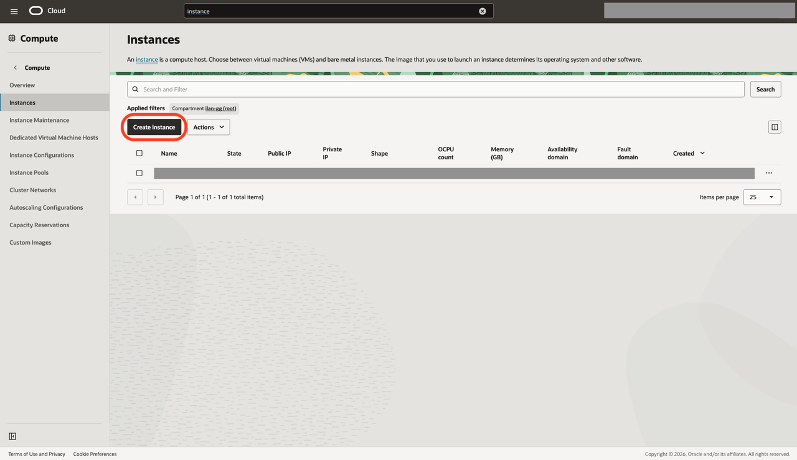

    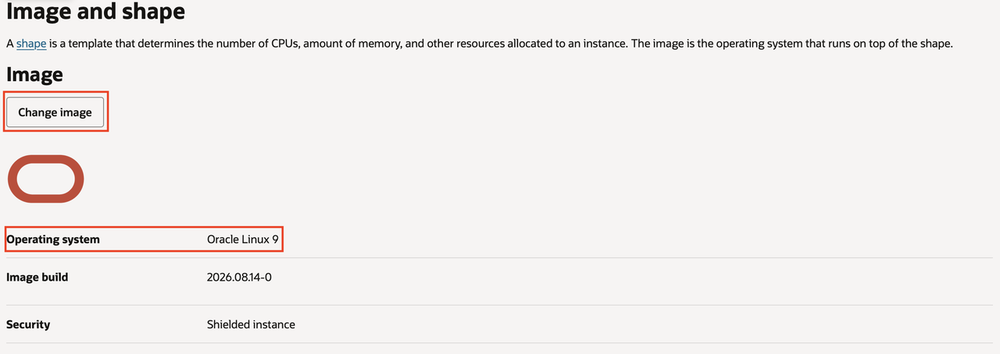

2. Configure the instance to use 4 OCPUs and 24 GB memory.

    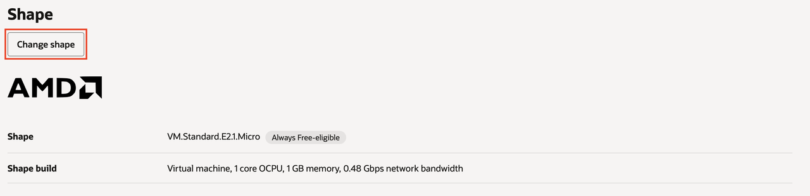

    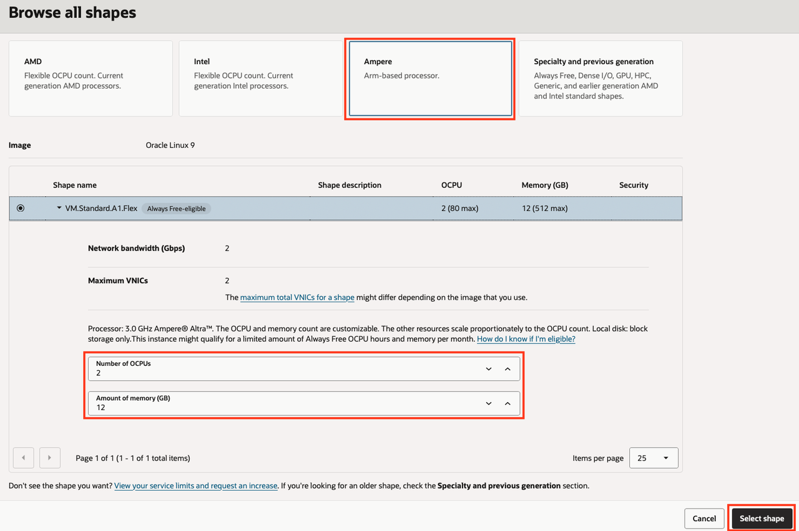

3. Under **Add SSH keys**, choose **Generate a key pair** and download the private key immediately, or upload a public key that you already control. OCI needs the public key during launch; the connection configuration happens after the instance is created.

    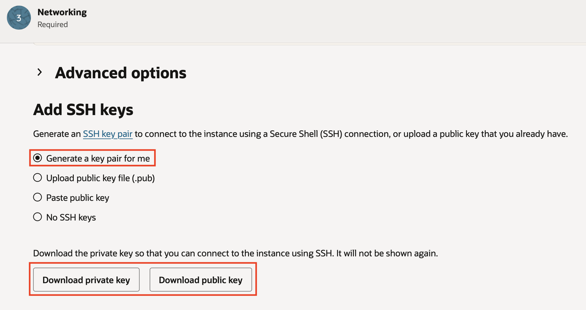

4. Find the security list for the instance subnet. In OCI Console, open the running instance, locate the **Primary VNIC** or **Subnet** link, open the subnet, and then open its attached **Security Lists**.

    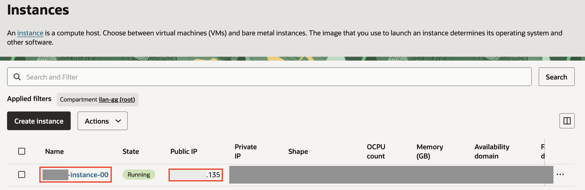

    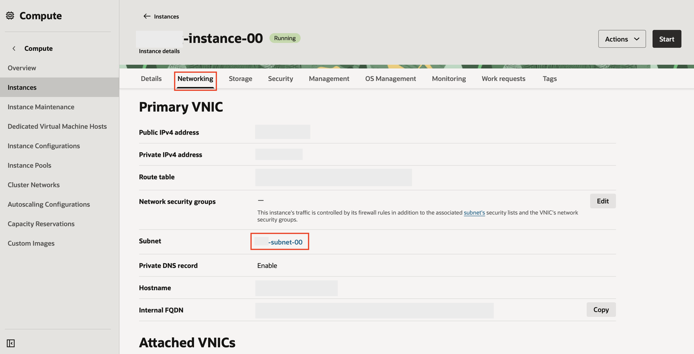

    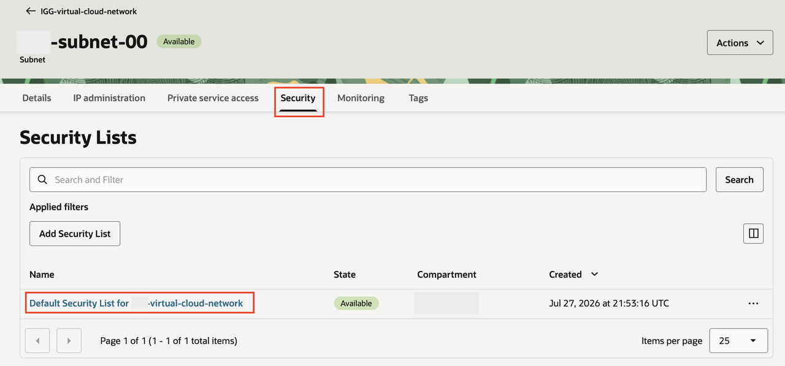

5. Add an **Ingress Rule**, not an egress rule, for SSH access. Use these values:

    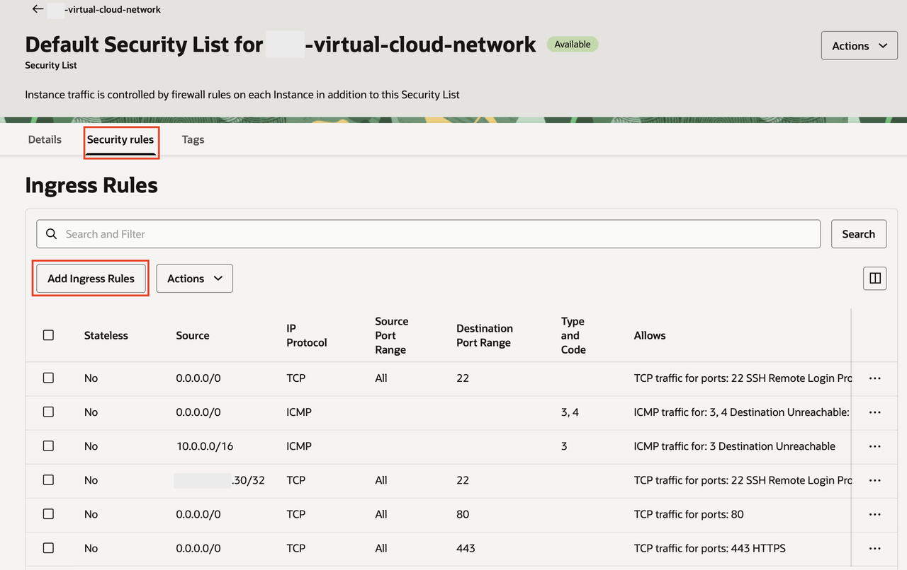

    | Field | Value |
    | --- | --- |
    | Source type | CIDR |
    | Source CIDR | Your administration network, preferably your laptop public IP as `<your-public-ip>/32` |
    | IP protocol | TCP |
    | Destination port range | `22` |
    | Description | `SSH from administrator workstation` |

    Leave the default egress rules unchanged unless your tenancy has a custom network policy. Egress controls outbound traffic from the instance; SSH access from your laptop uses an ingress rule.

6. Do not add ingress rules for ports `8001` through `8005`. These are internal agent service ports.

    Loopback-only means the services listen on `127.0.0.1`, which is the instance's local-only network address. A service bound to `127.0.0.1:8002` can be reached from the same VM with `curl http://127.0.0.1:8002/health`, but it is not reachable from the public internet. Keep these ports closed in OCI security lists and on the instance firewall.

7. After the instance reaches **Running** state, copy its public IP from OCI Console. Open the instance details page and locate **Primary VNIC** > **Public IPv4 address**. If the instance has no public IP, edit the VNIC or recreate the instance in a public subnet with public IP assignment enabled.

8. Configure the downloaded key on your laptop. Use the command set that matches your operating system, and replace the placeholder values.

    For macOS or Linux, open Terminal and run:

    ```bash
    <copy>
    mkdir -p ~/.ssh
    chmod 700 ~/.ssh
    mv ~/Downloads/<downloaded-private-key> ~/.ssh/my-ai-staff-oci.key
    chmod 600 ~/.ssh/my-ai-staff-oci.key
    </copy>
    ```

    Add this host entry to `~/.ssh/config`:

    ```ssh
    Host my-ai-staff-oci
        HostName <instance-public-ip>
        User opc
        IdentityFile ~/.ssh/my-ai-staff-oci.key
        IdentitiesOnly yes
    ```

    Test the connection:

    ```bash
    <copy>
    ssh my-ai-staff-oci
    </copy>
    ```

    For Windows, open PowerShell or Windows Terminal and run:

    ```powershell
    <copy>
    mkdir $env:USERPROFILE\.ssh
    move $env:USERPROFILE\Downloads\<downloaded-private-key> $env:USERPROFILE\.ssh\my-ai-staff-oci.key
    icacls $env:USERPROFILE\.ssh\my-ai-staff-oci.key /inheritance:r
    icacls $env:USERPROFILE\.ssh\my-ai-staff-oci.key /grant:r "$env:USERNAME:R"
    ssh -i $env:USERPROFILE\.ssh\my-ai-staff-oci.key opc@<instance-public-ip>
    </copy>
    ```

    If Windows reports that `ssh` is not recognized, install the OpenSSH Client optional feature or use VS Code Remote - SSH.

9. In VS Code, open the Command Palette, choose **Remote-SSH: Connect to Host**, and select `my-ai-staff-oci`. Edit the agent `.env` files on the instance through this connection; do not copy secrets into an unprotected local project folder or commit them.

## Task 2: Provision Autonomous Database 26ai

1. In OCI Console, create an Autonomous Database with workload type Transaction Processing.
    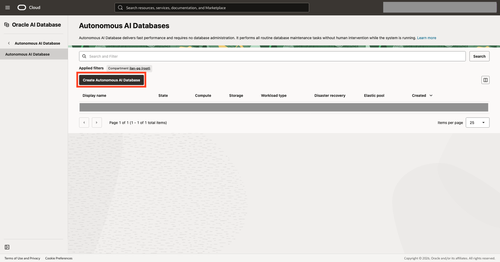

2. Choose Always Free and Oracle Database 26ai.
3. Enable secure access and download the wallet.

    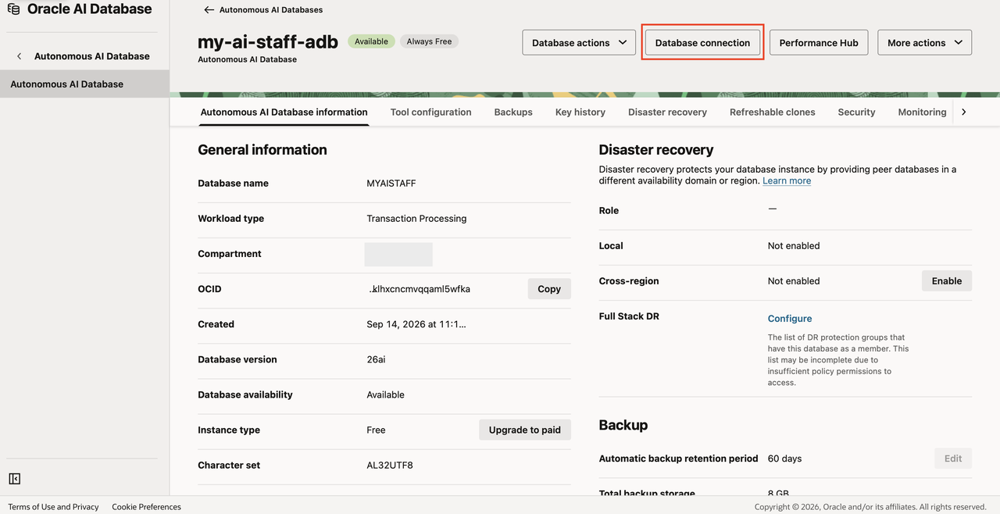

    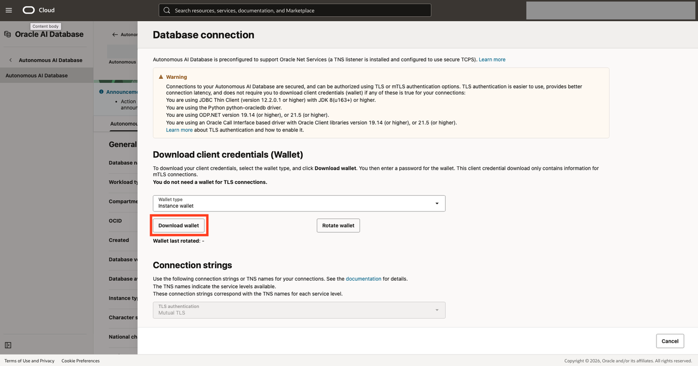

4. Copy the wallet zip file to the compute instance.

    When you download the wallet from Autonomous Database, your browser saves a file similar to `wallet_<db-name>.zip` on your laptop. Upload that ZIP to the `opc` user's home directory on the compute instance before you try to unzip it.

    On macOS or Linux, run this command from your laptop terminal:

    ```bash
    <copy>
    scp ~/Downloads/wallet_<db-name>.zip my-ai-staff-oci:~/wallet_<db-name>.zip
    </copy>
    ```

    If you did not configure the `my-ai-staff-oci` SSH alias in Task 1, use the key and public IP directly:

    ```bash
    <copy>
    scp -i ~/.ssh/my-ai-staff-oci.key ~/Downloads/wallet_<db-name>.zip opc@<instance-public-ip>:~/wallet_<db-name>.zip
    </copy>
    ```

    On Windows, run this command from PowerShell or Windows Terminal:

    ```powershell
    <copy>
    scp -i $env:USERPROFILE\.ssh\my-ai-staff-oci.key $env:USERPROFILE\Downloads\wallet_<db-name>.zip opc@<instance-public-ip>:~/wallet_<db-name>.zip
    </copy>
    ```

    The upload succeeds when `scp` returns to your local prompt with no error.

5. SSH into the compute instance and extract the wallet under the deployment user's home directory.

    ```
    <copy>
    mkdir -p ~/oracle/wallet
    unzip ~/wallet_<db-name>.zip -d ~/oracle/wallet
    ls ~/oracle/wallet/{sqlnet.ora,tnsnames.ora,cwallet.sso}
    </copy>
    ```

6. Verify the extracted wallet files include `sqlnet.ora`, `tnsnames.ora`, `cwallet.sso`, `ewallet.p12`, and `ewallet.pem`.

7. Record the wallet directory as `ADB_WALLET_DIR` for Lab 3. The agents pass the database ADMIN password as the wallet passphrase because `ewallet.pem` is passphrase-protected; do not confuse it with the separate password used when downloading the wallet zip.

## Task 3: Create the Application Schema and Run the Fresh-Build DDL

1. Download the [fresh-build AI_FOR_YOU DDL script](./sql/ai_for_you_fresh_ddl.sql) to your laptop. This is the workshop's executable schema script. It includes the application tables, foreign keys, indexes, and duality views required by a new deployment; it does not include objects that the memory package or Assistant Agent creates automatically.

2. In the Autonomous Database Console, open **Database Actions** and choose **SQL**. Connect as `ADMIN`.
    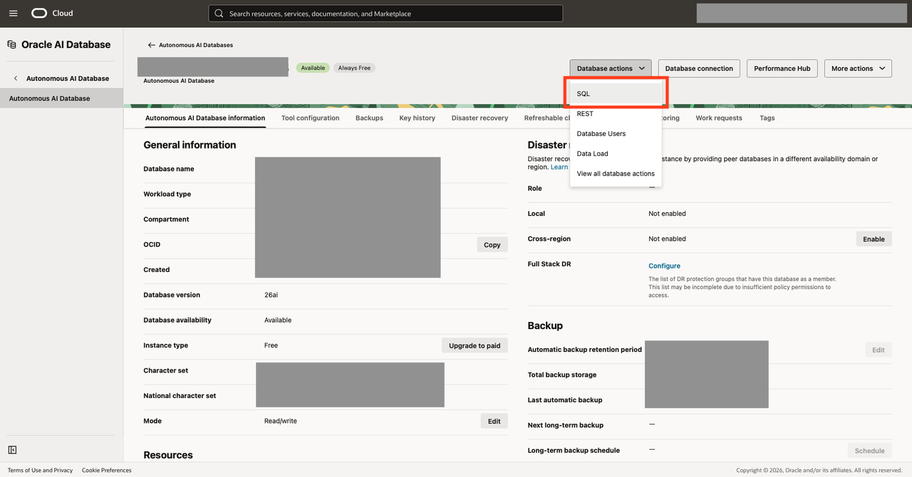

3. Create the AI_FOR_YOU schema. Use a strong password that does not contain a double quote, because it is entered in the quoted SQL literal below.

    ```
    <copy>
    CREATE USER AI_FOR_YOU IDENTIFIED BY "<strong-password>";
    GRANT CREATE SESSION, CREATE TABLE, CREATE SEQUENCE, CREATE VIEW TO AI_FOR_YOU;
    ALTER USER AI_FOR_YOU QUOTA UNLIMITED ON DATA;
    </copy>
    ```

4. Open the downloaded `ai_for_you_fresh_ddl.sql` in the SQL worksheet and choose **Run Script**. The first lines set `CURRENT_SCHEMA` and stop execution on the first SQL error. Run the file from top to bottom; do not run the historical migration files and do not edit the script to skip sections.

5. Confirm that the script reports `Fresh-build AI_FOR_YOU schema DDL completed.` and returns counts for the tables and duality views. If SQL Developer Web reports an error, stop at that statement and resolve it before continuing; do not replay the entire script over a partially created schema.

## Task 4: Load and Validate the ONNX Embedding Model

1. Oracle publishes the prebuilt `all_MiniLM_L12_v2` model in its [ONNX pretrained-model download table](https://docs.oracle.com/en/database/oracle/oracle-database/26/vecse/import-pretrained-models-onnx-format-vector-generation-database.html). The current direct Oracle download is [all_MiniLM_L12_v2.onnx](https://adwc4pm.objectstorage.us-ashburn-1.oci.customer-oci.com/p/iPX9W0MZeRkwJKWdFmdJCemmN-iKAl_bFvNGYLW7YqIrw4kKsukL24J2q93Beb9S/n/adwc4pm/b/OML-ai-models/o/all_MiniLM_L12_v2.onnx). If Oracle rotates that pre-authenticated URL, open the documentation page and use the current download link.

2. In the same `ADMIN` SQL worksheet, run the following block. It uses Oracle's documented [`DBMS_VECTOR.LOAD_ONNX_MODEL_CLOUD`](https://docs.oracle.com/en/database/oracle/oracle-database/26/vecse/load_onnx_model_cloud.html) procedure. The `credential => NULL` setting is correct for a pre-authenticated Object Storage URL. The existence check makes the block safe to run again without manually skipping a load section.

    ```
    <copy>
    WHENEVER SQLERROR EXIT SQL.SQLCODE

    DECLARE
      l_model_count NUMBER;
    BEGIN
      SELECT COUNT(*)
        INTO l_model_count
        FROM USER_MINING_MODELS
       WHERE MODEL_NAME = 'MINILM_V2';

      IF l_model_count = 0 THEN
        DBMS_VECTOR.LOAD_ONNX_MODEL_CLOUD(
          model_name => 'ADMIN.MINILM_V2',
          credential => NULL,
          uri        => 'https://adwc4pm.objectstorage.us-ashburn-1.oci.customer-oci.com/p/iPX9W0MZeRkwJKWdFmdJCemmN-iKAl_bFvNGYLW7YqIrw4kKsukL24J2q93Beb9S/n/adwc4pm/b/OML-ai-models/o/all_MiniLM_L12_v2.onnx'
        );
      END IF;
    END;
    /

    SELECT MODEL_NAME, ALGORITHM, MINING_FUNCTION
      FROM USER_MINING_MODELS
     WHERE MODEL_NAME = 'MINILM_V2';

    SELECT VECTOR_EMBEDDING(ADMIN.MINILM_V2 USING 'hello' AS data);
    </copy>
    ```

3. Confirm that the first query returns `MINILM_V2` and that the second query returns a vector. The model must be owned by `ADMIN` as `ADMIN.MINILM_V2`; the Data Agent memory endpoints require this model.

4. Lab 1 is complete. Continue directly to **Lab 2: Install the My AI Staff Runtime (Manual Path)**. Do not return to Lab 1 after starting Lab 2.

## Acknowledgements

- Authors: Cyrce Salinas Rojas and Ilan Gomez Guerrero
- Last Updated: Ilan Gomez Guerrero, September 2026
