# Lab 1: Prepare OCI Infrastructure and Database (Manual Path)

## Introduction

In this lab, you will prepare the base OCI environment and database foundation for My AI Staff. You will create compute and network resources, provision Autonomous Database 26ai, load the schema, and validate in-database vector embeddings.

Estimated Time: 60 minutes

### Objectives

In this lab, you will:

- Create OCI compute and ingress rules for secure access.
- Provision Autonomous Database 26ai and wallet files.
- Create the AI FOR YOU schema and load the application DDL.
- Load and validate the MiniLM ONNX embedding model.

### Prerequisites

- Completion of the workshop Introduction.
- OCI tenancy access with permissions to create compute and database resources.
- A laptop with an SSH client. macOS and most Linux distributions include OpenSSH. Windows users can use PowerShell with OpenSSH, Windows Terminal, or VS Code Remote - SSH. You will create or download the SSH key and configure the connection after the instance is created and its public IP is assigned.
- A browser for OCI Console and SQL Developer Web, or SQLcl installed on the instance.

## Task 1: Create Compute and Network Access

1. In [OCI Console](https://www.oracle.com/latam/cloud/sign-in.html), create one Oracle Linux 9 ARM instance using shape VM.Standard.A1.Flex
    (If not available choose a similar Shape, check documentation for more info [here](https://docs.oracle.com/es-ww/iaas/Content/Compute/References/computeshapes.htm#flexible)).

    

    

2. Configure the instance to use 2 OCPUs and 12 GB memory.

    

    

3. Create a new VCN and a Public Subnet, with a CIDR Block in the default 10.0.0.0/24

    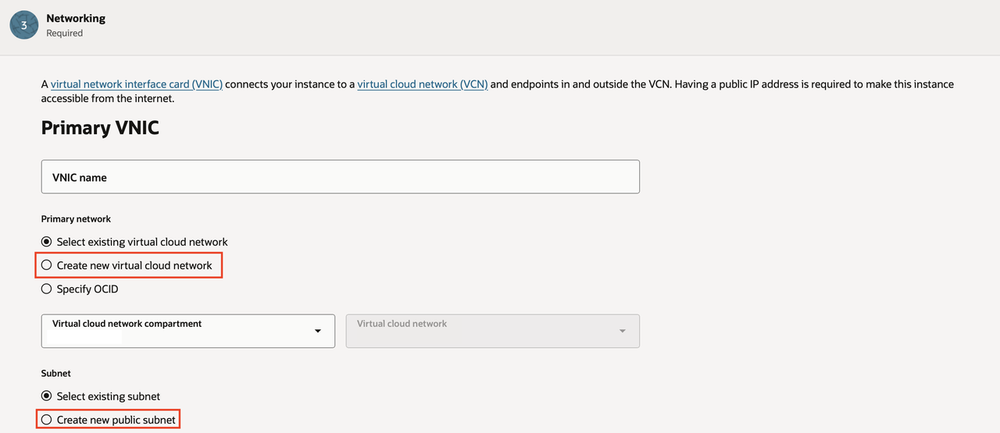

4. Under **Add SSH keys**, choose **Generate a key pair** and download the private key immediately, or upload a public key that you already control. OCI needs the public key during launch; the connection configuration happens after the instance is created.

    

    After that all Instance Configuration left can be left as default.

5. Find the security list for the instance subnet. In OCI Console, open the running instance, locate the **Primary VNIC** or **Subnet** link, open the subnet, and then open its attached **Security Lists**.

    

    

    

6. Add an **Ingress Rule**, not an egress rule, for SSH access. Use these values:

    

    | Field | Value |
    | --- | --- |
    | Source type | CIDR |
    | Source CIDR | Your administration network, preferably your laptop public IP as `<your-public-ip>/32` |
    | IP protocol | TCP |
    | Destination port range | `22` |
    | Description | `SSH from administrator workstation` |

    Leave the default egress rules unchanged unless your tenancy has a custom network policy. Egress controls outbound traffic from the instance; SSH access from your laptop uses an ingress rule.

9. After the instance reaches **Running** state, copy its public IP from OCI Console. Open the instance details page and locate **Networking** > **Primary VNIC** > **Public IPv4 address**.

    Complete the following public IP assignment steps only if the public IP field shows `-`. If a public IP already appears, copy it and skip to step 8.

    On the instance details page, open **Networking**, then click the **Primary VNIC** name under **Attached VNICs**.

    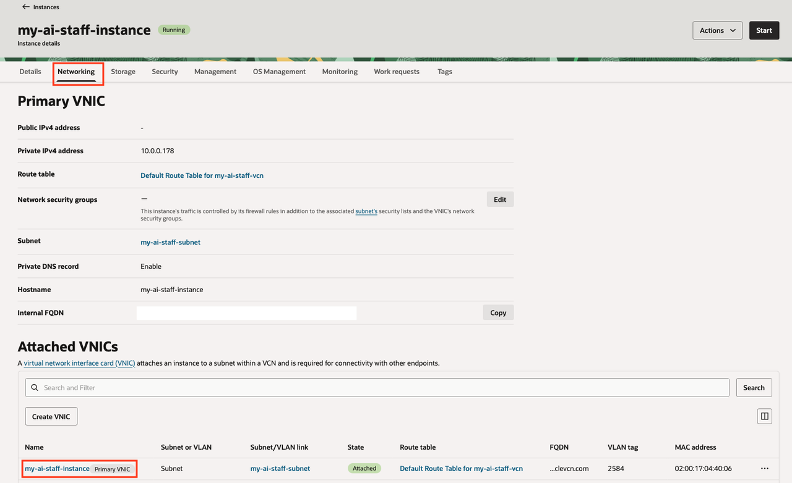

    In the VNIC page, open **IP administration**. In the private IP row, open the actions menu and choose **Edit**.

    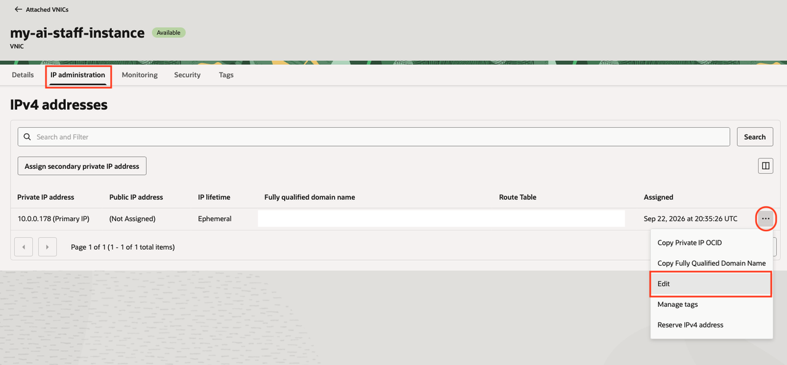

    In **Edit Private IP Address**, select **Ephemeral public IP** for a temporary lab IP, or **Reserved public IP** if wanted. Keep **Use VCN, subnet or VNIC route table** selected, then choose **Update**.

    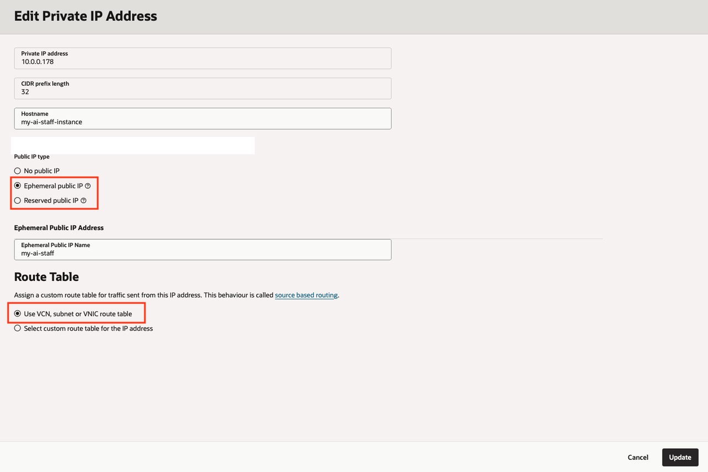

    Return to the instance details page and copy the new **Public IPv4 address**. Use this value as `<instance-public-ip>` in the SSH commands below.

10. Configure the downloaded key on your laptop. Use the command set that matches your operating system, and replace the placeholder values.

    For macOS or Linux, open Terminal and run:

    ```bash
    <copy>
    mkdir -p ~/.ssh
    chmod 700 ~/.ssh
    mv ~/Downloads/<downloaded-private-key> ~/.ssh/my-ai-staff-oci.key
    chmod 600 ~/.ssh/my-ai-staff-oci.key
    </copy>
    ```

    Open or create your SSH config file:

    ```bash
    <copy>
    touch ~/.ssh/config
    chmod 600 ~/.ssh/config
    nano ~/.ssh/config
    </copy>
    ```

    In `nano`, paste this host entry at the end of the file. Replace `<instance-public-ip>` with the public IP from step 8. Save with `Ctrl+O`, press `Enter`, then exit with `Ctrl+X`.

    ```ssh
    <copy>
    Host my-ai-staff-oci
        HostName <instance-public-ip>
        User opc
        IdentityFile ~/.ssh/my-ai-staff-oci.key
        IdentitiesOnly yes
    </copy>
    ```

    Test the connection:

    ```bash
    <copy>
    ssh my-ai-staff-oci
    </copy>
    ```

    For Windows, open PowerShell or Windows Terminal and run:

    ```powershell
    <copy>
    mkdir $env:USERPROFILE\.ssh
    move $env:USERPROFILE\Downloads\<downloaded-private-key> $env:USERPROFILE\.ssh\my-ai-staff-oci.key
    icacls $env:USERPROFILE\.ssh\my-ai-staff-oci.key /inheritance:r
    icacls $env:USERPROFILE\.ssh\my-ai-staff-oci.key /grant:r "$env:USERNAME:R"
    ssh -i $env:USERPROFILE\.ssh\my-ai-staff-oci.key opc@<instance-public-ip>
    </copy>
    ```

    If Windows reports that `ssh` is not recognized, install the OpenSSH Client optional feature or use VS Code Remote - SSH.

11. In VS Code, open the Command Palette, choose **Remote-SSH: Connect to Host**, and select `my-ai-staff-oci`. Edit the agent `.env` files on the instance through this connection; do not copy secrets into an unprotected local project folder or commit them.

## Task 2: Provision Autonomous Database 26ai

1. In OCI Console, create an Autonomous Database with workload type Transaction Processing.

    

    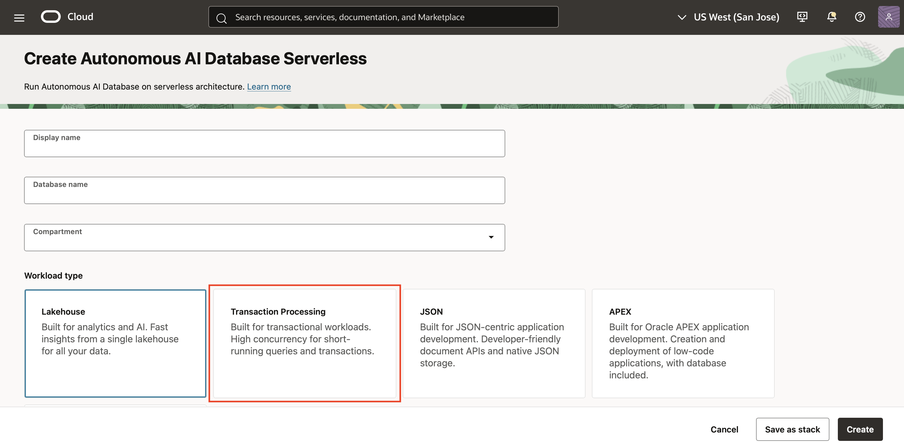

2. Choose Always Free and Oracle Database 26ai.

    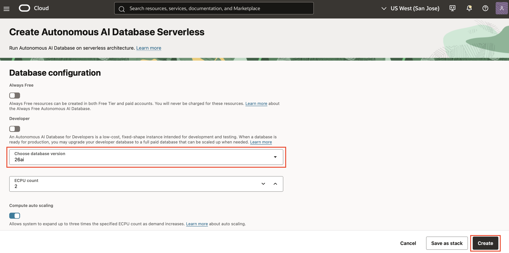

3. Enable secure access and download the wallet.

    

    

    When OCI asks for the wallet password or passphrase, enter the same password you use for the Autonomous Database `ADMIN` user. The runtime uses the `ADMIN` database password as the wallet passphrase in later labs.

4. Copy the wallet zip file to the compute instance.

    When you download the wallet from Autonomous Database, your browser saves a file similar to `wallet_<db-name>.zip` on your laptop. Upload that ZIP to the `opc` user's home directory on the compute instance before you try to unzip it.

    On macOS or Linux, run this command from your laptop terminal:

    ```bash
    <copy>
    scp ~/Downloads/wallet_<db-name>.zip my-ai-staff-oci:~/wallet_<db-name>.zip
    </copy>
    ```

    If you did not configure the `my-ai-staff-oci` SSH alias in Task 1, use the key and public IP directly:

    ```bash
    <copy>
    scp -i ~/.ssh/my-ai-staff-oci.key ~/Downloads/wallet_<db-name>.zip opc@<instance-public-ip>:~/wallet_<db-name>.zip
    </copy>
    ```

    On Windows, run this command from PowerShell or Windows Terminal:

    ```powershell
    <copy>
    scp -i $env:USERPROFILE\.ssh\my-ai-staff-oci.key $env:USERPROFILE\Downloads\wallet_<db-name>.zip opc@<instance-public-ip>:~/wallet_<db-name>.zip
    </copy>
    ```

    The upload succeeds when `scp` returns to your local prompt with no error.

5. SSH into the compute instance and extract the wallet under the deployment user's home directory.

    ```
    <copy>
    mkdir -p ~/oracle/wallet
    unzip ~/wallet_<db-name>.zip -d ~/oracle/wallet
    ls ~/oracle/wallet/{sqlnet.ora,tnsnames.ora,cwallet.sso}
    </copy>
    ```

6. Verify the extracted wallet files include `sqlnet.ora`, `tnsnames.ora`, `cwallet.sso`, `ewallet.p12`, and `ewallet.pem`.

7. Record the wallet directory as `ADB_WALLET_DIR` for Lab 3. The wallet password or passphrase must match the Autonomous Database `ADMIN` password because the runtime uses `ADB_PASSWORD` for both database login and wallet access.

## Task 3: Create a Clean Application Schema and Run the Fresh-Build DDL

1. Understand the database identities used by the platform.

    `ADMIN` owns the in-database embedding model and is the runtime connection user. `AI_FOR_YOU` owns the application tables, views, indexes, and runtime data. In Lab 3, set `ADB_USER=ADMIN` and set `ADB_PASSWORD` to the `ADMIN` database password. The runtime automatically sets `CURRENT_SCHEMA=AI_FOR_YOU` after connecting.

2. Download the [SQL AI FOR YOU Script](./sql/ai_for_you_fresh_ddl.sql) to your laptop. This is the workshop's executable schema script. It recreates the `AI_FOR_YOU` schema, creates the application tables, foreign keys, indexes, and duality views, and prints validation counts at the end.

    This script is for a new lab environment. It drops and recreates `AI_FOR_YOU`. Do not run it against an environment that contains data you need to keep.

3. In the Autonomous Database Console, open **Database Actions** and choose **SQL**. Connect as `ADMIN`.

    

4. Open the downloaded `ai_for_you_fresh_ddl.sql` in the SQL worksheet. Replace `<replace-with-strong-password>` near the top of the file with a strong `AI_FOR_YOU` schema password that does not contain a double quote.

    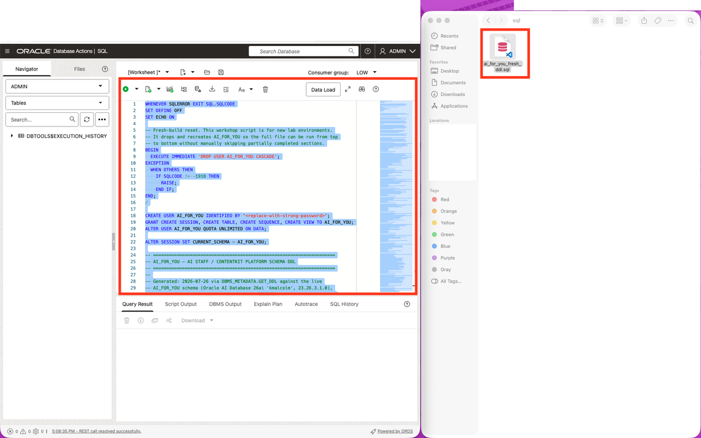

    ```
    <copy>
    CREATE USER AI_FOR_YOU IDENTIFIED BY "<replace-with-strong-password>";
    </copy>
    ```

    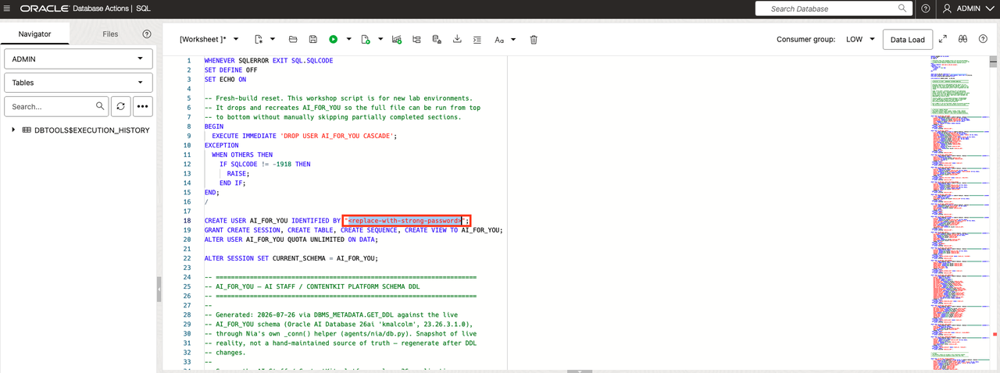

5. Choose **Run Script**. Run the file from top to bottom. Do not run historical migration files and do not edit the script to skip sections.

    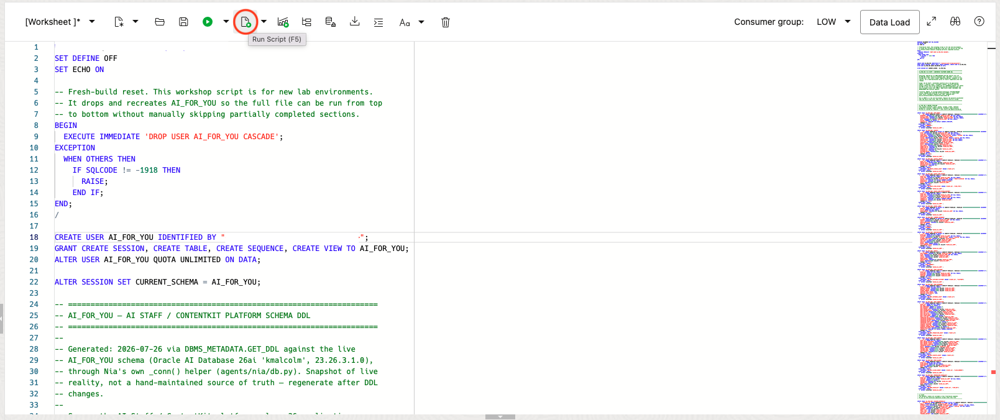

6. Confirm that the script reports `Fresh-build AI_FOR_YOU schema DDL completed.` and returns the final `CHECK_NAME` and `CHECK_VALUE` result table.

    Before continuing, confirm:

    - `TABLE_COUNT` has a `CHECK_VALUE` greater than `0`.
    - `VIEW_COUNT` has a `CHECK_VALUE` of `2`.

    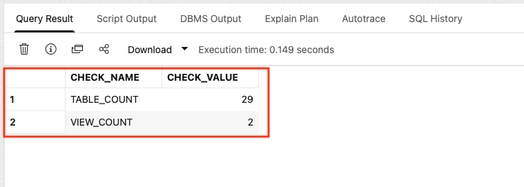

    If you do not see the final result table, run this validation query in the same SQL worksheet:

    ```sql
    <copy>
    SELECT 'TABLE_COUNT' AS CHECK_NAME,
           COUNT(*) AS CHECK_VALUE
      FROM ALL_TABLES
     WHERE OWNER = 'AI_FOR_YOU'
       AND TABLE_NAME NOT LIKE 'OAM_%'
       AND TABLE_NAME <> 'REMINDERS'
    UNION ALL
    SELECT 'VIEW_COUNT' AS CHECK_NAME,
           COUNT(*) AS CHECK_VALUE
      FROM ALL_OBJECTS
     WHERE OWNER = 'AI_FOR_YOU'
       AND OBJECT_NAME IN ('AISTAFF_CLIENT_DV', 'POST_CONTENT_DV')
       AND OBJECT_TYPE LIKE '%VIEW%';
    </copy>
    ```


## Task 4: Load and Validate the ONNX Embedding Model

1. Understand why the ONNX model is required.

    The agents do not call an external embedding API. Oracle AI Database generates embeddings internally with Oracle AI Vector Search. To enable that, load Oracle's prebuilt `all_MiniLM_L12_v2` ONNX model into the `ADMIN` schema as `MINILM_V2`. The SQL block in the next step loads the model directly from Oracle Object Storage; no manual model download is required.

2. In the same `ADMIN` SQL worksheet, run the following block. The existence check makes the block safe to run again without manually skipping a load section.

    ```
    <copy>
    SET DEFINE OFF
    SET ECHO ON

    DECLARE
      l_model_count NUMBER;
    BEGIN
      SELECT COUNT(*)
        INTO l_model_count
        FROM USER_MINING_MODELS
       WHERE MODEL_NAME = 'MINILM_V2';

      IF l_model_count = 0 THEN
        DBMS_VECTOR.LOAD_ONNX_MODEL_CLOUD(
          model_name => 'ADMIN.MINILM_V2',
          credential => NULL,
          uri        => 'https://adwc4pm.objectstorage.us-ashburn-1.oci.customer-oci.com/p/iPX9W0MZeRkwJKWdFmdJCemmN-iKAl_bFvNGYLW7YqIrw4kKsukL24J2q93Beb9S/n/adwc4pm/b/OML-ai-models/o/all_MiniLM_L12_v2.onnx'
        );
      END IF;
    END;
    /

    SELECT MODEL_NAME, ALGORITHM, MINING_FUNCTION
      FROM USER_MINING_MODELS
     WHERE MODEL_NAME = 'MINILM_V2';

    SELECT VECTOR_EMBEDDING(ADMIN.MINILM_V2 USING 'hello' AS data);
    </copy>
    ```

    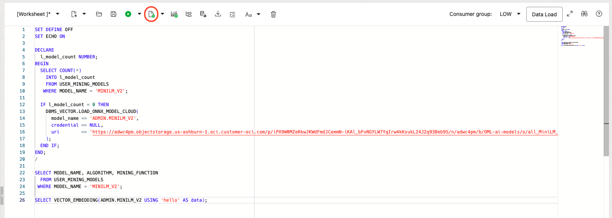

3. Confirm that the model validation succeeds.

    Before continuing, confirm:

    - The model query returns `MINILM_V2`, `ONNX`, and `EMBEDDING`.
    - The embedding query returns a vector.

    The model must be owned by `ADMIN` as `ADMIN.MINILM_V2`; the Data Agent memory endpoints require this model.

    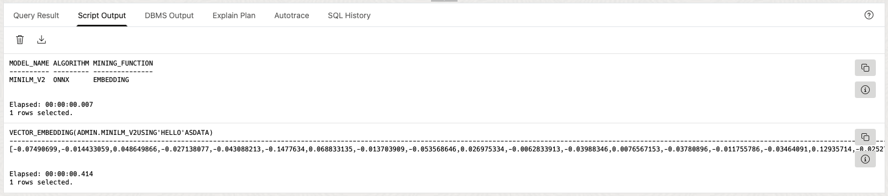

4. Lab 1 is complete. Continue directly to **Lab 2: Install the My AI Staff Runtime (Manual Path)**.

## Acknowledgements

- Authors: Cyrce Salinas Rojas and Ilan Gómez guerrero
- Last Updated: Ilan Gómez guerrero, September 2026