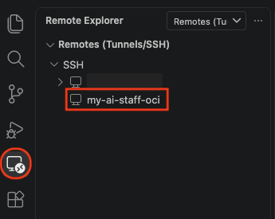
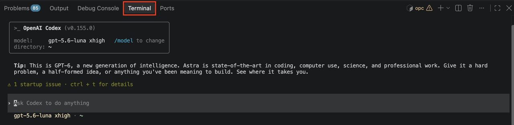
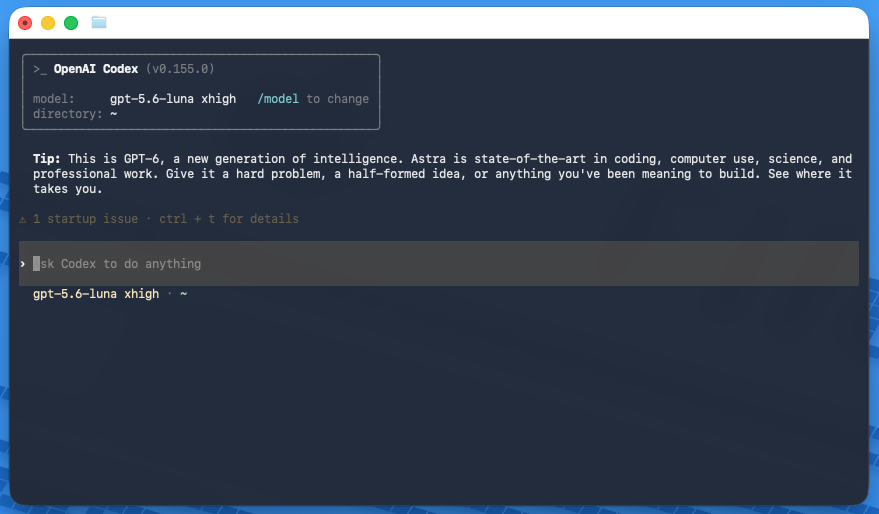

# Lab 2: Install the My AI Staff Runtime (Manual Path)

## Introduction

In this manual-path lab, you install the runtime tools, copy the workshop ZIP, install Codex skills, and create the Python virtual environments. Lab 3 covers Slack apps, environment files, and service activation. If you completed the Fast Path: Click the Magic Button, skip this lab and continue to Lab 3.

Estimated Time: 90 minutes

### Objectives

In this lab, you will:

- Install platform dependencies and runtime tools.
- Configure per-agent Python virtual environments.
- Install rclone for required Google Drive delivery.
- Prepare the current agent directories for Slack configuration and service activation.

### Prerequisites

- Completion of Lab 1.
- SSH access to the OCI compute instance.
- A personal Gmail account and a personal Slack account/workspace for this workshop.
- Do not use a corporate or customer-owned account for workshop identities or OAuth consent.
- Slack admin rights for that workspace.

## Task 1: Install Runtime Packages and Tooling

1. Connect to the OCI compute instance from your laptop. Use either method:
    - **VS Code:** Open the Command Palette, select **Remote-SSH: Connect to Host**, choose `my-ai-staff-oci`, and open **Terminal > New Terminal**. Run the commands below in that remote terminal.

    

    - **Laptop terminal:** Run `ssh my-ai-staff-oci` from a local terminal. After the prompt changes to the remote `opc` shell, run the commands below.

    Once connected, update system packages:

    ```
    <copy>
    sudo dnf update -y
    sudo dnf install -y dnf-plugins-core git curl unzip python3.12 policycoreutils-python-utils
    sudo dnf config-manager --set-enabled ol9_developer_EPEL
    sudo dnf install -y rclone
    rclone version
    </copy>
    ```

2. Install Codex CLI on the compute instance with the Linux standalone installer.

    ```
    <copy>
    curl -fsSL https://chatgpt.com/codex/install.sh | sh
    export PATH="$HOME/.local/bin:$PATH"
    command -v codex
    codex --version
    </copy>
    ```

    If `command -v codex` does not print a path, close and reopen the remote shell. Then run the verification commands again. Record the printed path for `CODEX_BIN` in Lab 3.

3. Start Codex CLI and sign in with ChatGPT.

    ```
    <copy>
    codex
    </copy>
    ```

    In the Codex interface, select **Sign in with ChatGPT** and complete the browser flow. On a remote OCI instance, the browser may not open automatically. If Codex prints a login URL or device code, copy it from the terminal. Open it in your laptop browser, complete the sign-in, and return to the remote shell.

    After signing in, you should see a Codex session similar to these examples:

    

    

4. Verify the CLI from the instance shell using a non-destructive test.

    ```
    <copy>
    codex exec --skip-git-repo-check "Reply with OK."
    </copy>
    ```

## Task 2: Download the Platform ZIP, Install Its Codex Skills, and Build Virtual Environments

1. Download the supplied platform ZIP and extract it into your home directory. The archive already contains the complete `livelabs-ai-staff/` directory, so do not run `git clone`. Use `~/livelabs-ai-staff`; later services expect this path.

    ```
    <copy>
    cd ~
    curl -fL --retry 3 'https://c4u02.objectstorage.us-ashburn-1.oci.customer-oci.com/p/9DEArLjsgbKXuJgQtSG95E8hMXRFtxgHR8jiHbqz4HgyVYXVnSo0SC_s-zq5CJA3/n/c4u02/b/hosted-files/o/livelabs-ai-staff.zip' -o /tmp/livelabs-ai-staff.zip
    test ! -e ~/livelabs-ai-staff || { echo 'Remove or rename the existing ~/livelabs-ai-staff directory before continuing.'; exit 1; }
    unzip -q /tmp/livelabs-ai-staff.zip -d ~
    cd ~/livelabs-ai-staff
    mkdir -p posts pending-posts
    test -f schema/ai_for_you_full_ddl.sql
    find . -maxdepth 1 -type d -print | sort
    </copy>
    ```

2. Install the Codex skills included in the ZIP. Then verify that Codex can discover them.

    ```
    <copy>
    cd ~/livelabs-ai-staff
    mkdir -p ~/.codex/skills
    cp -a /home/opc/livelabs-ai-staff/plugins/livelabsagentic-skills/skills/. ~/.codex/skills/
    find ~/.codex/skills -maxdepth 2 -name SKILL.md | wc -l
    </copy>
    ```

    The verification command must return a number greater than `0`. Start a new Codex session after copying the skills.

    The next steps create Python virtual environments for services that start in Lab 3. The SELinux commands label only the virtual-environment executable directories. This lets systemd run those Python interpreters. It does not disable SELinux, open network ports, or make the project directory public.

3. Build Python 3.9 virtual environments for `pipeline`, `assistant`, `brand-agent`, `ops`, `publish`, and `website`.

    ```
    <copy>
    cd ~/livelabs-ai-staff
    for agent in pipeline assistant brand-agent ops publish website; do
      python3 -m venv "agents/$agent/venv"
      "agents/$agent/venv/bin/pip" install --upgrade pip
      "agents/$agent/venv/bin/pip" install -r "agents/$agent/requirements.txt"
      "agents/$agent/venv/bin/pip" install -r agents/shared/requirements.txt
      sudo chcon -R -t bin_t "agents/$agent/venv/bin/"
      sudo chcon -h -t bin_t "agents/$agent/venv/bin/python"*
      sudo semanage fcontext -a -t bin_t "/home/opc/livelabs-ai-staff/agents/$agent/venv/bin(/.*)?" || \
        sudo semanage fcontext -m -t bin_t "/home/opc/livelabs-ai-staff/agents/$agent/venv/bin(/.*)?"
    done
    sudo restorecon -Rv ~/livelabs-ai-staff/agents
    </copy>
    ```

4. Create the Data Agent `agents/data/venv` with Python 3.12. Its memory dependencies require Python 3.10 or later.

    ```
    <copy>
    cd ~/livelabs-ai-staff
    python3.12 -m venv agents/data/venv
    agents/data/venv/bin/pip install --upgrade pip
    agents/data/venv/bin/pip install -r agents/data/requirements.txt
    sudo chcon -R -t bin_t agents/data/venv/bin/
    sudo chcon -h -t bin_t agents/data/venv/bin/python*
    sudo semanage fcontext -a -t bin_t '/home/opc/livelabs-ai-staff/agents/data/venv/bin(/.*)?' || \
      sudo semanage fcontext -m -t bin_t '/home/opc/livelabs-ai-staff/agents/data/venv/bin(/.*)?'
    sudo restorecon -Rv agents/data/venv
    </copy>
    ```

5. Create and label the File Editor virtual environment. This step installs dependencies only; Lab 3 starts the editor service.

    ```
    <copy>
    python3 -m venv apps/file-editor/venv
    apps/file-editor/venv/bin/pip install --upgrade pip
    apps/file-editor/venv/bin/pip install -r apps/file-editor/requirements.txt
    apps/file-editor/venv/bin/pip install -r agents/shared/requirements.txt
    sudo chcon -R -t bin_t apps/file-editor/venv/bin/
    sudo chcon -h -t bin_t apps/file-editor/venv/bin/python*
    sudo semanage fcontext -a -t bin_t '/home/opc/livelabs-ai-staff/apps/file-editor/venv/bin(/.*)?' || \
      sudo semanage fcontext -m -t bin_t '/home/opc/livelabs-ai-staff/apps/file-editor/venv/bin(/.*)?'
    sudo restorecon -Rv apps/file-editor/venv
    </copy>
    ```

6. Create the AI Staff virtual environment only when you plan to enable Gmail, Calendar, email, or public-intake automation.

    ```
    <copy>
    python3 -m venv agents/aistaff/venv
    agents/aistaff/venv/bin/pip install --upgrade pip
    agents/aistaff/venv/bin/pip install -r agents/aistaff/requirements.txt
    agents/aistaff/venv/bin/pip install -r agents/shared/requirements.txt
    sudo chcon -R -t bin_t agents/aistaff/venv/bin/
    sudo chcon -h -t bin_t agents/aistaff/venv/bin/python*
    sudo semanage fcontext -a -t bin_t '/home/opc/livelabs-ai-staff/agents/aistaff/venv/bin(/.*)?' || \
      sudo semanage fcontext -m -t bin_t '/home/opc/livelabs-ai-staff/agents/aistaff/venv/bin(/.*)?'
    sudo restorecon -Rv agents/aistaff/venv
    </copy>
    ```

## Task 3: Prepare for Slack Configuration

1. Confirm the role mapping: Assistant Agent/`assistant`, Content Agent and Creative Agent/`pipeline`, Brand Agent/`brand-agent`, Data Agent/`data`, Ops Agent/`ops`, and Publish Agent/`publish`.
2. In Lab 3, you create the Slack apps. You also record each token, channel ID, owner member ID, and Assistant Agent bot ID in `.env.shared`.
3. Do not create a Slack app for Website Agent/`website`; it is the HTTP-only intake service.

## Acknowledgements

- Authors: Cyrce Salinas Rojas and Ilan Gomez Guerrero
- Last Updated: Cyrce Salinas Rojas, September 2026
