# Lab 3: Configure Slack Agents, Environment Files, and Services

## Introduction

In this lab, you import the role-specific Slack manifests supplied with this workshop, define generic bot names in `.env.shared`, populate deployment-specific environment files, and prepare the platform configuration. Google OAuth and external-service activation happen in Lab 4 and Lab 5 so this lab can be completed in the same order on both deployment paths. Slack permissions do not add channel membership, so you explicitly invite every bot to its working channels.

Estimated Time: 75 minutes

### Objectives

In this lab, you will:

- Create Slack channels and configure seven Socket Mode applications.
- Map the runtime services to generic Assistant, Content, Creative, Brand, Data, Ops, and Publish agents.
- Configure protected shared and per-agent environment files.
- Configure the Content Kit skill runtime file.
- Prepare the service configuration for activation after external integrations are configured.

### Prerequisites

- Completion of Lab 2.
- Laptop editor access through VS Code Remote - SSH or an equivalent editor connected to the OCI instance; you will edit protected agent environment files on the instance.
- A Slack account and a workshop Slack workspace. You can use an existing workspace where you can create channels and install internal apps, or create a new workspace at [Slack: Create a workspace](https://slack.com/get-started#/createnew).
- Permission to create channels and install custom Slack apps. If your organization restricts app installation, ask a Workspace Owner or app manager to approve the seven internal apps you create in this lab.
- An OpenAI account
- Database connection values, Slack tokens, channel IDs, and deployment owner member ID.

## Task 1: Prepare Slack, Create Channels, and Capture IDs

1. Choose the Slack workspace for this workshop.

    If you already have a workshop workspace, sign in to Slack and open that workspace. If you need a new one, go to [Slack: Create a workspace](https://slack.com/get-started#/createnew), enter your email address, confirm the code from Slack, and follow the prompts. The person who creates a new workspace becomes the Workspace Primary Owner.

    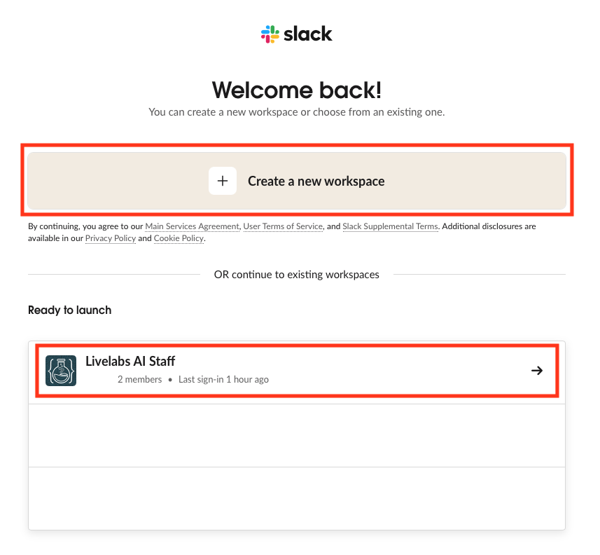

2. Confirm that your Slack user can create channels and install internal apps.

    In most workspaces, members can create channels from the plus sign in the Slack sidebar. Some company workspaces restrict channel creation or app installation. If you cannot create channels, ask a Workspace Owner for help before continuing. If app approval is enabled, ask the Workspace Owner or app manager to approve the internal apps after you import their manifests in Task 2.

    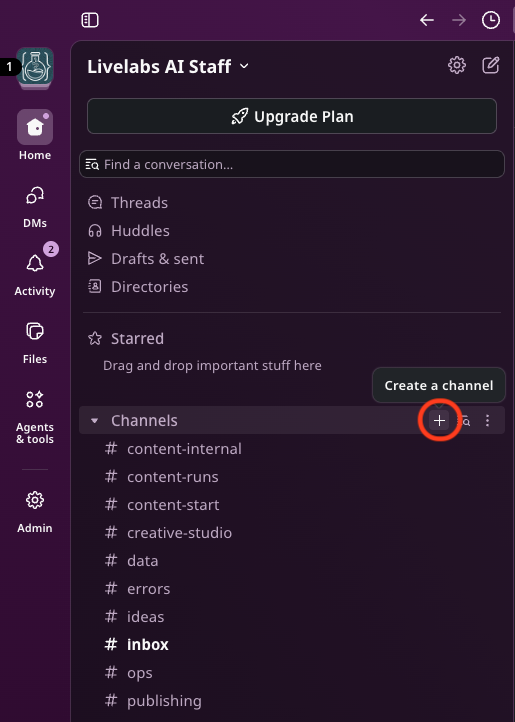

3. Create `#content-start`, `#content-runs`, `#content-internal`, `#creative-studio`, `#publishing`, `#data`, `#ops`, and `#errors` for the content workflow.

4. Create `#personal` (private), `#ideas`, `#inbox`, and `#briefing` for the Assistant Agent and AI Staff.

    

5. Copy every channel's `C...` ID from Slack and save it in a secure deployment worksheet. Environment files use IDs, not display names.

    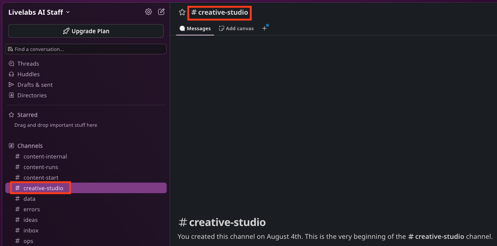

    

## Task 2: Import the Role-Specific Slack Manifests

1. At [Slack API: Your Apps](https://api.slack.com/apps), select **Create New App**, then **From an app manifest**. Select the workshop workspace and paste the matching JSON manifest from the blocks below.

    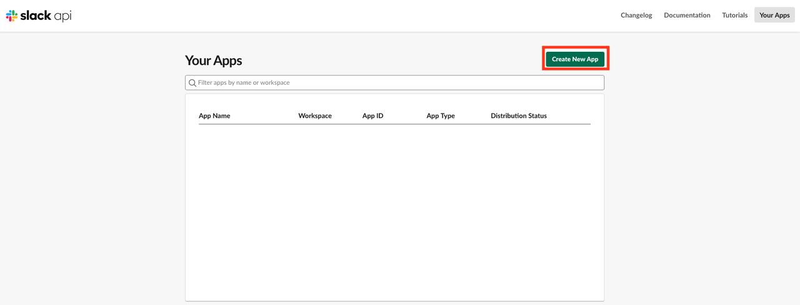

2. Import each manifest once. The manifests below are templates. You can change `display_information.name` and `features.bot_user.display_name` before importing each app if your deployment uses customer-specific bot names. Keep the scopes and events aligned with the role unless you intentionally change the runtime behavior.

    | Runtime directory | Manifest | Agent name | Required channel membership |
    | --- | --- | --- | --- |
    | `agents/assistant` | Assistant manifest below | Assistant Agent | `#personal`, `#ideas`, `#content-start`, `#publishing`, `#errors`, `#inbox`, `#briefing`, and direct messages |
    | `agents/pipeline` | Content manifest below | Content Agent | `#content-start`, `#content-runs`, `#content-internal`, `#publishing`, `#errors` |
    | `agents/pipeline` | Creative manifest below | Creative Agent | `#creative-studio`, `#content-runs`, `#content-internal`, `#errors` |
    | `agents/brand-agent` | Brand manifest below | Brand Agent | `#content-runs`, `#errors`, and direct messages |
    | `agents/data` | Data manifest below | Data Agent | `#data`, `#errors` |
    | `agents/ops` | Ops manifest below | Ops Agent | `#ops`, `#errors` |
    | `agents/publish` | Publish manifest below | Publish Agent | `#publishing`, `#content-runs`, `#errors` |


    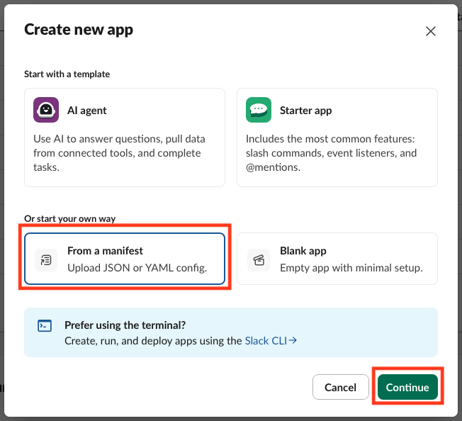

    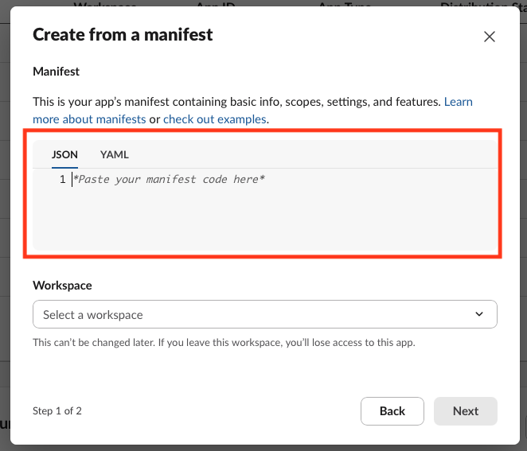

    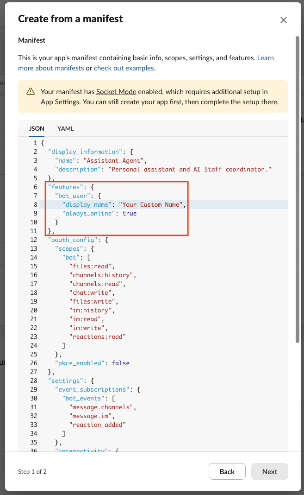

    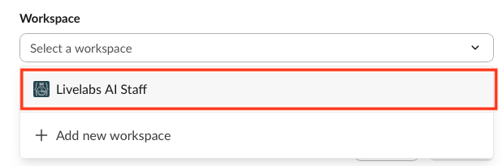

    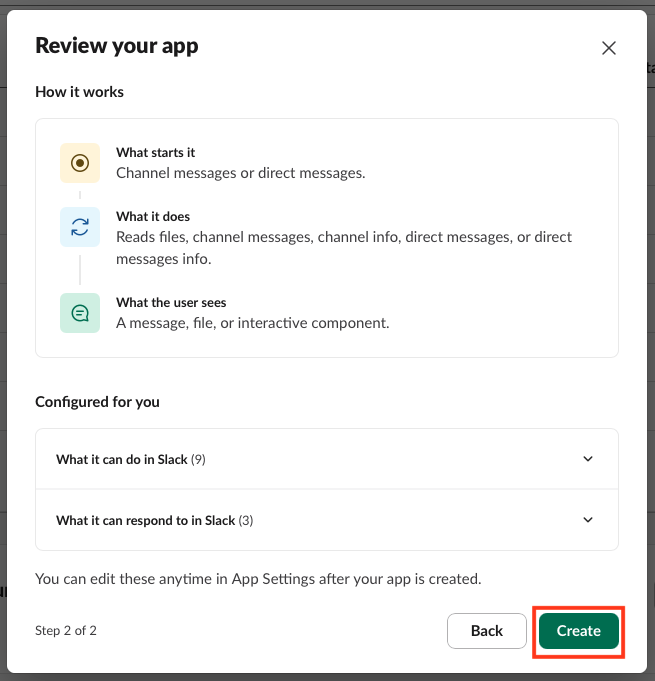

3. Paste this Assistant Agent manifest.

    ```json
    <copy>
    {
      "display_information": {
        "name": "Assistant Agent",
        "description": "Personal assistant and AI Staff coordinator."
      },
      "features": {
        "bot_user": {
          "display_name": "Assistant Agent",
          "always_online": true
        }
      },
      "oauth_config": {
        "scopes": {
          "bot": [
            "files:read",
            "channels:history",
            "channels:read",
            "chat:write",
            "files:write",
            "im:history",
            "im:read",
            "im:write",
            "reactions:read"
          ]
        },
        "pkce_enabled": false
      },
      "settings": {
        "event_subscriptions": {
          "bot_events": [
            "message.channels",
            "message.im",
            "reaction_added"
          ]
        },
        "interactivity": {
          "is_enabled": true
        },
        "org_deploy_enabled": false,
        "socket_mode_enabled": true,
        "token_rotation_enabled": false,
        "is_mcp_enabled": false
      }
    }
    </copy>
    ```

4. Paste this Content Agent manifest.

    ```json
    <copy>
    {
      "display_information": {
        "name": "Content Agent",
        "description": "Starts and coordinates content runs."
      },
      "features": {
        "bot_user": {
          "display_name": "Content Agent",
          "always_online": true
        }
      },
      "oauth_config": {
        "scopes": {
          "bot": [
            "chat:write",
            "channels:history",
            "channels:read",
            "files:write",
            "reactions:read"
          ]
        },
        "pkce_enabled": false
      },
      "settings": {
        "event_subscriptions": {
          "bot_events": [
            "message.channels",
            "reaction_added"
          ]
        },
        "interactivity": {
          "is_enabled": true
        },
        "org_deploy_enabled": false,
        "socket_mode_enabled": true,
        "token_rotation_enabled": false,
        "is_mcp_enabled": false
      }
    }
    </copy>
    ```

5. Paste this Creative Agent manifest.

    ```json
    <copy>
    {
      "display_information": {
        "name": "Creative Agent",
        "description": "Handles creative work and asset uploads."
      },
      "features": {
        "bot_user": {
          "display_name": "Creative Agent",
          "always_online": true
        }
      },
      "oauth_config": {
        "scopes": {
          "bot": [
            "chat:write",
            "channels:history",
            "channels:read",
            "files:write"
          ]
        },
        "pkce_enabled": false
      },
      "settings": {
        "event_subscriptions": {
          "bot_events": [
            "message.channels"
          ]
        },
        "interactivity": {
          "is_enabled": true
        },
        "org_deploy_enabled": false,
        "socket_mode_enabled": true,
        "token_rotation_enabled": false,
        "is_mcp_enabled": false
      }
    }
    </copy>
    ```

6. Paste this Brand Agent manifest.

    ```json
    <copy>
    {
      "display_information": {
        "name": "Brand Agent"
      },
      "features": {
        "bot_user": {
          "display_name": "Brand Agent",
          "always_online": false
        }
      },
      "oauth_config": {
        "scopes": {
          "bot": [
            "files:read",
            "channels:history",
            "channels:read",
            "chat:write",
            "files:write",
            "im:history",
            "im:read",
            "im:write",
            "reactions:read"
          ]
        },
        "pkce_enabled": false
      },
      "settings": {
        "event_subscriptions": {
          "bot_events": [
            "message.channels",
            "message.im",
            "reaction_added"
          ]
        },
        "interactivity": {
          "is_enabled": true
        },
        "org_deploy_enabled": false,
        "socket_mode_enabled": true,
        "token_rotation_enabled": false,
        "is_mcp_enabled": false
      }
    }
    </copy>
    ```

7. Paste this Data Agent manifest.

    ```json
    <copy>
    {
      "display_information": {
        "name": "Data Agent",
        "description": "Provides data and database operations."
      },
      "features": {
        "bot_user": {
          "display_name": "Data Agent",
          "always_online": true
        }
      },
      "oauth_config": {
        "scopes": {
          "bot": [
            "chat:write",
            "channels:history",
            "channels:read",
            "files:write"
          ]
        },
        "pkce_enabled": false
      },
      "settings": {
        "event_subscriptions": {
          "bot_events": [
            "message.channels"
          ]
        },
        "interactivity": {
          "is_enabled": true
        },
        "org_deploy_enabled": false,
        "socket_mode_enabled": true,
        "token_rotation_enabled": false,
        "is_mcp_enabled": false
      }
    }
    </copy>
    ```

8. Paste this Ops Agent manifest.

    ```json
    <copy>
    {
      "display_information": {
        "name": "Ops Agent",
        "description": "Reports and operates platform services."
      },
      "features": {
        "bot_user": {
          "display_name": "Ops Agent",
          "always_online": true
        }
      },
      "oauth_config": {
        "scopes": {
          "bot": [
            "chat:write",
            "channels:history",
            "channels:read",
            "files:write"
          ]
        },
        "pkce_enabled": false
      },
      "settings": {
        "event_subscriptions": {
          "bot_events": [
            "message.channels"
          ]
        },
        "interactivity": {
          "is_enabled": true
        },
        "org_deploy_enabled": false,
        "socket_mode_enabled": true,
        "token_rotation_enabled": false,
        "is_mcp_enabled": false
      }
    }
    </copy>
    ```

9. Paste this Publish Agent manifest.

    ```json
    <copy>
    {
      "display_information": {
        "name": "Publish Agent",
        "description": "Publishes approved work and uploads deliverables."
      },
      "features": {
        "bot_user": {
          "display_name": "Publish Agent",
          "always_online": true
        }
      },
      "oauth_config": {
        "scopes": {
          "bot": [
            "chat:write",
            "channels:history",
            "channels:read",
            "files:write"
          ]
        },
        "pkce_enabled": false
      },
      "settings": {
        "event_subscriptions": {
          "bot_events": [
            "message.channels"
          ]
        },
        "interactivity": {
          "is_enabled": true
        },
        "org_deploy_enabled": false,
        "socket_mode_enabled": true,
        "token_rotation_enabled": false,
        "is_mcp_enabled": false
      }
    }
    </copy>
    ```

10. Assistant Agent and Brand Agent are the only apps that need Direct Message access. Their manifests include `im:history`, `im:read`, `im:write`, and the `message.im` event. After importing those two manifests, verify that direct messages are enabled for each app before installing it.

    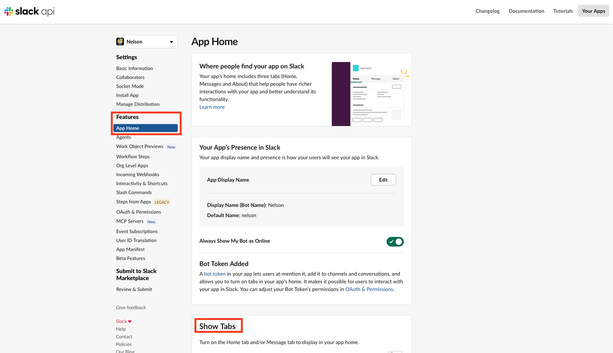

    

11. For each app, create an app-level token with `connections:write`, install or reinstall it, and record its `xoxb-...` bot token and `xapp-...` app token. Socket Mode needs both tokens.

    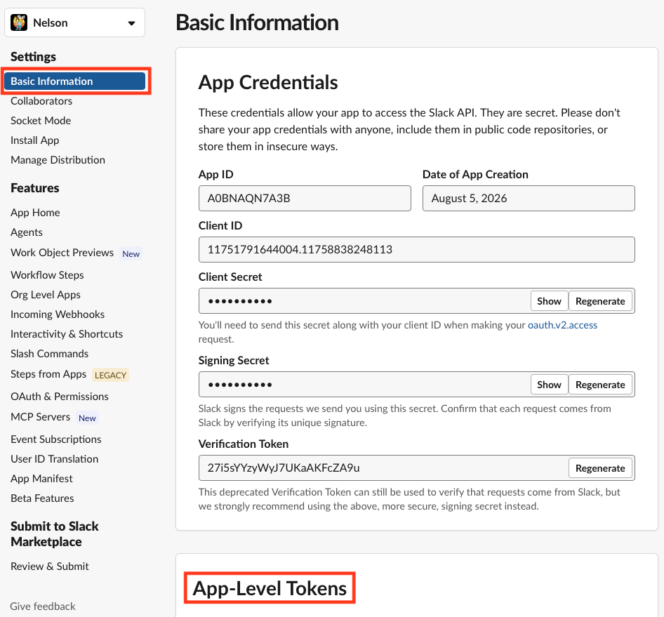

    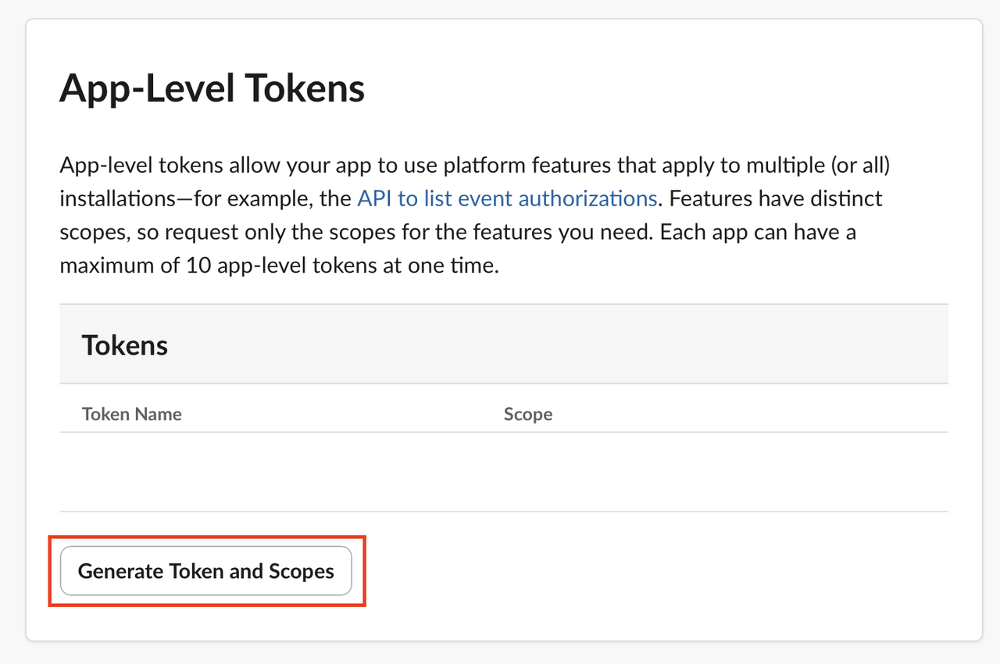

12. Invite each bot to all listed channels. A manifest grants scopes but does not grant membership; without membership, Slack does not deliver channel messages and file upload can fail with `not_in_channel`.

13. In your shell, export the Assistant Agent bot token temporarily, then obtain its bot ID and record it as `ASSISTANT_BOT_ID`. It is the only bot allowlisted to issue specialist-agent commands.

    ```
    <copy>
    export ASSISTANT_BOT_TOKEN='xoxb-<assistant-agent-token>'
    curl -s -H "Authorization: Bearer $ASSISTANT_BOT_TOKEN" \
      https://slack.com/api/auth.test | python3 -m json.tool
    unset ASSISTANT_BOT_TOKEN
    </copy>
    ```

14. Record the deployment owner's member ID as `SLACK_ASSISTANT_USER_ID`; the Assistant Agent uses it for reminders and privileged routing.

## Task 3: Configure and Protect Environment Files

1. Create environment files from the current templates. Do not commit the result or display secrets in evidence.

    ```
    <copy>
    cd ~/livelabs-ai-staff
    cp .env.shared.template .env.shared
    for agent in pipeline assistant brand-agent data ops publish aistaff; do
      cp "agents/$agent/.env.example" "agents/$agent/.env"
    done
    </copy>
    ```

2. Populate `.env.shared` with `ADB_DSN`, `ADB_USER`, `ADB_PASSWORD`, `ADB_WALLET_DIR`, `ASSISTANT_BOT_ID`, and `OPENAI_API_KEY`. Use the database values from Lab 1.

    ```
    <copy>
    ADB_USER=ADMIN
    ADB_PASSWORD=<admin-database-password>
    ADB_WALLET_DIR=/home/opc/oracle/wallet
    </copy>
    ```

    `ADB_PASSWORD` must be the Autonomous Database `ADMIN` password. It must also match the wallet passphrase from Lab 1. `AI_FOR_YOU` is the application schema, but the runtime connects as `ADMIN` and sets `CURRENT_SCHEMA=AI_FOR_YOU` automatically. The OpenAI key is required by the core visual-generation preflight. Add SMTP and AI Staff channel values only when those optional integrations are enabled.

3. Define all generic display names in `.env.shared`. This is required because the current runtime loads `.env.shared` first, then loads each agent-specific `.env`; do not set competing `*_BOT_NAME` values in the per-agent files.

    ```
    <copy>
    ASSISTANT_BOT_NAME="Assistant Agent"
    CONTENT_BOT_NAME="Content Agent"
    CREATIVE_BOT_NAME="Creative Agent"
    BRAND_BOT_NAME="Brand Agent"
    DATA_BOT_NAME="Data Agent"
    OPS_BOT_NAME="Ops Agent"
    PUBLISH_BOT_NAME="Publish Agent"
    </copy>
    ```

4. Use the current token names for a new deployment: `ASSISTANT_*`, `CONTENT_*`, `CREATIVE_*`, `BRAND_*`, `DATA_*`, `OPS_*`, and `PUBLISH_*`.

5. Set the same channel ID wherever it is shared. For example, `SLACK_PUBLISHING_CHANNEL` is used by pipeline, assistant, and publish.

6. Restrict access and label every environment file for SELinux.

    ```
    <copy>
    chmod 600 .env.shared agents/*/.env
    sudo chcon -t etc_t .env.shared agents/*/.env
    sudo semanage fcontext -a -t etc_t '/home/opc/livelabs-ai-staff/\.env\.shared' || \
      sudo semanage fcontext -m -t etc_t '/home/opc/livelabs-ai-staff/\.env\.shared'
    sudo semanage fcontext -a -t etc_t '/home/opc/livelabs-ai-staff/agents/[^/]+/\.env' || \
      sudo semanage fcontext -m -t etc_t '/home/opc/livelabs-ai-staff/agents/[^/]+/\.env'
    sudo restorecon -Rv ~/livelabs-ai-staff
    </copy>
    ```

## Task 4: Configure the Content Kit Runtime

The current runtime uses the local Codex plugin. The Content Kit configuration stores machine-specific paths and feature flags only. Never store API keys, OAuth tokens, passwords, or other secrets in this file.

1. Create the Content Kit configuration

    Run these commands from the repository root:

    ```bash
    cd /home/opc/livelabs-ai-staff

    export CONTENTKIT_CONFIG=/home/opc/.codex/contentkit/config.json

    mkdir -p /home/opc/.codex/contentkit
    chmod 700 /home/opc/.codex/contentkit

    cp plugins/livelabsagentic-skills/skills/content-kit/config.json.example \
      "$CONTENTKIT_CONFIG"

    chmod 600 "$CONTENTKIT_CONFIG"
    ```

    The `export` command is only required for the current shell when using the default path. Systemd services running as user `opc` use the same default path automatically. If a different configuration path is used, `CONTENTKIT_CONFIG` must also be defined in the environment of every service that invokes Content Kit scripts.

2. Edit the configuration

    Open the configuration file:

    ```bash
    vi "$CONTENTKIT_CONFIG"
    ```

    Replace its contents with valid, strict JSON. Do not include `//` comments or the words `Copy` or `Copymkdir` from rendered documentation.

    ```json
    {
      "base_dir": "/home/opc/livelabs-ai-staff",
      "python": "/home/opc/notebooklm-venv/bin/python3.12",
      "paths": {
        "shared": "/home/opc/livelabs-ai-staff/plugins/livelabsagentic-skills/resources/shared",
        "brand_guide": "/home/opc/livelabs-ai-staff/strategy/profiles/user/brand-guide.md",
        "content_strategy": "/home/opc/livelabs-ai-staff/strategy/profiles/user/general-strategy.md"
      },
      "fonts": {
        "sans": "/usr/share/fonts/dejavu-sans-fonts/DejaVuSans.ttf",
        "sans_bold": "/usr/share/fonts/dejavu-sans-fonts/DejaVuSans-Bold.ttf"
      },
      "image": {
        "provider": "cloudflare_workers_ai",
        "model": "@cf/black-forest-labs/flux-2-klein-9b",
        "width": 1024,
        "height": 1024,
        "guidance": 4.5,
        "max_reference_images": 4,
        "reference_max_width": 511,
        "reference_max_height": 511,
        "save_prompt_manifest": true,
        "reference": null
      },
      "db": {
        "nia_url": "http://127.0.0.1:8004",
        "enabled": false
      },
      "headshot": "/home/opc/livelabs-ai-staff/strategy/headshots/active-headshot.png",
      "substack": {
        "enabled": false,
        "substackrc": "~/.codex/.substackrc",
        "mcp_venv": "~/.codex/substack-mcp/venv/bin/python3",
        "mcp_path": "~/.codex/substack-mcp"
      }
    }
    ```

    Replace the following values for the specific deployment:

    - `base_dir`: the absolute path of the repository.
    - `python`: the Python 3.12 interpreter that has Pillow and numpy installed.
    - `paths.brand_guide`: the active deployment's brand guide.
    - `paths.content_strategy`: the active deployment's content strategy.
    - `headshot`: the deployment's actual headshot file.


3. Verify the Content Kit configuration

    First confirm that the file is strict JSON:

    ```bash
    python3 -m json.tool "$CONTENTKIT_CONFIG" >/dev/null
    ```

    Verify the configured interpreter and important files:

    ```bash
    test -x /home/opc/notebooklm-venv/bin/python3.12
    test -f /usr/share/fonts/dejavu-sans-fonts/DejaVuSans.ttf
    test -f /usr/share/fonts/dejavu-sans-fonts/DejaVuSans-Bold.ttf
    test -f /home/opc/livelabs-ai-staff/strategy/headshots/active-headshot.png
    ```

    The configuration file must remain private:

    ```bash
    chmod 600 "$CONTENTKIT_CONFIG"
    ```

The Content Kit configuration is now prepared for Lab 5, when the services are
activated after Google OAuth and the external integrations are complete.
Historical references to `~/.claude`, `~/.claude/skills`, or NotebookLM should
not be used in a fresh deployment.

## Acknowledgements

- Authors: Cyrce Salinas Rojas and Ilan Gomez Guerrero
- Last Updated: Ilan Gomez Guerrero, September 2026
