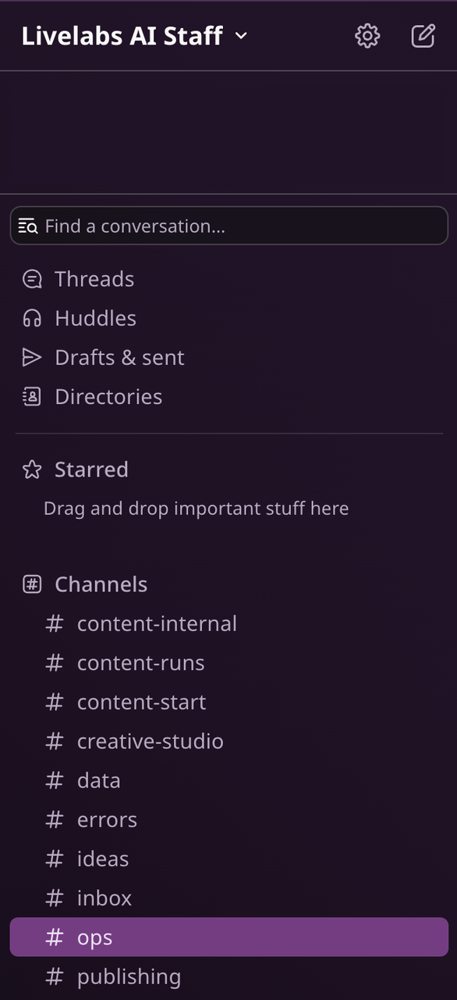
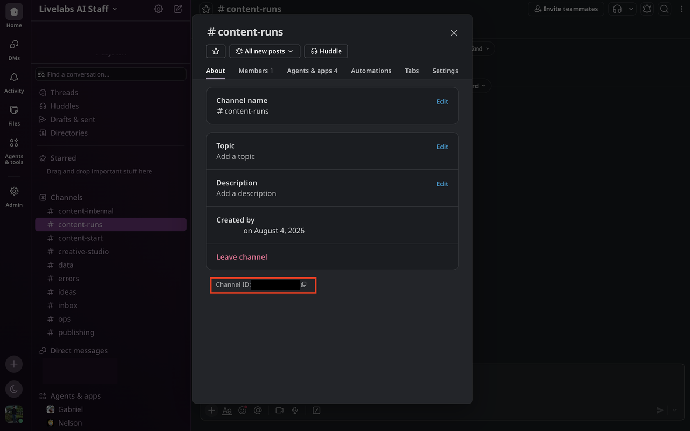
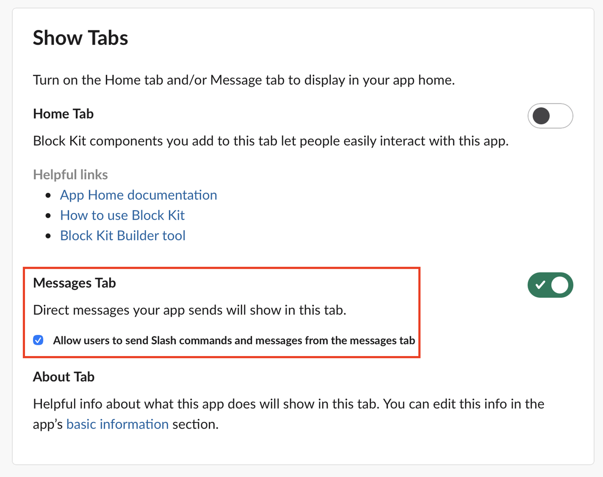

# Configure Slack Agents, Environment Files, and Services

## Introduction

In this lab, you import the role-specific Slack manifests supplied with this workshop, define generic bot names in `.env.shared`, configure required Google Drive delivery, populate deployment-specific environment files, and activate the platform services. Slack permissions do not add channel membership, so you explicitly invite every bot to its working channels.

Estimated Time: 75 minutes

### Objectives

In this lab, you will:

- Create Slack channels and configure seven Socket Mode applications.
- Map the runtime services to generic Assistant, Content, Creative, Brand, Data, Ops, and Publish agents.
- Configure protected shared and per-agent environment files.
- Configure required Google Drive delivery.
- Configure the Content Kit skill runtime file.
- Install current systemd units and enable the platform timers.

### Prerequisites

- Completion of Lab 2.
- Slack workspace administrator access.
- Database connection values, Slack tokens, channel IDs, and deployment owner member ID.

## Task 1: Create Channels and Capture IDs

1. Create `#content-start`, `#content-runs`, `#content-internal`, `#creative-studio`, `#publishing`, `#data`, `#ops`, and `#errors` for the content workflow.


2. Create `#personal` (private), `#ideas`, `#inbox`, and `#briefing` for the Assistant Agent and AI Staff. Create private `#website-inbox` if website intake approvals need a dedicated destination.

    

3. Copy every channel's `C...` ID from Slack and save it in a secure deployment worksheet. Environment files use IDs, not display names.

    

## Task 2: Import the Role-Specific Slack Manifests

1. At `api.slack.com/apps`, select **Create New App**, then **From an app manifest**. Select the deployment workspace and paste the matching JSON manifest from the blocks below.

2. Import each manifest once. The manifests below are templates. You can change `display_information.name` and `features.bot_user.display_name` before importing each app if your deployment uses customer-specific bot names. Keep the scopes and events aligned with the role unless you intentionally change the runtime behavior.

    | Runtime directory | Manifest | Agent name | Required channel membership |
    | --- | --- | --- | --- |
    | `agents/assistant` | Assistant manifest below | Assistant Agent | `#personal`, `#ideas`, `#content-start`, `#publishing`, `#errors`, `#inbox`, `#briefing`, and direct messages |
    | `agents/pipeline` | Content manifest below | Content Agent | `#content-start`, `#content-runs`, `#content-internal`, `#publishing`, `#errors` |
    | `agents/pipeline` | Creative manifest below | Creative Agent | `#creative-studio`, `#content-runs`, `#content-internal`, `#errors` |
    | `agents/brand-agent` | Brand manifest below | Brand Agent | `#content-runs`, `#errors`, and direct messages |
    | `agents/data` | Data manifest below | Data Agent | `#data`, `#errors` |
    | `agents/ops` | Ops manifest below | Ops Agent | `#ops`, `#errors` |
    | `agents/publish` | Publish manifest below | Publish Agent | `#publishing`, `#content-runs`, `#errors` |


3. Paste this Assistant Agent manifest.

    ```json
    <copy>
    {
      "display_information": {
        "name": "Assistant Agent",
        "description": "Personal assistant and AI Staff coordinator."
      },
      "features": {
        "bot_user": {
          "display_name": "Assistant Agent",
          "always_online": true
        }
      },
      "oauth_config": {
        "scopes": {
          "bot": [
            "chat:write",
            "channels:history",
            "channels:read",
            "groups:history",
            "groups:read",
            "im:history",
            "im:read",
            "im:write",
            "files:read",
            "files:write",
            "reactions:read"
          ]
        },
        "pkce_enabled": false
      },
      "settings": {
        "event_subscriptions": {
          "bot_events": [
            "message.channels",
            "message.groups",
            "message.im",
            "reaction_added"
          ]
        },
        "interactivity": {
          "is_enabled": false
        },
        "org_deploy_enabled": false,
        "socket_mode_enabled": true,
        "token_rotation_enabled": false,
        "is_mcp_enabled": false
      }
    }
    </copy>
    ```

4. Paste this Content Agent manifest.

    ```json
    <copy>
    {
      "display_information": {
        "name": "Content Agent",
        "description": "Starts and coordinates content runs."
      },
      "features": {
        "bot_user": {
          "display_name": "Content Agent",
          "always_online": true
        }
      },
      "oauth_config": {
        "scopes": {
          "bot": [
            "chat:write",
            "channels:history",
            "channels:read"
          ]
        },
        "pkce_enabled": false
      },
      "settings": {
        "event_subscriptions": {
          "bot_events": [
            "message.channels"
          ]
        },
        "interactivity": {
          "is_enabled": false
        },
        "org_deploy_enabled": false,
        "socket_mode_enabled": true,
        "token_rotation_enabled": false,
        "is_mcp_enabled": false
      }
    }
    </copy>
    ```

5. Paste this Creative Agent manifest.

    ```json
    <copy>
    {
      "display_information": {
        "name": "Creative Agent",
        "description": "Handles creative work and asset uploads."
      },
      "features": {
        "bot_user": {
          "display_name": "Creative Agent",
          "always_online": true
        }
      },
      "oauth_config": {
        "scopes": {
          "bot": [
            "chat:write",
            "channels:history",
            "channels:read",
            "files:write"
          ]
        },
        "pkce_enabled": false
      },
      "settings": {
        "event_subscriptions": {
          "bot_events": [
            "message.channels"
          ]
        },
        "interactivity": {
          "is_enabled": false
        },
        "org_deploy_enabled": false,
        "socket_mode_enabled": true,
        "token_rotation_enabled": false,
        "is_mcp_enabled": false
      }
    }
    </copy>
    ```

6. Paste this Brand Agent manifest.

    ```json
    <copy>
    {
      "display_information": {
        "name": "Brand Agent"
      },
      "features": {
        "bot_user": {
          "display_name": "Brand Agent",
          "always_online": false
        }
      },
      "oauth_config": {
        "scopes": {
          "bot": [
            "files:read",
            "channels:history",
            "channels:read",
            "chat:write",
            "files:write",
            "im:history",
            "im:read",
            "im:write",
            "reactions:read"
          ]
        },
        "pkce_enabled": false
      },
      "settings": {
        "event_subscriptions": {
          "bot_events": [
            "message.channels",
            "message.im",
            "reaction_added"
          ]
        },
        "interactivity": {
          "is_enabled": true
        },
        "org_deploy_enabled": false,
        "socket_mode_enabled": true,
        "token_rotation_enabled": false,
        "is_mcp_enabled": false
      }
    }
    </copy>
    ```

7. Paste this Data Agent manifest.

    ```json
    <copy>
    {
      "display_information": {
        "name": "Data Agent",
        "description": "Provides data and database operations."
      },
      "features": {
        "bot_user": {
          "display_name": "Data Agent",
          "always_online": true
        }
      },
      "oauth_config": {
        "scopes": {
          "bot": [
            "chat:write",
            "channels:history",
            "channels:read"
          ]
        },
        "pkce_enabled": false
      },
      "settings": {
        "event_subscriptions": {
          "bot_events": [
            "message.channels"
          ]
        },
        "interactivity": {
          "is_enabled": false
        },
        "org_deploy_enabled": false,
        "socket_mode_enabled": true,
        "token_rotation_enabled": false,
        "is_mcp_enabled": false
      }
    }
    </copy>
    ```

8. Paste this Ops Agent manifest.

    ```json
    <copy>
    {
      "display_information": {
        "name": "Ops Agent",
        "description": "Reports and operates platform services."
      },
      "features": {
        "bot_user": {
          "display_name": "Ops Agent",
          "always_online": true
        }
      },
      "oauth_config": {
        "scopes": {
          "bot": [
            "chat:write",
            "channels:history",
            "channels:read"
          ]
        },
        "pkce_enabled": false
      },
      "settings": {
        "event_subscriptions": {
          "bot_events": [
            "message.channels"
          ]
        },
        "interactivity": {
          "is_enabled": false
        },
        "org_deploy_enabled": false,
        "socket_mode_enabled": true,
        "token_rotation_enabled": false,
        "is_mcp_enabled": false
      }
    }
    </copy>
    ```

9. Paste this Publish Agent manifest.

    ```json
    <copy>
    {
      "display_information": {
        "name": "Publish Agent",
        "description": "Publishes approved work and uploads deliverables."
      },
      "features": {
        "bot_user": {
          "display_name": "Publish Agent",
          "always_online": true
        }
      },
      "oauth_config": {
        "scopes": {
          "bot": [
            "chat:write",
            "channels:history",
            "channels:read",
            "files:write"
          ]
        },
        "pkce_enabled": false
      },
      "settings": {
        "event_subscriptions": {
          "bot_events": [
            "message.channels"
          ]
        },
        "interactivity": {
          "is_enabled": false
        },
        "org_deploy_enabled": false,
        "socket_mode_enabled": true,
        "token_rotation_enabled": false,
        "is_mcp_enabled": false
      }
    }
    </copy>
    ```

10. Assistant Agent and Brand Agent are the two apps that need Direct Message access. Their manifests include `im:history`, `im:read`, `im:write`, and the `message.im` event. After importing those two manifests, verify that direct messages are enabled for each app in Slack before installing it.

    

11. Do not create a Slack app for Website Agent. The `agents/website` service exposes a local HTTP API on port 8005.

12. For each app, create an app-level token with `connections:write`, install or reinstall it, and record its `xoxb-...` bot token and `xapp-...` app token. Socket Mode needs both tokens.

    

13. Invite each bot to all listed channels. A manifest grants scopes but does not grant membership; without membership, Slack does not deliver channel messages and file upload can fail with `not_in_channel`.

14. In your shell, export the Assistant Agent bot token temporarily, then obtain its bot ID and record it as `ASSISTANT_BOT_ID`. It is the only bot allowlisted to issue specialist-agent commands.

    ```
    <copy>
    export ASSISTANT_BOT_TOKEN='xoxb-<assistant-agent-token>'
    curl -s -H "Authorization: Bearer $ASSISTANT_BOT_TOKEN" \
      https://slack.com/api/auth.test | python3 -m json.tool
    unset ASSISTANT_BOT_TOKEN
    </copy>
    ```

15. Record the deployment owner's member ID as `SLACK_ASSISTANT_USER_ID`; the Assistant Agent uses it for reminders and privileged routing.

## Task 3: Configure and Protect Environment Files

1. Create environment files from the current templates. Do not commit the result or display secrets in evidence.

    ```
    <copy>
    cd ~/livelabs-ai-staff
    cp .env.shared.template .env.shared
    for agent in pipeline assistant brand-agent data ops publish aistaff; do
      cp "agents/$agent/.env.example" "agents/$agent/.env"
    done
    </copy>
    ```

2. Populate `.env.shared` with `ADB_DSN`, `ADB_USER`, `ADB_PASSWORD`, `ADB_WALLET_DIR`, `ASSISTANT_BOT_ID`, and `OPENAI_API_KEY`. The OpenAI key is required by the core visual-generation preflight. Add SMTP and AI Staff channel values only when those optional integrations are enabled.

3. Define all generic display names in `.env.shared`. This is required because the current runtime loads `.env.shared` first, then loads each agent-specific `.env`; do not set competing `*_BOT_NAME` values in the per-agent files.

    ```
    <copy>
    ASSISTANT_BOT_NAME="Assistant Agent"
    CONTENT_BOT_NAME="Content Agent"
    CREATIVE_BOT_NAME="Creative Agent"
    BRAND_BOT_NAME="Brand Agent"
    DATA_BOT_NAME="Data Agent"
    OPS_BOT_NAME="Ops Agent"
    PUBLISH_BOT_NAME="Publish Agent"
    WEBSITE_BOT_NAME="Website Agent"
    </copy>
    ```

4. Use the current token names for a new deployment: `ASSISTANT_*`, `CONTENT_*`, `CREATIVE_*`, `BRAND_*`, `DATA_*`, `OPS_*`, and `PUBLISH_*`. The pipeline accepts legacy `ZORA_*` and `ZURI_*` keys, but they are not required for a new configuration.

5. Set the same channel ID wherever it is shared. For example, `SLACK_PUBLISHING_CHANNEL` is used by pipeline, assistant, and publish.

6. Restrict access and label every environment file for SELinux.

    ```
    <copy>
    chmod 600 .env.shared agents/*/.env
    sudo chcon -t etc_t .env.shared agents/*/.env
    sudo semanage fcontext -a -t etc_t '/home/opc/livelabs-ai-staff/\.env\.shared' || \
      sudo semanage fcontext -m -t etc_t '/home/opc/livelabs-ai-staff/\.env\.shared'
    sudo semanage fcontext -a -t etc_t '/home/opc/livelabs-ai-staff/agents/[^/]+/\.env' || \
      sudo semanage fcontext -m -t etc_t '/home/opc/livelabs-ai-staff/agents/[^/]+/\.env'
    sudo restorecon -Rv ~/livelabs-ai-staff
    </copy>
    ```

## Task 4: Configure Required Google Drive Delivery

1. Configure rclone with the Google account that owns the delivery folder. Name the remote exactly `gdrive`.

    ```
    <copy>
    rclone config
    rclone lsd gdrive: --max-depth 1
    </copy>
    ```

2. Create or choose the delivery folder in Google Drive. Copy the folder ID from the Drive URL.

3. Set the folder ID in `agents/pipeline/.env` as `GDRIVE_ROOT_FOLDER_ID`.

4. If Drive authorization expires later, reconnect the same remote and then restart the pipeline.

    ```
    <copy>
    rclone config reconnect gdrive:
    sudo systemctl restart contentkit-pipeline
    </copy>
    ```

## Task 5: Configure the Content Kit Runtime

The current runtime uses the local Codex plugin. The Content Kit configuration stores machine-specific paths and feature flags only. Never store API keys, OAuth tokens, passwords, or other secrets in this file.

1. Create the Content Kit configuration

    Run these commands from the repository root:

    ```bash
    cd /home/opc/livelabs-ai-staff

    export CONTENTKIT_CONFIG=/home/opc/.codex/contentkit/config.json

    mkdir -p /home/opc/.codex/contentkit
    chmod 700 /home/opc/.codex/contentkit

    cp plugins/livelabsagentic-skills/skills/content-kit/config.json.example \
      "$CONTENTKIT_CONFIG"

    chmod 600 "$CONTENTKIT_CONFIG"
    ```

    The `export` command is only required for the current shell when using the default path. Systemd services running as user `opc` use the same default path automatically. If a different configuration path is used, `CONTENTKIT_CONFIG` must also be defined in the environment of every service that invokes Content Kit scripts.

2. Edit the configuration

    Open the configuration file:

    ```bash
    vi "$CONTENTKIT_CONFIG"
    ```

    Replace its contents with valid, strict JSON. Do not include `//` comments or the words `Copy` or `Copymkdir` from rendered documentation.

    ```json
    {
      "base_dir": "/home/opc/livelabs-ai-staff",
      "python": "/home/opc/notebooklm-venv/bin/python3.12",
      "paths": {
        "shared": "/home/opc/livelabs-ai-staff/plugins/livelabsagentic-skills/resources/shared",
        "brand_guide": "/home/opc/livelabs-ai-staff/strategy/profiles/user/brand-guide.md",
        "content_strategy": "/home/opc/livelabs-ai-staff/strategy/profiles/user/general-strategy.md"
      },
      "fonts": {
        "sans": "/usr/share/fonts/dejavu-sans-fonts/DejaVuSans.ttf",
        "sans_bold": "/usr/share/fonts/dejavu-sans-fonts/DejaVuSans-Bold.ttf"
      },
      "image": {
        "provider": "cloudflare_workers_ai",
        "model": "@cf/black-forest-labs/flux-2-klein-9b",
        "width": 1024,
        "height": 1024,
        "guidance": 4.5,
        "max_reference_images": 4,
        "reference_max_width": 511,
        "reference_max_height": 511,
        "save_prompt_manifest": true,
        "reference": null
      },
      "gdrive": {
        "remote": "gdrive",
        "root_id": "",
        "root_path": "Post Content 2026",
        "enabled": false
      },
      "db": {
        "nia_url": "http://127.0.0.1:8004",
        "enabled": false
      },
      "headshot": "/home/opc/livelabs-ai-staff/strategy/headshots/active-headshot.png",
      "substack": {
        "enabled": false,
        "substackrc": "~/.codex/.substackrc",
        "mcp_venv": "~/.codex/substack-mcp/venv/bin/python3",
        "mcp_path": "~/.codex/substack-mcp"
      }
    }
    ```

    Replace the following values for the specific deployment:

    - `base_dir`: the absolute path of the repository.
    - `python`: the Python 3.12 interpreter that has Pillow and numpy installed.
    - `paths.brand_guide`: the active deployment's brand guide.
    - `paths.content_strategy`: the active deployment's content strategy.
    - `headshot`: the deployment's actual headshot file.

    The active strategy profile is selected by:

    ```text
    strategy/active-profile.md
    ```

    For the current repository, the user profile files are:

    ```text
    strategy/profiles/user/brand-guide.md
    strategy/profiles/user/general-strategy.md
    strategy/profiles/user/funnel-strategy.md
    ```

3. Verify the Content Kit configuration

    First confirm that the file is strict JSON:

    ```bash
    python3 -m json.tool "$CONTENTKIT_CONFIG" >/dev/null
    ```

    Verify the configured interpreter and important files:

    ```bash
    test -x /home/opc/notebooklm-venv/bin/python3.12
    test -f /usr/share/fonts/dejavu-sans-fonts/DejaVuSans.ttf
    test -f /usr/share/fonts/dejavu-sans-fonts/DejaVuSans-Bold.ttf
    test -f /home/opc/livelabs-ai-staff/strategy/headshots/active-headshot.png
    ```

    The configuration file must remain private:

    ```bash
    chmod 600 "$CONTENTKIT_CONFIG"
    ```

4. Verify Data Agent before enabling database tracking

    Data Agent runs on port `8004`. Check both the service and its database connection:

    ```bash
    curl -fsS http://127.0.0.1:8004/health
    echo

    curl -fsS http://127.0.0.1:8004/health-db
    echo
    ```

5. Configure the current Google Drive delivery path

    Add the Drive folder ID from Task 4 to `.env.shared`:

    ```text
    AISTAFF_DRIVE_ROOT_FOLDER_ID=<google-drive-folder-id>
    ```

    The folder should be the deployment's approved AI Staff delivery folder. Do not store this value in the Content Kit JSON unless the legacy rclone integration is also being used.

    Validate the shared environment configuration:

    ```bash
    python3 scripts/validate_config.py --env-only
    ```

6. Run the final validation

    From the repository root:

    ```bash
    python3 scripts/validate_config.py --config "$CONTENTKIT_CONFIG"
    ```

    Also verify the current service endpoints:

    ```bash
    for url in \
      http://127.0.0.1:8001/health \
      http://127.0.0.1:8002/health \
      http://127.0.0.1:8003/health \
      http://127.0.0.1:8004/health \
      http://127.0.0.1:8004/health-db; do
      curl -fsS "$url"
      echo
    done
    ```

The current runtime requires these local services:

- File Editor: `8001`
- Brand Agent: `8002`
- Operations Agent: `8003`
- Data Agent: `8004`
- Data Agent database check: `8004/health-db`

Cloudflare image-generation credentials belong in `.env.shared`, not in `config.json`:

    ```text
    CLOUDFLARE_ACCOUNT_ID=<cloudflare-account-id>
    CLOUDFLARE_API_TOKEN=<cloudflare-api-token>
    ```

This configuration is the machine-runtime configuration for the current Codex-based Content Kit installation. Historical references to `~/.claude`, `~/.claude/skills`, or NotebookLM should not be used in a fresh deployment.

## Task 6: Install Services and Timers

1. Use the unit files stored alongside each runtime component. They are the canonical units for this workshop because they reference the `.env.shared` and per-agent `.env` files created in Task 3. Do not bulk-copy `deploy/systemd/*.service`: that directory contains deployment-specific and legacy paths.

    ```
    <copy>
    cd ~/livelabs-ai-staff
    rg -n 'WorkingDirectory|EnvironmentFile|ExecStart' \
      agents/{assistant,pipeline,brand-agent,data,ops,publish,website}/contentkit-*.service \
      apps/file-editor/contentkit-file-editor.service
    </copy>
    ```

2. Create the File Editor environment file required by its unit, then install the required core units. This command deliberately omits Website Agent and AI Staff intake automation; configure those optional capabilities only when their required credentials and integrations are ready.

    ```
    <copy>
    sudo install -d -m 700 /etc/sysconfig
    sudo tee /etc/sysconfig/contentkit-file-editor > /dev/null <<'EOF'
    # Required EnvironmentFile for contentkit-file-editor.service.
    # Leave this file without variables when the editor uses local 127.0.0.1 links.
    EOF
    sudo chmod 600 /etc/sysconfig/contentkit-file-editor
    sudo cp agents/pipeline/contentkit-pipeline.service \
      agents/assistant/contentkit-assistant.service \
      agents/assistant/contentkit-assistant-reminder.service \
      agents/assistant/contentkit-assistant-reminder.timer \
      agents/brand-agent/contentkit-brand.service \
      agents/data/contentkit-data.service \
      agents/ops/contentkit-ops.service \
      agents/publish/contentkit-publish.service \
      apps/file-editor/contentkit-file-editor.service \
      /etc/systemd/system/
    sudo systemctl daemon-reload
    for unit in contentkit-data contentkit-brand contentkit-ops contentkit-publish \
                contentkit-assistant contentkit-pipeline contentkit-file-editor; do
      sudo systemctl enable --now "$unit"
      systemctl is-active "$unit"
    done
    sudo systemctl enable --now contentkit-assistant-reminder.timer
    systemctl list-timers 'contentkit-*'
    </copy>
    ```

3. Enable Website Agent only when you expose the public intake surface. It depends on Data Agent and requires its own venv from Lab 2.

    ```
    <copy>
    sudo cp agents/website/contentkit-website.service /etc/systemd/system/
    sudo systemctl daemon-reload
    sudo systemctl enable --now contentkit-website
    systemctl is-active contentkit-website
    </copy>
    ```

4. Enable AI Staff intake automation only after its Gmail, Calendar, and intake configuration is complete.

    ```
    <copy>
    sudo cp agents/aistaff/aistaff-intake-watch.service \
      agents/aistaff/aistaff-intake-watch.timer /etc/systemd/system/
    sudo systemctl daemon-reload
    sudo systemctl enable --now aistaff-intake-watch.timer
    systemctl list-timers 'aistaff-*'
    </copy>
    ```

5. If a unit reports `Failed to load environment files`, restore the `etc_t` label. If it reports `203/EXEC`, restore the `bin_t` label on the virtual environment and use `chcon -h` for the `python*` symlink.

## Acknowledgements

- Authors: Cyrce Salinas Rojas and Ilan Gomez Guerrero
- Last Updated: Ilan Gomez Guerrero, September 2026
