# Lab 3: Create and Configure the Slack Agents

## Introduction

In this lab, you create the Slack workspace resources used by AI Staff. The setup creates seven Slack apps, creates the required channels, and assigns each bot to its channels. Slack CLI then captures the bot and app tokens and writes them to the correct agent environment files.

Estimated Time: 45 minutes

### Objectives

In this lab, you will:

- Create a Slack workspace and authenticate Slack CLI.
- Run the AI Staff Slack setup.
- Install the seven apps and provide the Assistant Agent bot token.
- Capture all runtime tokens through Slack CLI.
- Write the shared Slack IDs to `.env.shared`.
- Add personal values for the deployment owner.
- Validate the environment files required at this stage of the workshop.

### Prerequisites

- Completion of Lab 2 or the Fast Path.
- Terminal access to the OCI instance that contains `~/livelabs-ai-staff`.
- Permission to install internal Slack apps and create channels.
- The database values created in Lab 1 or by the Fast Path.

## Task 1: Create the Slack Workspace and Prepare Slack CLI

1. Open [Create a Slack workspace](https://slack.com/get-started#/createnew).

    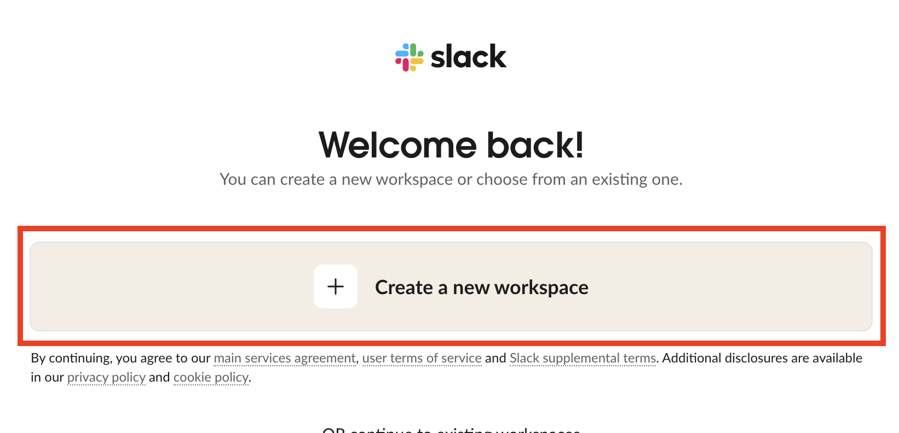

2. Follow the Slack prompts to name the workspace and create your profile.

    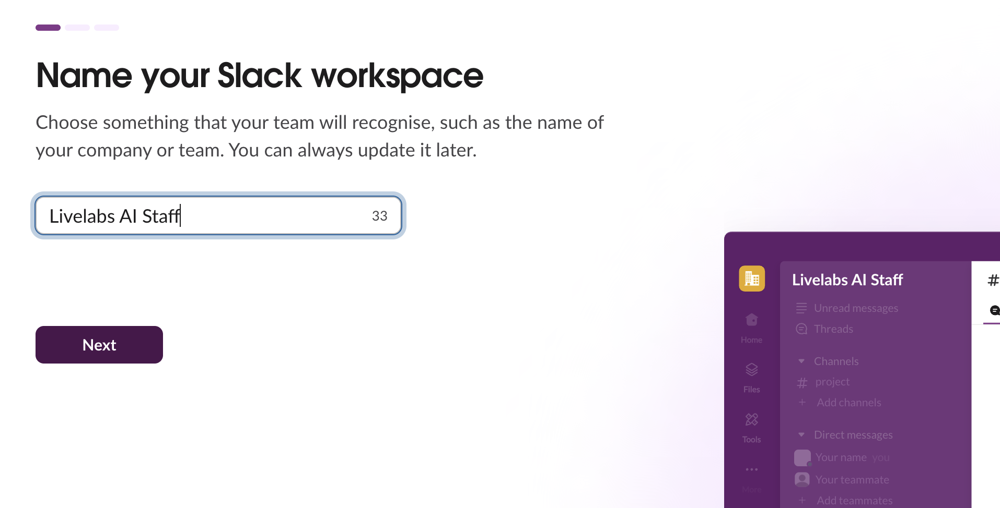

    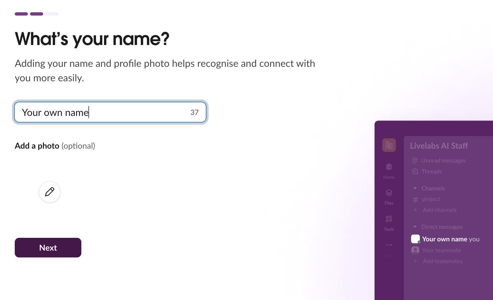

3. Skip the option to add coworkers. You can add users after the workshop if needed.

    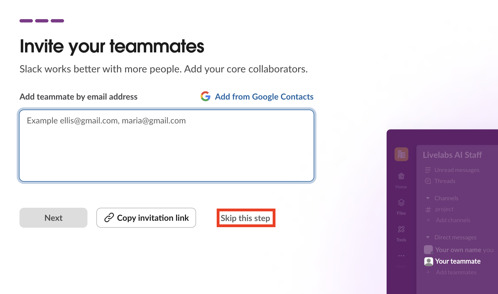

4. Install Slack CLI on the OCI instance.

    ```bash
    <copy>
    curl -fsSL https://downloads.slack-edge.com/slack-cli/install.sh | bash
    export PATH="$HOME/.local/bin:$PATH"
    slack version
    </copy>
    ```

    The setup requires Slack CLI 4.1 or newer.

5. Start Slack CLI authentication.

    ```bash
    <copy>
    slack login
    </copy>
    ```

    Slack CLI prints a `/slackauthticket` command and waits for a challenge code.

    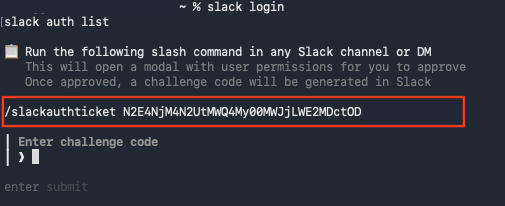

6. Copy the complete `/slackauthticket` command from the terminal.

    Paste it into any channel or direct message in the workshop workspace, and send the message.

    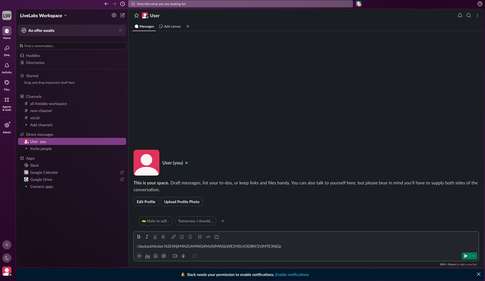

7. Review the requested Slack CLI permissions, and select **Confirm**.

    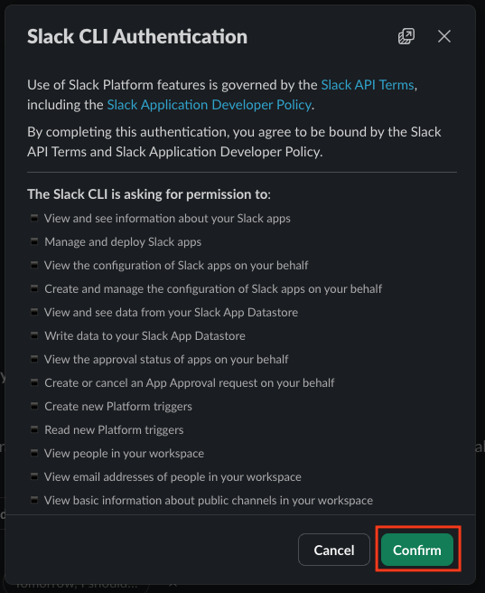

8. Copy the challenge code displayed by Slack.

    Keep this code private. It authorizes Slack CLI as your Slack account.

    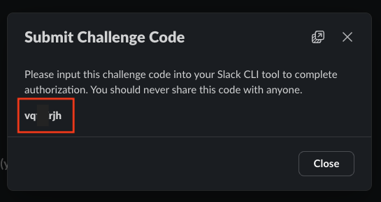

9. Return to the terminal, paste the challenge code at the prompt, and press Enter.

    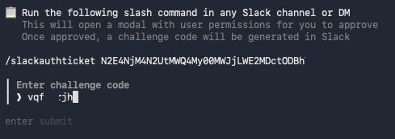

10. Confirm that the terminal reports successful authentication.

    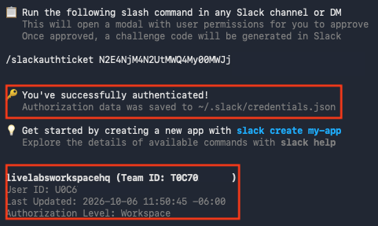

11. Verify that Slack CLI lists the workshop workspace.

    ```bash
    <copy>
    slack auth list
    </copy>
    ```

    Slack CLI authentication does not replace the `xoxe` app configuration token requested by the setup.

## Task 2: Run the Slack Setup

1. Open [Slack API: Your Apps](https://api.slack.com/apps).

2. Locate **Your App Configuration Tokens**.

    If the workspace does not have a current token, select **Generate Token** and choose the workshop workspace. The token begins with `xoxe` and expires after 12 hours.

    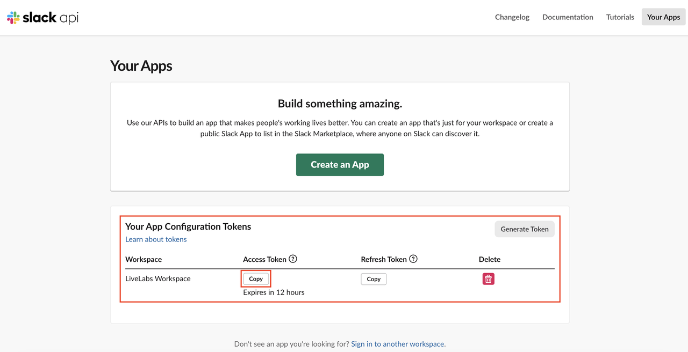

3. Start the setup.

    ```bash
    <copy>
    cd ~/livelabs-ai-staff
    python3 scripts/setup_slack.py setup
    </copy>
    ```

4. Paste the `xoxe` token at the hidden prompt.

    The command creates these apps:

    | App | Runtime directory | Main behavior |
    | --- | --- | --- |
    | Assistant Agent | `agents/assistant` | Coordinates AI Staff and direct messages |
    | Content Agent | `agents/pipeline` | Starts and coordinates content runs |
    | Creative Agent | `agents/pipeline` | Creates and uploads assets |
    | Brand Agent | `agents/brand-agent` | Builds the brand strategy |
    | Data Agent | `agents/data` | Handles data and database work |
    | Ops Agent | `agents/ops` | Reports and operates platform services |
    | Publish Agent | `agents/publish` | Publishes approved deliverables |

5. Wait until the terminal displays an **OAuth & Permissions** link for each app.

    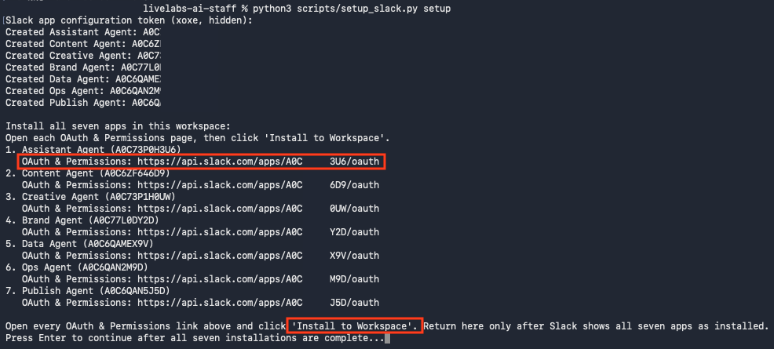

    Keep this terminal session open. The setup waits for you to install all seven apps.

## Task 3: Install the Apps and Provide the Assistant Token

1. Install each app with either of these methods:

    - Open each **OAuth & Permissions** link printed in the terminal.
    - Open [Slack API: Your Apps](https://api.slack.com/apps), select an app, and select **OAuth & Permissions**.

    The **Your Apps** page should list all seven apps created by the setup.

    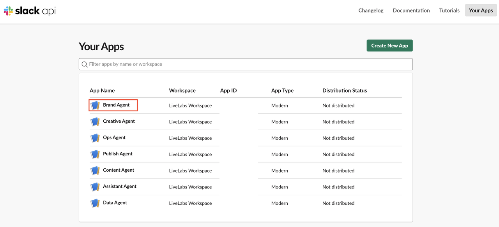

2. On the **OAuth & Permissions** page, select **Install to Workspace**.

    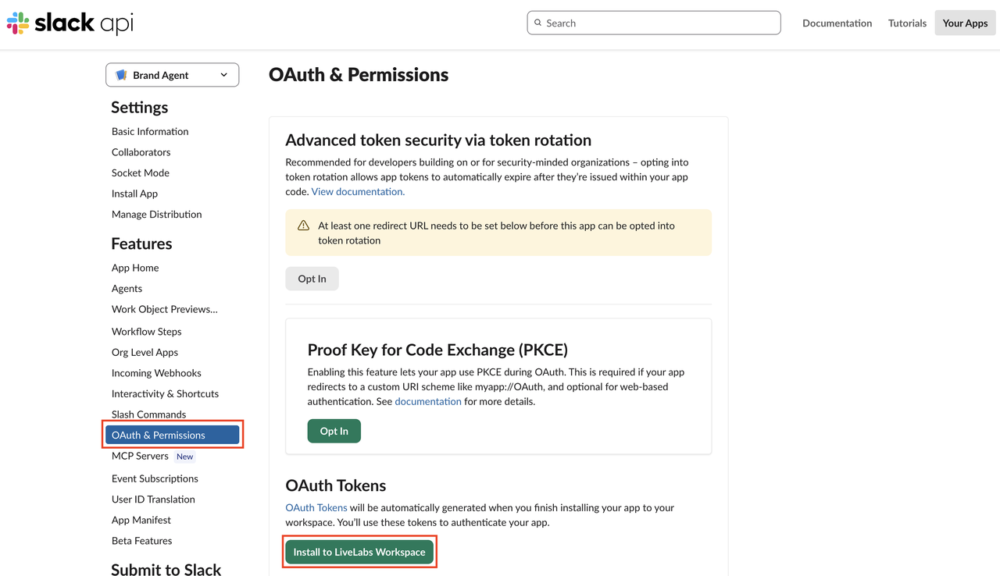

3. Review the permissions and select **Allow**.

    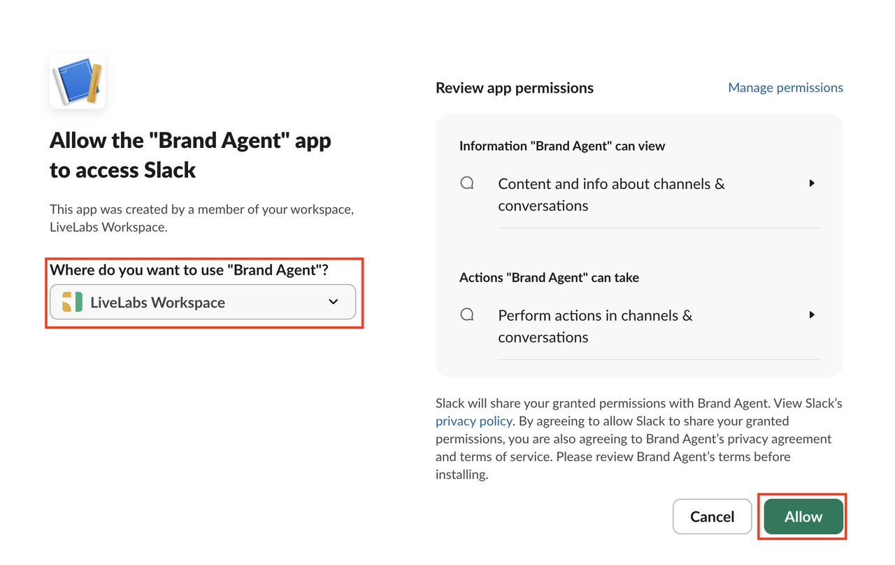

4. Repeat the installation for all seven apps.

    Return to the terminal only after every app displays **Reinstall to Workspace** on its OAuth page. If Slack requires administrator approval, obtain that approval before continuing.

5. Press **Enter** in the setup terminal.

6. Open **Assistant Agent**, select **OAuth & Permissions**, and copy its **Bot User OAuth Token**.

    The token begins with `xoxb`.

    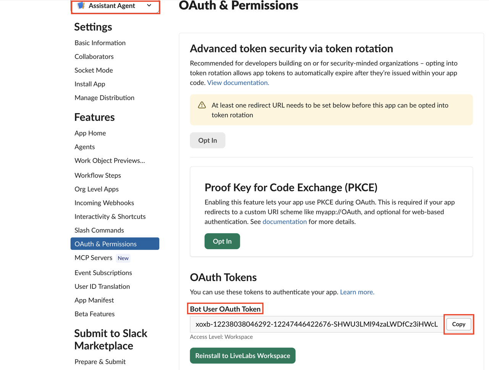

7. Paste the Assistant Agent token at the hidden terminal prompt.

    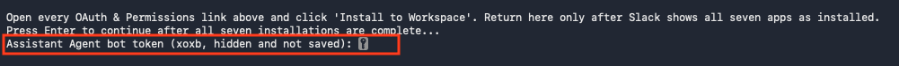

    The setup uses this token during the current process. It does not print or save the token.

8. Wait while the setup completes these actions:

    - Validates the Assistant Agent token.
    - Discovers all seven installed bot users.
    - Creates or reuses 11 public channels and the private `#personal` channel.
    - Assigns each bot to its required channels.
    - Saves the workspace, app, bot user, and channel IDs.
    - Creates missing environment files from their templates.

9. Confirm that the terminal displays `Slack setup is complete.`

    If the command stops, run `python3 scripts/setup_slack.py setup` again. It reuses the apps and channels recorded in `~/.config/livelabs-ai-staff/slack-setup.json`.

## Task 4: Install the Bootstrap Requirements

1. Install the official Python hooks used by Slack CLI.

    ```bash
    <copy>
    cd ~/livelabs-ai-staff
    python3 -m pip install --user -r scripts/requirements-slack-bootstrap.txt
    </copy>
    ```

    A message that says `Requirement already satisfied` means the dependency is ready.

2. Preview the bootstrap operation.

    ```bash
    <copy>
    python3 scripts/setup_slack.py bootstrap-tokens --dry-run
    </copy>
    ```

    The preview reads the saved app IDs. It does not call Slack or modify an environment file.

## Task 5: Run the Token Bootstrap

1. Run the bootstrap for all seven apps.

    ```bash
    <copy>
    python3 scripts/setup_slack.py bootstrap-tokens
    </copy>
    ```

    The command creates a temporary Slack CLI project for each existing app. Slack CLI provides the `xoxb` and `xapp` values to a temporary hook. The command validates each bot before it changes the agent environment files.

    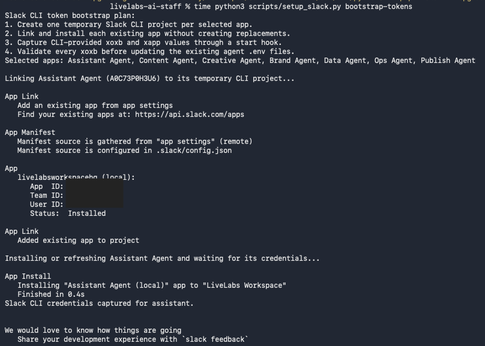

2. Confirm that the command reports seven apps and 14 runtime credentials.

    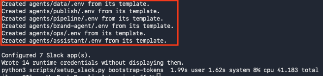

    If any app fails, correct the reported problem and run the same command again. The command preserves the existing environment files until all selected apps succeed.

3. Check the token status.

    ```bash
    <copy>
    python3 scripts/setup_slack.py status
    </copy>
    ```

    Confirm that all seven runtime credential entries show `configured`.

    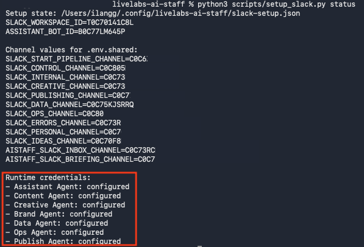

    The command reports token status without printing token values.

## Task 6: Write the Shared Slack Environment

1. Write the saved Slack IDs to `.env.shared`.

    ```bash
    <copy>
    python3 scripts/setup_slack.py write-env
    </copy>
    ```

    The setup normally performs this action before it exits. Running `write-env` again is safe and confirms that the shared file contains the current IDs.

2. Understand what the command writes.

    It creates `.env.shared` from `.env.shared.template` when the file is missing. It then writes:

    - `SLACK_WORKSPACE_ID`
    - `ASSISTANT_BOT_ID`
    - The 12 Slack channel IDs

    The command preserves database values, personal values, and other existing settings. It does not write `xoxb` or `xapp` tokens to `.env.shared`.

## Task 7: Add Personal Data and Validate the Configuration

1. Open the shared environment file.

    ```bash
    <copy>
    nano .env.shared
    </copy>
    ```

2. Add the identity and time zone for the deployment owner.

    ```text
    USER_NAME=<deployment-owner-name>
    USER_TIMEZONE=<iana-time-zone>
    ASSISTANT_TIMEZONE=<iana-time-zone>
    ```

    For example, use `America/Mexico_City` for the Mexico City time zone.

3. Copy the Slack member ID for the deployment owner.

    In Slack, open the member profile, select **More**, and select **Copy member ID**. Add the `U...` value to:

    ```text
    SLACK_ASSISTANT_USER_ID=U...
    SLACK_CREATIVE_OWNER_ID=U...
    ```

4. Confirm the bot display names.

    ```text
    ASSISTANT_BOT_NAME=Assistant Agent
    CONTENT_BOT_NAME=Content Agent
    CREATIVE_BOT_NAME=Creative Agent
    BRAND_BOT_NAME=Brand Agent
    DATA_BOT_NAME=Data Agent
    OPS_BOT_NAME=Ops Agent
    PUBLISH_BOT_NAME=Publish Agent
    ```

5. Confirm that `.env.shared` still contains the database values from Lab 1 or the Fast Path.

    ```text
    ADB_DSN=<database-service-name-ending-in-_low>
    ADB_USER=ADMIN
    ADB_PASSWORD=<admin-password>
    ADB_WALLET_DIR=/home/opc/oracle/wallet
    ```

6. Leave values for later integrations blank.

    Lab 4 and later labs configure SMTP, Cloudflare, MailerLite, Substack, Google, and other optional integrations. Do not add placeholder secrets for those services in this lab.

7. Save `.env.shared` and apply the required file permissions.

    ```bash
    <copy>
    chmod 600 .env.shared agents/*/.env
    sudo semanage fcontext -a -t etc_t '/home/opc/livelabs-ai-staff/\.env\.shared' || \
      sudo semanage fcontext -m -t etc_t '/home/opc/livelabs-ai-staff/\.env\.shared'
    sudo semanage fcontext -a -t etc_t '/home/opc/livelabs-ai-staff/agents/[^/]+/\.env' || \
      sudo semanage fcontext -m -t etc_t '/home/opc/livelabs-ai-staff/agents/[^/]+/\.env'
    sudo restorecon -Rv ~/livelabs-ai-staff
    </copy>
    ```

8. Validate the environment files.

    ```bash
    <copy>
    python3 scripts/validate_config.py --env-only
    </copy>
    ```

    The `validate_config.py` repository script checks the current environment files, required Slack and database values, token placeholders, duplicate keys, file syntax, and secret file permissions. It never prints secret values.

    Optional integrations scheduled for later labs may remain blank. Resolve every reported error for a value created in Labs 1 through 3.

9. Confirm that the validator displays:

    ```text
    Configuration validation passed; no values displayed.
    ```

## Task 8: Customize the Slack Apps

This task is optional. Slack App Settings remains the source of truth for the identity of each app.

1. Open [Slack API: Your Apps](https://api.slack.com/apps) and select an app.

2. Change its name, bot display name, description, background color, or icon.

3. Repeat the changes for any other app.

4. Preserve the OAuth scopes, events, Socket Mode, and interactivity settings created by the setup.

    Reinstall an app if you add a scope or an event that requires another scope.

5. Update the matching `*_BOT_NAME` value in `.env.shared` after changing a bot display name.

The Slack apps, channels, and environment files are ready for the next lab.

## Learn More

- [Slack CLI](https://docs.slack.dev/tools/slack-cli/)
- [Use environment variables with Slack CLI](https://docs.slack.dev/tools/slack-cli/guides/using-environment-variables-with-the-slack-cli/)
- [Slack CLI hooks](https://docs.slack.dev/tools/slack-cli/reference/hooks/)
- [Configure apps with app manifests](https://docs.slack.dev/app-manifests/configuring-apps-with-app-manifests)

## Acknowledgements

- Authors: Cyrce Salinas Rojas and Ilan Gómez Guerrero
- Last Updated: Ilan Gómez Guerrero, October 2026
