# Lab 3: Configure Slack Agents, Environment Files, and Services

## Introduction

In this lab, you import the role-specific Slack manifests supplied with this workshop, define generic bot names in `.env.shared`, populate deployment-specific environment files, and prepare the platform configuration. Google OAuth and external-service activation happen in Lab 4 and Lab 5 so this lab can be completed in the same order on both deployment paths. Slack permissions do not add channel membership, so you explicitly invite every bot to its working channels.

Estimated Time: 75 minutes

### Objectives

In this lab, you will:

- Create Slack channels and configure seven Socket Mode applications.
- Map the runtime services to generic Assistant, Content, Creative, Brand, Data, Ops, and Publish agents.
- Configure protected shared and per-agent environment files.
- Configure the Content Kit skill runtime file.
- Prepare the service configuration for activation after external integrations are configured.

### Prerequisites

- Completion of Lab 2 or Fast Path.
- Laptop editor access through VS Code Remote - SSH or an equivalent editor connected to the OCI instance; you will edit protected agent environment files on the instance.
- A Slack account and a workshop Slack workspace. You can use an existing workspace where you can create channels and install internal apps, or create a new workspace at [Slack: Create a workspace](https://slack.com/get-started#/createnew).
- Permission to create channels and install custom Slack apps. If your organization restricts app installation, ask a Workspace Owner or app manager to approve the seven internal apps you create in this lab.
- Database connection values, Slack workspace ID, Slack tokens, channel IDs, and deployment owner member ID.

## Task 1: Prepare Slack, Create Channels, and Capture IDs

1. Choose the Slack workspace for this workshop.

    If you already have a workshop workspace, sign in to Slack and open that workspace. If you need a new one, go to [Slack: Create a workspace](https://slack.com/get-started#/createnew), enter your email address, confirm the code from Slack, and follow the prompts. The person who creates a new workspace becomes the Workspace Primary Owner.

    

2. Give name to your workspace, your self and skip team members.

    
    
    

2. Confirm that your Slack user can create channels and install internal apps.

    In most workspaces, members can create channels from the plus sign in the Slack sidebar. Some company workspaces restrict channel creation or app installation. If you cannot create channels, ask a Workspace Owner for help before continuing. If app approval is enabled, ask the Workspace Owner or app manager to approve the internal apps after you import their manifests in Task 2.

    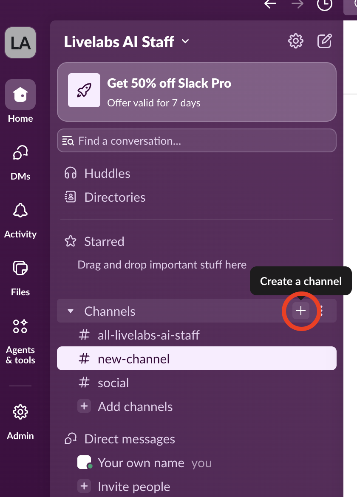

3. Create `#content-start`, `#content-runs`, `#content-internal`, `#creative-studio`, `#publishing`, `#data`, `#ops`, and `#errors` for the content workflow.

4. Create `#personal` (private), `#ideas`, `#inbox`, and `#briefing` for the Assistant Agent and AI Staff.

    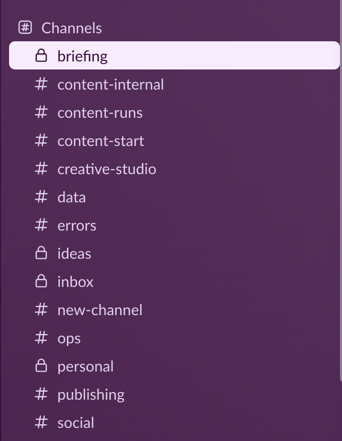

5. Copy every channel's `C...` ID from Slack and save it in a secure deployment worksheet. Environment files use IDs, not display names.

    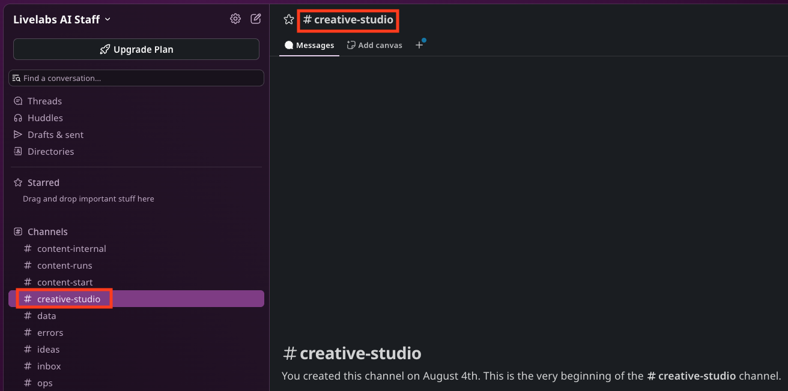

    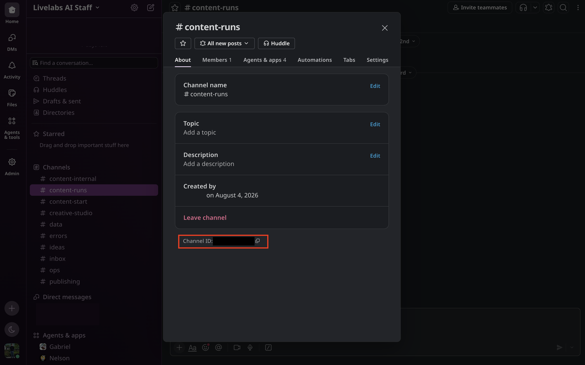

## Task 2: Import the Role-Specific Slack Manifests

1. At [Slack API: Your Apps](https://api.slack.com/apps), select **Create New App**, then **From an app manifest**. Select the workshop workspace.

    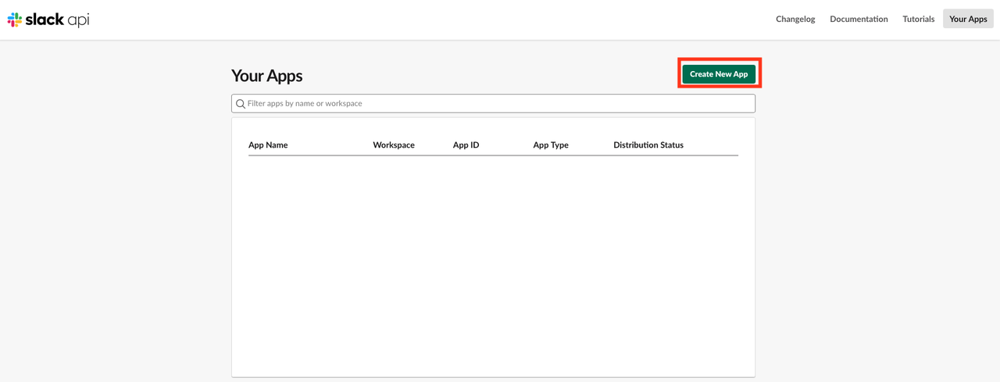

2. Import each manifest once. Expand the matching agent manifest below, click the **Copy** button, and paste its JSON into the Slack manifest editor. The JSON stays collapsed until you open an agent name. These are templates; you can change `display_information.name` and `features.bot_user.display_name` before importing each app if your deployment uses customer-specific bot names. Keep the scopes and events aligned with the role unless you intentionally change the runtime behavior.

    <details>
    <summary>Assistant Agent manifest — open to copy</summary>

    ```json
    <copy>
    {
      "display_information": {
        "name": "Assistant Agent",
        "description": "Personal assistant and AI Staff coordinator."
      },
      "features": {
        "bot_user": {
          "display_name": "Assistant Agent",
          "always_online": true
        }
      },
      "oauth_config": {
        "scopes": {
          "bot": [
            "files:read",
            "channels:history",
            "channels:read",
            "chat:write",
            "files:write",
            "im:history",
            "im:read",
            "im:write",
            "reactions:read"
          ]
        },
        "pkce_enabled": false
      },
      "settings": {
        "event_subscriptions": {
          "bot_events": [
            "message.channels",
            "message.im",
            "reaction_added"
          ]
        },
        "interactivity": {
          "is_enabled": true
        },
        "org_deploy_enabled": false,
        "socket_mode_enabled": true,
        "token_rotation_enabled": false,
        "is_mcp_enabled": false
      }
    }
    </copy>
    ```

    </details>

    <details>
    <summary>Content Agent manifest — open to copy</summary>

    ```json
    <copy>
    {
      "display_information": {
        "name": "Content Agent",
        "description": "Starts and coordinates content runs."
      },
      "features": {
        "bot_user": {
          "display_name": "Content Agent",
          "always_online": true
        }
      },
      "oauth_config": {
        "scopes": {
          "bot": [
            "chat:write",
            "channels:history",
            "channels:read",
            "files:write",
            "reactions:read"
          ]
        },
        "pkce_enabled": false
      },
      "settings": {
        "event_subscriptions": {
          "bot_events": [
            "message.channels",
            "reaction_added"
          ]
        },
        "interactivity": {
          "is_enabled": true
        },
        "org_deploy_enabled": false,
        "socket_mode_enabled": true,
        "token_rotation_enabled": false,
        "is_mcp_enabled": false
      }
    }
    </copy>
    ```

    </details>

    <details>
    <summary>Creative Agent manifest — open to copy</summary>

    ```json
    <copy>
    {
      "display_information": {
        "name": "Creative Agent",
        "description": "Handles creative work and asset uploads."
      },
      "features": {
        "bot_user": {
          "display_name": "Creative Agent",
          "always_online": true
        }
      },
      "oauth_config": {
        "scopes": {
          "bot": [
            "chat:write",
            "channels:history",
            "channels:read",
            "files:write"
          ]
        },
        "pkce_enabled": false
      },
      "settings": {
        "event_subscriptions": {
          "bot_events": [
            "message.channels"
          ]
        },
        "interactivity": {
          "is_enabled": true
        },
        "org_deploy_enabled": false,
        "socket_mode_enabled": true,
        "token_rotation_enabled": false,
        "is_mcp_enabled": false
      }
    }
    </copy>
    ```

    </details>

    <details>
    <summary>Brand Agent manifest — open to copy</summary>

    ```json
    <copy>
    {
      "display_information": {
        "name": "Brand Agent",
        "description": "Learns who you are, your voice, audience, and goals, then shapes your brand strategy and creates content that sounds like you."
      },
      "features": {
        "bot_user": {
          "display_name": "Brand Agent",
          "always_online": false
        }
      },
      "oauth_config": {
        "scopes": {
          "bot": [
            "files:read",
            "channels:history",
            "channels:read",
            "chat:write",
            "files:write",
            "im:history",
            "im:read",
            "im:write",
            "reactions:read"
          ]
        },
        "pkce_enabled": false
      },
      "settings": {
        "event_subscriptions": {
          "bot_events": [
            "message.channels",
            "message.im",
            "reaction_added"
          ]
        },
        "interactivity": {
          "is_enabled": true
        },
        "org_deploy_enabled": false,
        "socket_mode_enabled": true,
        "token_rotation_enabled": false,
        "is_mcp_enabled": false
      }
    }
    </copy>
    ```

    </details>

    <details>
    <summary>Data Agent manifest — open to copy</summary>

    ```json
    <copy>
    {
      "display_information": {
        "name": "Data Agent",
        "description": "Provides data and database operations."
      },
      "features": {
        "bot_user": {
          "display_name": "Data Agent",
          "always_online": true
        }
      },
      "oauth_config": {
        "scopes": {
          "bot": [
            "chat:write",
            "channels:history",
            "channels:read",
            "files:write"
          ]
        },
        "pkce_enabled": false
      },
      "settings": {
        "event_subscriptions": {
          "bot_events": [
            "message.channels"
          ]
        },
        "interactivity": {
          "is_enabled": true
        },
        "org_deploy_enabled": false,
        "socket_mode_enabled": true,
        "token_rotation_enabled": false,
        "is_mcp_enabled": false
      }
    }
    </copy>
    ```

    </details>

    <details>
    <summary>Ops Agent manifest — open to copy</summary>

    ```json
    <copy>
    {
      "display_information": {
        "name": "Ops Agent",
        "description": "Reports and operates platform services."
      },
      "features": {
        "bot_user": {
          "display_name": "Ops Agent",
          "always_online": true
        }
      },
      "oauth_config": {
        "scopes": {
          "bot": [
            "chat:write",
            "channels:history",
            "channels:read",
            "files:write"
          ]
        },
        "pkce_enabled": false
      },
      "settings": {
        "event_subscriptions": {
          "bot_events": [
            "message.channels"
          ]
        },
        "interactivity": {
          "is_enabled": true
        },
        "org_deploy_enabled": false,
        "socket_mode_enabled": true,
        "token_rotation_enabled": false,
        "is_mcp_enabled": false
      }
    }
    </copy>
    ```

    </details>

    <details>
    <summary>Publish Agent manifest — open to copy</summary>

    ```json
    <copy>
    {
      "display_information": {
        "name": "Publish Agent",
        "description": "Publishes approved work and uploads deliverables."
      },
      "features": {
        "bot_user": {
          "display_name": "Publish Agent",
          "always_online": true
        }
      },
      "oauth_config": {
        "scopes": {
          "bot": [
            "chat:write",
            "channels:history",
            "channels:read",
            "files:write"
          ]
        },
        "pkce_enabled": false
      },
      "settings": {
        "event_subscriptions": {
          "bot_events": [
            "message.channels"
          ]
        },
        "interactivity": {
          "is_enabled": true
        },
        "org_deploy_enabled": false,
        "socket_mode_enabled": true,
        "token_rotation_enabled": false,
        "is_mcp_enabled": false
      }
    }
    </copy>
    ```

    </details>


    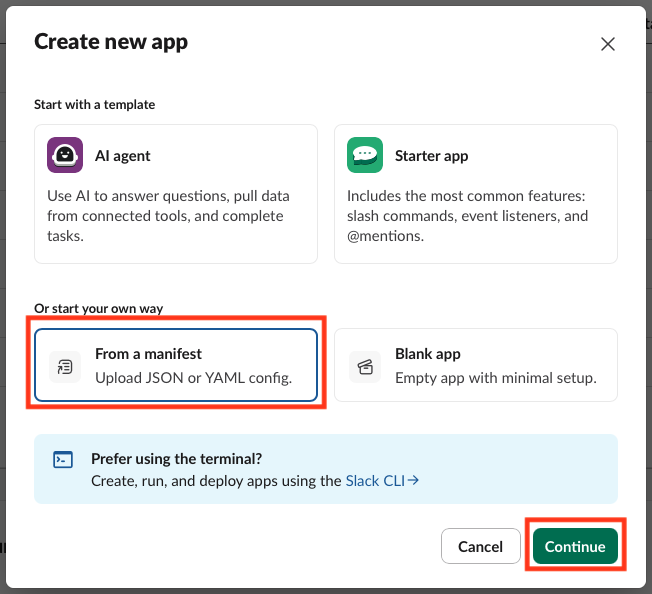

    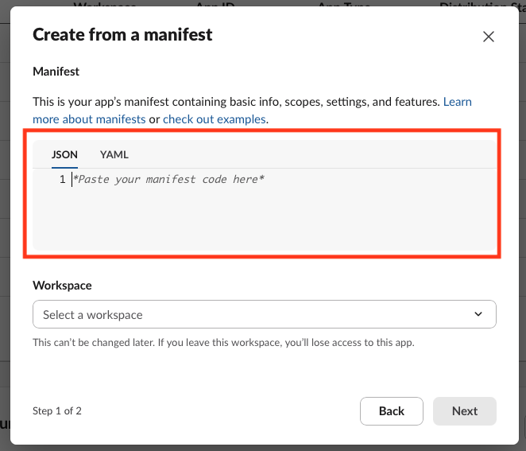

    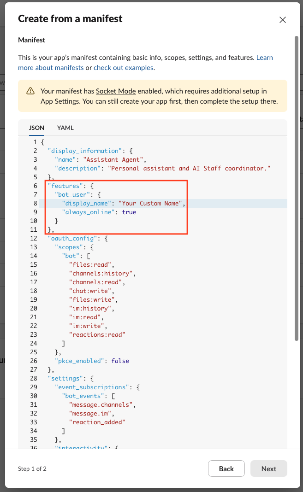

    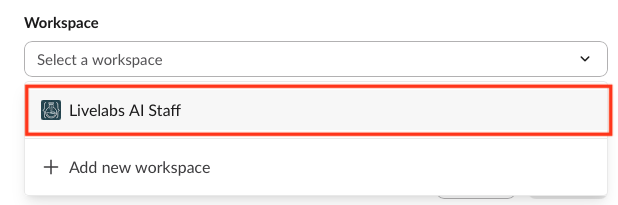

    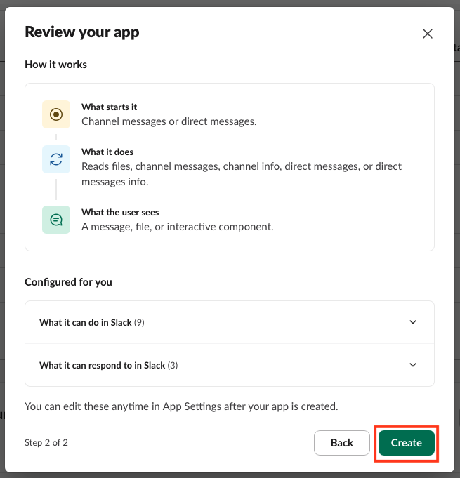

3. Assistant Agent and Brand Agent are the only apps that need Direct Message access. Their manifests include `im:history`, `im:read`, `im:write`, and the `message.im` event. After importing those two manifests, verify that direct messages are enabled for each app before installing it.

    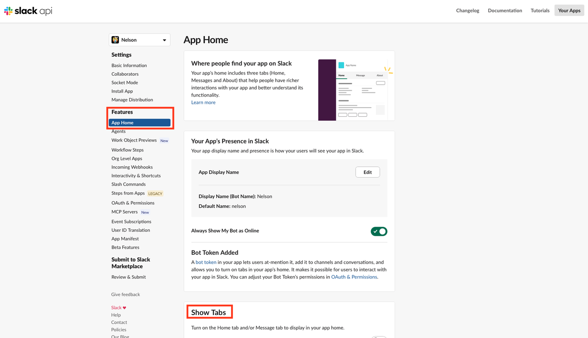

    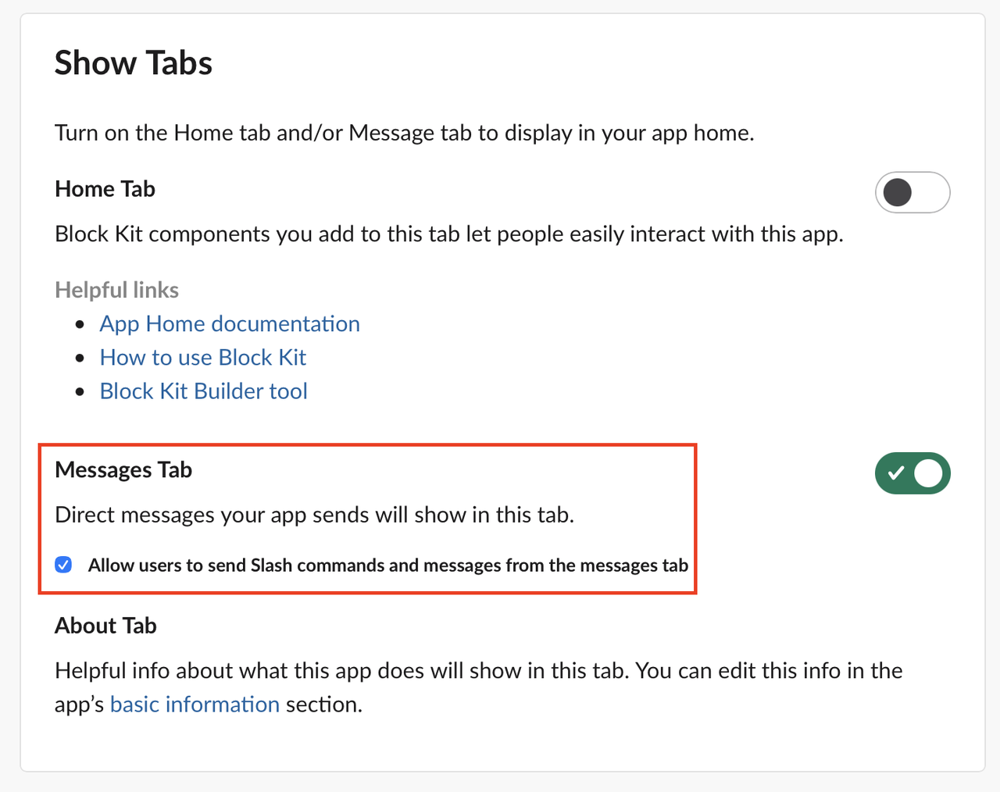

4. For each app, create an app-level token with `connections:write`, record its `xapp-...` app token. 

    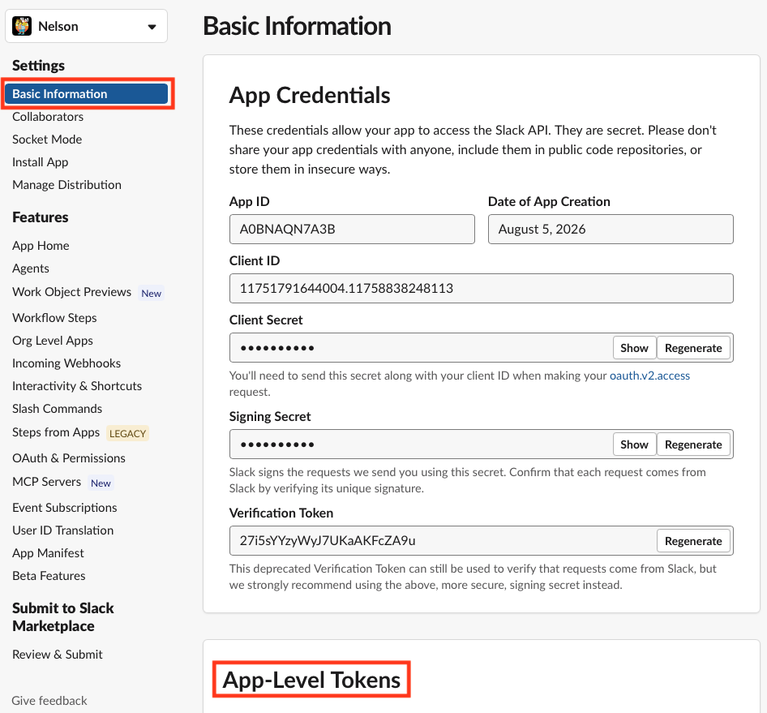

    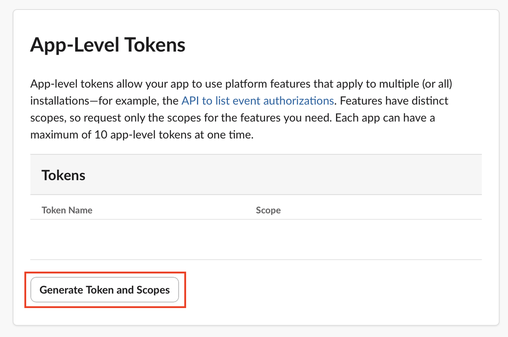

    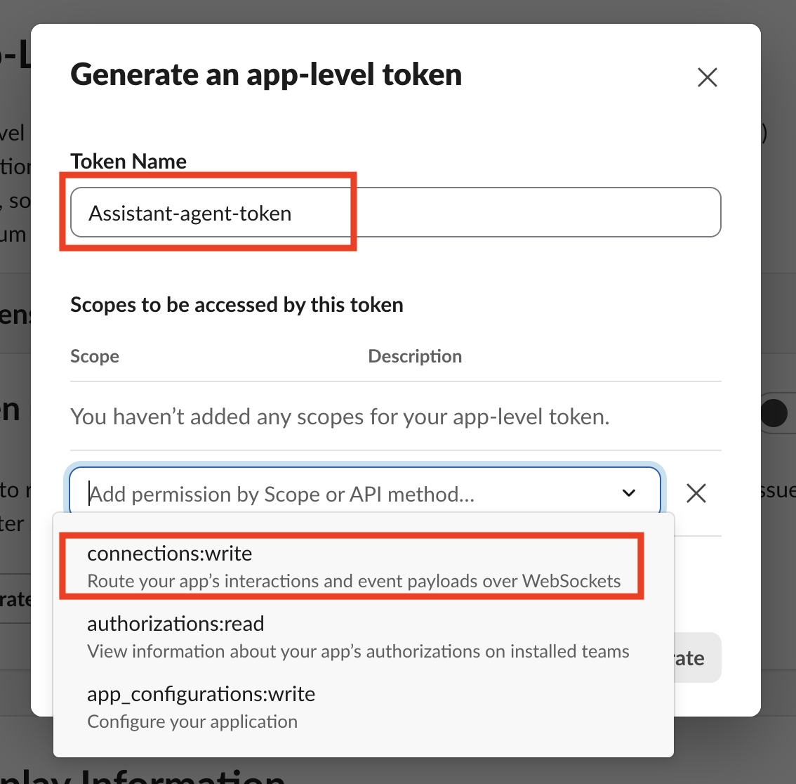

    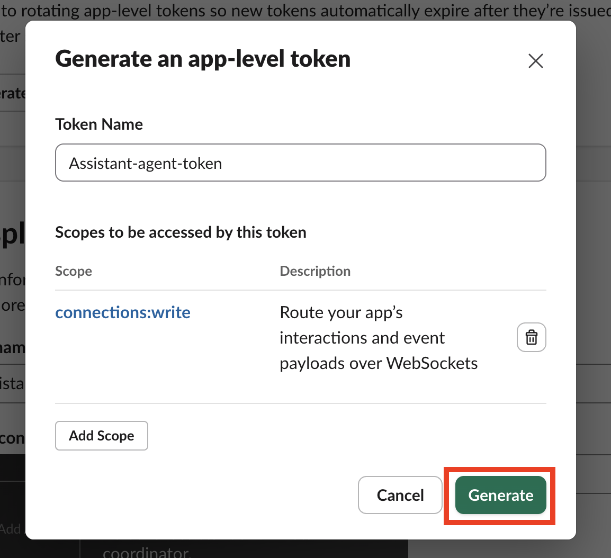

    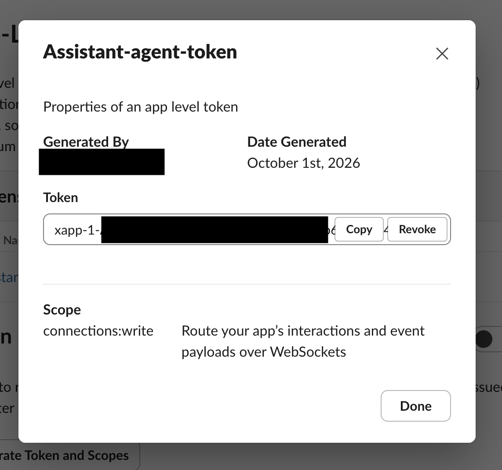

    Also install or reinstall it, and record its `xoxb-...` bot token. Socket Mode needs both tokens.

    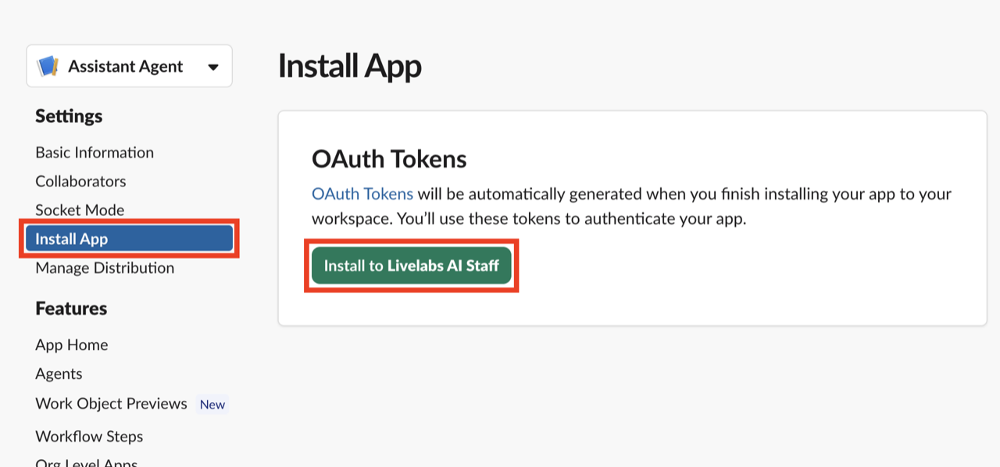

    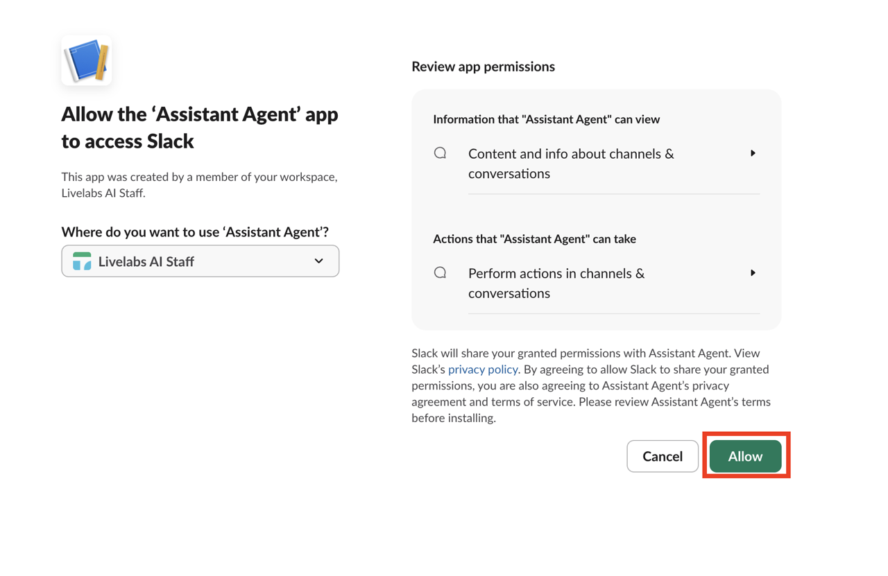

    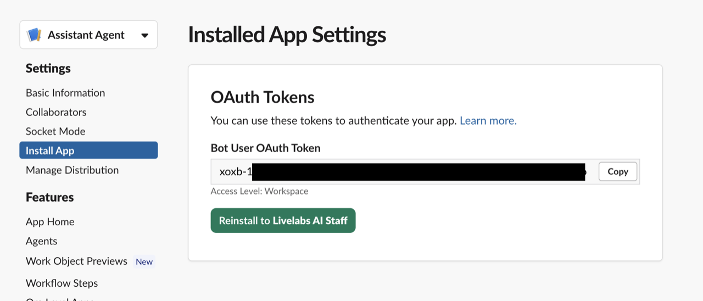

5. Invite the listed agents to each channel. Open a Slack channel, click **Invite Teammates**, enter the agent name shown in the table, select the matching app, and invite it. Repeat for every agent listed for that channel. Creating an app does not add it to a channel; without membership, Slack does not deliver channel messages and file uploads can fail with `not_in_channel`.

    | Slack channel | Invite these agents |
    | --- | --- |
    | `#content-start` | Assistant Agent, Content Agent |
    | `#content-runs` | Content Agent, Creative Agent, Brand Agent, Publish Agent |
    | `#content-internal` | Content Agent, Creative Agent |
    | `#creative-studio` | Creative Agent |
    | `#publishing` | Assistant Agent, Content Agent, Publish Agent |
    | `#data` | Data Agent |
    | `#ops` | Ops Agent |
    | `#errors` | Assistant Agent, Content Agent, Creative Agent, Brand Agent, Data Agent, Ops Agent, Publish Agent |
    | `#personal` | Assistant Agent |
    | `#ideas` | Assistant Agent |
    | `#inbox` | Assistant Agent |
    | `#briefing` | Assistant Agent |

    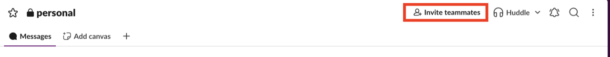
    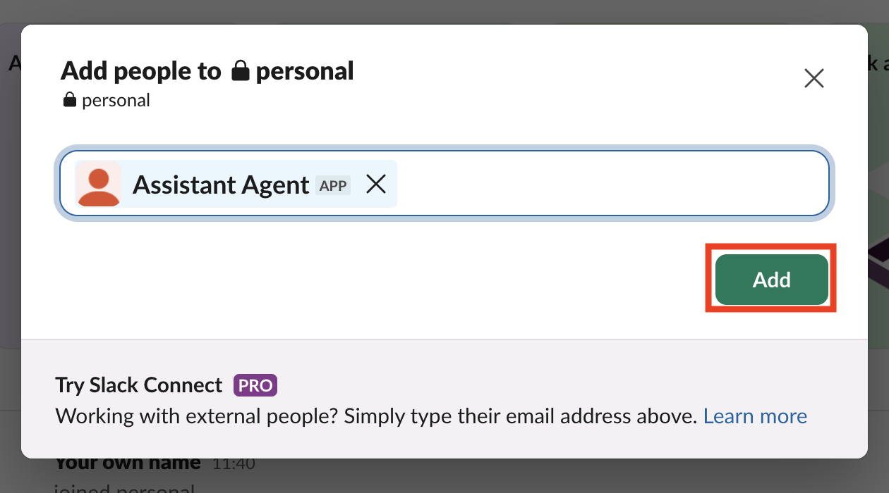

6. Before running the command, replace `<assistant-agent-token>` with the actual `xoxb-...` bot token for your Assistant Agent app. Export the token temporarily, then run `auth.test`. Record `team_id` as `SLACK_WORKSPACE_ID` and `bot_id` as `ASSISTANT_BOT_ID`. The Assistant Agent is the only bot allowlisted to issue specialist-agent commands.

    ```
    <copy>
    curl -s -H "Authorization: Bearer $ASSISTANT_BOT_TOKEN" \
      https://slack.com/api/auth.test | python3 -m json.tool
    unset ASSISTANT_BOT_TOKEN
    </copy>
    ```

    In the command output, use these fields:

    - `team_id`: save as `SLACK_WORKSPACE_ID`.
    - `bot_id`: save as `ASSISTANT_BOT_ID`.


    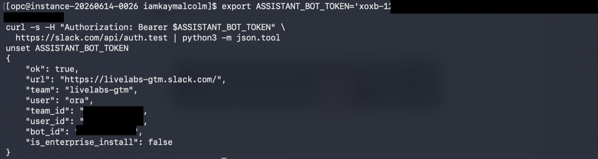

7. Record the deployment owner's member ID as `SLACK_ASSISTANT_USER_ID`; the Assistant Agent uses it for reminders and privileged routing.

## Task 3: Configure and Protect Environment Files

1. Create environment files from the current templates. Do not commit the result or display secrets in evidence.

    ```
    <copy>
    cd ~/livelabs-ai-staff
    cp .env.shared.template .env.shared
    for agent in pipeline assistant brand-agent data ops publish aistaff; do
      cp "agents/$agent/.env.example" "agents/$agent/.env"
    done
    </copy>
    ```

2. Open `.env.shared` with VS Code Remote - SSH or a terminal editor. If you use the terminal, run:

    ```bash
    <copy>
    nano .env.shared
    </copy>
    ```

    Keep the API defaults already present in the template. Use the column for the deployment path you completed to fill the database values:

    | `.env.shared` setting | Fast Path | Manual Path |
    | --- | --- | --- |
    | `ADB_DSN` | Copy `autonomous_database_service_name` from the Resource Manager stack's **Outputs**. Use the whole value; it ends in `_low`. | In Lab 1, Task 2, open `/home/opc/oracle/wallet/tnsnames.ora` and copy the exact alias ending in `_low` from the left side of `=`. |
    | `ADB_USER` | `ADMIN` | `ADMIN` |
    | `ADB_PASSWORD` | The `ADMIN` password you entered when creating the stack. It is not shown in the outputs. | The `ADMIN` password you set in Lab 1. It is also the wallet passphrase. |
    | `ADB_WALLET_DIR` | `/home/opc/oracle/wallet` | The wallet directory created in Lab 1, normally `/home/opc/oracle/wallet`. Use the actual path if you extracted the wallet elsewhere. |

    `tnsnames.ora` is a text file inside the wallet. It maps short connection aliases to the database network settings; set `ADB_DSN` to the alias only, not the full descriptor or the path to this file. For the manual path, Lab 1, Task 2, steps 5–7, creates and verifies the wallet files in `~/oracle/wallet`.

    The other Fast Path outputs are not `.env.shared` values: `autonomous_database_name`, `db_name`, and `configuration_summary.database_name` identify the database but are not the `_low` connection alias; `instance_public_ip` and `ssh_command` are for SSH; and `bootstrap_log` and `bootstrap_status` are paths used to monitor bootstrap. The remaining `configuration_summary` entries describe region, workload, and capacity. Get Slack IDs from Slack in Tasks 1 and 2.

    ```
    <copy>
    ADB_DSN=<exact-adb-low-alias>
    ADB_USER=ADMIN
    ADB_PASSWORD=<admin-database-password>
    ADB_WALLET_DIR=/home/opc/oracle/wallet
    USER_NAME=<deployment-owner-name>
    ASSISTANT_TIMEZONE=<iana-time-zone>
    SLACK_WORKSPACE_ID=<workspace-id-starting-with-T>
    ASSISTANT_BOT_ID=<assistant-bot-id-starting-with-B>
    SLACK_ASSISTANT_USER_ID=<deployment-owner-member-id-starting-with-U>
    SLACK_START_PIPELINE_CHANNEL=<content-start-channel-id>
    SLACK_CONTROL_CHANNEL=<content-runs-channel-id>
    SLACK_INTERNAL_CHANNEL=<content-internal-channel-id>
    SLACK_CREATIVE_CHANNEL=<creative-studio-channel-id>
    SLACK_PUBLISHING_CHANNEL=<publishing-channel-id>
    SLACK_DATA_CHANNEL=<data-channel-id>
    SLACK_OPS_CHANNEL=<ops-channel-id>
    SLACK_ERRORS_CHANNEL=<errors-channel-id>
    SLACK_PERSONAL_CHANNEL=<personal-channel-id>
    SLACK_IDEAS_CHANNEL=<ideas-channel-id>
    AISTAFF_SLACK_INBOX_CHANNEL=<inbox-channel-id>
    AISTAFF_SLACK_BRIEFING_CHANNEL=<briefing-channel-id>
    </copy>
    ```

    For this workshop, use the Autonomous Database `ADMIN` password as the wallet passphrase in Lab 1 and as `ADB_PASSWORD` here. `AI_FOR_YOU` is the application schema, but the runtime connects as `ADMIN` and sets `CURRENT_SCHEMA=AI_FOR_YOU` automatically. Leave external-service credentials blank until Lab 4.

3. Define all generic display names in `.env.shared`. This is required because the current runtime loads `.env.shared` first, then loads each agent-specific `.env`; do not set competing `*_BOT_NAME` values in the per-agent files.

    ```
    <copy>
    ASSISTANT_BOT_NAME="Assistant Agent"
    CONTENT_BOT_NAME="Content Agent"
    CREATIVE_BOT_NAME="Creative Agent"
    BRAND_BOT_NAME="Brand Agent"
    DATA_BOT_NAME="Data Agent"
    OPS_BOT_NAME="Ops Agent"
    PUBLISH_BOT_NAME="Publish Agent"
    </copy>
    ```

4. Add each app's `xoxb-...` bot token and `xapp-...` app token to its agent-specific file. Content Agent and Creative Agent share `agents/pipeline/.env`.

    | Environment file | Required variables |
    | --- | --- |
    | `agents/assistant/.env` | `ASSISTANT_BOT_TOKEN`, `ASSISTANT_APP_TOKEN` |
    | `agents/pipeline/.env` | `CONTENT_BOT_TOKEN`, `CONTENT_APP_TOKEN`, `CREATIVE_BOT_TOKEN`, `CREATIVE_APP_TOKEN` |
    | `agents/brand-agent/.env` | `BRAND_BOT_TOKEN`, `BRAND_APP_TOKEN` |
    | `agents/data/.env` | `DATA_BOT_TOKEN`, `DATA_APP_TOKEN` |
    | `agents/ops/.env` | `OPS_BOT_TOKEN`, `OPS_APP_TOKEN` |
    | `agents/publish/.env` | `PUBLISH_BOT_TOKEN`, `PUBLISH_APP_TOKEN` |

    Open the files with VS Code Remote - SSH, or use this terminal command:

    ```bash
    <copy>
    for env_file in agents/assistant/.env agents/pipeline/.env \
      agents/brand-agent/.env agents/data/.env agents/ops/.env agents/publish/.env; do
      nano "$env_file"
    done
    </copy>
    ```

5. Save the files. In `nano`, press **Ctrl+O**, **Enter**, and then **Ctrl+X**. Channel IDs belong only in `.env.shared`; do not duplicate them in the agent-specific files.

6. Restrict access and label every environment file for SELinux.

    ```
    <copy>
    chmod 600 .env.shared agents/*/.env
    sudo chcon -t etc_t .env.shared agents/*/.env
    sudo semanage fcontext -a -t etc_t '/home/opc/livelabs-ai-staff/\.env\.shared' || \
      sudo semanage fcontext -m -t etc_t '/home/opc/livelabs-ai-staff/\.env\.shared'
    sudo semanage fcontext -a -t etc_t '/home/opc/livelabs-ai-staff/agents/[^/]+/\.env' || \
      sudo semanage fcontext -m -t etc_t '/home/opc/livelabs-ai-staff/agents/[^/]+/\.env'
    sudo restorecon -Rv ~/livelabs-ai-staff
    </copy>
    ```

7. Validate the environment files before continuing. The command checks required shared values, agent tokens, file ownership, and permissions without requiring the Google or Cloudflare credentials configured in Lab 4.

    ```bash
    <copy>
    python3 scripts/validate_config.py --env-only
    </copy>
    ```

## Task 4: Configure the Content Kit Runtime

The Content Kit configuration stores machine-specific paths and feature flags only. Never store API keys, OAuth tokens, passwords, or other secrets in this file.

1. Create the Content Kit configuration

    Run:

    ```bash
    <copy>
    cd /home/opc/livelabs-ai-staff

    export CONTENTKIT_CONFIG=/home/opc/.codex/contentkit/config.json

    mkdir -p /home/opc/.codex/contentkit
    chmod 700 /home/opc/.codex/contentkit

    cp plugins/livelabsagentic-skills/skills/content-kit/config.json.example \
      "$CONTENTKIT_CONFIG"

    chmod 600 "$CONTENTKIT_CONFIG"
    </copy>
    ```

    The `export` command is only required for the current shell when using the default path. Systemd services running as user `opc` use the same default path automatically. If a different configuration path is used, `CONTENTKIT_CONFIG` must also be defined in the environment of every service that invokes Content Kit scripts.

2. Edit the configuration file

    If you are connected with VS Code Remote - SSH, open this file from the VS Code Explorer:

    ```text
    /home/opc/.codex/contentkit/config.json
    ```

    If you are using the terminal, open it with `nano`:

    ```bash
    <copy>
    nano "$CONTENTKIT_CONFIG"
    </copy>
    ```

    Replace the full file with the JSON below. Keep it as strict JSON: do not include `//` comments or the words `Copy` or `Copymkdir` from rendered documentation. In `nano`, press **Ctrl+O**, **Enter**, and then **Ctrl+X** to save and exit.

    ```json
    <copy>
    {
      "base_dir": "/home/opc/livelabs-ai-staff",
      "python": "/home/opc/notebooklm-venv/bin/python3.12",
      "paths": {
        "shared": "/home/opc/livelabs-ai-staff/plugins/livelabsagentic-skills/resources/shared",
        "brand_guide": "/home/opc/livelabs-ai-staff/strategy/profiles/user/brand-guide.md",
        "content_strategy": "/home/opc/livelabs-ai-staff/strategy/profiles/user/general-strategy.md"
      },
      "fonts": {
        "sans": "/usr/share/fonts/dejavu-sans-fonts/DejaVuSans.ttf",
        "sans_bold": "/usr/share/fonts/dejavu-sans-fonts/DejaVuSans-Bold.ttf"
      },
      "image": {
        "provider": "cloudflare_workers_ai",
        "model": "@cf/black-forest-labs/flux-2-klein-9b",
        "width": 1024,
        "height": 1024,
        "guidance": 4.5,
        "max_reference_images": 4,
        "reference_max_width": 511,
        "reference_max_height": 511,
        "save_prompt_manifest": true,
        "reference": null
      },
      "db": {
        "nia_url": "http://127.0.0.1:8004",
        "enabled": false
      },
      "headshot": "/home/opc/livelabs-ai-staff/strategy/headshots/active-headshot.png",
      "substack": {
        "enabled": false,
        "substackrc": "~/.codex/.substackrc",
        "mcp_venv": "~/.codex/substack-mcp/venv/bin/python3",
        "mcp_path": "~/.codex/substack-mcp"
      }
    }
    </copy>
    ```

    Update only these values when they differ from your deployment:

    - `base_dir`: the absolute path of the repository.
    - `python`: the Python 3.12 interpreter that has Pillow and numpy installed.
    - `paths.brand_guide`: the active deployment's brand guide.
    - `paths.content_strategy`: the active deployment's content strategy.
    - `headshot`: the deployment's actual headshot file.

    The `notebooklm-venv` directory name is historical. In this workshop, it is the Python 3.12 runtime used by Content Kit scripts. The Brand Agent creates the user strategy files in Lab 5. Add the deployment headshot before running a workflow that generates personalized images.

3. Verify the Content Kit configuration

    First confirm that the file is strict JSON:

    ```bash
    <copy>
    python3 -m json.tool "$CONTENTKIT_CONFIG" >/dev/null
    </copy>
    ```

    Verify the configured interpreter and fonts. Do not check the user strategy or headshot yet; those are added after this lab.

    ```bash
    <copy>
    test -x /home/opc/notebooklm-venv/bin/python3.12
    test -f /usr/share/fonts/dejavu-sans-fonts/DejaVuSans.ttf
    test -f /usr/share/fonts/dejavu-sans-fonts/DejaVuSans-Bold.ttf
    echo "Content Kit prerequisites are available"
    </copy>
    ```

    The configuration file must remain private:

    ```bash
    <copy>
    chmod 600 "$CONTENTKIT_CONFIG"
    </copy>
    ```

The Content Kit configuration is now prepared for Lab 5, when the services are activated after Google OAuth and the external integrations are complete. Historical references to `~/.claude` or `~/.claude/skills` should not be used in a fresh deployment.

## Acknowledgements

- Authors: Cyrce Salinas Rojas and Ilan Gómez guerrero
- Last Updated: Ilan Gómez guerrero, September 2026
