# Lab 4: Configure External Services

## Introduction

In this lab, you configure Google OAuth and the external services used by My AI Staff. Lab 5 activates the services and verifies the complete deployment.

Estimated Time: 30 minutes

### Objectives

In this lab, you will:

- Configure AI Staff Gmail and Calendar OAuth.
- Configure the single Google Drive publication root for all new content.
- Configure Cloudflare Workers AI image generation.
- Enable voice transcription support.
- Configure email delivery and publishing helpers.

### Prerequisites

- Completion of Lab 3.
- Customer intake values for each external service you plan to enable.
- A personal Gmail account for the workshop OAuth flow. Do not use a corporate or customer-owned Google account.
- The folder ID of the approved Google Drive root for AI Staff.
- A Cloudflare account ID and API token if you plan to generate images.
- Access to the email sender and publishing accounts.

## Task 1: Configure Google OAuth for AI Staff

1. Complete this task to enable required Google Drive delivery. The same authorization enables Gmail and Calendar workflows. Current email support is Gmail-only.

2. Sign in to the [Google Cloud Console](https://console.cloud.google.com/) with the personal Gmail account selected for this workshop. In the top navigation bar, select the project selector.

    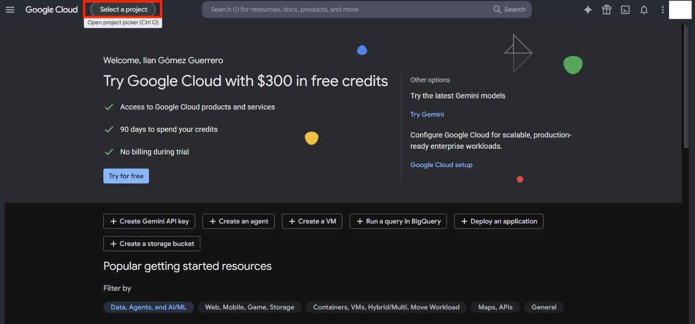

3. In the **Select a project** window, select **New project**.

    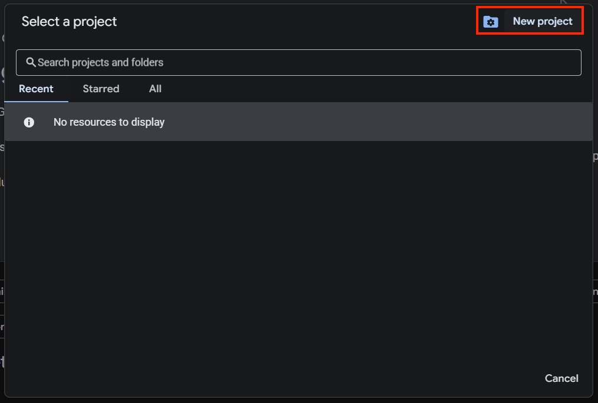

4. Enter `my-ai-staff-project` as the project name. Select the appropriate organization, or leave **No organization** for a personal account. Select **Create**.

    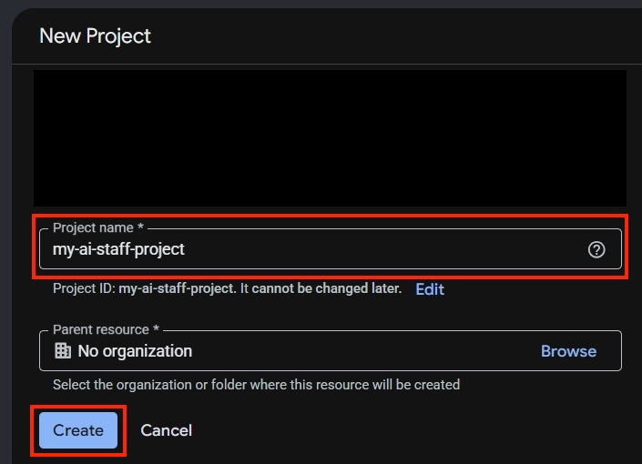

5. Open the project selector again and select `my-ai-staff-project`. Confirm that the project name appears in the top navigation bar.

    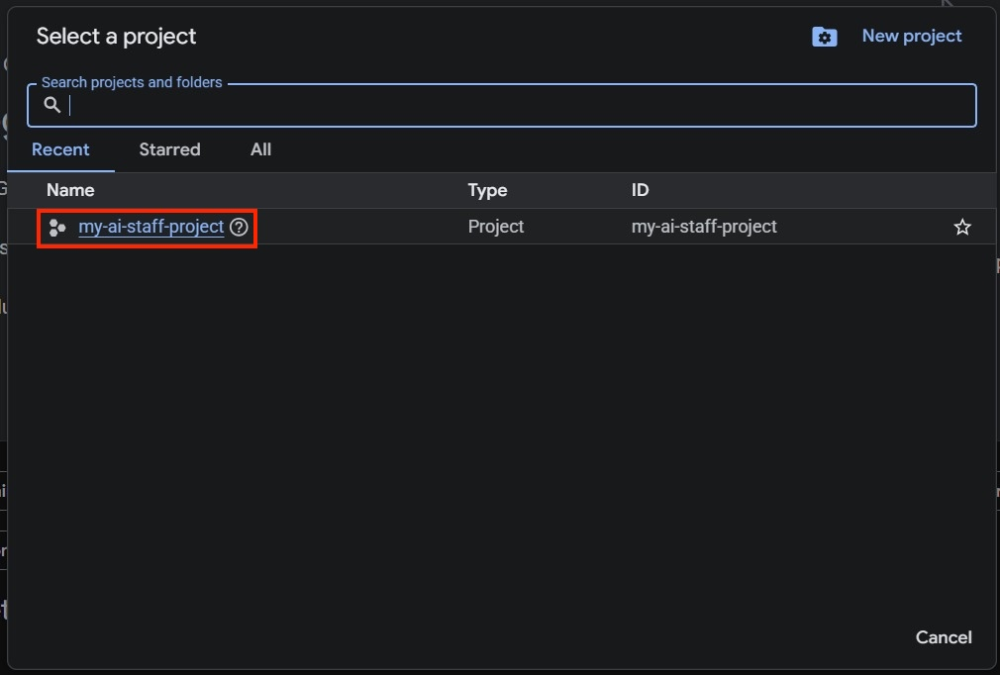

6. Open the navigation menu and select **APIs & Services**, then **Enabled APIs & services**.

    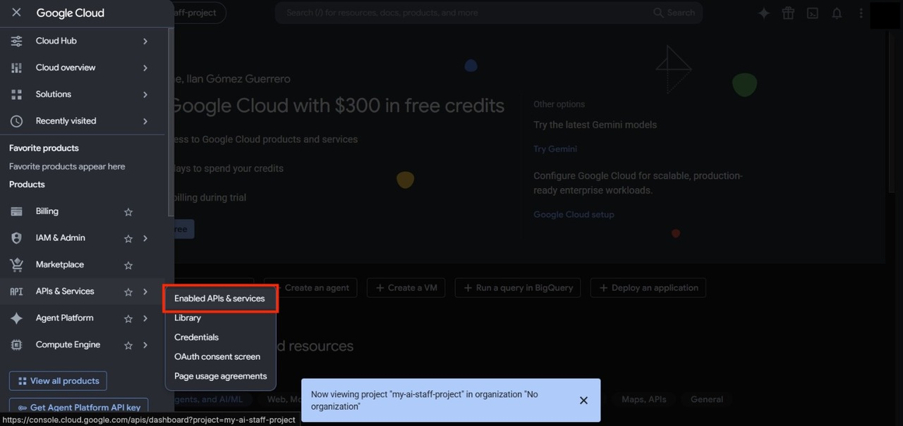

7. Select **Enable APIs and services** to open the API Library.

    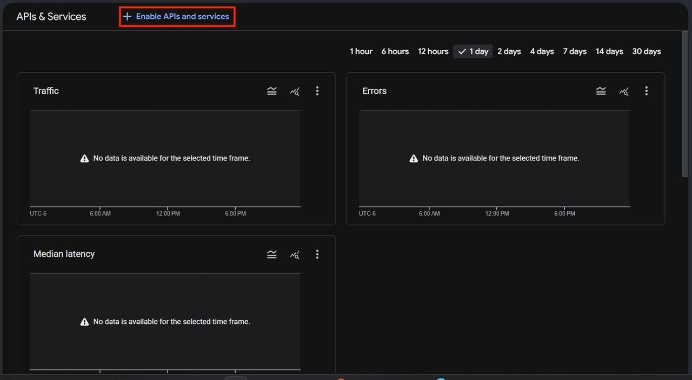

8. Search for `Google Calendar API` and select **Google Calendar API**.

    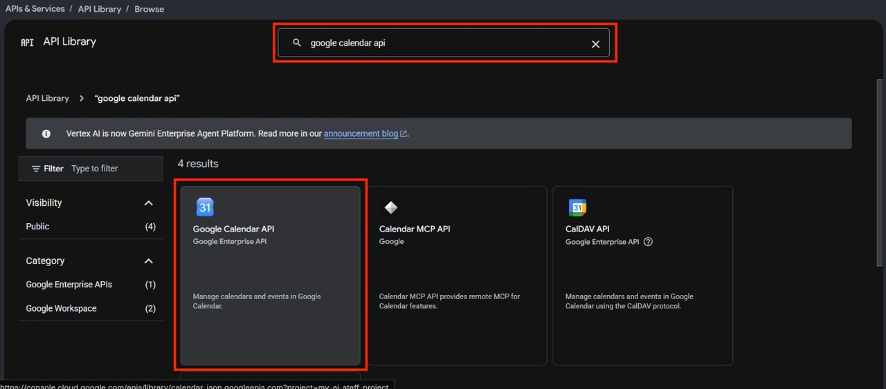

9. Select **Enable** on the Google Calendar API product page.

    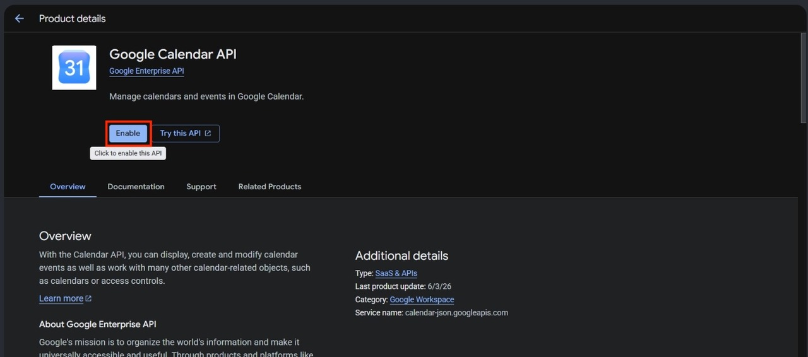

10. Return to the API Library and repeat the same process for `Gmail API`: search for the API, select **Gmail API**, and select **Enable**.

    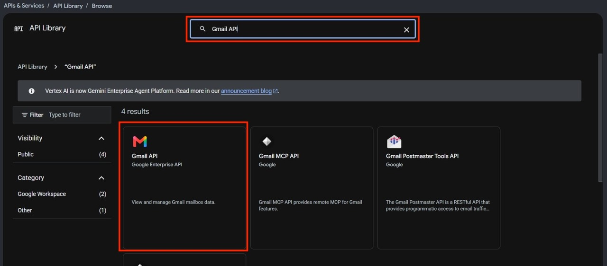

11. Repeat the process for `Google Drive API`: search for the API, select **Google Drive API**, and select **Enable**.

    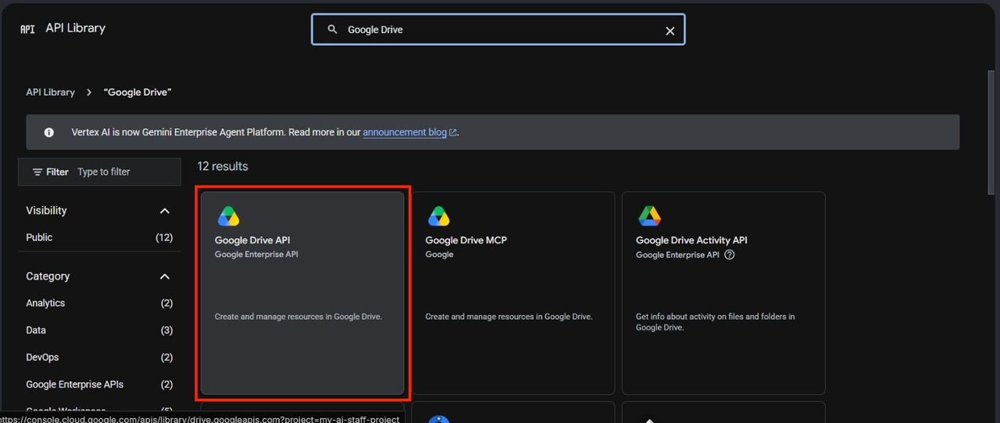

12. Open the navigation menu and select **APIs & Services**, then **OAuth consent screen**.

    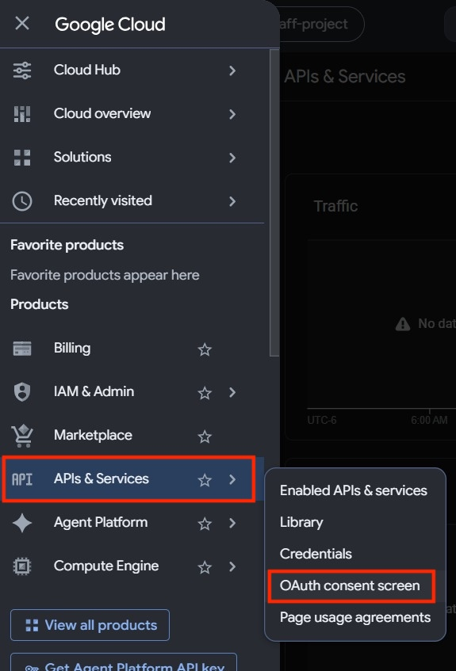

13. On the Google Auth Platform overview, select **Get started**.

    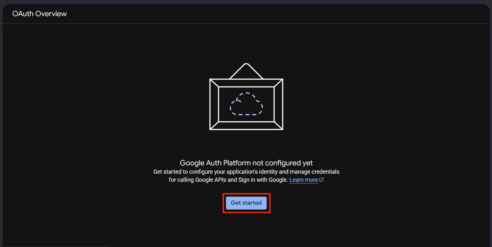

14. Under **App Information**, enter `My-AI-Staff` as the app name. Select the workshop Gmail address as the support email, then select **Next**.

    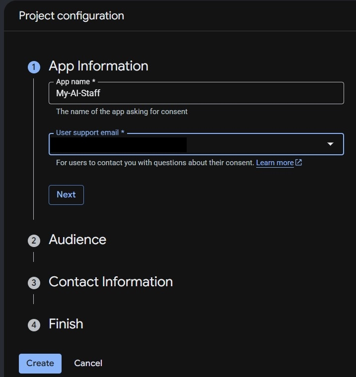

15. Under **Audience**, select **External**, then select **Next**. Keep the application in Testing mode for this workshop.

    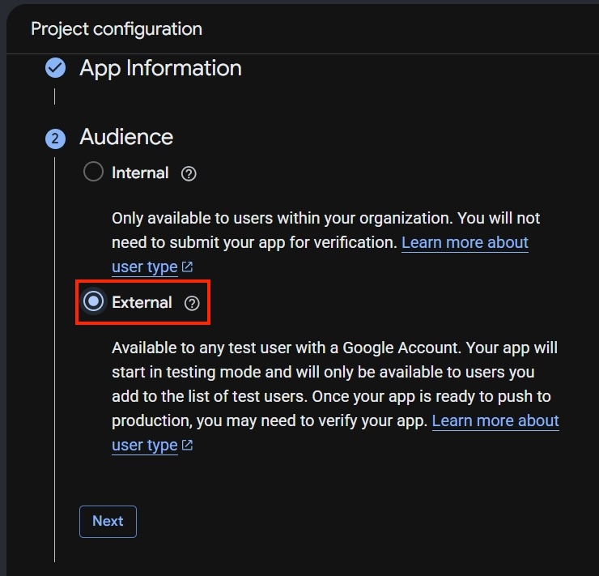

16. Under **Contact Information**, enter the workshop Gmail address, then select **Next**.

    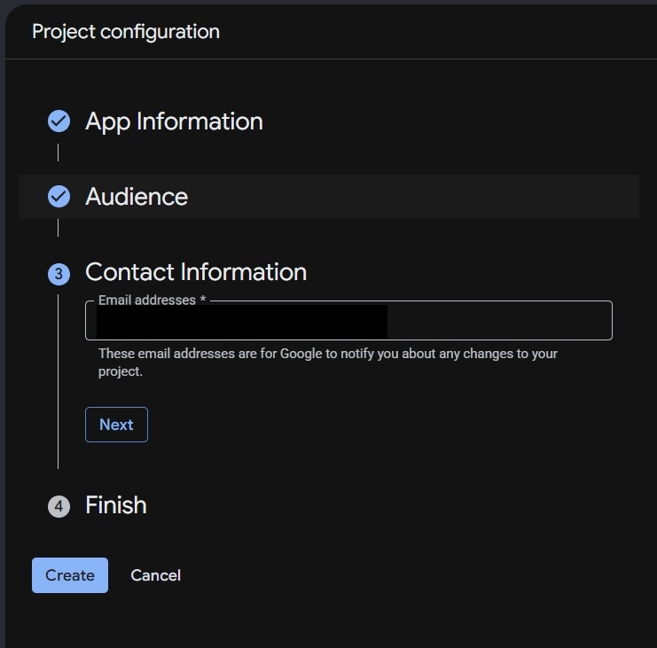

17. Under **Finish**, review the Google API Services User Data Policy and select the agreement checkbox. Select **Continue**, then select **Create**.

    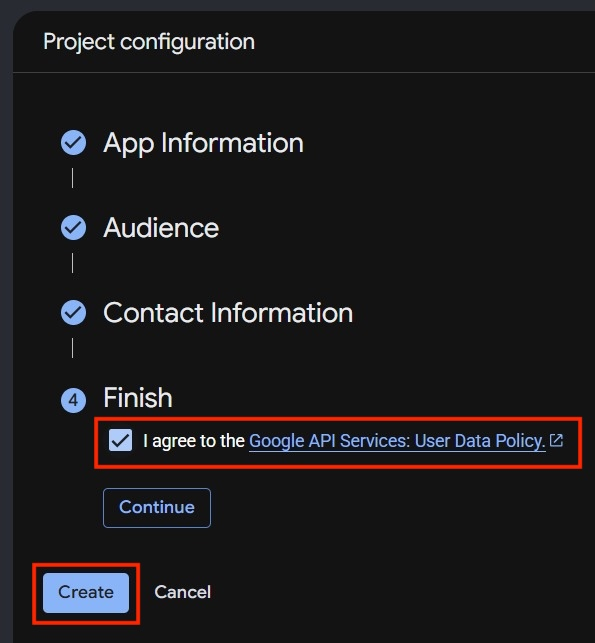

18. In Google Auth Platform, open **Audience**. Under **Test users**, select **Add users**. Add the Gmail account that will authorize AI Staff and save the change. Keep this account listed while the app remains in Testing mode.

19. Open **Data Access**, select **Add or remove scopes**, and add the four scopes below. You must declare the same permissions that `setup_google.py` requests.

    ```text
    <copy>
    https://www.googleapis.com/auth/gmail.modify
    https://www.googleapis.com/auth/calendar.readonly
    https://www.googleapis.com/auth/calendar.events
    https://www.googleapis.com/auth/drive
    </copy>
    ```

    Save the scope selection. These permissions support Gmail processing, calendar availability and events, and delivery to the approved Drive root.

20. Return to **Overview** and select **Create OAuth client**.

    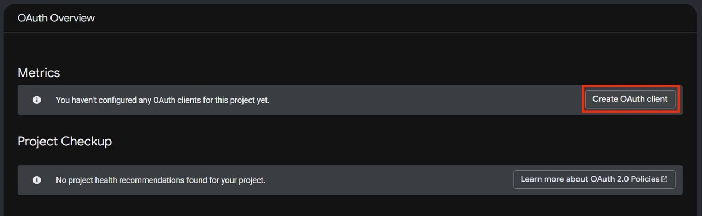

21. Open the **Application type** list and select **Desktop app**.

    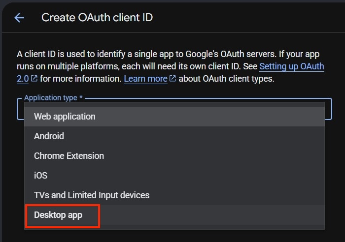

22. Enter `my-ai-staff-client` as the client name and select **Create**.

    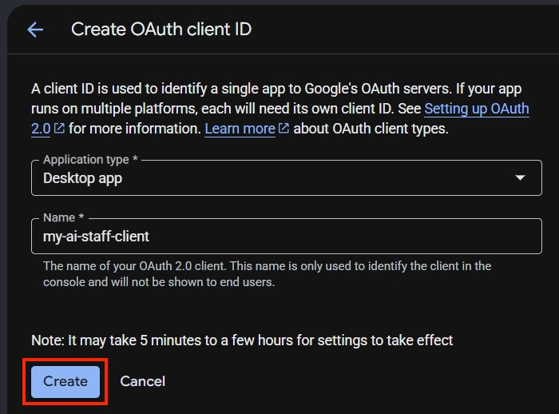

23. Copy the **Client ID** and **Client secret** before closing the confirmation window. Keep both values private.

    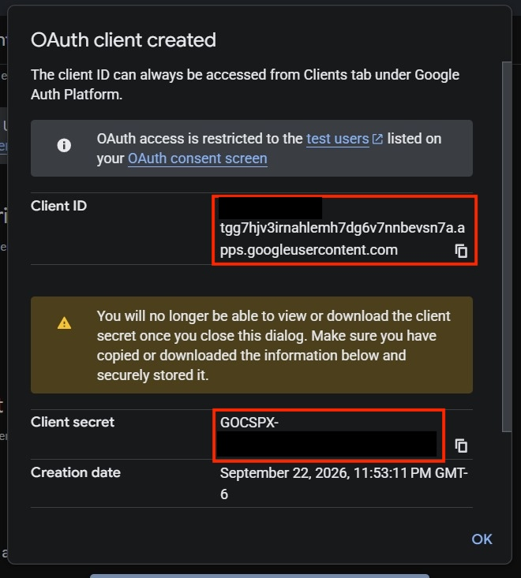

24. On the compute instance, create the protected integration file before adding the values:

    ```bash
    <copy>
    cd ~/livelabs-ai-staff
    install -d -m 700 agents/aistaff/integrations
    cp agents/aistaff/integrations/.env.example agents/aistaff/integrations/.env
    chmod 600 agents/aistaff/integrations/.env
    </copy>
    ```

    Edit `agents/aistaff/integrations/.env` and add the values:

    ```text
    <copy>
    AISTAFF_GOOGLE_CLIENT_ID="<google-client-id>"
    AISTAFF_GOOGLE_CLIENT_SECRET="<google-client-secret>"
    AISTAFF_DRIVE_ROOT_FOLDER_ID="<approved-published-folder-id>"
    </copy>
    ```

    Open the approved root folder in Google Drive. Copy the value after `/folders/` in the URL; this is the folder ID.

25. Run the headless consent flow from the compute instance.

    ```
    <copy>
    cd ~/livelabs-ai-staff
    agents/aistaff/venv/bin/python agents/aistaff/integrations/setup_google.py
    chmod 700 agents/aistaff/integrations
    chmod 600 agents/aistaff/integrations/.env
    sudo chcon -t etc_t agents/aistaff/integrations/.env
    </copy>
    ```

    The script prints an authorization URL. Open it in your local browser, sign in with the test user, and approve access.

    Google redirects the browser to `http://localhost:8765`. The page does not need to load. Copy the complete address-bar URL and paste it into the script prompt on the compute instance.

26. Confirm that the script reports the connected email address and the number of available calendars. Verify that it wrote the refresh token without displaying the token:

    ```bash
    <copy>
    grep -q '^AISTAFF_GOOGLE_REFRESH_TOKEN=.' agents/aistaff/integrations/.env \
      && echo "Google refresh token saved"
    </copy>
    ```

    Testing-mode refresh tokens can expire after seven days. To reconnect, run the consent script again and reapply the SELinux label:

    ```bash
    <copy>
    sudo chcon -t etc_t agents/aistaff/integrations/.env
    </copy>
    ```

## Task 2: Configure Cloudflare Workers AI

1. Complete this task if the deployment will generate infographics, stories, or other images. Sign in to the [Cloudflare dashboard](https://dash.cloudflare.com/) or create an account.

2. Select **Quick search** in the upper-left corner.

    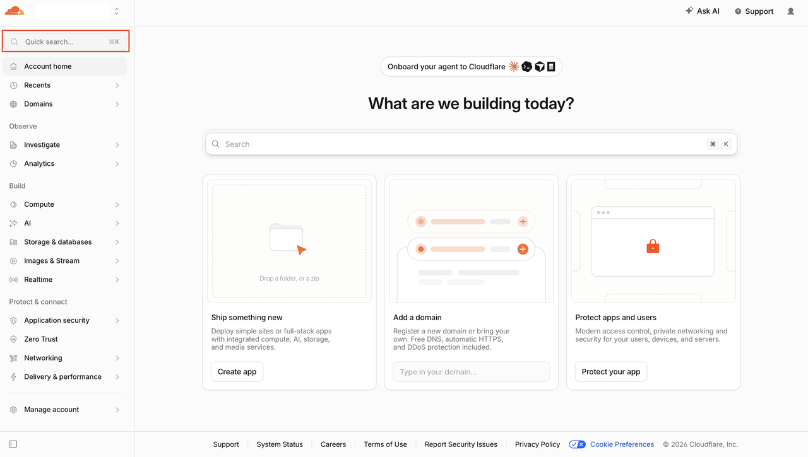

3. Enter `Copy Account ID` and select the **Copy account ID** command. Save the copied value as your `CLOUDFLARE_ACCOUNT_ID`.

    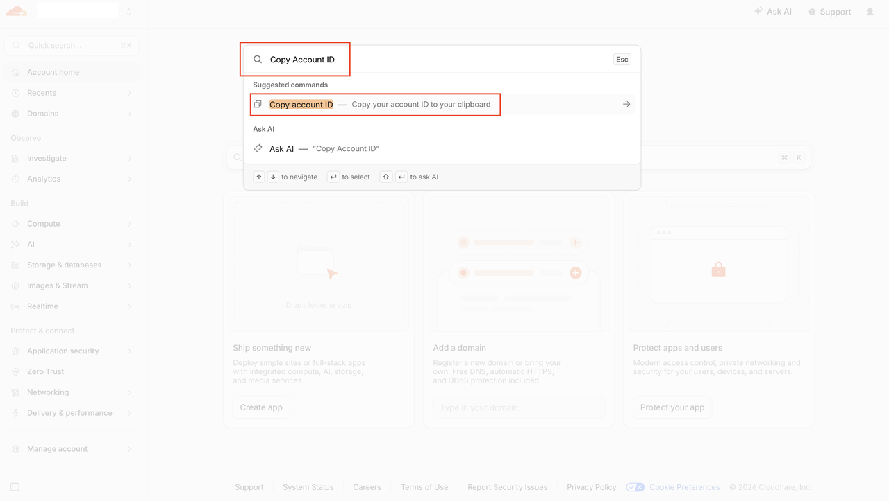

4. Open **Quick search** again, enter `Account API Tokens`, and select **Account API tokens**.

    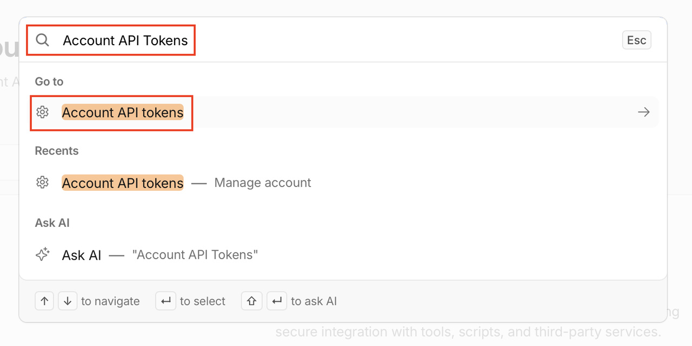

5. Select **Create Token**, then select **Start from scratch** under **Permission policies**.

    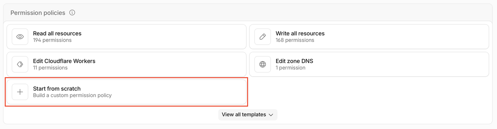

6. Name the token `my-ai-staff-token` and apply it to the account used for this workshop. Under **AI & Machine Learning**, grant **Workers AI Read** and **Workers AI Edit**. Do not grant permissions for other Cloudflare products.

    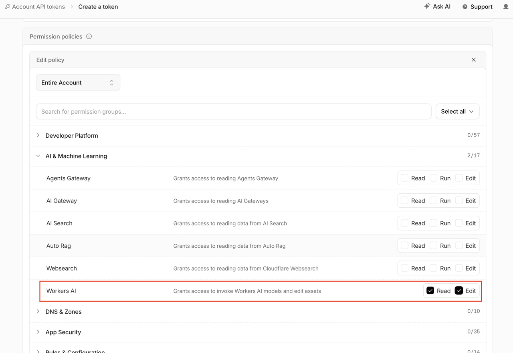

7. Continue to the summary and confirm that it lists only Workers AI Read and Workers AI Edit. Select **Create token**, copy the generated token, and store it securely. Cloudflare displays the token secret only once.

    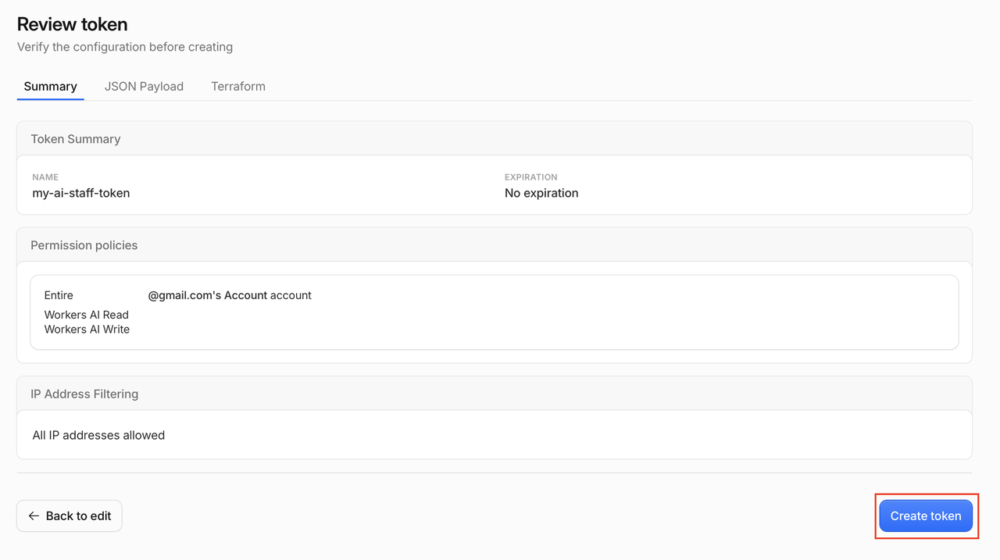

8. On the compute instance, open the shared environment file with VS Code Remote - SSH or `nano`:

    ```bash
    <copy>
    cd ~/livelabs-ai-staff
    nano .env.shared
    </copy>
    ```

    Add the Account ID and token. Store Cloudflare credentials in `.env.shared`, not in the Content Kit JSON.

    ```text
    <copy>
    CLOUDFLARE_ACCOUNT_ID=<cloudflare-account-id>
    CLOUDFLARE_API_TOKEN=<cloudflare-api-token>
    </copy>
    ```

    In `nano`, press **Ctrl+O**, press **Enter**, and then press **Ctrl+X**.

9. Protect and label the shared environment file after adding the values:

    ```bash
    <copy>
    chmod 600 .env.shared
    sudo chcon -t etc_t .env.shared
    sudo restorecon -v .env.shared
    </copy>
    ```


## Task 4: Validate the External-Service Handoff

1. Validate the external configuration before activating services.

    ```
    <copy>
    python3 scripts/validate_config.py --env-only
    </copy>
    ```

    Do not activate or restart the platform services yet. Lab 5 performs activation after all external configuration is complete.

2. Confirm the protected Google integration file exists. If the deployment generates images, also confirm the shared Cloudflare values. Do not print their contents.

    ```
    <copy>
    test -f agents/aistaff/integrations/.env
    test "$(stat -c '%a' agents/aistaff/integrations/.env)" = "600"
    if grep -Eq '^CLOUDFLARE_(ACCOUNT_ID|API_TOKEN)=[^[:space:]]' .env.shared; then
      grep -Eq '^CLOUDFLARE_ACCOUNT_ID=[^[:space:]]' .env.shared
      grep -Eq '^CLOUDFLARE_API_TOKEN=[^[:space:]]' .env.shared
    fi
    </copy>
    ```

3. Continue directly to Lab 5: Connect Services and Verify the Deployment.

## Acknowledgements

- Author: CYRCE SALINAS ROJAS
