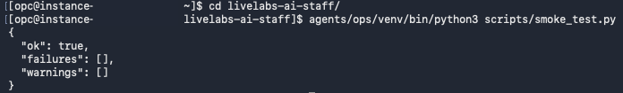

# Connect Services and Verify the Deployment

## Introduction

In this lab, you create a personalized strategy with the Brand Agent, then perform layered verification to confirm the core platform is production-ready. You will execute health checks, database and memory probes, Slack smoke tests, manual validation, and one complete end-to-end run.

Estimated Time: 45 minutes

### Objectives

In this lab, you will:

- Validate service and database health endpoints.
- Create a personalized user strategy with the Brand Agent.
- Validate Data Agent memory recall.
- Execute automated and manual Slack validation.
- Complete one end-to-end workflow from topic intake to publish.
- Confirm final platform status is healthy.

### Prerequisites

- Completion of Lab 3.
- Active runtime services.
- Access to Slack workspace and channels configured in Lab 3.

## Task 1: Create a Personalized Strategy with the Brand Agent

1. Open a direct message with the Brand Agent configured in Lab 3. This app is the brand and strategy owner for the deployment.

2. Start the threaded strategy setup interview.

    ```
    <copy>
    setup strategy
    </copy>
    ```

3. Answer the Brand Agent questions with customer-specific information. The interview gathers the user's role, audience, offer, voice, content pillars, funnel goals, and publishing preferences. When complete, the Brand Agent generates a personalized strategy profile for the user.

4. Review the current strategy summary.

    ```
    <copy>
    strategy status
    </copy>
    ```

5. Confirm that the generated strategy reflects the customer before running content workflows. If the summary is incomplete, send `setup strategy` again and refine the answers in the same Brand Agent thread.

## Task 2: Run Tier 1 Platform Health Checks

1. Validate that `contentkit-assistant`, `contentkit-pipeline`, `contentkit-brand`, `contentkit-data`, `contentkit-ops`, and `contentkit-publish` are active. Also validate `contentkit-website` when the public intake service is enabled.
2. Check all loopback-only `/health` endpoints: file editor (8001), Brand Agent (8002), Ops Agent (8003), Data Agent (8004), and Website Agent (8005 when enabled).
3. Validate database health and memory recall from the Data Agent endpoint. Empty recall results are acceptable; the response must return `"status": "ok"`. A 500 response usually means the ONNX model from Lab 1 was not loaded or the wallet/database configuration is wrong.

    ```
    <copy>
    for p in 8001 8002 8003 8004 8005; do curl -sm 5 localhost:$p/health; echo " :$p"; done
    curl -sm 15 localhost:8004/health-db
    curl -s -X POST localhost:8004/memory/recall \
      -H 'Content-Type: application/json' \
      -d '{"agent":"assistant-agent","query":"test","limit":3}' | python3 -m json.tool
    curl -sm 10 localhost:8003/agents | python3 -m json.tool
    </copy>
    ```

4. If database or memory checks fail, revisit the wallet, `AI_FOR_YOU` schema, and `MINILM_V2` model setup from Lab 1.

## Task 3: Run Tier 2 and Tier 3 Slack Validation

1. Run the automated Slack smoke test script first. This confirms token loading and basic agent routing before you send manual Slack commands.

    ```
    <copy>
    agents/data/venv/bin/python3 scripts/smoke_test.py
    </copy>
    ```
    

2. Validate each Slack agent with a direct command. Brand Agent strategy validation already happened in Task 1, so this table focuses on the remaining runtime agents.

    | Agent | Where to send it | Command | Expected result |
    | --- | --- | --- | --- |
    | Ops Agent | `#ops` | `check agents` | A `Platform Agent Health` summary with configured agents marked `✅`. |
    | Data Agent | `#data` | `status` | A `DB status summary` with no connection errors. |
    | Publish Agent | `#publishing` | `status` | A list of pending publications or a message that no publications are pending. |
    | Assistant Agent | Direct message | `status` | A general platform status response. |
    | Content Agent | `#content-runs` | `status` | A list of active or paused runs, or a message that no runs are active. |
    | Creative Agent | `#creative-studio` | `regen infographic for 1056` | A regeneration confirmation. Replace `1056` with an existing post number from the deployment. |

3. Confirm that each bot answers from the expected app identity and channel. If a bot does not respond, verify channel membership, Socket Mode status, the `xapp-...` app token, and the matching `xoxb-...` bot token from Lab 3.

4. Confirm Assistant Agent reminders and approval interactions are functioning.

    ```
    <copy>
    remind me to verify the Slack agents in 5 minutes
    </copy>
    ```

5. Make sure correct channel-membership, Socket Mode, or token issues before continuing.

## Task 4: Execute One End-to-End Workflow

1. Submit a topic in `#content-start` and follow the Content Agent prompt to begin the run.
2. Progress through each workflow pause and approval checkpoint with `continue`, `edit`, `done`, or `approve` as requested in the active thread.
3. Trigger at least one Creative Agent asset revision, then approve the Brand Agent grade-gated content.
4. Confirm that the Content Agent hands the final item to the Publish Agent in `#publishing`, then run `publish <post-number>` to validate the configured delivery behavior.

## Task 5: Complete Final Status Validation

1. Send `status` to the Assistant Agent in a direct message.
2. Confirm the response reports all configured agents up and the database healthy. This exercises Assistant Agent routing, the Ops Agent aggregate health check, and the Data Agent database probe.
3. Capture verification evidence and record any follow-up actions.

## Acknowledgements

- Authors: Cyrce Salinas Rojas and Ilan Gomez Guerrero
- Last Updated: Ilan Gomez Guerrero, September 2026
