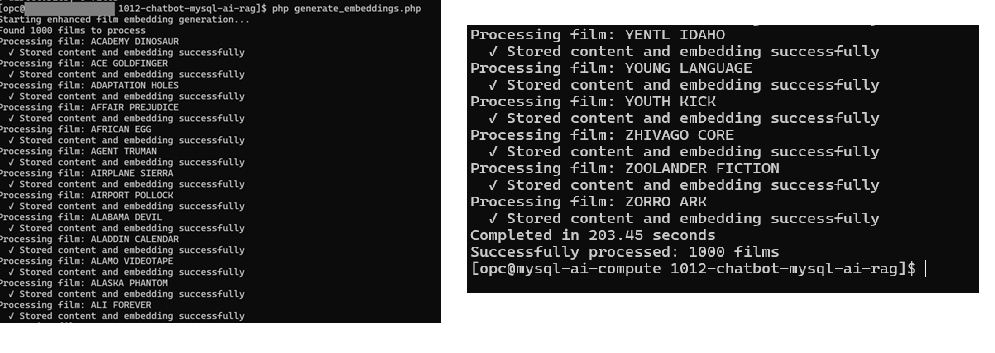

# Build MySQL AI RAG Application

## Introduction

This implementation showcases a pure RAG (Retrieval-Augmented Generation) application built on the LAMP stack, powered by MySQL Enterprise Edition 9.4.1's native AI capabilities. The application delivers intelligent movie recommendations from the Sakila sample database through semantic vector search and context-aware LLM responses, all processed within the database layer.

**Note:** This code is for educational purposes only and is not designed for production use.

_Estimated Lab Time:_ 30 minutes

### Objectives

- Understand the application architecture
- Deploy and configure the application
- Check for Errors
- Run and test the RAG application

### Prerequisites

- Oracle Trial or Paid Cloud Account
- Apache Web server with PHP 8.2+
- MySQL Enterprise Edition 9.4.1 or higher with MySQL AI enabled
- MySQL AI models configured:
  - `all_minilm_l12_v2` for embeddings
  - `llama3.2-3b-instruct-v1` for text generation
- Basic familiarity with MySQL and PHP
- Completed Lab 6

## Task 1: Understand the Application

A RAG chatbot using MySQL AI for in-database semantic search and LLM inference.

**Key Features:**
- All AI operations in MySQL (no external APIs)
- 7-section super prompt with strict knowledge boundaries
- Similarity filtering (0.30 threshold) for quality results
- Session-based history (4 turns max)


**Flow:** Query → Semantic search → Build super prompt (AI identity + rules + contexts) → MySQL LLM generates response


**File Structure**

chatbot-mysql-ai-rag/
├── api_key.php              # Database connection
├── config.php               # RAG parameters & model IDs
├── chat_handler.php         # Main RAG logic & API endpoint
├── generate_embeddings.php  # One-time vector generation
├── index.html               # Frontend UI
└── styles.css               # Styling


## Task 2: Deploy and Configure the Application

> **Note:** This application is the exact same application that you built in **Lab 5: Build Chatbot Application**. 
We just extended it to support RAG. So don't feel like you created the chatbot app for no purpose.

1. Navigate to the development folder

    ```bash
    <copy>cd /var/www/html</copy>
    ```

2. Download application code

    ```bash
    <copy>sudo wget https://objectstorage.us-ashburn-1.oraclecloud.com/p/Jpp9H3R-FwV2DTHA1m3NkjBcPM5VyN5m2ASaizg1BPnG6x79hmJMig6g-98kFSKB/n/idazzjlcjqzj/b/mysql-ai-store/o/chatbot-mysql-ai-rag.zip</copy>
    ```

3. Unzip application code

    ```bash
    <copy>sudo unzip chatbot-mysql-ai-rag.zip</copy>
    ```

4. View folder structure

    ```bash
    <copy>tree chatbot-mysql-ai-rag</copy>
    ```
    

5. Configure database credentials in `api_key.php`

    ```bash
    <copy>sudo nano chatbot-mysql-ai-rag/api_key.php</copy>
    ```

    Update to the following values:
    - `$db_config = [`
    - `'host' => 'localhost',`
    - `'port' => '3306',`
    - `'database' => 'sakila',`
    - `'username' => 'admin',`
    - `'password' => 'Workshop2024!',`
    - `'charset' => 'utf8mb4'`
    - `];

6. Set proper permissions

    ```bash
    <copy>cd chatbot-mysql-ai-rag</copy>
    <copy>sudo chmod 644 *.php *.html *.css</copy>
    <copy>sudo chmod 755 .</copy>
    ```

7. Generate the vector embeddings

    ```bash
    <copy>php /var/www/html/chatbot-mysql-ai-rag/generate_embeddings.php</copy>
    ```

    

## Task 3: Check for Errors

1. View the most recent PHP errors in real-time

    ```bash
    <copy>sudo tail -f /var/log/php-fpm/www-error.log</copy>
    ```

2. Clear an existing error log if it becomes too large or cluttered:

    ```bash
    <copy>sudo truncate -s 0 /var/log/php-fpm/www-error.log</copy>
    ```
3. To exit: Press Ctrl+C to stop following the log and return to your normal command prompt.

    **Note:** These commands are particularly helpful when:
    - The application isn't responding as expected
    - You're seeing blank pages or incomplete responses
    - The RAG functionality isn't retrieving film information correctly
    - There are issues with the MySQL AI connections

## Task 4: Run and Test the Application

1. Navigate to the application in your browser:

    `http://your-server-ip/chatbot-mysql-ai-rag/`

     **Note:** The first LLM query will take awhile... please be patient.

2. Test using sample prompts by clicking the "Sample Prompts" menu

    Categories include:
    - Pure RAG Movie Queries
    - Semantic Discovery
    - Comparison Queries
    - Genre-Specific Queries
    - Complex Queries

3. Try these example queries:

    - Tell me about ALIEN CENTER
    - What's the plot of APOCALYPSE FLAMINGOS?
    - Is BEAST HUNCHBACK a comedy or drama?
    - Recommend action movies
    - Movies about friendship and loyalty

4. Test edge cases:

    - Click "New Chat" to start fresh
    - Try **Tell me about CHICAGO NOOOORTH** (with typo)
    - Then try **Tell me about CHICAGO NORTH** (correct)
    - Click **New Chat** again
    - Ask **Do you know when Chicago N. was released?**
    - Try **I'd like to watch a movie with a composer and a detective. I want it to be fun. What do you recommend?**

5. Observe how the system handles:

    - Direct film title matches
    - Semantic similarities
    - Spelling variations
    - Incomplete title information
    - Natural language questions

    **Note:** This demonstrates the power of combining MySQL AI capabilities with RAG techniques for creating domain-specific applications with improved accuracy and relevance.

## Learn More

- [MySQL AI Documentation](https://dev.mysql.com/doc/mysql-ai/9.4/en/)

## Acknowledgements

- **Authors:** Craig Shallahamer, Applied AI Scientist, Viscosity North America; Perside Foster, Open Source Principal Partner Solution Engineer
- **Contributors:** Open Source Channel Enablement Team (Nick Mader, Chris Bates, Juliana Castro)
- **Last Updated:** October 2025