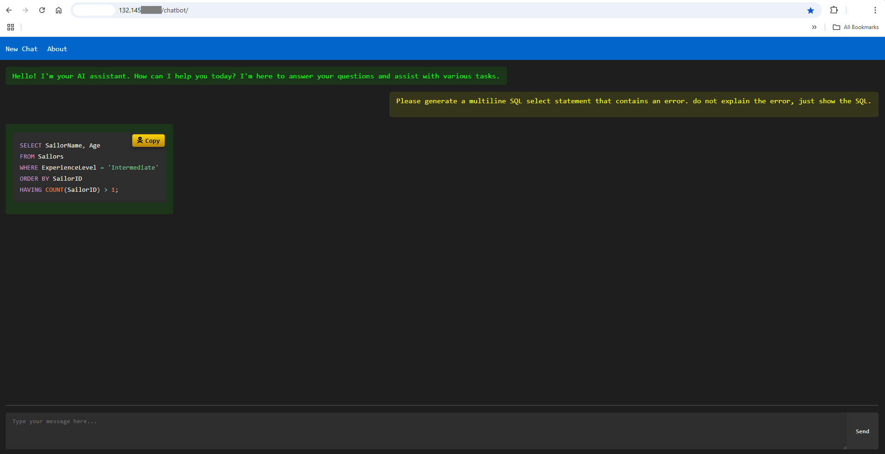

# Build Your Own AI Chatbot

## Introduction

In this lab, you will be building the chatbot portion of the final RAG application. We'll explore the new world of AI assistance, experiencing collaboration with an AI towards a common goal. Rather than static, one-off instructions given to Claude Sonnet 4.5, we'll begin to think of the AI as a working companion, empowering you to accomplish things you couldn't achieve before.

We will use Claude Sonnet to assist us in building the web app through conversational and iterative prompting. We will collaborate with Claude to handle all the PHP, CSS, HTML, and JavaScript coding. In one window, we'll work with Claude as our coding assistant, in another, we'll work with the code (there isn't much code), and in a third window, we'll run our web app.

We'll start by designing the general web app UI, then move on to integrating an MySQL AI 9.4.1 LLM  for AI responses, adding conversation memory, buttons and modals, and formatting for various types of text. We'll even experiment with fun features. By the end, our web app will be robust, engaging, and ready for collaborative interactions.

Starting with a basic interface, you will progressively enhance your application to include:

1. A responsive dark-mode UI with customizable styling
2. Multi line text input capabilities
3. Integration with MySQL AI powerful language models
4. Conversation memory to maintain context between messages
5. Markdown parsing and code syntax highlighting
6. User-friendly features like code copying and sample prompts

This approach mirrors professional development practices, allowing you to troubleshoot effectively and understand how the different technologies (HTML, CSS, JavaScript, PHP, and APIs) work together. By the end of the lab, you will have both a working chatbot and the knowledge to customize it further for your specific needs.

Whether you are new to web development or looking to enhance your skills with AI integration, this step-by-step process provides practical experience that can be applied to countless other projects.

**Note:** The application code in this lab is intended for educational purposes only. It is designed to help developers learn and practice application development skills. The code is not designed to be used in a production environment

_Estimated Lab Time:_ 30 minutes

### Objectives

In this lab, you will be guided through the following tasks:

- Execute each prompt to build the application
- Test each task before moving to the next one.
- Check for errors


### Prerequisites

- An Oracle Trial or Paid Cloud Account
- Apache Web server with PHP 8.2+
- Access to Claude Sonnet 4.5 AI assistant
- Access to MySQL AI Models (in-database): Embeddings: `all_minilm_l12_v2`
- Basic understanding of HTML, CSS, JavaScript and PHP
- Completed Lab 4

## Task 1: Build Basic Chat Interface (Full-Screen Version)

1. If not already connected with SSH, on Command Line, connect to the Compute instance using SSH ... be sure replace the  "private key file"  and the "new compute instance IP"

     ```bash
    <copy>ssh -i private_key_file opc@new_compute_instance_ip</copy>
     ```

2. Create applicationn folder:

      ```bash
      <copy> cd /var/www/html</copy>
      ```

      ```bash
      <copy> sudo mkdir chatbot</copy>
      ```

      ```bash
      <copy> cd chatbot</copy>
      ```


      **Start building the  Basic Chat Interface (Full-Screen Version)**
3. Copy prompt to Claude.ai

      ```bash
      <copy>Prompt 1: Basic Chat Interface (Full-Screen Version)

      Files:
      - index.html - Basic web interface with three sections
      - styles.css - Variable-driven CSS for easy customization

      I am a developer and an AI enthusiast.

      The goal is to code an AI Chatbot web app by using a step-by-step process. After each step, I will check that the app is working properly. Then I will prompt you for the next step. Because I will likely restart this process, your responses should be as consistent as possible.

      The app is to be primarily coded, in no particular order, using PHP, HTML, CSS and JQuery. If a web server is needed, use PHP which is installed on my system.

      This step focuses on creating a variable driven CSS stylesheet file (styles.css), so a designer can easily change the design. Plus, the chatbot interface which will contain the AI response text and a user input form field (index.html)

      The app contains three web page sections, which is always in dark mode, contained within a single column, with all text defaulting to the Monaco font. All main elements should have a CSS variable. The design will likely be changed, so please use Flexbox.

      Here is how to setup the three sections:
      - Section 1. Add a blue menu bar with 2 menu items; 'New Chat' and 'About'. The item text in white. Ensure the font is Monaco using CSS variables.
      - Section 2. Add a classic chat dialog displaying both the AI response (text color: classic bright terminal green, left justified) and the user input (text color: bright yellow, right justified). Add some placeholder text for the AI response to validate the chat dialog layout. Ensure the font is Monaco using CSS variables.
      - Section 3. On the bottom of the screen and on the same row spanning entire width of the screen, add the user input field and its submit button. Add a grey horizontal line at the top of this section with some space between the line and user input and submit button. Ensure the font is Monaco using CSS variables.

      **IMPORTANT:** Create artifacts with clear file names (index.html and styles.css) and use cache-busting CSS link: `<link rel="stylesheet" href="styles.css?v=1">`

      Your task is to code according to the above instructions and nothing else.

      Respond with each web app file briefly explaining its function.

      </copy>
      ```

   

4. Copy generated index.html file to "chatbot"" folder

    ```bash
    <copy> sudo nano index.html</copy>
    ```

5. Copy generated styles.css file to "chatbot"" folder

    ```bash
    <copy> sudo nano styles.css</copy>
    ```

6. From your local machine browser, test the Application Example: http://129.213.167.../chatbot

   

   **TESTING:**
   - I am Captain Craig.
   - Hit Send (No response)

## Task 2: Add Multi line Input Enhancement

1. **Prompt 2: Multi line Input Enhancement**

      Copy prompt to Claude.ai

      ```bash
      <copy>Prompt 2: Multi line Input Enhancement

      Files: I want completed files with updates included
      - index.html - Updated textarea in input section
      - styles.css - Styling for multi line input

      Please enhance the chatbot so the user has the ability to enter multiple lines, such as three lines, instead of just one. Is this possible?
      </copy>
      ```

2. Replace index.html file with new content in  "chatbot" folder

      - Delete all content
      ```bash
      <copy> sudo rm index.html</copy>
      ```
      - Replace all content
      ```bash
      <copy> sudo nano index.html</copy>
      ```

3. Replace styles.css file with new content in  "chatbot" folder

      - Delete all content
      ```bash
      <copy> sudo rm styles.css</copy>
      ```
      - Replace all content
      ```bash
      <copy> sudo nano styles.css</copy>
      ```


4. From your local machine browser, test the Application Example: http://129.213.167.../chatbot

   **TESTING:**
   - I am Captain Craig.
   - Hit "Shift + Enter"
   - Do you remember my name?
   - Hit Send (No response)

## Task 3: Add LLM Integration

1. **Prompt 3: MySQL AI LLM Integration**
      Copy prompt to Claude.ai

      ```bash
      <copy>Prompt 3: MySQL AI Integration
      Files: I want completed files with updates included

      api_key.php - Store MySQL AI database connection details
      chat_handler.php - Process user input and connect to MySQL AI 9.4.1
      index.html - Updated with script to handle API calls
      styles.css - Updated to ensure full-screen display

      This step focuses on enhancing the existing code base enabling MySQL AI 9.4.1 LLM to respond and display its response.
      MySQL AI Integration Requirements:

      Use MySQL AI 9.4.1 with the sys.ML_GENERATE function
      Function syntax: sys.ML_GENERATE(prompt, JSON_OBJECT('task', 'generation', 'model_id', 'llama3.2-3b-instruct-v1'))
      The function returns JSON format: {"text": "response", "license": "..."}
      Extract only the "text" field from the JSON response for display
      Include proper JSON parsing and error handling for malformed responses

      Database Connection:

      Store connection details in api_key.php (security risk acknowledged)
      Use PDO with proper error handling and prepared statements

      System Prompt Requirements:

      Give direct, concise answers without unnecessary pleasantries or conversational filler
      When asked for code, SQL, or technical examples, provide them immediately without asking for clarification unless genuinely ambiguous
      Skip phrases like 'I'm glad you're here' or 'Before I get started'
      Answer questions directly and focus on what was asked
      Use formatting only when it improves clarity

      Frontend Integration:

      Add jQuery for AJAX functionality
      Handle form submission with POST to chat_handler.php
      Display responses in the existing chat dialog
      Include loading states and error messaging

      CSS Requirements:

      Maintain full-screen visual design from Step 1
      Ensure all container elements use width: 100%
      Main container uses width: 100vw
      HTML/body elements: width and height 100%, overflow hidden

      Your task is to code according to the above instructions and nothing else.
      </copy>
      ```

2. Copy generated api\_key.php file to "chatbot"" folder

    ```bash
    <copy> sudo nano api_key.php</copy>
    ```

  **Update to the following values:**

    // MySQL AI Database Connection Details
    - `define('DB_HOST', 'localhost');`
    - `define('DB_NAME', 'mysql');`
    - `define('DB_USER', 'admin');`
    - `define('DB_PASS', 'Workshop2024!');`
    - `define('DB_CHARSET', 'utf8mb4');`


3. Copy generated chat\_handler.php file to "chatbot"" folder

    ```bash
    <copy> sudo nano chat_handler.php</copy>
    ```

4. Replace index.html file with new content in  "chatbot" folder

      - Delete all content
      ```bash
      <copy> sudo rm index.html</copy>
      ```
      - Replace all content
      ```bash
      <copy> sudo nano index.html</copy>
      ```

5. Replace styles.css file with new content in  "chatbot" folder

      - Delete all content
      ```bash
      <copy> sudo rm styles.css</copy>
      ```
      - Replace all content
      ```bash
      <copy> sudo nano styles.css</copy>
      ```

6. From your local machine browser, test the Application Example: http://129.213.167.../chatbot

   **Note:** The first LLM query will take awhile... please be patient.

   **TESTING:**
   - I am Captain Craig.
   - I want to sail very far away from here! Will you join me?
   - Do you remember my name?

      **Note:** In case you see the following error

      **" Sorry, there was an error processing your request. Please try again later. (Error: )"**

      - Review the api_key.php file and make sure you have entered the correct database information .

## Task 4: Add Conversation Memory

1. **Prompt 4: Conversation Memory**
      Copy prompt to Claude.ai

      ```bash
      <copy>Prompt 4: Conversation Memory

      Files Modified:
      - chat_handler.php - Add session handling for chat history
      - index.html - Update "New Chat" button logic

      Enhance the chatbot to maintain context throughout a conversation by:
      1. Storing conversation history in PHP sessions
      2. Passing previous messages to the AI with each new request
      3. Allowing the AI to reference information from earlier in the conversation

      Requirements:
      - Implement PHP session handling to store chat history
      - Update the API calls to include the full conversation context
      - Add a mechanism to limit the conversation length to prevent token limits
      - Ensure the "New Chat" button properly clears both the UI and the server-side memory

      Implementation details:
      - Add session initialization in chat_handler.php
      - Create a conversation history array structure with system, user, and assistant messages
      - Include the conversation history in each API request to MySQL AI 
      - Update the system prompt to instruct the AI to remember user information
      - Add a clear_history action to reset the conversation when "New Chat" is clicked

      The goal is to make the chatbot feel more natural by remembering previous interactions until the user explicitly starts a new chat.
      </copy>
      ```


2. Replace chat\_handler.php file with new content in  "chatbot" folder

      - Delete all content
      ```bash
      <copy> sudo rm chat_handler.php</copy>
      ```
      - Replace all content
      ```bash
      <copy> sudo nano chat_handler.php</copy>
      ```

3. Replace index.html file with new content in  "chatbot" folder

      - Delete all content
      ```bash
      <copy> sudo rm index.html</copy>
      ```
      - Replace all content
      ```bash
      <copy> sudo nano index.html</copy>
      ```

4. From your local machine browser, test the Application Example: http://129.213.167.../chatbot
   

   **TESTING:**
   - I am Captain Craig.
   - I want to sail very far away from here! Will you join me?
   - Do you remember my name?
   - Please generate a multi line SQL statement.
   - Please generate a multiline SQL statement.

## Task 5: Add Text Formatting Enhancement

1. **Prompt 5: Text Formatting Enhancement**
      Copy prompt to Claude.ai

      ```bash
      <copy>Prompt 5: Text Formatting Enhancement

      Files Modified:
      - index.html - Add proper markdown and code syntax highlighting
      - styles.css - Add styling for formatted text and code
      - chat_handler.php - Update system prompt for balanced formatting

      Enhance the chatbot so it properly displays formatted text, including plain text, markdown, and code snippets in various languages.

      Requirements:
      - For user input, preserve whitespace, indentation, and line breaks exactly as entered
      - For AI responses, implement markdown parsing using Showdown.js with appropriate configuration
      - Add code syntax highlighting using Prism.js core and autoloader for different programming languages
      - Ensure the welcome message stays as simple plain text with no formatting
      - Configure AI to provide direct, concise responses without unnecessary formatting
      - **Add automatic session clearing on page load to ensure fresh conversations**

      Implementation details:
      Include the correct libraries in the proper order:
      - jQuery first
      - Showdown.js for markdown conversion
      - Prism.js core component
      - Prism autoloader plugin (instead of individual language components)

      Configure Showdown properly:
      - Enable GitHub-style code blocks
      - Enable tables, task lists, and strikethrough
      - Do NOT use the 'prettify' extension which causes errors

      Implement safe code highlighting:
      - Use a try-catch block around highlighting operations
      - Add a class to processed code blocks to prevent re-processing
      - Use setTimeout to ensure DOM is ready before highlighting

      **Session Management:**
      - Add automatic conversation history clearing on page load
      - Create a separate clearConversationHistory() function for reusability
      - Ensure every fresh visit starts with a clean conversation state
      - Maintain "New Chat" button functionality for manual resets during sessions

      Update the chat_handler.php system prompt:
      - Instruct AI to provide direct, concise answers
      - Use markdown/formatting only when specifically beneficial
      - Avoid unnecessary headers, verbose explanations, or over-formatting
      - When generating code, provide clean examples without extra commentary unless requested
      - Do NOT use nl2br() function on AI responses

      Style code blocks and formatted text appropriately:
      - Add proper styling for headings, lists, links, blockquotes, tables
      - Ensure code blocks have proper background and text colors
      - Preserve user message formatting with pre tags and CSS

      **IMPORTANT:** Include cache-busting CSS link with incremented version number and ensure artifacts are named clearly (index.html and styles.css).

      The goal is to make the chatbot display formatted text naturally when needed while maintaining concise, direct responses, preventing JavaScript errors, and ensuring every user starts with a fresh conversation state.

      </copy>
      ```

2. Replace index.html file with new content in  "chatbot" folder

      - Delete all content
      ```bash
      <copy> sudo rm index.html</copy>
      ```
      - Replace all content
      ```bash
      <copy> sudo nano index.html</copy>
      ```

3. Replace styles.css file with new content in  "chatbot" folder

      - Delete all content
      ```bash
      <copy> sudo rm styles.css</copy>
      ```
      - Replace all content
      ```bash
      <copy> sudo nano styles.css</copy>
      ```

4. Replace chat\_handler.php file with new content in  "chatbot" folder

      - Delete all content
      ```bash
      <copy> sudo rm chat_handler.php</copy>
      ```
      - Replace all content
      ```bash
      <copy> sudo nano chat_handler.php</copy>
      ```

5. From your local machine browser, test the Application Example: http://129.213.167.../chatbot
   

   **TESTING**
   - I am Captain Craig.
   - Please generate a multi line SQL statement.
   - Please generate a multiline SQL statement.
   - Please generate a 200 word story about a baby bird breaking out of its shell for the first time.


## Task 6: Add Code Copy Functionality

1. **Prompt 6: Add Code Copy Functionality**

      Copy prompt to Claude.ai

      ```bash
      <copy>Prompt 6: Code Copy Functionality with HTTP Fallback

      Files Modified:
      - index.html
      - styles.css

      Generate code to enhance the chatbot with a convenient way to copy code snippets by adding a pirate-themed copy button to code blocks that works in both secure (HTTPS) and non-secure (HTTP) environments.

      Requirements:
      1. Add a copy button that appears when hovering over any code block in AI responses
      2. Style the button with a pirate theme (skull and crossbones icon)
      3. Provide visual feedback when the code is successfully copied
      4. Make sure the button works with all code languages
      5. Ensure compatibility with HTTP connections by implementing a fallback method
      6. **Ensure cross-browser compatibility, especially Chrome and Firefox**

      Implementation details:
      - Add a function to identify and process all code blocks in AI responses
      - Create a cross-browser compatible copy-to-clipboard function that works on HTTP
      - Implement fallback method using document.execCommand for non-secure contexts
      - Add pirate-themed styling with treasure colors (gold gradient)
      - Implement hover effects and success feedback animation
      - Ensure mobile compatibility with touch-friendly design
      - **Set initial button opacity to 0.7 instead of 0 for Chrome compatibility**
      - **Add -webkit-appearance: none for consistent cross-browser button styling**
      - **Include both parent hover and direct button hover states for better visibility**

      **Cross-browser compatibility fixes:**
      - Use opacity: 0.7 instead of opacity: 0 to ensure buttons are discoverable in all browsers
      - Add -webkit-appearance, -moz-appearance, and appearance: none for consistent styling
      - Include multiple hover selectors: both `.ai-message pre:hover .copy-button` and `.copy-button:hover`
      - Increment CSS version number for cache-busting

      **IMPORTANT:** Include cache-busting CSS link with incremented version number and ensure artifacts are named clearly (index.html and styles.css).

      The goal is to make it easier for users to use the code provided by the AI while adding a fun visual element to the interface, ensure the functionality works on both secure and non-secure connections, and guarantee compatibility across all major browsers including Chrome and Firefox.

      </copy>
      ```

2. Replace index.html file with new content in  "chatbot" folder

      - Delete all content
      ```bash
      <copy> sudo rm index.html</copy>
      ```
      - Replace all content
      ```bash
      <copy> sudo nano index.html</copy>
      ```


3. Replace styles.css file with new content in  "chatbot" folder

      - Delete all content
      ```bash
      <copy> sudo rm styles.css</copy>
      ```
      - Replace all content
      ```bash
      <copy> sudo nano styles.css</copy>
      ```


4. From your local machine browser, test the Application Example: http://129.213.167.../chatbot
   

   **TESTING**
   
   - Please generate a multi line SQL select statement that contains an error. do not explain the error, just show the SQL.
   - Please generate a multiline SQL select statement that contains an error. do not explain the error, just show the SQL.
   - Copy that text
   - Create a 'New Chat'
   - Enter: I think there is something wrong with this SQL. What do you think?
   - **paste the sql there**

## Task 7: Add About Popup

1. **Prompt 7: Add About Popup**

      Copy prompt to Claude.ai

      ```bash
      <copy>Prompt 7: About Popup
      Files Modified: I want completed files with updates  included
      index.html - Add popup overlay and handling for About button
      styles.css - Styling for popup window

      I want to improve this chatbot so when the About button is pressed a small window pops up with the centered text, "This Chatbot was " How can I do this?
      I want to improve this chatbot so when the About button is pressed a small window pops up with the centered text, "This Chatbot was created during the MySQL AI Introduction October 2025!" How can I do this?

      </copy>
      ```

2. Replace index.html file with new content in  "chatbot" folder

      - Delete all content
      ```bash
      <copy> sudo rm index.html</copy>
      ```
      - Replace all content
      ```bash
      <copy> sudo nano index.html</copy>
      ```

3. Replace styles.css file with new content in  "chatbot" folder

      - Delete all content
      ```bash
      <copy> sudo rm styles.css</copy>
      ```
      - Replace all content
      ```bash
      <copy> sudo nano styles.css</copy>
      ```

4. From your local machine browser, test the Application Example: http://129.213.167.../chatbot

 - Click "About" button for simple popup window.

## Task 8: Add Sample Prompts Feature

1. **Prompt 8: Sample Prompts Feature**

      Copy prompt to Claude.ai

      ```bash
      <copy>Prompt 8: Sample Prompts Feature (Corrected)
      Files Modified:

      index.html - Add Sample Prompts menu item and popup dialog
      styles.css - Add styling for sample prompts popup and categories

      Enhance the chatbot with a Sample Prompts feature that allows users to select from predefined test queries.
      Requirements:

      Add a "Sample Prompts" item to the top menu bar between "New Chat" and "About"
      Create a popup dialog that displays categorized sample queries with click-to-use functionality
      Allow users to select any query to be automatically inserted into the input field
      Organize sample prompts by feature type (Basic Conversation, Code Highlighting, Context Memory, etc.)

      Implementation details:

      Add a new menu item in the header section with proper event handling
      Create a large popup overlay with scrollable content and categorized sections
      Style sample prompts as clickable elements with hover effects and mobile responsiveness
      Implement JavaScript to populate the input field when a sample is clicked and close the popup
      Include multi line samples to demonstrate textarea capabilities

      Sample Prompts to Include:

      Basic Conversation:

      "Hello, how are you today?"
      "What can you help me with?"
      "Tell me a fun fact about technology"


      Multi line Input Demo:

      Code review example with multi line JavaScript function


      Markdown Formatting:

      "Explain what markdown is and show examples"
      "Show me markdown syntax for headers, lists, and links"


      Code Highlighting:

      "Write a Python function to calculate fibonacci numbers"
      "Create an HTML form with validation"
      "Generate a SQL statement that takes up several lines"
      "Show me a JavaScript async/await example"
      "Generate a SQL select statement that takes up several lines and contains an error. Do not explain the error."


      Context Memory Test:

      "My name is John"
      "What is my name?"
      "I work as a software developer"
      "What do I do for a living?"


      Complex Conversation:

      "I have a cat named Whiskers"
      "She's 3 years old and loves to play"
      "What can you tell me about my pet?"


      Important: Include cache-busting CSS link with incremented version number and ensure artifacts are named clearly (index.html and styles.css).
      The goal is to provide an easy way for users to test chatbot features and demonstrate its capabilities through pre-written example prompts.
      </copy>
      ```

2. Replace index.html file with new content in  "chatbot" folder

      - Delete all content
      ```bash
      <copy> sudo rm index.html</copy>
      ```
      - Replace all content
      ```bash
      <copy> sudo nano index.html</copy>
      ```

3. Replace styles.css file with new content in  "chatbot" folder

      - Delete all content
      ```bash
      <copy> sudo rm styles.css</copy>
      ```
      - Replace all content
      ```bash
      <copy> sudo nano styles.css</copy>
      ```

4. From your local machine browser, test the Application Example: http://129.213.167.../chatbot

## Task 9: Check for Errors

1. Monitor PHP-FPM errors in real-time to troubleshoot issues with your PHP application.

      ```bash
      <copy>sudo tail -f /var/log/php-fpm/error.log</copy>
      ```
2. To exit: Press Ctrl+C to stop following the log and return to your normal command prompt.

You may now **proceed to the next lab**

## Acknowledgements

- Authors: Craig Shallahamer, Applied AI Scientist, Viscosity North America, Perside Foster, Open Source Principal Partner Solution Engineer
- Contributors: Open Source Channel Enablement Team (Nick Mader, Chris Bates, Juliana Castro)
- Last Updated: Perside Foster, October 2025