# Create a Compute Instance

## Introduction

Oracle Cloud Infrastructure Compute lets you provision and manage compute hosts, known as instances. You can create instances as needed to meet your compute and application requirements. After you create an instance, you can access it securely from your computer or cloud shell.

_Estimated Time:_ 10 minutes

### Objectives

In this lab, you will be guided through the following task:

- Create Compute Instance

### Prerequisites

- You have completed Lab 1.

## Task 1: Create a Compute Instance

You need a compute instance to connect to perform the database and application tasks.

1. Click the **Navigation menu** in the upper left, navigate to **Compute**, and under **Compute**, select **Instances**.
  
    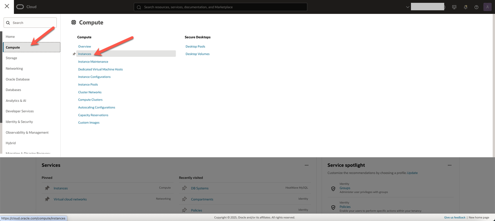

2. Ensure **mysql** compartment is selected, and click **Create instance**.

     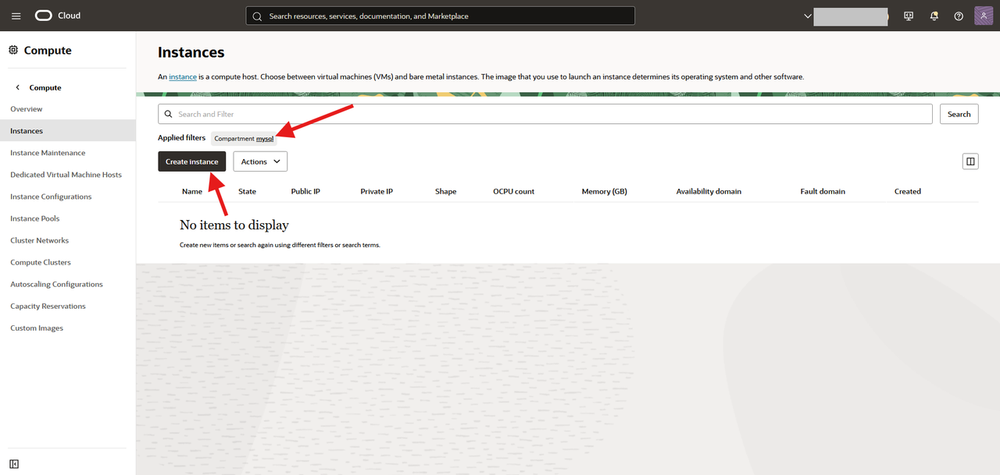

3. On **Create compute instance** page, enter the name of the compute instance.

    ```bash
    <copy>mysql-compute</copy>
    ```

4. Ensure **mysql** compartment is selected.

5. In the **Placement** field, keep the selected **Availability domain**.

    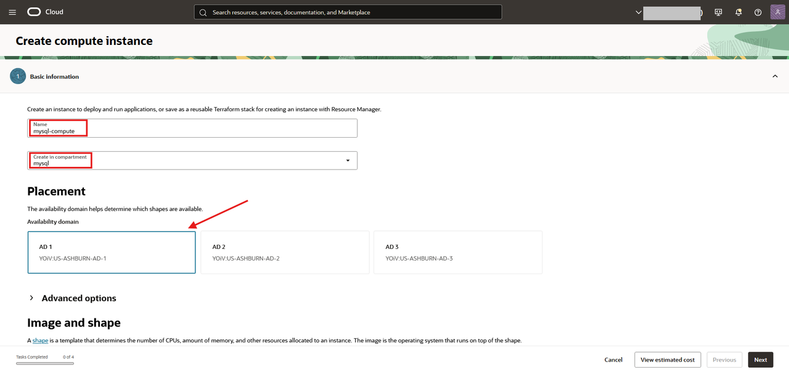

6. In the **Image and Shape** field, change the default image.

    Click the **Change image** button to select image, **Oracle Linux 8**.
    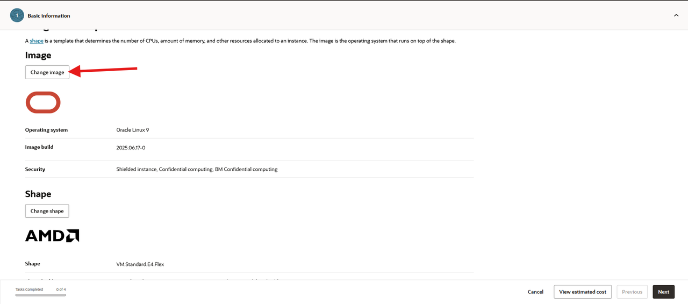

7. In the **Select Image Screen** do the followings:
    1. Click the **Oracle Linux Box**
    2. Enter the following in the search box:

        ```bash
        <copy>Oracle Linux 8</copy>
        ```

    3. Select the **Oracle Linux 8** entry
    4. Click the **Select Image** button
        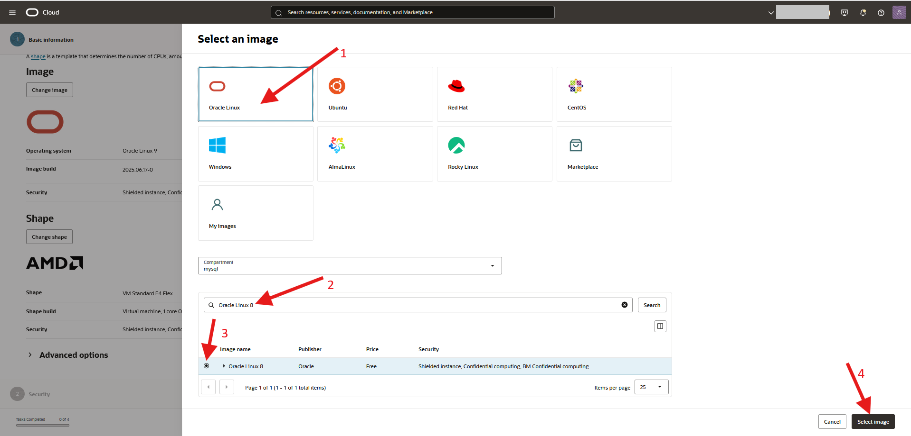

7. In the **Image and Shape** field, change the default shape.

    Click the **Change shape** button to select shape, **VM.Standard.E4.Flex**.

    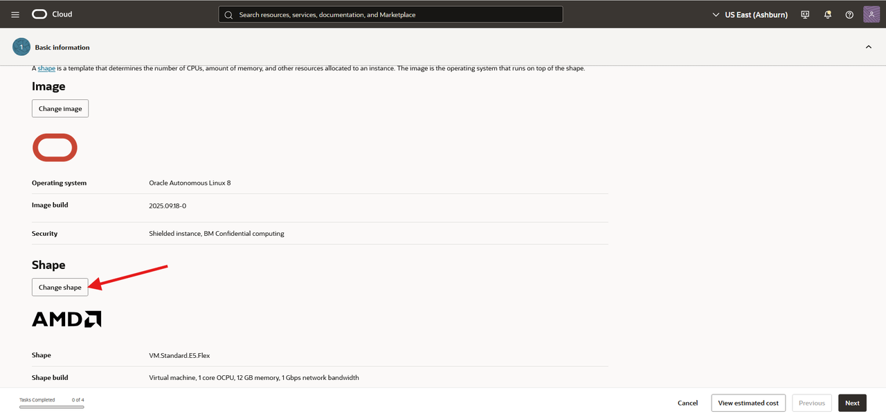

8. In the **Select Shape Screen** do the followings:
    - Instance type: 	Virtual machine
    - Shape series:  	AMD
    - Shape name:    	VM.Standard.E4.Flex
    - Number of OCPUs:  32
    - Amount of memory (GB):  512

    4. Click the **Select shape** button
        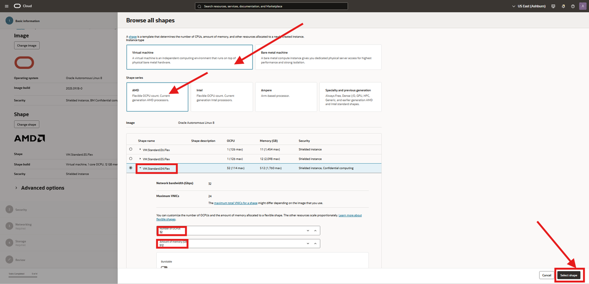


9. In the final **Image and Shape** field, keep the default shape and the new **Oracle Linux 8** image , and click **Next**.
   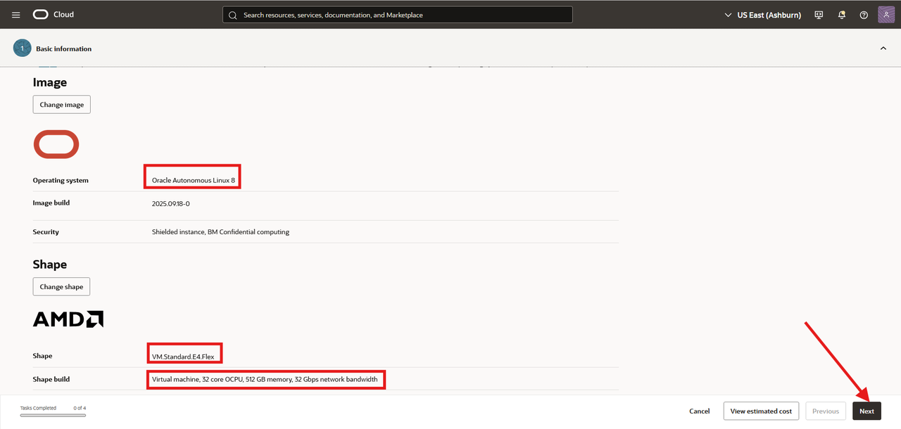

10. Under **Security** panel, click **Next**.

11. Under **Networking** panel, in **Primary network** field, select **Select existing virtual cloud network**, and ensure the following settings are selected:

    - **Virtual cloud network compartment**: **mysql**

    - **Virtual cloud network**: **mysql-vcn**

12. Under **Subnet**, ensure the following are selected:

    - **Subnet compartment**: **mysql**

    - **Subnet**: **public-subnet-mysql-vcn**

13. In **Primary VNIC IP addresses** field, ensure the following settings are selected:

    - **Private IPv4 address**: **Automatically assign private IPv4 address**

    - **Automatically assign public IPv4 address**: Enabled

    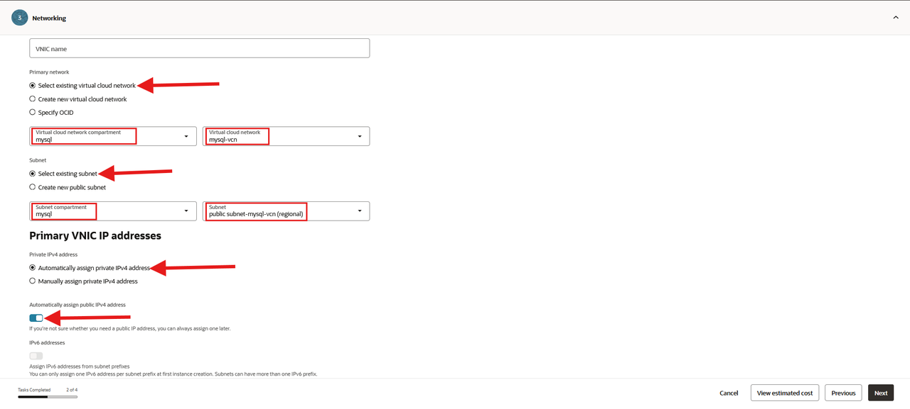

14. In **Add SSH keys** field, select **Generate a key pair for me** and Click **Download private key**
  
    

15. Save **private key** in your ssh folder, and rename the key. For example:

    ```bash
    <copy>ssh-key-2025</copy>
    ```

     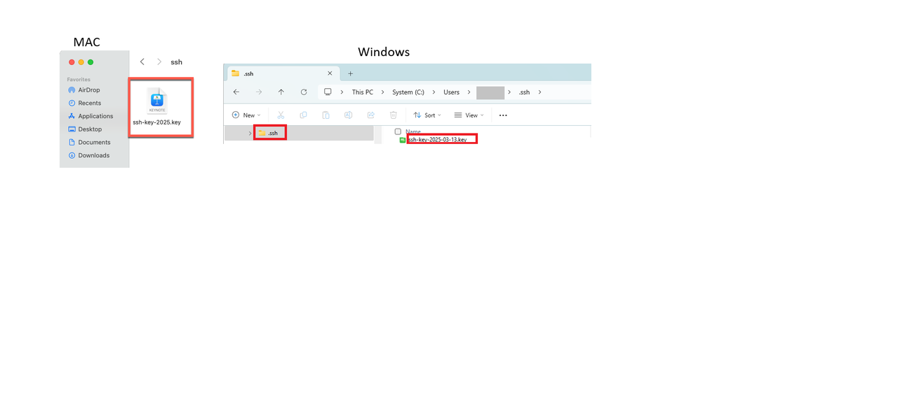

16. Click **Next**.

17. On the Storage section change the  Boot volume size  to 600 GB:
    - Turn on the **Specify a custom boot volume size and performance setting** button
    - Enter the value 600
    - Click **Next**


    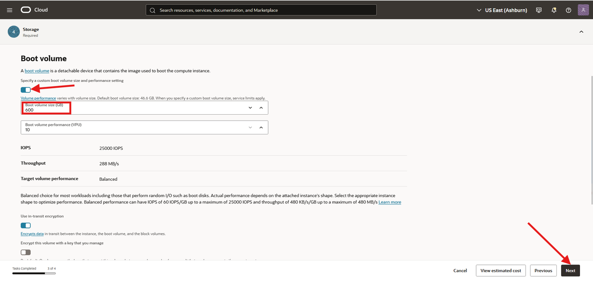

18. Click **Create** to create your compute instance.

19. The compute instance will be ready to use after a few minutes. The state is shown as **Provisioning** while the instance is creating.

20. When the compute instance is ready to use, the state is shown as **Running**. _Save_ the **Public IP address** and the **Username**.

    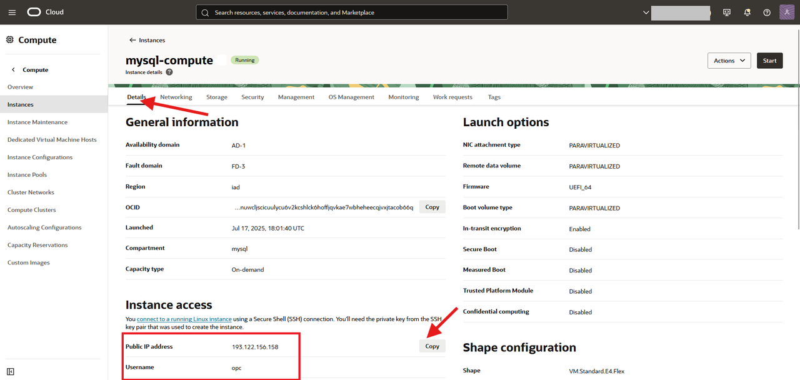

You may now **proceed to the next lab**.

## Acknowledgements

- Authors: Craig Shallahamer, Applied AI Scientist, Viscosity North America, Perside Foster, Open Source Principal Partner Solution Engineer
- Contributors: Open - Source Channel Enablement Team (Nick Mader, Chris Bates, Juliana Castro)
- Last Updated: Perside Foster, October 2025
