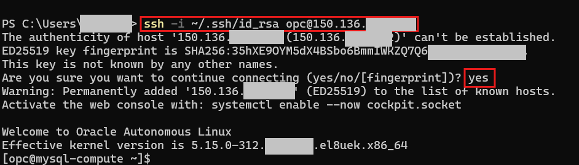
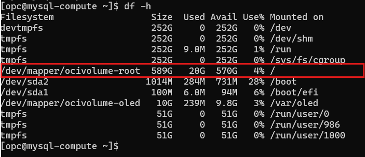
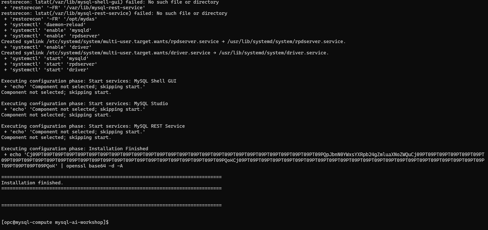
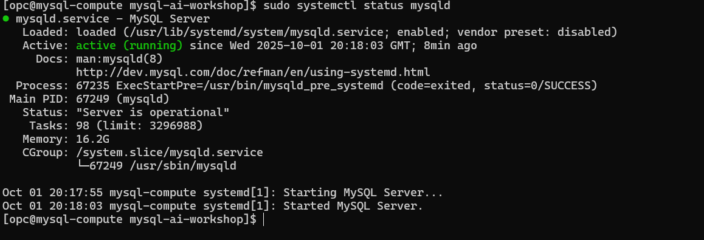

# Install MySQL AI

## Introduction

MySQL AI provides developers the ability to build rich applications with MySQL leveraging built in machine learning, GenAI, LLMs and semantic search. They can create vectors from documents stored in a local file system. Customers can deploy these AI applications on premise or migrate them to MySQL HeatWave for lower cost, higher performance, richer functionality and latest LLMs with no change to their application. This gives developers the flexibility to build their applications on MySQL EE and then deploy them either on premise or in the cloud.

**Important Note:** This configuration is for POC/development only. Production deployments should use strong passwords, restrict remote access, and enable encryption.


_Estimated Time:_ 20 minutes

### Objectives

In this lab, you will be guided through the following tasks:

- Install MySQL AI
- Start and test MySQL AI


### Prerequisites

This lab assumes you have:

- Completed Lab 2
- **OCI Compute instance with at least 500GB available storage**
- SSH access to your compute instance


## Task 1: Connect to OCI compute  and verify storage availability

1. Connect with SSH, on Command Line, connect to the Compute instance using SSH ... be sure replace the  "private key file"  and the "new compute instance Public IP". Enter  **Yes** for the "Are you sure" question.

     ```bash
    <copy>ssh -i private_key_file opc@new_compute_instance_public_ip</copy>
     ```

    


2. Verify OCI compute instance 600GB storage is available for use

    ```bash
    <copy>sudo /usr/libexec/oci-growfs -h</copy>
    ```

    ```bash
    <copy>df -h</copy>
    ```

    > **Important:** MySQL AI requires approximately **500GB of disk space** for:
    > - MySQL Server installation
    > - Embedded LLM models (llama3.2, e5-small, all\_minilm\_l12\_v2)
    > - Vector storage and indexes
    > - Database files and logs
    >
    > Your df -h output should show at least 500GB available space.


    

    The following output entry means: You're all set! You have 570GB of free space available right now

    **/dev/mapper/ocivolume-root  589G   20G  570G   4% /**
    - Total size: 589GB (close to your 600GB - some space is reserved for filesystem overhead)
    - Used: 20GB
    - Available: 570GB free
    - Mounted at: / (root directory)

## Task 2: Prepare  MySQL AI for installation

3. Create installation folder

    ```bash
    <copy>mkdir ~/mysql-ai-workshop</copy>
    ```
4. Go to new directory

    ```bash
    <copy>cd ~/mysql-ai-workshop</copy>
    ```
5. Download MySQL AI file

    ```bash
    <copy>wget https://objectstorage.us-ashburn-1.oraclecloud.com/p/ywKKB1ymwLAeMUa3yiA4KE1l1EUu-xz4pXJC_XCPrxzUe3HKcKkTIYrUWk5gPk1C/n/idazzjlcjqzj/b/mysql-ai-store/o/V1051679-01.zip</copy>
    ```
6. Unzip the downloaded file

    ```bash
    <copy>unzip V1051679-01.zip</copy>
    ```

7. Make sure the required files are available.

    ```bash
    <copy>ls -la
    find . -name "*.rpm"</copy>
    ```

## Task 3: Install MySQL AI

1. Installs the MySQL AI setup tool/installer onto your system

    ```bash
    <copy>sudo dnf localinstall mysql-ai-setup-9.4.1-1.2.el8.x86_64.rpm -y</copy>
    ```
2. Install and configure MySQL Server 9.4.1 with AI/ML capabilities (HeatWave GenAI)
    - download the embedded LLM models (llama3.2, e5-small, etc.) **~400GB**
    - set up the ML functions and procedures, and starts the MySQL service.

    ```bash
    <copy>sudo mysql-ai-setup --cli \
        --mysql-root-user=admin \
        --mysql-root-password='Workshop2024!' \
        --mysql-root-allow-remote-connection \
        --secure-file-priv=/var/lib/mysql-files \
        --skip-ai-encryption</copy>
    ```
3. Wait for installation to complete (approximately 15-20 minutes depending on network speed for model downloads).

    Final results should look like this:

    


## Task 4: Verify Installation

1. Check MySQL AI status

    ```bash
    <copy>sudo systemctl status mysqld</copy>
    ```
    

2. Check MySQL version. Should show MySQL 9.4.1-ai

    ```bash
    <copy>mysql --version</copy>
    ```

3. Login to MySQL. Password is  **Workshop2024!** 

    - Save the password for later use.

    ```bash
    <copy>mysql -h localhost -u admin -p</copy>
    ```

4. Check ML functions. Should see: ML\_EMBED\_ROW, ML\_GENERATE, ML\_PREDICT_ROW, etc.

    ```bash
    <copy>SHOW FUNCTION STATUS WHERE Name LIKE 'ML_%';</copy>
    ```

5.  Check ML procedures. Should see: ML\_TRAIN, ML\_MODEL\_LOAD, ML\_RAG, etc.
    ```bash
    <copy>SHOW PROCEDURE STATUS WHERE Name LIKE 'ML_%';</copy>
    ```

6. List available models. Should show: llama3.2-3b-instruct-v1, multilingual-e5-small, all\_minilm\_l12_v2

    ```bash
    <copy>SELECT sys.ML_LIST_LLMS();</copy>
    ```
7. Exit MySQL.

    ```bash
    <copy>EXIT;</copy>
    ```


You may now **proceed to the next lab**.

## Learn More

- [MySQL AI Installation](https://dev.mysql.com/doc/mysql-ai/9.4/en/myai-installation.html)

## Acknowledgements

- Authors: Craig Shallahamer, Applied AI Scientist, Viscosity North America, Perside Foster, Open Source Principal Partner Solution Engineer
- Contributors: Open - Source Channel Enablement Team (Nick Mader, Chris Bates, Juliana Castro)
- Last Updated: Perside Foster, October 2025
