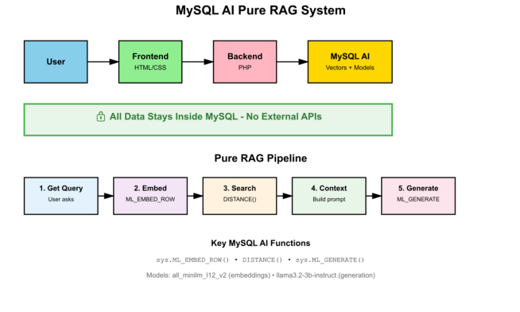

# Introduction

## About this Workshop

### Building  A Pure RAG Application with MySQL Enterprise Edition for MySQL AI

In this workshop, you will use MySQL Enterprise Edition 9.4.1 with MySQL AI's built-in language models, vector search, and relational capabilities to build a privacy-preserving film recommendation and Q&A application. You will see how a traditional relational database can power a complete RAG workflow—embeddings, semantic search, and response generation—entirely inside MySQL, keeping your data private and under your control.

### View the documentation:
- [MySQL AI](https://dev.mysql.com/doc/mysql-ai/9.4/en/)

### What is MySQL Enterprise Edition for MySQL AI?

MySQL Enterprise Edition for MySQL AI integrates machine learning directly into the database. Announced in April 2025, it enables you to:

- Generate vector embeddings in SQL with `sys.ML_EMBED_ROW()`
- Store and search vectors using the native VECTOR data type and `DISTANCE()` functions
- Generate natural-language responses with `sys.ML_GENERATE()` and built-in LLMs
- Keep all data and AI processing in your infrastructure—no external AI services or API costs

Compared to traditional RAG pipelines that rely on external providers, MySQL AI keeps data in-database for privacy, cost predictability, and operational control.

### What You'll Build and Learn

You will build a Pure RAG application over the Sakila film database, starting with a terminal-themed chatbot UI and integrating MySQL's vector and AI functions for end-to-end retrieval and generation.

You will learn to:
- Create and manage VECTOR columns
- Generate embeddings with `sys.ML_EMBED_ROW()` and query them efficiently
- Perform semantic similarity searches with `DISTANCE()` (cosine, Euclidean, dot product)
- Orchestrate a RAG pipeline fully in SQL
- Generate responses with `sys.ML_GENERATE()`
- Manage conversation context and deploy a self-contained application

Estimated Workshop Time: 120 minutes

### Why This Matters

- Data privacy and compliance: All AI operations occur within MySQL; no third-party data sharing
- Cost and performance: Predictable licensing, no per-token fees, reduced latency, no rate limits
- Control and reliability: Full ownership of models, data, and infrastructure

## System Architecture

Main components:
1. Frontend: HTML/CSS/jQuery with AJAX
2. Backend: PHP/Apache orchestrating the RAG flow
3. MySQL Database: Sakila schema with vectorized film descriptions
4. MySQL AI Models (in-database):
   - Embeddings: `all_minilm_l12_v2` (384-D vectors)
   - Generation: `llama3.2-3b-instruct`

Data Privacy: Embedding, search, and generation all run inside MySQL; no external AI calls.

## Real-World Applications

- Internal knowledge bases and document search
- Customer support assistants with private data
- Healthcare, finance, government, and legal workloads with strict compliance needs
- HR assistants and product recommendations without external data exposure
- Manufacturing, education, and other regulated or sensitive-data environments

Key business advantages:
- Meet regulatory requirements (e.g., GDPR, HIPAA, SOC2, PCI-DSS)
- Avoid vendor lock-in and unpredictable API charges
- Reduce latency and remove external service limits
- Keep proprietary data in-house

## Approach and Labs

You will complete the following phases and labs:

1. Setup OCI Components
   - Lab 1: Create a Virtual Cloud Network
   - Lab 2: Create a Compute instance

2. Setup Database, AI, and Sakila
   - Lab 3: Install MySQL Enterprise Edition 9.4.1 with MySQL AI
   - Lab 4: Install Sakila and configure vector embeddings with `sys.ML_EMBED_ROW()`

3. Setup and Chatbot
   - Lab 5: Build and test Apache/PHP
   - Lab 6: Build Pure RAG chatbot interface

4. Build and Validate Sakila Pure RAG pipeline
   - Lab 7: Build, deploy, and test the Pure RAG Application

You may now proceed to the next lab.

## Prerequisites

- Oracle Free Tier or paid Cloud account
- Basic SQL knowledge
- Familiarity with PHP and web development
- Helpful: understanding of vector embeddings and semantic search
- No external AI accounts or APIs required

## About the Product/Technology

MySQL Enterprise Edition 9.4.1 for MySQL AI brings AI into the database engine.

Core database features:
- High performance and advanced query optimization
- Native VECTOR type and vector operations
- Enterprise-grade security (encryption, authentication, audit)
- High availability (replication, clustering)
- Simplified administration and tooling
- Cross-platform support and 24/7 enterprise support

AI capabilities:
- `sys.ML_EMBED_ROW()`: Embedding generation with built-in models (e.g., all_minilm_l12_v2); 384-D vectors; precompute for efficiency
- `sys.ML_GENERATE()`: Natural-language generation with built-in LLMs (e.g., llama3.2-3b-instruct); full prompt control
- `DISTANCE()`: Vector similarity (cosine, Euclidean, dot product)
- Vector math: normalization, addition/subtraction, dimensionality utils

Model management:
- Load models (e.g., from HuggingFace)
- Use custom fine-tuned models
- Versioning and performance monitoring

Cost and performance:
- No per-token fees; predictable budgeting
- Lower latency and higher throughput without external round-trips
- Works offline

## Learn More

- [MySQL AI Announcement Blog](https://blogs.oracle.com/mysql/post/announcing-mysql-ai)

## Acknowledgements

- Authors: Craig Shallahamer, Applied AI Scientist, Viscosity North America, Perside Foster, Open Source Principal Partner Solution Engineer
- Contributors: Open Source Channel Enablement Team (Nick Mader, Chris Bates, Juliana Castro)
- Last Updated: Perside Foster, October 2025