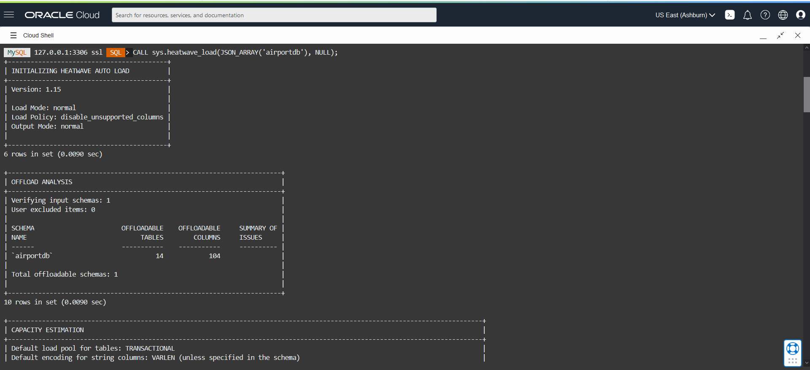
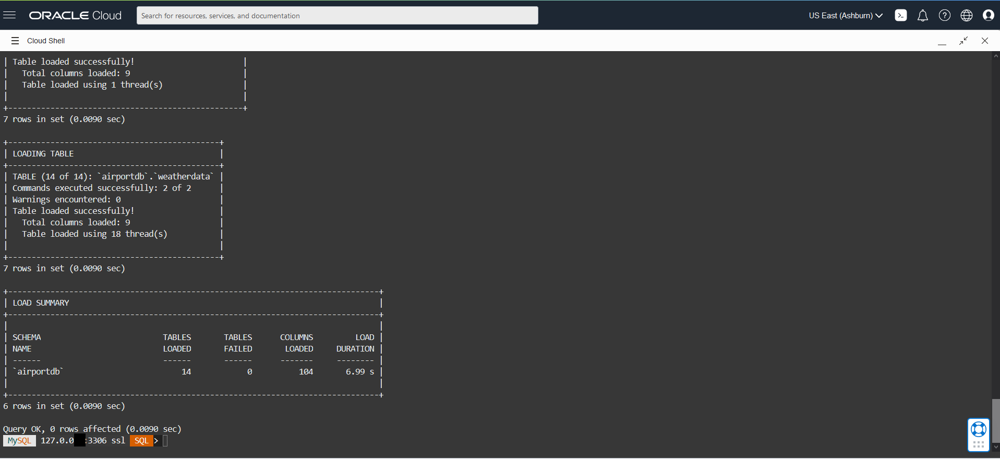
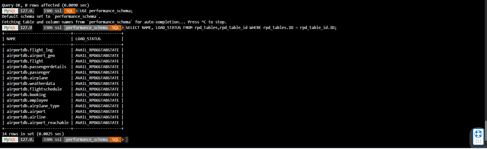

# Load Mysql HeatWave Cluster 


## Introduction

A HeatWave cluster comprise of a MySQL DB System node and two or more HeatWave nodes. The MySQL DB System node includes a plugin that is responsible for cluster management, loading data into the HeatWave cluster, query scheduling, and returning query result.


_Estimated Time:_ 10 minutes

Watch the video below for a quick walk through of the lab.

[](youtube:OzqCt3XATto)

### Objectives

In this lab, you will be guided through the following task:

- Load Airportdb Data into HeatWave

### Prerequisites

- An Oracle Trial or Paid Cloud Account
- Some Experience with MySQL Shell
- Completed Lab 2


## Task 1: Load airportdb Data into HeatWave Cluster
1. If not already connected with SSH, connect to Compute instance using Cloud Shell

    (Example: **ssh -i ~/.ssh/id_rsa opc@132.145.17....**)

2. On command Line, connect to MySQL using the MySQL Shell client tool with the following command:

    ```
    <copy>mysqlsh -uadmin -p -h 10.0.1... --sql </copy>
    ```

3. Run the following Auto Parallel Load command to load the airportdb tables into HeatWave..

    

    ```
    <copy>CALL sys.heatwave_load(JSON_ARRAY('airportdb'), NULL);</copy>
    ```
4. The completed load cluster screen should look like this:

    

    

5.	Verify that the tables are loaded in the HeatWave cluster. Loaded tables have an AVAIL_RPDGSTABSTATE load status.

    ```
    <copy>USE performance_schema;</copy>
    ```
    ```
    <copy>SELECT NAME, LOAD_STATUS FROM rpd_tables,rpd_table_id WHERE rpd_tables.ID = rpd_table_id.ID;</copy>
    ```
    

## Learn More

* [Oracle Cloud Infrastructure MySQL Database Service Documentation ](https://docs.cloud.oracle.com/en-us/iaas/MySQL-database)
* [MySQL Database Documentation](https://www.MySQL.com)

## Acknowledgements

* **Author** - Perside Foster, MySQL Solution Engineering
* **Contributors** - Mandy Pang, MySQL Principal Product Manager,  Priscila Galvao, MySQL Solution Engineering, Nick Mader, MySQL Global Channel Enablement & Strategy Manager
* **Last Updated By/Date** - Perside Foster, MySQL Solution Engineering, May 2022
