# Create Linux Compute Instance

## Introduction

Oracle Cloud Infrastructure Compute lets you provision and manage compute hosts, known as instances . You can create instances as needed to meet your compute and application requirements. After you create an instance, you can access it securely from your computer or cloud shell.

In this lab, you will create a Compute instance.

_Estimated Time:_ 10 minutes

### Objectives

In this lab, you will be guided through the following tasks:

- Create Compute Instance

### Prerequisites

- Livelab Sandbox
- Get Livelab Compartment Name (example:LL1...-COMPARTMENT)


## Task 1: Create Compute Instance

You need a compute instance to connect to perform the database and application tasks

1. Click the **Navigation menu** in the upper left, navigate to **Compute**, and under **Compute**, select **Instances**.
  
    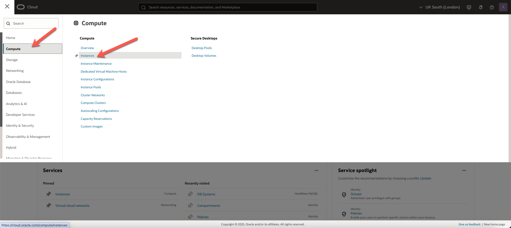

2. In the **Livelab Compartment Name** into the search box and then select it, and click the **Create instance** button.

     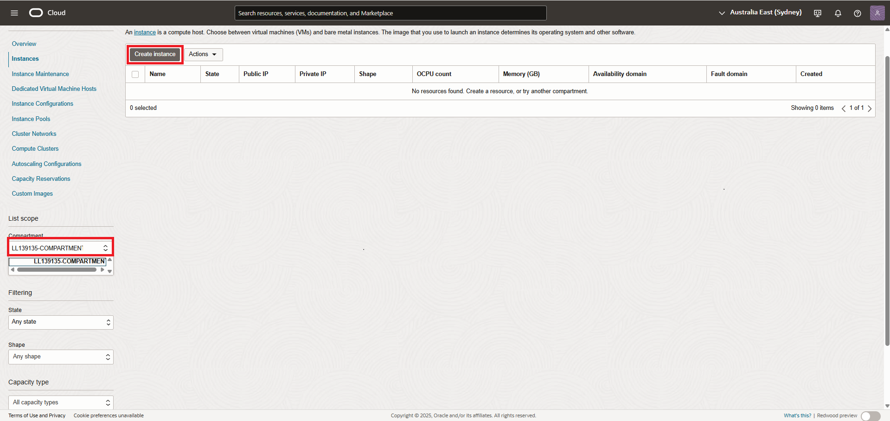

3. On **Create compute instance** page, enter the name of the compute instance.

    ```bash
    <copy>mysql-compute</copy>
    ```

4. Keep the selected **Livelab Compartment Name** .

    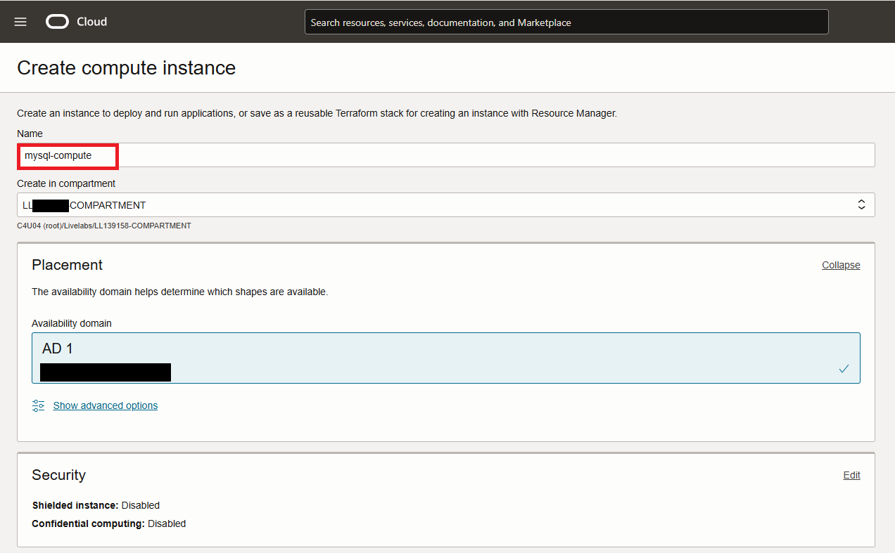

5. In the **Placement** field, keep the selected **Availability Domain**.

6. In the **Image and Shape** field, keep the selected image, **Oracle Linux 8**, and click the **Change shape** button.

    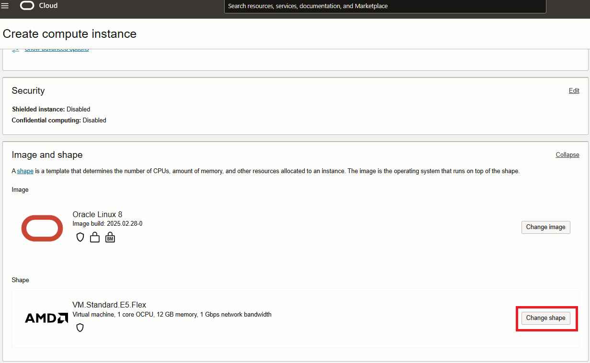

    - For new shape do the following:
        - Instance Type: Select Virtual Machine 
        - Shape series: Select AMD
        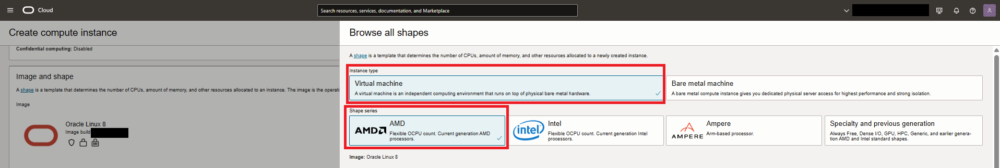  
        - Shape name:  VM.Standard.E4.Flex   1 OCPU 16 Memory(GB).
        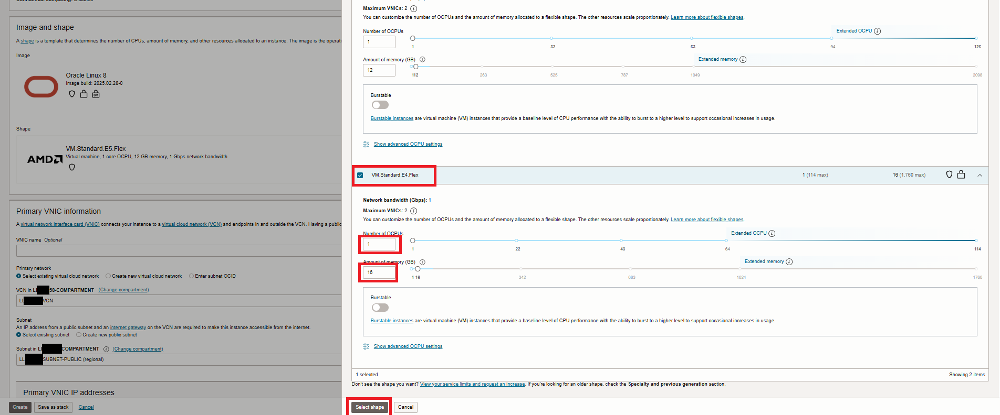  
    - Completes Shape selection:
    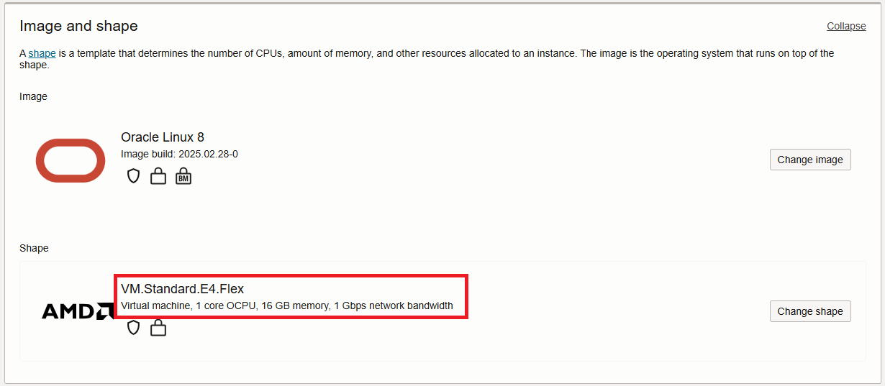 


7. In **Primary VNIC information** field, ensure the following settings are selected:

    - **Primary Network**: **existing vcn**

    - **Subnet**: **existing public-subnet-vcn**

8. In **Primary VNIC IP addresses** field, ensure the following settings are selected:

    - **Private IPv4 address**: **Automatically assign private IPv4 address**

    - **Public IPv4 address**: Selected

    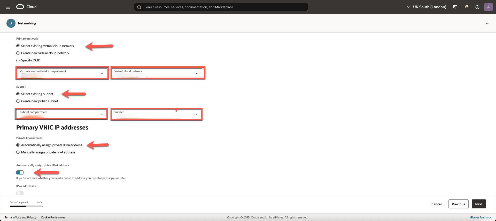

9. In **Add SSH keys** field, click **Generate a key pair for me**.
  
    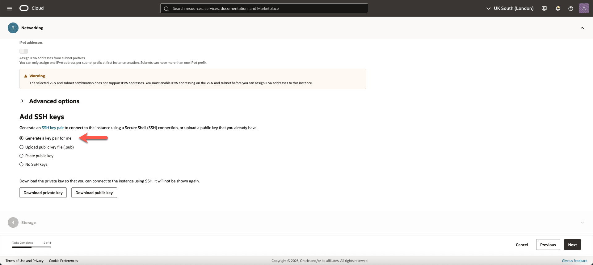

10. Save the downloaded SSH keys in your .ssh folder. and rename the key. For example:

    ```bash
    <copy>ssh-key-2024</copy>
    ```

     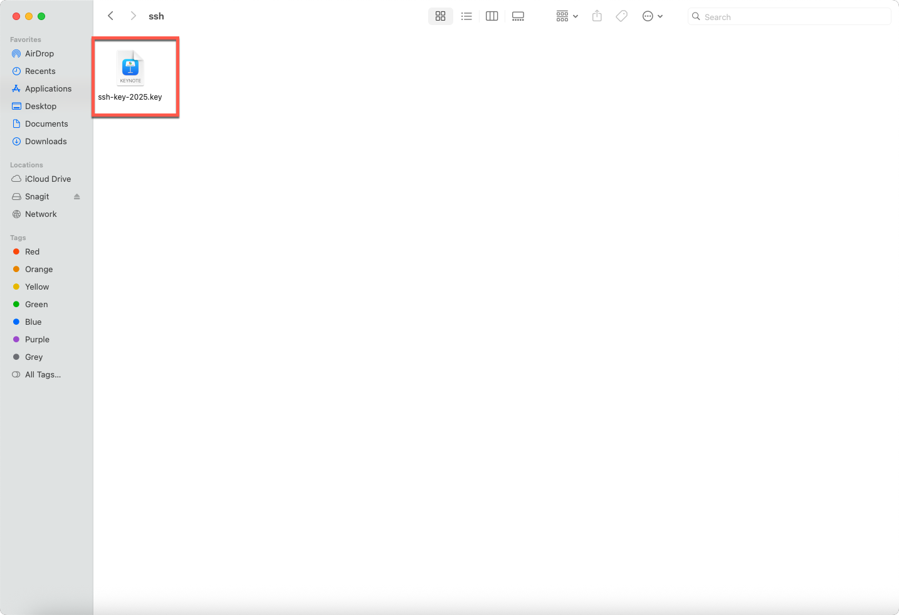

11. Click '**Create**' to create your compute instance.

12. The compute instance will be ready to use after a few minutes. The state is shown as **Provisioning** while the instance is creating.

13. When the compute instance is ready to use, the state is shown as **Running**. _Note_ the **Public IP address** and the **Username**.

    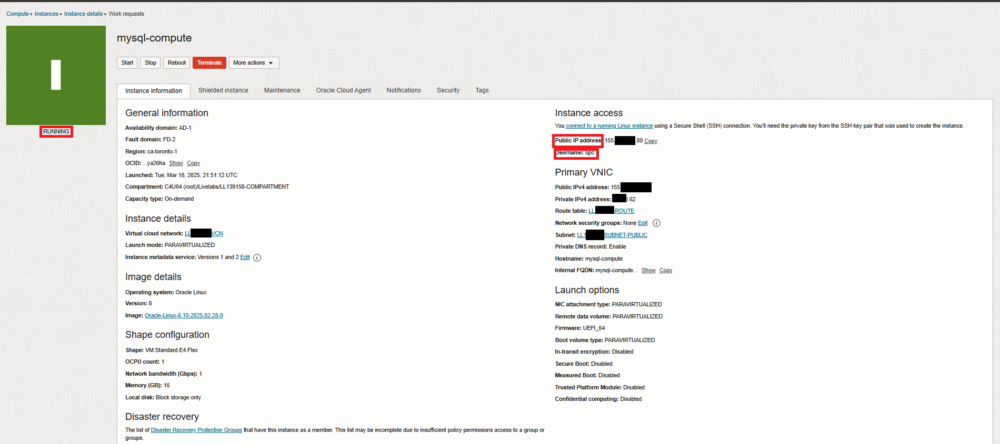

You may now **proceed to the next lab**.

## Acknowledgements

- **Author** - Perside Foster, MySQL Solution Engineering
- **Contributor** - Nick Mader, MySQL Global Channel Enablement & Strategy Director,
Selena Sanchez, MySQL Staff Solutions Engineer 
- **Last Updated By/Date** - Perside Foster, MySQL Solution Engineering, March  2025
