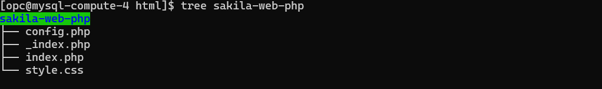
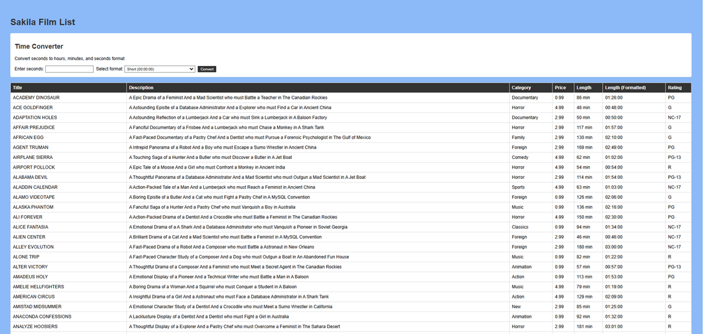

# Install, configure, and test Apache/PHP Web Application

## Introduction

**Important:** You can install either the Apache/PHP server or the Flask/Python server on the compute instance - but not both.  

MySQL Enterprise Edition integrates seamlessly with the LAMP (Linux, Apache, MySQL, PHP) stack, enhancing open-source capabilities with enterprise features. MySQL EE works with the LAMP stack by:

- Running JavaScript functions in database
- Using secure PHP connections (PDO)
- Maintaining Apache/Linux compatibility

After installing the LAMP Stack , you will Deploy and test the "Sakila Film Library with Time Converter" web application. This application displays the Sakila.Film data while providing a time conversion tool. Users can enter seconds and convert them to either HH:MM:SS format or written time descriptions using MySQL Enterprise Edition's JavaScript function. This LAMP-based application demonstrates practical use of database features within MySQL Enterprise Edition.

**Note:** The application code in this lab is intended for educational purposes only. It is designed to help developers learn and practice application development skills with MySQL Enterprise Edition. The code is not designed to be used in a production environment

_Estimated Lab Time:_ 15 minutes

### Objectives

In this lab, you will be guided through the following tasks:

- Install Apache and PHP
- Learn to create PHP / MYSQL Connect Application
- Deploy the Sample LAMP WEB Application

### Prerequisites

- An Oracle Trial or Paid Cloud Account
- Some Experience with MySQL SQL and  PHP
- Completed Lab 4

## Task 1: Install App Server (APACHE)

1. If not already connected with SSH, on Command Line, connect to the Compute instance using SSH ... be sure replace the  "private key file"  and the "new compute instance IP"

     ```bash
    <copy>ssh -i private_key_file opc@new_compute_instance_ip</copy>
     ```

2. Verify that Python/Flask server has not already been installed on this compute instance. **If yes then exit this lab**.

     ```bash
    <copy>python -c "import flask" 2>/dev/null
        if [ $? -eq 0 ]; then
            echo "Python/Flask server is installed. You cannot install the Apache/PHP server. Please exit this Lab."
        else
            echo "Python/Flask server is not installed. You may proceed to install the Apache/PHP server."
        fi</copy>
     ```

3. Install app server

    a. Install Apache

    ```bash
    <copy>sudo yum install httpd -y </copy>
    ```

    b. Enable Apache

    ```bash
    <copy>sudo systemctl enable httpd</copy>
    ```

    c. Start Apache

    ```bash
    <copy>sudo systemctl restart httpd</copy>
    ```

    d. Setup firewall

    ```bash
    <copy>sudo firewall-cmd --permanent --add-port=80/tcp</copy>
    ```

    e. Reload firewall

    ```bash
    <copy>sudo firewall-cmd --reload</copy>
    ```

4. From a browser test apache from your loacal machine using the Public IP Address of your Compute Instance

    **Example: http://129.213....**

## Task 2: Install PHP

1. Install php:

    a. Install php:8.2

    ```bash
    <copy> sudo dnf install @php:8.2 -y</copy>
    ```

    b. Install associated php libraries

    ```bash
    <copy>sudo yum install php-cli php-mysqlnd php-zip php-gd php-mbstring php-xml php-json -y</copy>
    ```

    c. View  php / mysql libraries

    ```bash
    <copy>php -m |grep mysql</copy>
    ```

    d. View php version

    ```bash
    <copy>php -v</copy>
    ```

    e. Restart Apache

    ```bash
    <copy>sudo systemctl restart httpd</copy>
    ```

2. Create test php file (info.php)

    ```bash
    <copy>sudo nano /var/www/html/info.php</copy>
    ```

3. Add the following code to the editor and save the file (ctr + o) (ctl + x)

    ```bash
    <copy><?php
    phpinfo();
    ?></copy>
    ```

4. From your local machine, browse the page info.php

   Example: http://129.213.167.../info.php

## Task 3: Create MySQL / PHP connect app

1. Security update" set SELinux to allow Apache to connect to MySQL

    ```bash
    <copy> sudo setsebool -P httpd_can_network_connect 1 </copy>
    ```

2. Create config.php

    ```bash
    <copy>cd /var/www/html</copy>
    ```

    ```bash
    <copy>sudo nano config.php</copy>
    ```

3. Add the following code to the editor, change DB_PASSWORD, and save the file (ctr + o) (ctl + x)

    ```bash
    <copy>
    <?php
    // Database credentials
    define('DB_SERVER', 'localhost');//
    define('DB_USERNAME', 'admin');
    define('DB_PASSWORD', 'Welco...');
    define('DB_NAME', 'mysql');
    //Attempt to connect to database
    $link = mysqli_connect(DB_SERVER, DB_USERNAME, DB_PASSWORD, DB_NAME);
    // Check connection
    if($link === false){
        die("ERROR: Could not connect to the MySQL instance. " . mysqli_connect_error());
    }
    // Print host information
    echo 'Successfully connected to the MySQL instance.';
    echo 'Host info: ' . mysqli_get_host_info($link);
    ?>
    </copy>
    ```

    - Test Config.php on Web sever http://150.230..../config.php

4. Create dbtest.php

    ```bash
    <copy>cd /var/www/html</copy>
    ```

    ```bash
    <copy>sudo nano dbtest.php</copy>
    ```

5. Add the following code to the editor and save the file (ctr + o) (ctl + x)

    ```bash
    <copy>
    <?php
    require_once "config.php";
    $query = "SELECT user FROM mysql.user;";
    if ($stmt = $link->prepare($query)) {
    $stmt->execute();
    $stmt->bind_result($user);
    echo "<table>";
        echo "<tr>";
        echo "<th>User</th>";
    echo "</tr>";

    while ($stmt->fetch()) {
        echo "<tr>";
        echo "<td>" . $user ."</td>";
        echo "</tr>";
    }

    $stmt->close();
    }
    ?>
    </copy>
    ```

6. From your local  machine connect to dbtest.php

    Example: http://129.213.167..../dbtest.php  

## Task 4: Deploy Sakila Film Web / MySQL JavaScript Stored Function Application

1. Go to the development folder

    ```bash
    <copy>cd /var/www/html</copy>
    ```

2. Download application code

    ```bash
    <copy> sudo wget https://objectstorage.us-ashburn-1.oraclecloud.com/p/rPTYzb6NhleKQN6i0Jnq3MJ_p_IAhDH4jm-a7Y5do65WWh5NnPdCmdkhJ2hCL1ID/n/idazzjlcjqzj/b/livelab_apps/o/sakila-web-php.zip</copy>
    ```

3. unzip Application code

    ```bash
    <copy>sudo unzip sakila-web-php.zip</copy>
    ```

4. Check if tree is installed, install if not

    ```bash
        <copy>command -v tree >/dev/null 2>&1 || sudo dnf install -y tree
        tree sakila-web-php</copy>
    ```

    - Application directory structure:

    


5. Update file db_config.php 

    ```bash
    <copy>cd sakila-web-php</copy>
    ```

    ```bash
    <copy>sudo nano  config.php</copy>
    ```

    - Change the following values if needed
        - $host = 'localhost'; // Change this if your MySQL server is hosted elsewhere
        - $dbname = 'sakila';
        - $username = 'admin'; // Change this to your MySQL username
        - $password = ''; // Change this to your MySQL password

6. **Important** - The following command puts only the MySQL process in permissive mode, leaving the rest of your system protected by SELinux. It tells SELinux to allow all actions by MySQL while still logging any potential violations. 
    - **This is for testing only. Please contact Oracle MySQL Support for Production guidance.**

    ```bash
    <copy>sudo semanage permissive -a mysqld_t</copy>
    ```

    - Restart MySQL 

    ```bash
    <copy>sudo systemctl restart mysqld</copy>
    ```

7. Run the application as follows (Use your coupute IP address):

    http://127.0.0.../sakila-web-php/

    

8. Test the application with following examples(Enter seconds, then select **short** or **long** format):

    a. Test Case 1 - Movie Length:
    - Input: 7200 seconds (typical movie)
    - Short format: 02:00:00
    - Long format: 2 hours

    b. Test Case 2 - TV Episode:
    - Input: 1350 seconds (22.5 minute show)
    - Short format: 00:22:30
    - Long format: 22 minutes 30 seconds

    c. Test Case 3 - Long Film:
    - Input: 18105 seconds (Lord of the Rings style)
    - Short format: 05:01:45
    - Long format: 5 hours 1 minute 45 seconds

    d. Test Case 4 - Short Clip:
    - Input: 90 seconds (quick scene)
    - Short format: 00:01:30
    - Long format: 1 minute 30 seconds

## Learn More

- [Install Apache and PHP on an Oracle Linux Instance](https://docs.oracle.com/en-us/iaas/developer-tutorials/tutorials/apache-on-oracle-linux/01-summary.htm)

## Acknowledgements

- **Author** - Perside Foster, MySQL Principal Solution Engineering
- **Contributors** 
- Nick Mader, MySQL Global Channel Enablement & Strategy Director, 
- Selena Sanchez, MySQL Staff Solutions Engineer,
- **Last Updated By/Date** - Perside Foster, MySQL Principal Solution Engineering, July   2025