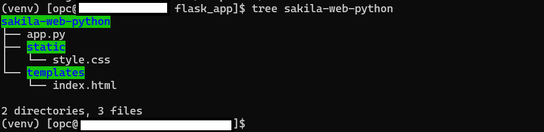

# Install, configure, and test Flask/Python Web Application

## Introduction

**Important:** You can install either the Apache/PHP server or the Flask/Python server on the compute instance - but not both. 

MySQL Enterprise Edition integrates seamlessly with Linux, MySQL, Python, Flask enhancing open-source capabilities with enterprise features. MySQL EE works with them by:

- Running JavaScript functions in database
- Using PyMySQL Package
- Maintaining Flask/Linux compatibility

After installing the Flask/Python server , you will Deploy and test the "Sakila Film Library with Time Converter" web application. This application displays the Sakila.Film data while providing a time conversion tool. Users can enter seconds and convert them to either HH:MM:SS format or written time descriptions using MySQL Enterprise Edition's JavaScript function. This Flask/Python - based application demonstrates practical use of database features within MySQL Enterprise Edition.

**Note:** The application code in this lab is intended for educational purposes only. It is designed to help developers learn and practice application development skills with MySQL Enterprise Edition. The code is not designed to be used in a production environment

_Estimated Lab Time:_ 15 minutes

### Objectives

In this lab, you will be guided through the following tasks:

- Install  Python and Flask
- Deploy the Sample Flask/Python WEB Application

### Prerequisites

- An Oracle Trial or Paid Cloud Account
- Some Experience with MySQL SQL and  Python
- Completed Lab 4

## Task 1: Install Python

1. Go to home folder

    ```bash
    <copy>cd /home/opc</copy>
    ```

2. Verify that Apache/PHP server has not already been installed on this compute instance. **If yes then exit this lab**.

    ```bash
    <copy>php -v 2>/dev/null
    if [ $? -eq 0 ]; then
        echo "Apache/PHP server is installed. You cannot install the Python/Flask server. Please exit this Lab"
    else
        echo "Apache/PHP server is not installed. You may proceed to install the Python/Flask server."
    fi </copy>   
    ```

3. Check for Python 3.9 and install it if needed

    ```bash
        <copy>command -v python3.9 >/dev/null 2>&1 || { 
            echo >&2 "❌ Python 3.9 is not installed. Installing..."; 
            sudo dnf module enable -y python39
            sudo dnf install -y python39 python39-pip python39-devel
        }</copy>
    ```

4. Verify the Python installation

    ```bash
        <copy>python3.9 --version
        pip3.9 --version
        command -v python3.9</copy>
    ```

## Task 2: Setup the Python environment

1. Configure firewall

    ```bash
        <copy>sudo firewall-cmd --permanent --add-port=5000/tcp </copy>
    ```

    ```bash
        <copy>sudo firewall-cmd --reload</copy>
    ```

2. Setup the directory structure

    ```bash
        <copy>sudo mkdir -p /var/www/
        sudo chown -R opc:opc /var/www/
        cd /var/www/</copy>
    ```

3. Download and extract the Python packages

    ```bash
        <copy>wget https://objectstorage.us-ashburn-1.oraclecloud.com/p/E6EsKKHbTXMp0siJb6GzG4vS1eKnl2vfdZua_7do_epdxGriBDEvuxPRmY45VjCM/n/idazzjlcjqzj/b/livelab_apps/o/python_packages.tar.gz</copy>
    ```

    - Unzip Python packages

    ```bash
        <copy>tar -xzvf python_packages.tar.gz</copy>
    ```

4. Create and activate virtual environment

    ```bash
        <copy>python3.9 -m venv venv
        source /var/www/venv/bin/activate</copy>
    ```

5. Install the Python packages

    ```bash
        <copy>cd /var/www/offline_packages/
        pip install --no-index --find-links=. flask flask-sqlalchemy pymysql cryptography gunicorn
        </copy>
    ```


## Task 3: Deploy Sakila Film Web / MySQL JavaScript Stored Function Application

1. Create and setup the flask app directory

    ```bash
        <copy>mkdir -p /var/www/flask_app/
        cd /var/www/flask_app/</copy>
    ```

2. Dowload the application

    ```bash
        <copy>wget https://objectstorage.us-ashburn-1.oraclecloud.com/p/ojnCuO6Nk8l9tVyocciB9GpJgYR5CyZZ_bgr2-emm9lGxn-Tdf1rqeHd1NgcjgdQ/n/idazzjlcjqzj/b/livelab_apps/o/sakila-web-python.zip
        unzip sakila-web-python.zip</copy>
    ```

3. Check if tree is installed, install it if not

    ```bash
        <copy>command -v tree >/dev/null 2>&1 || sudo dnf install -y tree
        tree sakila-web-python</copy>
    ```

    - Application directory structure:

    

4. Update file app.py  to change the following values if needed

    ```bash
        <copy>cd sakila-web-python</copy>
    ```

    ```bash
        <copy>sudo nano  app.py</copy>
    ```

    - Change the following values if needed

        - DB_CONFIG = {
            - 'host': 'localhost', # Change this if your MySQL server is hosted elsewhere
            - 'user': 'admin', # Change this to your MySQL username
            - 'password': '', # Change this to your MySQL password
            - 'db': 'sakila',
            - 'charset': 'utf8mb4',
            - 'cursorclass': DictCursor
        - }

## Task 4: Run  Sakila Film Web / MySQL JavaScript Stored Function Application

1. Setup the Python environment for application execution.

    ```bash
        <copy>cd /var/www/flask_app/sakila-web-python</copy>
    ```

    - Activate the virtual environment 

    ```bash
        <copy>python3.9 -m venv venv
        source /var/www/venv/bin/activate</copy>
    ```

    - Execute the Python script "app.py" using the Python interpreter 

    ```bash
        <copy>python app.py</copy>
    ```

2. Run the application from your browser as follows (Replace 127.0.0.1 with your IP address ). 

    - Be sure to use **http://** not   https://:

        http://150.136...:5000 

    

3. Test the application with following examples(Enter seconds, then select **short** or **long** format):

    a. Test Case 1 - Movie Length:
    - Input: 7200 seconds (typical movie)
    - Short format: 02:00:00
    - Long format: 2 hours

    b. Test Case 2 - TV Episode:
    - Input: 1350 seconds (22.5 minute show)
    - Short format: 00:22:30
    - Long format: 22 minutes 30 seconds

    c. Test Case 3 - Long Film:
    - Input: 18105 seconds (Lord of the Rings style)
    - Short format: 05:01:45
    - Long format: 5 hours 1 minute 45 seconds

    d. Test Case 4 - Short Clip:
    - Input: 90 seconds (quick scene)
    - Short format: 00:01:30
    - Long format: 1 minute 30 seconds

## Learn More

- [Install Flask on an Ubuntu VM](https://docs.oracle.com/en-us/iaas/developer-tutorials/tutorials/flask-on-ubuntu/01oci-ubuntu-flask-summary.htm#install-flask-ubuntu)


## Acknowledgements

- **Author** - Perside Foster, MySQL Principal Solution Engineering
- **Contributors** 
- Nick Mader, MySQL Global Channel Enablement & Strategy Director, 
- Selena Sanchez, MySQL Staff Solutions Engineer,
- **Last Updated By/Date** - Perside Foster, MySQL Principal Solution Engineering, July   2025