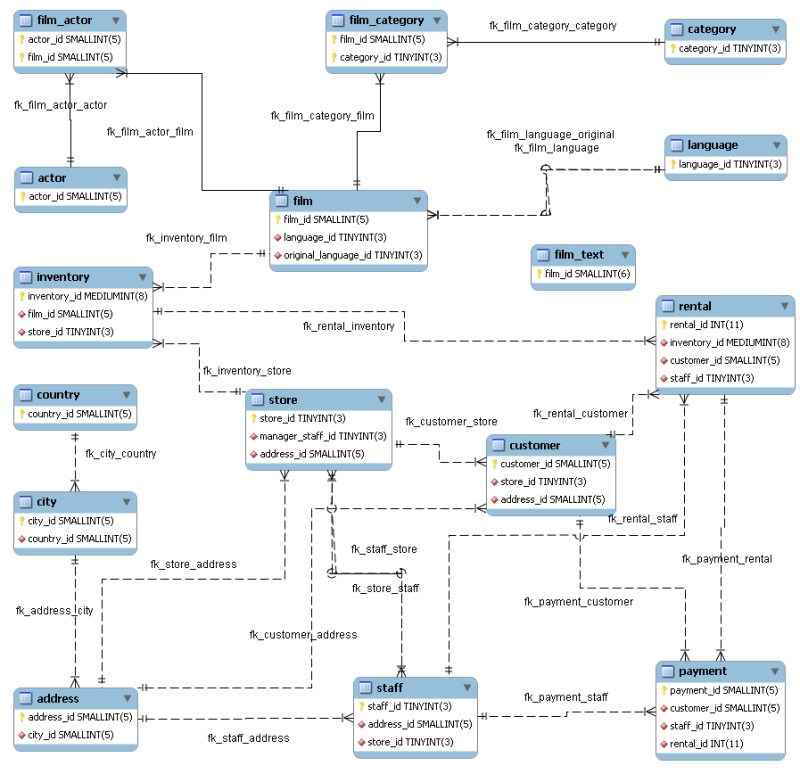

# Setup Sakila Sample Database and JavaScript Stored Function

## Introduction

The Sakila sample database was initially developed by Mike Hillyer, a former member of the MySQL AB documentation team. It is intended to provide a standard schema that can be used for examples in books, tutorials, articles, samples, and so forth. The Sakila sample database also serves to highlight features of MySQL such as Views, Stored Procedures, and Triggers.


JavaScript is the most popular programming language among developers.  Besides the simpler syntax and the support for modern language features, a key factor in its popularity is the rich ecosystem which provides a multitude of reusable code modules.
By supporting JavaScript in stored programs, developers will be able to write MySQL stored programs in a familiar language and take advantage of the extensive JavaScript ecosystem! 

_Estimated Time:_ 20 minutes

### Objectives

In this lab, you will be guided through the following tasks:

- Install  Sakila
- Explore the Sakila Database in MySQL
- Configure the system to access the JavaScript libraries
- Create and test a JavaScript Stored Function


### Prerequisites

This lab assumes you have:

- Completed Labs 3

## Task 1: Install Sakila Database

1. Connect to **mysql-compute** instance using Cloud Shell (**Example:** ssh -i  ~/.ssh/id_rsa opc@132.145.17….)

    ```bash
    <copy>ssh -i ~/.ssh/id_rsa opc@<your_compute_instance_ip></copy>
    ```

    

2. Change to home directory

    ```bash
    <copy>cd /home/opc</copy>
    ```

3. Download the Sakila Database

    ```bash    
    <copy>wget https://objectstorage.us-ashburn-1.oraclecloud.com/p/bZJU1s_dUgBBWjMp34WFKqVGJvDBnC_yFg9PrOawSlCZ6GblRwjcb4r0pSPIrL5k/n/idazzjlcjqzj/b/mysql-ee-downloads/o/sakila-db.tar.gz</copy>
    ```

4. Extract the contents of the "sakila-db.tar.gz" archive file. you should see two .sql files: sakila-data.sql and sakila-schema.sql

    ```bash
    <copy>tar -xvf sakila-db.tar.gz</copy>
    ```

5. Change to the sakila directory

    ```bash
    <copy>cd sakila-db</copy>
    ```

6. Connect to the MySQL server. Enter your password when prompted

    ```bash
    <copy>mysqlsh -uadmin -hlocalhost -p</copy>
    ```

7. Execute the sakila-schema.sql script to create the database structure

    ```bash
    <copy>SOURCE sakila-schema.sql;</copy>
    ```

8. Execute the sakila-data.sql script to populate the database structure

    ```bash
    <copy>SOURCE sakila-data.sql;</copy>
    ```

9. Verify the installation

    ```bash
    <copy>show databases;</copy>
    ```

## Task 2: Explore the Sakila Database in MySQL

1. Point to the sakila dabase

    ```bash
    <copy>use sakila;</copy>
    ```

2. List the sakila tables

    ```bash
    <copy>show tables;</copy>
    ```

3. Here is the ERD (Entity Relationship Diagram) of the Sakila Database.

    

4. Take a look at the actor table

    ```bash
    <copy>describe actor;</copy>
    ```

5. List data from the actor table

    ```bash
    <copy>SELECT * FROM actor;</copy>
    ```

6. List data from the film table

    ```bash
    <copy>SELECT * FROM film;</copy>
    ```

7. List data from the film_actor view

    ```bash
    <copy>SELECT * FROM sakila.film_actor;</copy>
    ```

8. Find Overdue DVDs

    ```bash
    <copy>SELECT CONCAT(customer.last_name, ', ', customer.first_name) AS customer,
           address.phone, film.title
           FROM rental INNER JOIN customer ON rental.customer_id = customer.customer_id
           INNER JOIN address ON customer.address_id = address.address_id
           INNER JOIN inventory ON rental.inventory_id = inventory.inventory_id
           INNER JOIN film ON inventory.film_id = film.film_id
           WHERE rental.return_date IS NULL
           AND rental_date + INTERVAL film.rental_duration DAY < CURRENT_DATE()
           ORDER BY title
           LIMIT 5;</copy>
    ```

9. Exit

    ```bash
    <copy>\q</copy>
    ```

## Task 3: Setup MySQL EE  for JavaScript Stored Function

MySQL now supports writing stored functions and stored procedures using JavaScript. Please note that this functionality is only available in MySQL Enterprise Edition.  

1. Setup  MLE Component when using JavaScript. As part of enabling Javascript SP: INSTALL COMPONENT 'file://component_mle';
This  is a prerequisite step in the OS shell that runs before installing the MLE component. 

2. First set SELinux to permissive mode

    ```bash
    <copy>sudo setenforce 0</copy>
    ```

3. Login to MySQL 

    ```bash
    <copy>mysqlsh -uadmin -hlocalhost -p </copy>
    ```

4. Install the component file

    ```bash
    <copy>INSTALL COMPONENT 'file://component_mle'; </copy>
    ```

    ```bash
    <copy>\q</copy>
    ```

5. Enforce SELinux

    ```bash
    <copy>sudo setenforce 1</copy>
    ```

6. SELinux is now  blocking MySQL from using the JavaScript files. Fix this by executing the following commands to grant the specific permissions needed for the JavaScript functionality.

    - Generate the policy module from audit logs

        ```bash
        <copy>sudo grep -i libpolyglot /var/log/audit/audit.log | sudo audit2allow -M mysql_js</copy>
        ```

    - Install the policy module

        ```bash
        <copy>sudo semodule -i mysql_js.pp</copy>
        ```

7. Restart MySQL to apply the changes:

    ```bash
    <copy>sudo systemctl restart mysqld </copy>
    ```

## Task 4: Create and test a MySQL JavaScript Stored Function

Let's create a stored function with a complex business logic with the followig Business Rules:

Let’s assume we have a requirement to return a given number of seconds in a format that includes the number of hours, minutes, and seconds represented by this number. We also need to have two different formats. The first format is a short format that would return the data using the following format: hh:mm:ss. The second, long, format would return the data using h hours m minutes s seconds. Additional requirements for the long format include:

If the number of hours, minutes, or seconds is 0, do not include it in the output.
If the number of hours, minutes, or seconds is 1, use the singular version of the word; otherwise, use the plural.

Creating a MySQL stored function to handle this would be possible, but it might be longer and more involved. Using Javascript is fairly straightforward.

1. Log  back into MySQL

    ```bash
    <copy>mysqlsh -uadmin -hlocalhost -p </copy>
    ```

2. Point to the sakila dabase

    ```bash
    <copy>use sakila;</copy>
    ```

3. Create the **secondsToHoursMinsSecs** JavaScript Stored Function

    ```bash
    <copy>create function secondsToHoursMinsSecs(seconds double, format varchar(5))
    returns varchar(256) DETERMINISTIC language javascript as $$
    if(format !== 'long') format = 'short'
    const hrs = Math.floor(seconds/3600)
    const mins = Math.floor((seconds % 3600) / 60)
    const secs = (seconds % 60)
    switch(format.toLowerCase()){
        case 'short':
            return `${hrs.toString().padStart(2, '0')}:${mins.toString().padStart(2, '0')}:${secs.toString().padStart(2, '0')}`
            break
        case 'long':
            let lng = ''
            if(hrs > 0) lng += `${hrs} hour${hrs > 1 ? 's' : ''} `
            if(mins > 0) lng += `${mins} minute${mins > 1 ? 's' : ''} `
            if(secs > 0) lng += `${secs} second${secs > 1 ? 's' : ''}`
            return lng.trim()
            break
    }
$$; </copy>
    ```
4. Test the **secondsToHoursMinsSecs** function in short mode

    ```bash
    <copy>select secondsToHoursMinsSecs(1234, 'short') as result;</copy>
    ```
5. Test the **secondsToHoursMinsSecs** function in long mode

    ```bash
    <copy>select secondsToHoursMinsSecs(1234, 'long') as result; </copy>
    ```
6. Exit 

    ```bash
    <copy>\q</copy>
    ```

You may now **proceed to the next lab**.

## Learn More

- [Sakila Sample Database](https://dev.mysql.com/doc/sakila/en/sakila-introduction.html)
- [JavaScript in MySQL](https://blogs.oracle.com/mysql/post/more-javascript-in-mysql)
- [MySQL Enterprise Stored Programs](https://www.mysql.com/products/enterprise/storedprograms.html)
- [MySQL SELinux File Context](https://dev.mysql.com/doc/refman/8.4/en/selinux-file-context.html)


## Acknowledgements

- **Author** - Perside Foster, MySQL Principal Solution Engineering
- **Contributors** 
- Nick Mader, MySQL Global Channel Enablement & Strategy Director, 
- Selena Sanchez, MySQL Staff Solutions Engineer,
- **Last Updated By/Date** - Perside Foster, MySQL Principal Solution Engineering, July   2025
