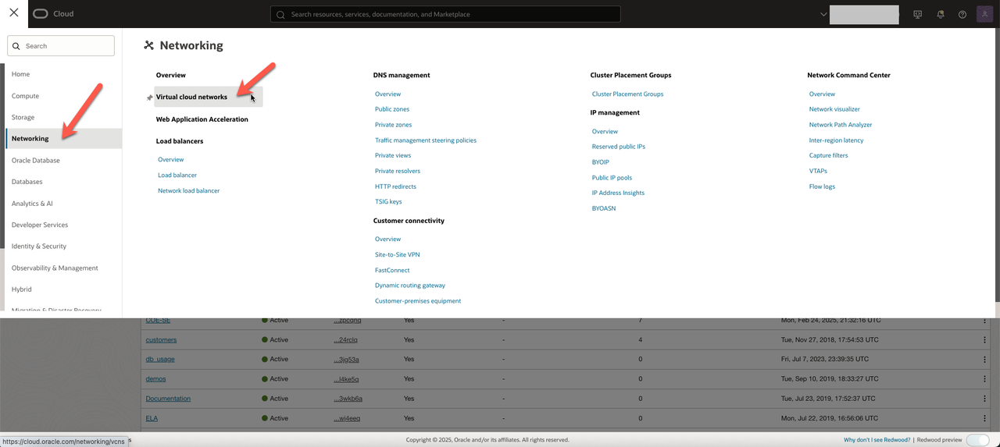
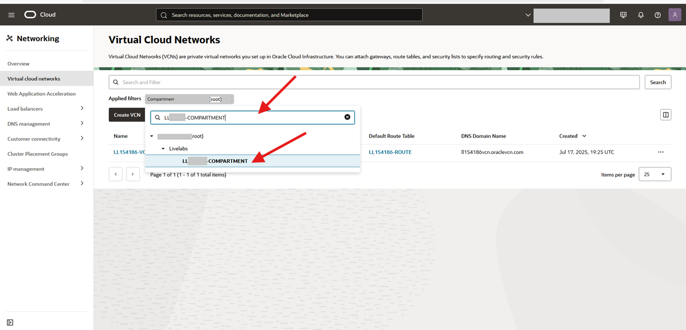
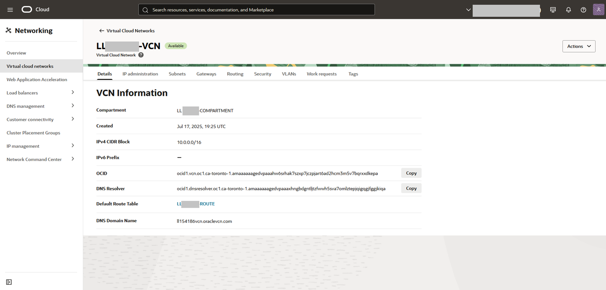

# View Your Virtual Cloud Network 

## Introduction

In this lab, you will access your Livelabs comaprtmne and review the pre-created Virtual Cloud Network.

_Estimated Time:_ 5 minutes

### Objectives

In this lab, you will review the pre-created View Virtual Cloud Network.

### Prerequisites

- Logged into your Livelab Sandbox

## Task 1: View Virtual Cloud Network

1. Click the **Navigation menu** in the upper left, navigate to **Networking**, and select **Virtual cloud networks**.

    

2. Under **Compartment**, enter **The Provided Livelab Compartment Name**  and select it 

    Then Click on the existing **VCN**

    

4. Your pre-created VCN will be displayed

    

## Acknowledgements

- **Author** - Perside Foster, MySQL Principal Solution Engineering
- **Contributors** 
- Nick Mader, MySQL Global Channel Enablement & Strategy Director, 
- Selena Sanchez, MySQL Staff Solutions Engineer,
- **Last Updated By/Date** - Perside Foster, MySQL Principal Solution Engineering, July   2025
