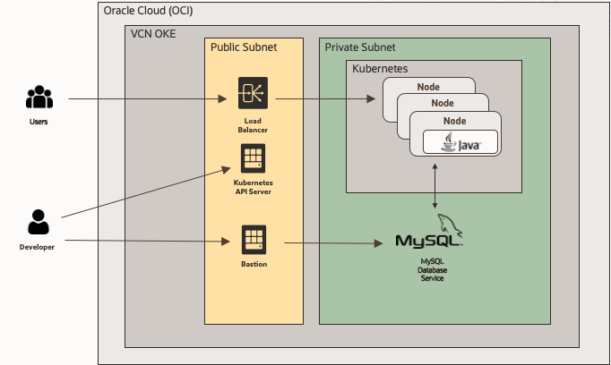

# Introduction

Estimated Workshop Time: 90 minutes

## About this Workshop

In this workshop, you will: 
* Setup an MySQL DB Service, Kubernetes cluster.
* Create a simple Java program to connect to it. Run it in Docker.
* Create a Spring Boot program that connects to MySQL. Run it in Kubernetes.

  

### Objectives

In this workshop, you will learn how to:
* Create a Kubernetes cluster (OKE)
* Create a MySQL DB System
* Create a simple Java program that connects to MySQL. 
* Build your own docker container.
* Create a Spring Boot program that connects to MySQL. 
* Create a Spring Boot container. 
* Run a container in Kubernetes.
* Create secrets and configMaps to store connection's details outside of the container.

### Prerequisites (Optional)

This lab assumes you have:
*  A valid email address
*  Ability to receive SMS text verification (only if your email isn't recognized)
*  Credit card (you will not be charged unless you elect to upgrade the account later.)

## Acknowledgements
* Marc Gueury - Application Development EMEA
* Stuart Davey - MySQL EMEA
* Mario Beck - MySQL EMEA
* Olivier Dasini - MySQL EMEA
* Last Updated - Feb 2022
