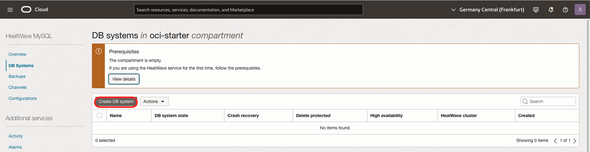
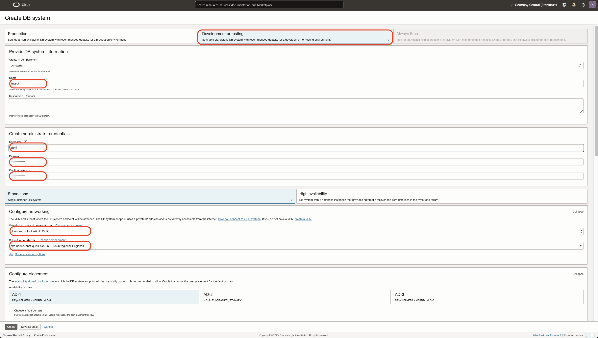
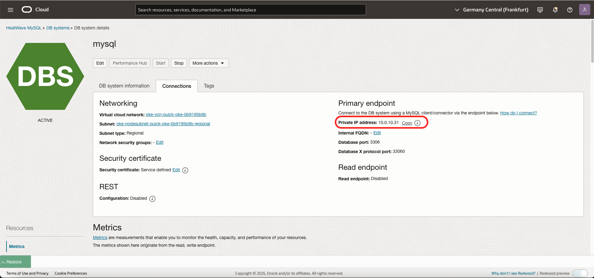
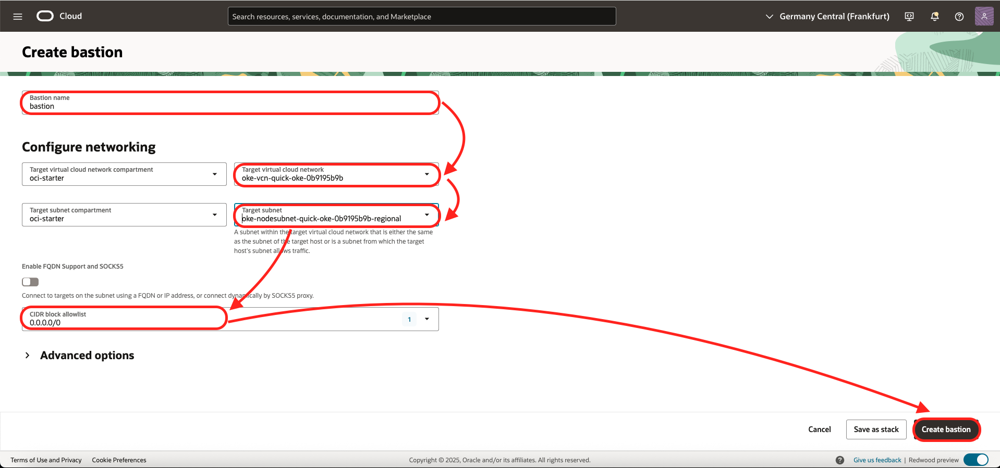
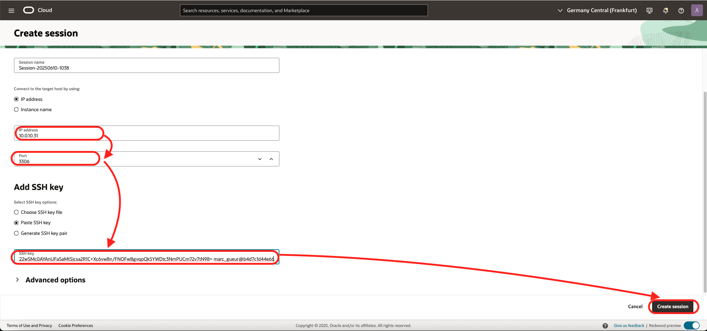

# Setup MySQL

## Introduction

In this lab, we will create the MySQL database service.

Estimated Time: 20 minutes

### About MySQL 
The MySQL Database Service (MDS) is a database service that is 100% developed, managed, and supported by the MySQL team. 
MySQL Database Service is a fully managed service, running on Oracle Cloud Infrastructure. It enables you to:
* Instantly provision MySQL instances and connect to a production ready, pre-configured MySQL database.
* Automate database specific tasks such as configuration, security patching, backup, high availability, and monitoring.

### Objectives
* Install MySQL 
* Create the table

## Task 1: Clone the GIT repository
Open the Oracle Cloud Shell and clone this repository:

```
<copy>git clone https://github.com/mgueury/oke_mysql_java_101.git</copy>
```
## Task 2: Install MySQL

* Option 1: Install MySQL Database Service
* Option 2: Install MySQL inside the Kubernetes cluster
* Or both !

## Option 1 - Part 1: Install MySQL Database Service

To install the MySQL Database service, follow these steps:

1. In the Oracle Cloud Menu, go to Database / MySQL. Click "Create MySQL Database System"

	

2. Please use these paramaters:
    - Name: mysql
    - Username: root
    - Password (2x): Welcome1! 
    - In Configure Networking, choose the VCN that was created by the OKE wizard : oke-vcn-quick-cluster1-xxxxx (##2##)
    - Subnet: oke-nodesubnet-quick-cluster1-xxxx-regional (##3##)

	

3. Click Create.

4. When the database is installed. Please note the Private IP Address (##4##). The MySQL port will be 3306.

	

## Option 1 - Part 2: Create a bastion to create a SSH Tunnel to our MySQL DB System

Let's install a Bastion. A longer explanation is available here: [https://blogs.oracle.com/mysql/post/using-oci-cloud-shell-bastion-with-mysql-database-service](https://blogs.oracle.com/mysql/post/using-oci-cloud-shell-bastion-with-mysql-database-service)

1. The Bastion Service’s dashboard is located in Identity & Security

      - Menu / Identity & Security
      - Click Bastion
      - Choose the VCN where MySQL is installed (##2##)
      - Choose the Subnet where MySQL is installed (##3##)
      - Use 0.0.0.0/0 for the CIDR allow block (See the blog above for more secure solution)

	

2. Create a SSL Certificate

      - Back the Cloud shell
      - Create a SSH Certificate

	```
	ssh-keygen -t rsa
	(Press Enter a lot of times)
	cat $HOME/.ssh/id_rsa.pub
	```

	```
	ssh-rsa abcdefghijklAADAQABAAABAQDF9jXWObkl6n482Gxxxxxxxxxxxxxx marc_gueur@06671dff81b6
	```

      - Copy the key (##5##)

3. Create a Bastion Session

      - Back in the Bastion screen
      - Click Create session
      - Enter
       - Session Type: SSH Port forwarding session
       - IP Address: 10.0.10.2 (your value from ##4##)
       - Port: 3306
       - Paste SSH Key (##5##)

	

      - Click on the 3 dots ... next to the session
      - Copy SSH commands. It will look like this:

	```
	ssh -i <privateKey> -N -L <localPort>:10.0.10.2:3306 -p 22 ocid1.bastionsession.oc1.eu-frankfurt-1.abcdefgxxcujoii55b7kq@host.bastion.eu-frankfurt-1.oci.oraclecloud.com
	```

4. Try to connect through the bastion 

      - Back to the Cloud Shell
      - Modify the command
          - Remove the  -i <privateKey>, since it is the default key
          - Replace &lt;localPort&gt; with 3306
          - Add the flag -4
          - Add & at the end of the command to run in background

	Example
     
	```
	<copy>ssh -4 -N -L 3306:10.0.10.2:3306 -p 22 ocid1.bastionsession.oc1.eu-frankfurt-1.abcdefgxxcujoii55b7kq@host.bastion.eu-frankfurt-1.oci.oraclecloud.com &
	</copy>
	````

	Connect to the database

	```
	<copy>mysqlsh root@127.0.0.1:3306 --password=Welcome1! --sql
	\exit
	</copy>
	```

Note the command to connect to the database (##1##)

## Option 2: Install MySQL inside the Kubernetes cluster

For reference, the explanation on how to install MySQL in Kubernetes is here:
- [https://kubernetes.io/docs/tasks/run-application/run-single-instance-stateful-application/](https://kubernetes.io/docs/tasks/run-application/run-single-instance-stateful-application/)

The git repository contains an example to create a MySQL server with username/password = root/Welcome1!

```
<copy>cd oke_mysql_java_101
kubectl create -f setup/oke_mysql.yaml 
</copy>
```

To allow the connection to the MySQL database from your Oracle Cloud Shell, you need
to run the following MySQL commands:

```
<copy>kubectl exec -it deployment/mysql -- bash
mysql -uroot -pWelcome1!
CREATE USER 'root'@'%' IDENTIFIED BY 'Welcome1!';
GRANT ALL PRIVILEGES ON *.* TO 'root'@'%' WITH GRANT OPTION;
exit
exit
</copy>
```
This will connect to MySQL in the container. And create a user that may log in from the shell.

Then forward the MySQL port to your Oracle Cloud Shell and check if it works:

```
<copy>kubectl port-forward deployment/mysql 3306 &
mysqlsh root@127.0.0.1:3306 --password=Welcome1! --sql
\exit
</copy>
```

Note the command to connect to the database (##1##)

## Task 3: Create the table

Connect to the database using command (##1##). Run this:
```
<copy>show databases;
create database db1;
use db1;

CREATE TABLE t1 (
 id INT AUTO_INCREMENT PRIMARY KEY,
  name VARCHAR(20) NOT NULL
);
insert into t1( name ) values ('DOLPHIN');
insert into t1( name ) values ('TIGER');
insert into t1( name ) values ('PENGUIN');
insert into t1( name ) values ('LION');
select * from t1;
\exit
</copy>
```

## Acknowledgements
* Marc Gueury - Application Development EMEA
* Stuart Davey - MySQL EMEA
* Mario Beck - MySQL EMEA
* Olivier Dasini - MySQL EMEA
* Last Updated - Feb 2022


